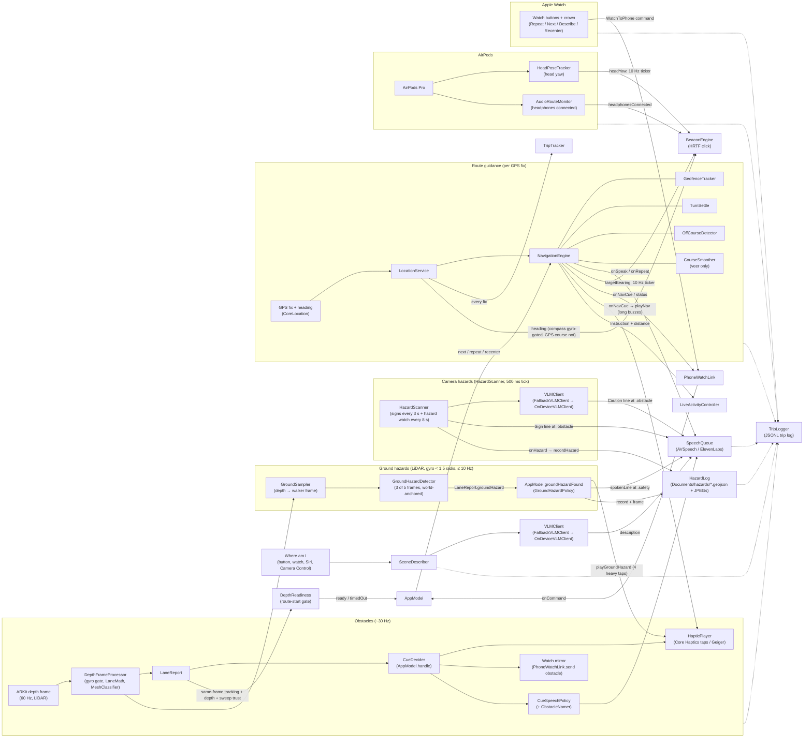

# CaneKit code reference

CaneKit (the OpenCane project) is a native Swift 6 / SwiftUI app, built against iOS 26 / watchOS 26
APIs with no third-party packages, that guides a blind cane user along GPS waypoints and warns about
waist-to-head obstacles. The **phone is the only computer**: an iPhone 17 Pro Max running iOS 27
(deployment target iOS 26) clamped to a non-metal 28.75 mm cane, using LiDAR depth for obstacles and
Core Haptics for taps. AirPods Pro carry the spatial-audio beacon, speech and head yaw. An Apple Watch
gives wrist taps and the Repeat / Next / Describe / Recenter buttons. There's no ESP32 and no external
sensor. The demo route is ISR Townsend Hall → CIF on the UIUC campus
(`ios/CaneKit/Resources/route_isr_cif.json`), and MapKit walking directions handle any other
destination. For the demo everything runs **untethered on the phone**. The Mac only signs and installs
the app. This file maps every file, type and function by module. `AGENTS.md` has the hard rules and
wins wherever the two disagree.

## Contents

- [Data flow](#data-flow)
- [How to keep this file true](#how-to-keep-this-file-true)
- [Module: logic — `ios/Logic` (SwiftPM package `CaneKitLogic`)](#module-logic--ioslogic-swiftpm-package-canekitlogic)
- [Module `app-core` — `ios/CaneKit/App/`](#module-app-core--ioscanekitapp)
- [Module `depth-haptics` — `ios/CaneKit/Depth/*.swift`, `ios/CaneKit/Haptics/HapticPlayer.swift`](#module-depth-haptics--ioscanekitdepthswift-ioscanekithapticshapticplayerswift)
- [Module: speech-audio-scene (`ios/CaneKit/Speech`, `ios/CaneKit/Audio`, `ios/CaneKit/Scene`)](#module-speech-audio-scene-ioscanekitspeech-ioscanekitaudio-ioscanekitscene)
- [Module `navigation-trip` — GPS, waypoint engine, turn settling, route sources, trip log/tracker, Live Activity](#module-navigation-trip--gps-waypoint-engine-turn-settling-route-sources-trip-logtracker-live-activity)
- [Module `watch-widget-shared`](#module-watch-widget-shared)
- [Module `family-alerts` — cane events → the Grok Bot routine (Step 39)](#module-family-alerts--cane-events--the-grok-bot-routine-step-39)
- [Module: ui-tests-build — Phone UI, XCUITests, XcodeGen build, CI](#module-ui-tests-build--phone-ui-xcuitests-xcodegen-build-ci)

## Data flow

`AppModel` (`ios/CaneKit/App/AppModel.swift`) owns every engine and does the wiring shown below. The
pure decision types (`CueDecider`, `CueSpeechPolicy`, `GeofenceTracker`, `TurnSettle`,
`OffCourseDetector`, `StraightWalkDetector`, `CourseSmoother`, `GroundHazardDetector`,
`GroundHazardPolicy`, `SignPolicy`, `HazardWatchPolicy`) live in `CaneKitLogic`, and the app classes
around them only own state, timing and effects. The module sections below have the exact callbacks.



The dotted edges mean every subsystem writes events (`gps`, `speech`, `navcue`, `waypoint`, `lanes`,
`watch`, `describe`, `hazard`, `route_readiness`, …) to `TripLogger` through `AppModel`. The solid
`DepthReadiness` edge is the safety interlock: a route request waits for fresh, same-frame ARKit
tracking/depth evidence before `AppModel` calls the normal route-start effects. Sign reading needs no network
(on-device Vision text only); the hazard watch and "Where am I" share one `VLMClient` built by
`VLMClientFactory.resolved(context:)` — the cloud provider when a key is set, with `OnDeviceVLMClient`
(Apple Vision + Foundation Models, template fallback) behind it, or on-device alone. `AppModel.handle`
writes `AppModel.contextLine(report)` into the shared `SceneContext` on every report, which is how the
on-device client knows what LiDAR sees.

## How to keep this file true

Change code, and you update its module section here **in the same commit**. Agents read this map
instead of the source, so a stale entry leads them to wrong edits. When you add a file, give it a `###`
entry under the right `##` module. When you rename or delete a type or function, edit or remove its
entry. When you change a number or a ⚠ invariant, keep the text in step with the `CaneKitLogic` test
that pins it. `AGENTS.md` has the hard rules (concurrency, iOS 26 APIs only, logic in `ios/Logic`,
secrets, generated project, frozen bundle IDs, audio session, cue priorities, accessibility labels,
per-commit checks). If this file and `AGENTS.md` disagree, `AGENTS.md` wins; fix this file.

---

## Module: logic — `ios/Logic` (SwiftPM package `CaneKitLogic`)

Pure-Swift, Foundation-only package. No ARKit/UIKit/WatchKit/MapKit/CoreLocation so `swift test` runs on a Mac with only Command Line Tools. **Isolation:** `Package.swift` sets only `.swiftLanguageMode(.v6)` — there is no `SWIFT_DEFAULT_ACTOR_ISOLATION=MainActor` here (unlike the app targets), so every type is **nonisolated** by default. All value types are `Sendable`; the three stateful classes (`CueDecider`, `OffCourseDetector`, `GeofenceTracker`) are deliberately **not Sendable** and must be owned and driven by exactly one actor (the app drives them from `@MainActor` `AppModel` / `NavigationEngine`). The four `NavSupport` state machines (`TurnSettle`, `StraightWalkDetector`, `CueSpeechPolicy`, `CrownAccumulator`) are `Sendable` structs with `mutating` updates: the owner keeps them in a `var` and must write a mutated copy back (e.g. `if var s = settle { s.update(fix); settle = s }` in `NavigationEngine`). The Step 11 state machines follow the same rule: `CourseSmoother` (owned by `NavigationEngine`), `GroundHazardDetector` (owned by `DepthFrameProcessor`, driven only on its serial `canekit.depth` queue), `GroundHazardPolicy` (`AppModel`), `SignPolicy` and `HazardWatchPolicy` (`HazardScanner`) are `Sendable` structs with `mutating` updates held in a `var` by exactly one owner.

### `ios/Logic/Package.swift`
- swift-tools 6.0; platforms iOS 26, watchOS 26, macOS 15; one library product `CaneKitLogic`, one test target `CaneKitLogicTests` (Swift Testing). No dependencies.
- ⚠ Do not add ARKit/UIKit/MapKit imports to `Sources/` — `ios/scripts/test.sh` and the Linux `logic-tests` CI job rely on the package building with Foundation alone.

---

### `LaneMath.swift` — LiDAR depth map → 3 lanes × 2 bands (10th-percentile per cell) + centre median
**`struct LaneConfig: Sendable, Equatable`** — tunables for `computeLanes`.

| Field | Default | Meaning |
|---|---|---|
| `rotateForPortrait` | `true` | Landscape sensor buffer is the scene rotated 90° CCW (EXIF 6): `bufX = sceneY`, `bufY = bufH-1-sceneX` |
| `mirrorLeftRight` | `false` | Swap output lanes 0↔2 (phone mounted facing the other way) |
| `minConfidence` | `1` (UInt8) | ARKit confidence 0 low / 1 medium / 2 high; pixels below are ignored. Medium **must** be accepted |
| `groundSkipFraction` | `0.25` | Bottom fraction of the upright scene skipped as ground |
| `subsampleStep` | `4` | Sample every Nth pixel on both axes (clamped ≥ 1) |
| `minSamplesPerCell` | `8` | Fewer valid samples → cell = `.infinity` (clear) |
| `percentile` | `0.10` | Index `Int(count × percentile)` of sorted samples ("nearest 10 % of the cell") |
| `centerWindow` | `16` | Side (scene px) of the square window for `centerDepth` |
| `closeOverrideThreshold` | `0.35` m | Proximity floor below which low-confidence returns (< 35 cm, SPAD saturation against point-blank walls) are accepted as obstacles |

**`struct LaneGrid: Sendable, Equatable`** — `head: [Float]`, `torso: [Float]` (index 0 = left, 1 = centre, 2 = right; metres; `.infinity` = clear/no data), `centerDepth: Float` (median of centre window, `.infinity` if unknown). `static let empty` = all infinity. `nearest(lane:) -> Float` = `min(head[lane], torso[lane])`.

**`enum LaneMath`**
- `static func computeLanes(depth: UnsafeRawPointer, depthBytesPerRow: Int, confidence: UnsafeRawPointer?, confidenceBytesPerRow: Int, width: Int, height: Int, config: LaneConfig, scratch: inout [Float]) -> LaneGrid`
  - Raw entry point used by the app (`DepthFrameProcessor.computeGrid`) over CVPixelBuffer memory. Depth is Float32 metres; confidence is UInt8. **Both row strides must be honoured** (CVPixelBuffer rows are padded). `scratch` is a reusable sample buffer (no per-frame allocation); not thread-safe — one caller at a time.
  - Geometry: `sceneW = rotate ? bufH : bufW`, `sceneH = rotate ? bufW : bufH`; `usableH = max(2, Int(sceneH × (1 − groundSkipFraction)))`; `bandH = usableH / 2` (band 0 = head/top, band 1 = torso); `laneW = sceneW / 3`.
  - A sample is valid iff depth `isFinite && > 0.05 m` and either (a) depth `< closeOverrideThreshold` (35 cm, near-field saturation override), or (b) confidence ≥ `minConfidence` (when confidence map is given). Zero, NaN, and ≤ 5 cm are invalid.
  - Per cell: sorted samples, value = `scratch[min(count−1, Int(count × percentile))]`, or `.infinity` if `count < minSamplesPerCell`. Consequence: an obstacle must cover **more than ~10 %** of a cell's valid samples to register (pinned by `tenthPercentileNeedsMoreThanTenPercentOfCell`).
  - Centre window: full-image centre (**independent of ground skip**), sampled at step 2, median if ≥ 4 samples else `.infinity`.
  - Pure; no side effects other than mutating `scratch`.
- `static func computeLanes(depth: [Float], confidence: [UInt8]?, width: Int, height: Int, config: LaneConfig = LaneConfig()) -> LaneGrid` — array convenience for tests/replay; `precondition(depth.count == width*height)` (and same for confidence); assumes tight rows (`bytesPerRow = width*4` / `width`).
- ⚠ Do not change the rotation mapping, ground skip, percentile logic, or stride handling without re-running `LaneMathTests` (esp. `rawEntrypointHonoursPaddedRowStrides`, `headRowIsTopBand`, `groundBandIsSkipped`, `pointBlankLowConfidenceObstacleIsDetected`) **and** a device test with the phone clamped upright on the cane (the L/R/head/torso orientation is only verifiable on hardware).

---

### `LaneReport.swift` — what the depth pipeline publishes (~30 Hz normal / 60 Hz high-rate); value type so it can cross actors
- **`enum ObstacleClass: Int, Sendable, Codable, CaseIterable`** — `none=0, wall, floor, ceiling, table, seat, window, door` — mirrors ARKit mesh classification raw values (order must stay in sync with `ARMeshClassification`). `spokenName: String?` → "wall"/"table"/"seat"/"window"/"door"; `nil` for `none/floor/ceiling` (never announced).
- **`struct MeshHit: Sendable, Equatable`** — `classification: ObstacleClass`, `distance: Float` (m).
- **`struct LaneReport: Sendable, Equatable`** — `grid: LaneGrid` (default `.empty`), `isTrusted: Bool` (default `true`; false while cane is sweeping, |ω| ≥ app threshold → cues freeze), `rotationRate: Float` (|rad/s|; logged as `omega` in the `lanes` trip-log record, not shown on screen), `timestamp: TimeInterval`, `depthAvailable: Bool` (default `false`; false until first depth frame / non-LiDAR), `trackingNormal: Bool` (default `false`; whether the same ARKit frame had `.normal` camera tracking), `frameSequence: Int` (published-report sequence used to detect newest-only stream gaps), `centerHit: MeshHit?`, `groundHazard: GroundHazard?` (default `nil`; the latest *confirmed* LiDAR ground hazard from `GroundHazardDetector`, set by `DepthFrameProcessor` and re-attached to every report until the next trusted evaluation replaces it — see `Hazards.swift`). `cameraTiltDownDeg: Float?` (default `nil`; degrees the camera looks below the horizon, positive = down, a ~0.5 s EMA at the normal 30 Hz publish rate over trusted frames from `DepthFrameProcessor.trackTilt`; nil before the first trusted frame). `init(grid:isTrusted:rotationRate:timestamp:depthAvailable:trackingNormal:frameSequence:centerHit:groundHazard:cameraTiltDownDeg:)`, all defaulted. Computed `head`/`torso` forward to `grid`.
- **`struct DepthFrameContinuity: Sendable, Equatable`** — pure transition-boundary / newest-only-stream policy. `begin(after:)` excludes buffered reports at or before the boundary; `accepts(_:)` requires exact sequence increments, rejects a gap as readiness evidence, then anchors the next run. Pinned by `DepthReadinessTests.publishedFrameContinuityRejectsGapsAndRecovers` and `publishedFrameContinuityHonorsTransitionBoundary`. ⚠ Both tests call `accepts` into a local before `#expect`, because it is `mutating` and `#expect` captures its argument immutably — inlining the call breaks the build (Step 28).
- **`enum MountTilt`** — the mount's camera aim. The lane grid skips a fixed bottom fraction of the image as ground (`LaneConfig.groundSkipFraction`, no gravity correction), so the phone must look only a little below the horizon: at ~10° down the torso lanes already read bare pavement near 2 m (the centre-approach threshold) and the cane buzzes on an empty sidewalk; at 0° or above the ground detector loses its 0.8–1.5 m reference (`hardware/mount/DESIGN.md` and `pitch_model.py` derive the window). `static func downDegrees(cameraZColumnY:) -> Float` converts `camera.transform.columns.2.y` to degrees below the horizon (the camera looks along −Z, so down is positive; pinned by `tiltSignIsDownPositive`); `DepthFrameProcessor.trackTilt` uses it. `status` judges the rounded value it displays (2.6° → "3°, good").
  - `static let aim: ClosedRange<Float> = 3...8` (degrees down).
  - `static func status(downDeg d: Float) -> (text: String, ok: Bool)` — `n = Int(|d|.rounded())`; `n == 0` → ("Camera level: tilt the phone down", false); inside `aim` → ("Camera tilt N° down, good", true); above → "Camera tilt N° down: tilt the phone up"; below (incl. looking up, `d < 0` → "up") → "Camera tilt N° up|down: tilt the phone down", false. Shown by the Settings tab's Mount card (`MountAimRow`, used by `SettingsPage.mountSettings`). Pinned by `mountTiltWindow`.
- **`enum TileLevel: Sendable`** — `clear, far, near, urgent, noData`. `static func level(for distance: Float, hasData: Bool) -> TileLevel`: `!hasData → .noData`; non-finite → `.clear`; `< 0.7 → .urgent`; `< 1.2 → .near`; `< 2.0 → .far`; else `.clear`. Used by `LaneGridView` debug tiles. Pinned by `tileLevels`.

---

- **`public struct PublishGate`** — `maxRate`, `shouldPublish(at:) -> Bool` with a 4 ms tolerance (a plain `≥ 1/maxRate` check ran a 15 Hz cap at exactly 10 Hz on 30 Hz frames on the real phone). Pinned by `publishGateHitsFifteenHertzFromThirtyHertzFrames` (30 and 60 Hz input → 15/s).

### `DepthReadiness.swift` — bounded ARKit/LiDAR route-start interlock
- **`enum DepthReadinessState: String, Sendable`** — `idle`, `warming`, `ready`, `timedOut`.
- **`struct DepthReadiness: Sendable, Equatable`** — pure state machine owned by `DepthEngine` and
  driven by the app's main-actor adapter. A frame qualifies only when the same frame has normal
  AR tracking, valid scene depth and the existing sweep-gate trust bit. The default policy requires
  3 consecutive qualifying reports, permits at most a 0.5 s gap, and times out after 5 s. Any
  interruption, pause/resume or AR session reconfiguration resets the consecutive run (but not the
  overall bounded deadline); `poll(at:)` closes a no-frame wait as `timedOut`; `cancel()` returns to
  idle. `DepthReadinessTests` pins cold start,
  interruption/recovery, timeout, fast warm-up and stale gaps.

### `CueDecider.swift` — LaneReport → haptic cue with hysteresis and rate limiting (decides *what/when*; player is elsewhere)
- **`enum HapticCue: Sendable, Equatable`** — `centerApproach(distance: Float)`, `left`, `right`, `head`; `kind: CueKind`.
- **`enum CueKind: String, Sendable, Codable, Hashable, CaseIterable`** — `clear, center, left, right, head`. Also travels to the watch inside `PhoneToWatch.obstacle(CueKind)` — ⚠ raw values are wire format; renaming breaks phone↔watch compatibility.
- **`enum CueOutput: Sendable, Equatable`** — `fire(HapticCue)` (start/re-fire), `updateCenter(distance:)` (centre loop active, only distance changed), `stop` (active cue ended; stop continuous pattern).
- **`struct CueThresholds: Sendable, Equatable`**

| Field | Default | Meaning |
|---|---|---|
| `head` | 1.5 m | any head-row lane closer → head cue |
| `center` | 2.0 m | torso centre lane closer → approach cue |
| `centerNear` | 0.5 m | floor for the reported approach distance (rate scaling floor) |
| `side` | 1.2 m | torso left/right lane closer → side cue |
| `hysteresis` | 0.15 m | zone clears only when `d > enter + hysteresis` |
| `minChangeInterval` | 0.4 s | minimum time between cue *changes* |
| `repeatInterval` | 1.0 s | minimum time before the same discrete cue (left/right/head) fires again |
| `nearDropoutHoldSeconds` | 1.5 s | hold active state across non-finite dropouts when obstacle was in urgent proximity (< 0.7 m) |

- **`enum GeigerRate`** — `static func hertz(distance: Float, thresholds: CueThresholds = .init()) -> Double`: `clamp(4/d, 2, 8)`; non-finite or ≤ 0 → 2. So 2 Hz at 2.0 m, 4 Hz at 1.0 m, 8 Hz at 0.5 m. Called by `HapticPlayer`'s Geiger loop (`startApproachLoopIfNeeded`). Pinned by `geigerRateScalesWithInverseDistance`.
- **`final class CueDecider`** — **not Sendable**; owned by `AppModel` (`@ObservationIgnored private let decider`). State: `thresholds` (var), `active: CueKind` (private(set), starts `.clear`), `lastChange: TimeInterval` (starts `-∞`), private `lastFired: [CueKind: TimeInterval]`, private `zoneActive` per kind.
  - `init(thresholds: CueThresholds = .init())`
  - `reset()` — clears all state.
  - `update(_ r: LaneReport, now: TimeInterval) -> CueOutput?` — `nil` = nothing new. Algorithm, in order:
    1. `guard r.depthAvailable, r.isTrusted else { return nil }` — untrusted frames **freeze** state (no zone updates, no stop).
    2. Zone hysteresis via `updateZone` for head (`min` of the 3 head lanes vs `head`), center (`torso[1]` vs `center`), left (`torso[0]` vs `side`), right (`torso[2]` vs `side`).
    3. Priority **head > center > left > right**; centre distance reported as `max(centerNear, torso[1])`.
    4. No desired cue: if `active != .clear` → `active = .clear`, `lastChange = now`, return `.stop`; else `nil`.
    5. Desired kind ≠ active: require `now − lastChange ≥ minChangeInterval` (else `nil`, active unchanged). Then for discrete kinds (not center) require `now − lastFired[kind] ≥ repeatInterval`; if not met and something is active → switch to `.clear`, set `lastChange`, return `.stop` (don't leave the old loop running); if nothing active → `nil`. Otherwise set `active`, `lastChange`, `lastFired[kind] = now`, return `.fire`.
    6. Same kind active: center → `.updateCenter(distance:)` every frame (exempt from the 1 s floor); discrete → re-`fire` only when `now − lastFired ≥ repeatInterval`.
  - `now` is caller-supplied (monotonic, seconds); the decider never reads the clock.
  - ⚠ Do not change thresholds, priority order, the 400 ms / 1 s gates, or the freeze rule without re-running `CueDeciderTests` (all 14) and a walk test with the cane; these values are the spec'd haptic grammar.

---

### `GeoMath.swift` — haversine distance/bearing, angle wrapping, off-course detection, waypoint geofences
- **`struct Coordinate: Sendable, Equatable, Codable`** — `latitude`, `longitude` (degrees).
- **`struct GeoFix: Sendable, Equatable`** — `coordinate`, `accuracy: Double` (horizontal m; **negative = invalid**), `speed: Double` (m/s; **negative = invalid**, CoreLocation reports −1 when unknown), `timestamp`. App adapts `CLLocation → GeoFix`.
- **`enum GeoMath`** — `static let earthRadius = 6_371_000.0` m (internal).
  - `distanceMeters(_ a, _ b) -> Double` — haversine, `asin(min(1, √h))` guards rounding.
  - `bearingDegrees(from:to:) -> Double` — initial great-circle bearing, degrees clockwise from true north in `[0, 360)`.
  - `wrap360(_:)` → `[0, 360)`; `wrap180(_:)` → `(−180, 180]` (note `wrap180(180) == 180`); `bearingError(target:heading:)` = `wrap180(target − heading)`, **positive = target is to the right**. Used by `NavigationEngine.recomputeError` and the smoothed-course veer error in `update(heading:now:)`.
- **`enum Turn: String, Sendable, Codable, Equatable`** — `left, right`.
- **`final class OffCourseDetector`** — **not Sendable**; owned by `NavigationEngine`. Tunables: `threshold = 25°`, `hold = 3 s`, `cooldown = 10 s`.
  - `reset()`; `update(error: Double, now: TimeInterval) -> Turn?` — |error| ≤ threshold resets the episode (`offSince = nil`). Otherwise starts/continues the episode; fires once when `now − offSince ≥ hold` **and** `now − lastCue ≥ cooldown`, then sets `lastCue = now` and `offSince = now` (a further full hold is required before the next cue). Returns `.right` if error > 0 else `.left`.
  - ⚠ Do not change without re-running `offCourseNeedsThreeSecondsThenCoolsDown` / `offCourseResetsWhenBackOnBearing`.
- **`enum NavEvent: Sendable, Equatable`** — `reached(index: Int, waypoint: Waypoint, isLast: Bool, skipped: [Waypoint] = [], passedBy: Bool = false)`. `skipped` = earlier waypoints jumped over via look-ahead; `passedBy` = never entered but clearly walked past.
- **`final class GeofenceTracker`** — **not Sendable**; created per route by `NavigationEngine.start(_:)` (which sets `maxAccuracy = veerMaxAccuracy`, 20). Enter-once geofences with GPS gating.

| Tunable | Default | Meaning |
|---|---|---|
| `maxAccuracy` | 20 m | intermediate fixes worse than this are ignored |
| `minSpeed` | 0.5 m/s | intermediate fixes with `speed <= minSpeed` ignored (strictly `> 0.5` passes) |
| `maxArrivalAccuracy` | 30 m | last waypoint needs a valid fix no worse than this; speed-exempt |
| `arrivalHits` | 2 | consecutive *plausibly inside* fixes needed for arrival |
| `lookahead` | 2 | fixes may claim up to this many waypoints beyond the current one |
| `passedByFactor` | 2 | "near" for passed-by (and `isNearCurrent` / leg-bearing zone) = within `factor × radiusM` |
| `passedByFixes` | 3 | consecutive receding gated fixes needed to count as passed |

  - `waypoints` (private(set)), `index` (private(set), starts 0), `current: Waypoint?`, `isFinished: Bool` (`index >= count`).
  - `@discardableResult advance() -> Waypoint?` — manual next (watch crown / Action button); returns the waypoint skipped; resets passed-by state and the arrival streak via private `moveTo`.
  - private `gatePasses(_ fix, forLast:)` — last: `accuracy >= 0 && <= maxArrivalAccuracy`; intermediate: `accuracy` in `[0, maxAccuracy]` **and** `speed >= 0 && speed > minSpeed`.
  - `update(_ fix: GeoFix) -> NavEvent?` — (1) for `i in index...min(last, index+lookahead)` with a passing gate: intermediate waypoint fires when `distance <= radiusM`; the **last** waypoint needs `distance + accuracy/2 <= radiusM` (plausibly inside) and increments a private `arrivalStreak`, firing only once it reaches `arrivalHits`. A fix that was *evaluated* for arrival (passed the arrival accuracy gate) but not plausibly inside resets the streak to 0; a fix too poor to judge (> 30 m) leaves it alone (`aGatedOutFixDoesNotBreakTheArrivalStreak`). On fire: `moveTo(i+1)`, return `.reached(index: i, …, skipped: waypoints[index..<i])` — nearest index wins. (2) Passed-by, intermediate only and only on gated fixes: track `minDistance`; `recedingFixes` is reset to 0 whenever `d <= minDistance` (approaching the waypoint), increments when `d > lastDistance − 1 m` (tolerates 1 m jitter), else resets to 0 (first fix after `moveTo` has no `lastDistance` → 0); fire `.reached(…, passedBy: true)` when `minDistance <= radiusM × passedByFactor`, `d >= minDistance + radiusM`, `recedingFixes >= passedByFixes`. Never applied to the last waypoint. Returns `nil` once finished.
  - `targetBearing(from fix: GeoFix, maxLiveAccuracy: Double = 20) -> Double?` — `leg` = previous waypoint's `bearingNextDeg` (nil at index 0). Inside `radiusM × passedByFactor` of the current waypoint → `leg` if non-nil (live bearing swings next to a waypoint and points back after a missed fence; applies to the last waypoint too). Else live bearing when `0 <= accuracy <= maxLiveAccuracy`; else `leg ?? live`. `nil` when finished. Consumed by `NavigationEngine.effectiveBearing` (`NavigationEngine.update(fix:)`, `update(heading:now:)`, `refreshInstruction`).
  - `isNearCurrent(_ fix: GeoFix) -> Bool` — fix within `radiusM × passedByFactor` of the current waypoint; always `false` for the last waypoint or when finished. `NavigationEngine.update(heading:now:)` mutes veer cues inside this zone.
  - ⚠ Do not change the gating, arrival plausibility/streak, look-ahead, passed-by, or leg-bearing rules without re-running `GeoMathTests` (`geofenceGatesOnAccuracyAndSpeedExceptArrival`, `arrivalStreakResetsOnAMiss`, `invalidSpeedOrAccuracyDoesNotPassIntermediateGate`, `missedFenceIsSkippedWhenTheNextOneIsEntered`, `lookaheadReachesArrivalWhenThePreviousFenceWasMissed`, `oneBadFixShortOfTheDoorDoesNotArrive`, `passedByIgnoresStationaryFixesAtACurb`, `passedByNeverAppliesToArrival`, `passedByStateResetsAfterAdvance`, `passedByResetsRecedingStreakDuringSlowApproach`, `targetBearingUsesTheLegNearTheWaypoint`, `walkingPastAWaypointCountsAsReached`, `passedByNeedsANearApproach`) and a GPS walk of the ISR→CIF route (arrival ends the beacon and Live Activity with no way back).

---

### `NavSupport.swift` — small pure state machines the app engines drive (moved out of app classes so they are testable)

**`struct TurnSettle: Sendable, Equatable`** — after a waypoint is reached (its fence fires up to `radius_m` before the corner), keeps the new leg from driving the beacon / veer cues until the user has actually turned.

`struct Config: Sendable, Equatable`

| Field | Default | Meaning |
|---|---|---|
| `nearM` | 6 m | good moving fix this close to the corner → release after grace |
| `minRecedeM` | 6 m | floor for `recedeM = max(minRecedeM, radiusM / 2)` |
| `graceSeconds` | 4 s | delay after a near / recede release |
| `maxMovingSeconds` | 25 s | cap; counts only time between good **moving** fixes |
| `headingMatchDeg` | 30° | body heading within this of `nextBearing` → immediate release |
| `minSpeed` | 0.5 m/s | "moving" = `speed > minSpeed` |
| `maxAccuracy` | 20 m | "good" = `0 <= accuracy <= maxAccuracy` |

- Stored: `anchor: Coordinate`, `heldBearing: Double?` (bearing kept while settling), `nextBearing: Double?` (nil = no heading release), `isCrossing`, `config`, `recedeM`; `private(set)` `minDistance`, `releaseAt: TimeInterval?`, `movingSeconds`; private `recedeHits`, `stoppedHits`, `lastTime`.
- `init(anchor:radiusM:heldBearing:nextBearing:isCrossing:startDistance:releasedAt: TimeInterval? = nil, config: = Config())` — `minDistance` starts at `startDistance`; non-nil `releasedAt` = live from that time (manual / passed-by advance: already past the corner).
- `isLive(at now:) -> Bool` — `releaseAt != nil && now >= releaseAt`, or `movingSeconds >= maxMovingSeconds`.
- `bearing(live: Double?, at now:) -> Double?` — live → `live`; settling at a crossing → `nil` (beacon silent: "Listen for traffic"); else `heldBearing ?? live`.
- `@discardableResult mutating update(_ fix: GeoFix) -> Bool` (returns `isLive(at: fix.timestamp)`):
  1. `dt = clamp(now − lastTime, 0, 5)` (0 on the first fix); `movingSeconds += dt` only when the fix is good **and** moving.
  2. Crossing, not yet released: `stoppedHits` counts consecutive *at-the-curb* fixes: `speed < minSpeed` (speed −1 counts as standing), accuracy ≤ `maxAccuracy`, and distance to the anchor ≤ `nearM + curbSlackM` (6 + 4 = 10 m); any other fix resets it; 2 → `releaseAt = now` (no grace). A pause 11 m short of the street does not release (`aPauseShortOfTheCurbDoesNotReleaseACrossing`).
  3. Only good, moving, unreleased fixes continue: `d ≤ nearM` → `releaseAt = now + graceSeconds`; else `minDistance = min(minDistance, d)`, `recedeHits` counts consecutive fixes with `d ≥ minDistance + recedeM` (reset otherwise); 2 → `releaseAt = now + graceSeconds`. Stationary or poor fixes never ratchet `minDistance` and never release by distance. Once set, `releaseAt` never moves.
- `mutating update(heading: Double, now:)` — unreleased and `nextBearing != nil`: `|wrap180(heading − nextBearing)| < headingMatchDeg` → `releaseAt = now`. Caller must pass the gyro-gated **body** heading (phone on the cane), never head yaw.
- Owner: `NavigationEngine.settle: TurnSettle?`, created in `reached`: normal fence entry → `heldBearing` = previous leg (`skipped.last?.bearingNextDeg ?? previousBearing`), `nextBearing = wp.bearingNextDeg` only when `NavigationEngine.isTurn(from: prev, to:)` (else nil), `isCrossing = wp.crossing`, `startDistance` = last fix's distance (∞ if none); manual or passed-by → `heldBearing nil`, `isCrossing false`, `releasedAt = now`. Not created for the last waypoint. When live, the engine sets `settle = nil` and resets `OffCourseDetector`; `isSettling` mutes veer cues and blocks auto-recenter.
- ⚠ Do not change the release rules or defaults without re-running the nine `NavSupportTests` settle tests (`settleHoldsThePreviousLegUntilNearTheCornerPlusGrace`, `settleDoesNotReleaseOnOneJitteryFix`, `settleReleasesAfterTwoConsecutiveRecedingFixes`, `stationaryOrPoorFixesNeverReleaseByDistance`, `settleCapCountsMovingTimeOnly`, `crossingSilencesTheBeaconAndReleasesAtTheCurb`, `turningTheBodyReleasesImmediately`, `manualOrPassedByAdvanceIsLiveAtOnce`, `noHeldBearingFallsBackToLive`) and a walk through the 12 m turn fences (WP3/WP6/WP8) incl. the WP6 crossing.

**`struct StraightWalkDetector: Sendable, Equatable`** — "walking straight" for AirPods auto-recenter.
- Vars: `minSpeed = 0.6` m/s (cane users walk ~0.6–1.0 m/s), `maxAccuracy = 20` m, `maxCourseDelta = 15°`, `maxYawDelta = 8°`, `requiredFixes = 3`; `private(set) count`; private `lastHeading`, `lastYaw`. `reset()` clears all three.
- `mutating update(speed: Double, accuracy: Double, heading: Double?, headYaw: Double) -> Bool` — unless `speed > minSpeed`, `0 <= accuracy <= maxAccuracy` and `heading != nil` → `reset()`, `false`. `steady = |wrap180(heading − lastHeading)| < maxCourseDelta`, `still = |headYaw − lastYaw| < maxYawDelta` (plain difference, not wrapped); both `true` on the first fix. `count = steady && still ? count + 1 : 1` (the fix that breaks a run starts the next one). At `requiredFixes` → `reset()` and `true` (the first fix counts).
- Owner: `AppModel.straightWalk` (`AppModel.autoRecenterIfWalkingStraight`), fed each fix by `autoRecenterIfWalkingStraight` with `location.heading` and `head.headYawDeg ?? 0`; reset while no recenter is pending, `nav.isSettling`, AirPods not connected, or within `recenterAfterCrossingM` (15 m) of a crossing `nav.lastReached`; reset at route start and on every waypoint advance (which re-arms `recenterPending`). `true` → `head.recenter()`.
- ⚠ Pinned by `straightWalkNeedsThreeSteadyFixesCountingTheFirst`, `straightWalkRestartsOnATurnAStopOrAHeadTurn`.

**`struct CueSpeechPolicy: Sendable, Equatable`** — which obstacle cues are also spoken.
- `enum Tier: Sendable, Equatable { safety, obstacle }`. Vars `headInterval = 4 s`, `sideInterval = 4 s`; private `lastSpoken: [CueKind: TimeInterval]`, `episodeKind` (starts `.clear`).
- `mutating cleared()` — `episodeKind = .clear` (next head cue is a new episode).
- `mutating line(for cue: HapticCue, phoneCannotBuzz: Bool, now: TimeInterval) -> (text: String, tier: Tier)?` — `newEpisode = episodeKind != cue.kind`; a `.head` cue sets `episodeKind = .head`, and a side cue moves the episode only when it is actually spoken (a buzzed, silent side cue between two head re-fires does not make the second "new" — `aBuzzedSideCueDoesNotSplitAHeadEpisode`). `.head` → `"Head height."` (`.safety`, `headInterval`) only on a new episode, regardless of `phoneCannotBuzz`. `.left` → `"Left."`, `.right` → `"Right."`, `.centerApproach(d)` → distance-first `"<Capitalized phrase> ahead."` (all `.obstacle`, `sideInterval`) only when `phoneCannotBuzz`. Then a per-kind limiter: `nil` if `now − lastSpoken[kind] < interval`, else record `now` and return. Consequences: a head episode swallowed by the 4 s limiter is not spoken later in that episode; a *spoken* side cue (phone cannot buzz) between two head cues starts a new head episode.
- Owner: `AppModel.cueSpeech` (`AppModel.speakCueIfNeeded`): `speakCueIfNeeded` on every `CueOutput.fire` with `phoneCannotBuzz = !haptics.isHealthy || haptics.silenced`; `.safety` → `SpeechPriority.safety`, else `.obstacle`; ttl 6 s (survives queuing behind a crossing line). `cleared()` on `CueOutput.stop`; a fresh instance at route start.
- ⚠ Pinned by `headHeightIsSpokenOncePerEpisode`, `headEpisodesAreRateLimitedAcrossEpisodes`, `sideCuesAreSpokenOnlyWhenThePhoneCannotBuzz`. The head line must never be suppressed for a new episode (spec: an overhanging sign has no mesh class).

**`struct CrownAccumulator: Sendable, Equatable`** — Digital Crown "next waypoint" gesture.
- Vars `detents = 3` (Double), `window = 1 s`, `debounce = 0.8 s`; private `windowStart`, `travel`, `lastFire` (`-∞`).
- `mutating move(delta: Double, now: TimeInterval) -> Bool` — window expires when `now − windowStart > window` (travel reset); a new window is anchored at the first detent; `travel += |delta|` (either direction). At `travel ≥ detents` the window and travel reset, then fire only if `now − lastFire ≥ debounce` (a debounced gesture is consumed, not carried over). A cuff brushing once per arm swing never accumulates.
- Owner: `WatchModel.crown` (`CrownAccumulator` held by `WatchModel`); `crownMoved(delta:now:)` → `send(.nextWaypoint)`.
- ⚠ Pinned by `crownFiresOnThreeDetentsWithinASecond`, `crownIgnoresARhythmicSleeve`, `crownDebouncesBackToBackGestures`.

---

### `Waypoint.swift` — route file schema + MapKit-steps → waypoints converter (MapKit-free)
- **`struct Waypoint: Sendable, Equatable, Codable, Identifiable`** — `id: Int`, `lat`, `lon`, `radiusM` (JSON `radius_m`), `say: String` (spoken once on fence entry), `crossing: Bool`, `bearingNextDeg: Double?` (JSON `bearing_next_deg`; degrees true; `nil` on last waypoint), `curved: Bool` (JSON `curved`, optional, default `false`: the leg **after** this waypoint is not straight → no veer cues and the beacon is silent on it; `NavigationEngine.legCurved`). `coordinate: Coordinate`.
  - `init(id:lat:lon:radiusM:say:crossing:bearingNextDeg:curved: Bool = false)`.
  - Custom `init(from:)`: `bearing_next_deg` and `curved` are `decodeIfPresent` (`curved` → `false`); all other keys required. Encoding is synthesized (always writes `curved`, omits a nil bearing).
  - `name: String?` — optional JSON `"name"`: the short spoken place name ("Goodwin Avenue", "the path to CIF"). Every waypoint in the shipped route has one (pinned by `shippedRouteFileIsConsistent`, ≤ 30 chars).
  - `placeName: String` — `name` when set, else the first sentence of `say` (split on the first `.`, whitespace-trimmed; MapKit routes use this fallback). Used by `NavigationEngine` for "Passed <place>. <next place> in N meters." and Repeat's "Next, <place>, in N meters." ⚠ Give every hand-written waypoint a `name`; the first-sentence fallback reads badly for sentences like "CIF is ahead on your left".
  - ⚠ `CodingKeys` are the on-disk schema of `ios/CaneKit/Resources/route_isr_cif.json`; changing them breaks `routeFileDecodesSnakeCaseSchema` and `shippedRouteFileIsConsistent`.
- **`struct Route: Sendable, Equatable, Codable`** — `name`, `waypoints`. `static func load(from data: Data) throws -> Route` (plain `JSONDecoder`; called by `RouteSource.bundled()`). `bearingInconsistencies(tolerance: Double = 15) -> [(id, recorded, geometric)]` — every recorded `bearingNextDeg` must be within `tolerance°` (via `wrap180`) of the geometric bearing to the next waypoint; hand-edit sanity check.
- **`struct RouteStepInput: Sendable, Equatable`** — `points: [Coordinate]`, `instructions: String` (one MapKit walking step, reduced).
- **`enum RouteBuilder`** — `static func waypoints(from steps: [RouteStepInput], destinationName: String = "destination") -> [Waypoint]`: drops steps with empty `points` (MapKit's empty first step); one waypoint at the **end** of each step, `id = i+1`, `say` = the **next** step's trimmed instruction (last: `"Arrived at \(destinationName)."`; empty → `"Continue."`), `crossing` = say contains "cross" (case-insensitive), `radiusM` = 15 (20 for the last), `bearingNextDeg` = bearing from this end point to the next step's last point (nil on last), `curved` always `false`. Called by `RouteSource.mapKit(to:from:)`.

---

### `WatchMessage.swift` — phone ↔ watch contract over WatchConnectivity (JSON under message key `"m"`)
- **`enum NavCue: String, Sendable, Codable, CaseIterable`** — `turnLeft, turnRight, crossing, arrived, obstacle`.
- **`enum PhoneToWatch: Sendable, Codable, Equatable`** — `nav(NavCue)`, `obstacle(CueKind)` (mirrored obstacle cue, fallback when phone haptic engine is unhealthy or silenced), `status(instruction: String, distanceM: Int)` (watch face; `distanceM == -1` = unknown — `AppModel` sends `distanceToNext ?? -1`, `WatchModel` maps negative → `nil`). Uses synthesized `Codable` for enums with associated values.
- **`enum WatchToPhone: String, Sendable, Codable, CaseIterable`** — `nextWaypoint, describe, recenter, repeatLast` (`repeatLast` → `AppModel.repeatInstruction()` → `NavigationEngine.repeatInstruction()`: the last line actually spoken plus "Next, <place>, in N meters.").
- **`enum WatchEnvelope`** — `static let key = "m"`; `encode(_ m: PhoneToWatch) throws -> [String: Any]` / `encode(_ m: WatchToPhone) throws -> [String: Any]` (value is `Data` from `JSONEncoder`); `decodePhoneToWatch(_:)` / `decodeWatchToPhone(_:) -> …?` return `nil` when the key is missing, not `Data`, or undecodable (forward compatibility with newer app versions — never throw).
- Call sites: `CaneKit/Watch/PhoneWatchLink.swift` (encode in `send(status:distanceM:)` and private `send(_:)`, decode in `SessionRelay`'s two `didReceiveMessage` variants), `CaneKitWatch/WatchModel.swift` (decode in `WatchSessionRelay` and in `start()`'s reachability handler, also from `receivedApplicationContext`; encode in `send(_:)`).
- Version skew: the watch sends commands with a reply handler; the phone replies `["ok": decodeWatchToPhone(message) != nil]` (`SessionRelay`'s reply-handler `didReceiveMessage` in `PhoneWatchLink.swift`). The watch treats a missing `ok` as success; `ok == false` → "Update the phone app" + `.retry` haptic.
- ⚠ Case names and raw values are the wire format between two separately installed binaries. Adding cases is safe (old side decodes `nil`, and an old phone replies `ok=false`); renaming/removing is not. Re-run `WatchMessageTests` and a paired phone+watch device test.

---

### `VLMCodec.swift` — request bodies / response parsing for scene-description providers (app owns URLSession, keys, audio)
- **`enum VLMProvider: String, Sendable, Codable, CaseIterable`** — `custom` (any OpenAI-compatible chat endpoint; Muse 1.3 for this build), `anthropic`, `gemini`, `openai`.
- **`enum VLMError: Error, Equatable, LocalizedError`** — `http(Int, String)`, `emptyResponse(String)`, `refused`, `malformed(String)`; `errorDescription` gives spoken/loggable strings.
- **`enum ScenePrompt`** — `static let text` = "You are describing a scene to a blind pedestrian. One sentence, under 20 words, use clock-face directions and distances in meters. Mention hazards first." (fixed by spec).
- **`enum VLMRequest`** (all return `Data` JSON bodies; all take `jpegBase64: String`, `prompt = ScenePrompt.text`):
  - `gemini(jpegBase64:prompt:)` — `generateContent` body: `contents[0].parts = [text, inlineData{mimeType:"image/jpeg", data}]`, `generationConfig{maxOutputTokens: 120, temperature: 0.2, thinkingConfig{thinkingBudget: 0}}`. Header (app side): `x-goog-api-key`.
  - `openAICompatible(model:jpegBase64:prompt:)` — `chat/completions`: user message with `[{type:"text"}, {type:"image_url", image_url.url:"data:image/jpeg;base64,…"}]`, `max_tokens 120`, `temperature 0.2`.
  - `anthropic(model:jpegBase64:prompt:)` — Messages API: content `[image(base64, image/jpeg), text]`, `max_tokens 1024` (ceiling covering thinking + one sentence — 256 would starve the answer on Opus/Sonnet 5), `output_config{effort:"low"}`. Headers (app side): `x-api-key`, `anthropic-version: 2023-06-01`.
- **`enum VLMResponse`**
  - `checkStatus(_ status: Int, data: Data) throws` — non-2xx → `.http(status, msg)` where `msg` = provider `{error:{message}}` or first 200 bytes of body. Called first by `post(_:headers:body:)` in `VLMClient.swift`.
  - `gemini(_ data) throws -> String` — joins `candidates[0].content.parts[].text`; empty → `.emptyResponse(promptFeedback.blockReason ?? finishReason ?? "no text")`; undecodable → `.malformed("gemini: …")`.
  - `openAICompatible(_ data) throws -> String` — no choices → `.emptyResponse("no choices")`; non-empty `message.refusal` → `.refused`; `content` may be a string **or** `[{type,text}]` (internal `struct ContentValue: Decodable`); empty → `.emptyResponse(finish_reason ?? "no content")`.
  - `anthropic(_ data) throws -> String` — `stop_reason == "refusal"` → `.refused`; joins `content[].text` where `type == "text"`; empty → `.emptyResponse(stop_reason ?? "no text")` ("max_tokens" with no text = thinking ate the budget).
  - internal `clean(_:)` — collapses all whitespace runs to single spaces, strips one pair of surrounding double quotes.
- **`enum SpokenDistance`** — `static func phrase(_ meters: Float) -> String`: rounds to nearest 0.5 m; non-finite → `""`; `< 0.5` → "very close"; 0.5 → "half a meter"; 1 → "one meter"; 1.5 → "one and a half meters"; 2 → "two meters"; whole → "N meters"; else "%.1f meters". `static func leadingCapitalized(_ phrase: String) -> String`: upper-cases only the first letter for distance-first line starts ("One meter ahead, door" — `.capitalized` would title-case every word). Used by `CueSpeechPolicy`, `ObstacleNamer`, `LaneGridView` (accessibility labels), `GroundHazard.spokenLine`, `PeopleAhead.line`, `AppModel.contextLine`.
- ⚠ Do not change request shapes or parser fallbacks without re-running `VLMCodecTests` and one live call per provider from `VLMClient` (the tests only pin JSON shape, not provider acceptance).

---

### `Hazards.swift` — hazards the maps do not know about: LiDAR ground profile, sign phrases, vision-model hazard replies, GeoJSON hazard map (Step 11)

Pure decisions only; the app feeds samples in (`GroundSampler`, `OnDeviceVision`, `VLMClient`) and turns the outputs into speech, haptics and `HazardLog` entries. All types are nonisolated `Sendable` values; the four stateful structs (`GroundHazardDetector`, `GroundHazardPolicy`, `SignPolicy`, `HazardWatchPolicy`) have `mutating` updates and one owner each.

**`struct GroundSample: Sendable, Equatable`** — one LiDAR return already in the walker's gravity-aligned frame: `forward` (m ahead along the horizontal walking direction), `lateral` (m to the right), `height` (m relative to the camera; negative = below the phone). `init(forward:lateral:height:)`. Produced by `GroundSampler.samples(frame:walkDirection:stride:minConfidence:)` (app).

**`enum GroundHazardKind: String, Sendable, Codable, Equatable, CaseIterable`** — `dropOff` (ground falls away by more than a step and stays down), `pothole` (a hole whose far side comes back up), `stepUp` (rises by a step and stays up), `lowObstacle` (10–50 cm tall, ground comes back down behind). `spoken`: "Drop-off ahead" / "Hole ahead" / "Step up ahead" / "Low obstacle ahead" (direction-only fallback); `shortNoun`: "drop-off" / "hole" / "step up" / "low obstacle" (the word after the distance in `spokenLine`). Raw values are also the `kind` written to `HazardRecord` / the `hazard` trip-log event.

**`struct GroundHazard: Sendable, Equatable`** — `kind`, `distance: Float` (m ahead to the hazard's **nearer edge** — see `classify`), `delta: Float` (m height change vs the ground reference; negative for drops/holes), `anchor: Float` (where the hazard is along the walk = `distance` + metres already walked when it was seen; stays put while the walker approaches, so `GroundHazardPolicy` can tell "the same curb, closer" from "a new curb"). `init(kind:distance:delta:anchor: Float? = nil)` — a nil anchor defaults to `distance` (nobody tracks the walk, e.g. tests); `GroundHazardDetector.update` sets it. `spokenLine` = distance-first `"<Capitalized phrase> ahead, \(kind.shortNoun)."` → "Two meters ahead, drop-off." (pinned by `groundHazardLine`; non-finite falls back to `"<kind.spoken>."`).

**`struct GroundHazardDetector: Sendable`** — per-frame classification plus multi-frame confirmation. Owner: `DepthFrameProcessor.groundDetector` (queue-only).

`struct Config: Sendable, Equatable`

| Field | Default | Meaning |
|---|---|---|
| `corridorHalfWidth` | 0.45 m | only samples with `|lateral| ≤` this (and finite height) are used |
| `nearMin` / `nearMax` | 0.8 / 1.5 m | near field whose **median** height is the ground reference |
| `minNearSamples` | 12 | fewer near-field samples → no verdict (`nil`) |
| `scanMax` | 3.5 m | bins run from `nearMax` while `start < scanMax` → bins start at 1.5, 1.8, 2.1, 2.4, 2.7, 3.0, 3.3 m |
| `binSize` | 0.3 m | bin = `[start, start + binSize)`; bin height = median |
| `minSamplesPerBin` | 6 | sparser bins are skipped entirely (not used as `previous` either) |
| `dropThreshold` | 0.12 m | drop / hole: bin this far below ground |
| `riseThreshold` | 0.10 m | step / low obstacle: bin this far above ground |
| `maxRise` | 0.5 m | taller is the lane grid's job, not a ground hazard |
| `edgeJump` | 0.07 m | minimum jump vs the previous **two** bins — a curb face that lands mid-bin splits its jump across two bins, while a ramp ≤ 10 % changes ≤ 6 cm over two bins and never triggers |
| `windowFrames` | 5 | history length (trusted evaluations) |
| `confirmFrames` | 3 | agreeing entries needed to confirm |
| `distanceTolerance` | 0.6 m | agreement window on the world-anchored position |
| `maxAge` | 2 s | entries older than this (vs the newest `time`) are dropped |

- `init(config: Config = Config())`; private `history: [(hazard: GroundHazard?, at: Float, time: TimeInterval)]`.
- `classify(_ samples: [GroundSample]) -> GroundHazard?` — no memory. Corridor filter → near-field median `ground` (needs ≥ 12) → bins (median, ≥ 6 samples) → none → `nil`. For each bin `i` in order: `delta = h − ground`; `p1` / `p2` = heights of the previous one / two bins (`ground` where they do not exist); `later` = deltas of the following bins; nested `edge(adjacentJump:)` = `bins[i−1].start` when `i ≥ 1` and `|h − p1| < edgeJump` (the face fell inside the previous bin), else `bin.start` — **the reported distance is always the nearer edge** (review round 5: `bin.start` overstated it by up to ~0.4 m).
  1. Drop: `delta ≤ −dropThreshold` and `h − max(p1, p2) ≤ −edgeJump` → `.pothole` if any later delta `> −dropThreshold/2` (−0.06 m, recovers), else `.dropOff`; `distance = edge(adjacentJump: h − p1)`.
  2. Rise: `riseThreshold ≤ delta ≤ maxRise` and `h − min(p1, p2) ≥ edgeJump` **and** the bin's 75th-percentile corridor height (`upperQuartile`) − ground `≤ maxRise` (a wall or pole filling part of a bin must not read as a step; `aPartialWallIsNotAStep`) → **a rise in the last bin returns `nil`** (step up vs low obstacle is a guess with nothing beyond it — wait for a closer frame rather than say one kind now and the other next second); otherwise `.stepUp` if every later delta `≥ riseThreshold/2` (0.05 m), else `.lowObstacle`; `distance = edge(adjacentJump: h − p1)`.
  The first bin that trips wins.
- `mutating update(_ samples: [GroundSample], trusted: Bool, travelled: Float = 0, time: TimeInterval = 0) -> GroundHazard?` — **untrusted frames return `nil` without touching history** (sweep frames never use up confirmation slots; the app decides "trusted" with its own ground gate, |ω| < 1.5 rad/s, and always passes `trusted: true`). Otherwise appends `(classify(samples), at: (h?.distance ?? 0) + travelled, time)`, drops entries with `time − entry.time > maxAge`, keeps the last `windowFrames`; returns the newest hazard only when it is non-nil and ≥ `confirmFrames` entries have the **same kind** and `|at − newest.at| ≤ distanceTolerance`, with its `anchor` set to the newest entry's `at`. **World-anchored agreement**: `travelled` is the cumulative metres walked along the walk direction (from `DepthFrameProcessor.trackWalk`), so a curb approached at 1.2 m/s — 0.5 m closer on each evaluation — still agrees with itself (`aCurbYouWalkTowardStillConfirms`); a relative comparison never confirmed under a real sweep. `time` is the ARKit clock in the app; the defaults (0) mean nothing ever expires in the older tests.
- `static upperQuartile(_ samples:, from:, to:) -> Float` — sorted heights in `[from, to)`, index `min(count − 1, count·3/4)`; empty → `−∞`. (Internal; it is passed the corridor samples.)
- `mutating reset()` — clears history (the processor calls it while ground hazards are disabled). `static median(_:)` — internal, even count = mean of the two middle values.
- Known limit (AGENTS.md): with the two-bin comparison, ramps steeper than ~11 % (7 cm over 60 cm) can read as a drop-off or step; ≤ 10 % stays silent (`aTenPercentRampIsNotAHazard`; ADA ramps are ≤ 8.3 %). Do not swap `max`/`min` in the two comparisons — that reverts to adjacent-bin only and a curb face landing mid-bin is missed again (`aMidBinCurbFaceIsStillFound`).
- ⚠ Do not change `Config` defaults, the two-bin edge-jump rule, the nearer-edge distance, the last-bin rule, the upper-quartile guard, the world-anchored agreement or the untrusted-frame rule without re-running every ground test in `HazardTests` (`flatGroundIsQuiet`, `aSmoothRampIsNotAHazard`, `aTenPercentRampIsNotAHazard`, `aCurbDownIsADropOff`, `aHoleThatComesBackUpIsAPothole`, `aCurbUpIsAStepUp`, `aShortBlockIsALowObstacle`, `aMidBinCurbFaceIsStillFound`, `aRiseInTheLastBinWaitsForACloserLook`, `tallThingsAreLeftToTheLaneGrid`, `hazardsOutsideTheCorridorAreIgnored`, `noNearFieldMeansNoVerdict`, `aHazardNeedsThreeAgreeingFrames`, `sweepFramesDoNotConfirm`, `flickeringNoiseNeverConfirms`, `aCurbYouWalkTowardStillConfirms`, `staleEvaluationsExpire`, `aPartialWallIsNotAStep`) and a device walk with the cane sweeping toward a real curb. The feature ships **off by default** (`AppModel.groundHazardsEnabled`) until that walk passes.

**`struct GroundHazardPolicy: Sendable, Equatable`** — when a confirmed hazard is worth saying. Vars `repeatInterval = 30` s (same hazard, not getting closer — the walker standing at it), `closerBy: Float = 1.0` m, `samePlace: Float = 1.0` m (two sightings of one kind whose anchors are this close are the same hazard); private `last: (kind, distance, anchor, time)?` (the last *announced* hazard). `==` compares only the three tunables.
- `mutating shouldAnnounce(_ h: GroundHazard, now: TimeInterval) -> Bool` — `false` only when **all** hold: same kind as the last announcement, `|last.anchor − h.anchor| ≤ samePlace`, not at least `closerBy` nearer (`last.distance − h.distance < closerBy`), and `now − last.time < repeatInterval`; otherwise records `h` and returns `true`. So a new kind, the same kind elsewhere along the walk, the same hazard ≥ 1 m closer, or 30 s later are announced; standing at a curb gets one warning, not a `.safety` line and four heavy taps every few seconds (review round 5). `mutating reset()`.
- Owner: `AppModel.groundPolicy`, fed every report carrying a `groundHazard` with `now = report.timestamp` (AR clock); `reset()` at every `beginRoute`. Pinned by `groundHazardsAreAnnouncedSparingly`, `aSecondCurbOfTheSameKindIsAnnounced`.

**`struct SignPolicy: Sendable, Equatable`** — recognized text → at most one spoken sign line.
- `static let phrases` (18, sorted longest first so "SIDEWALK CLOSED" beats "CLOSED" and "PUSH BUTTON" beats "PUSH"): SIDEWALK CLOSED, ROAD CLOSED, USE OTHER SIDEWALK, NO PEDESTRIANS, DO NOT ENTER, WET FLOOR, KEEP OUT, WORK ZONE, CONSTRUCTION, DETOUR, DANGER, CAUTION, PUSH BUTTON, CLOSED, EXIT, ENTRANCE, PULL, PUSH. **No "STOP"**: a STOP sign faces drivers and, with 1/128-height text reading, would be read at every stop-controlled corner (pinned by `stopSignsAreForDriversPushButtonIsForWalkers`). ⚠ `ios/scripts/vision_probe.swift` keeps a copy (`signPhrases`) — change both.
- Vars `repeatInterval = 60` s, `minConfidence: Float = 0.5`; private `lastSaid: [String: TimeInterval]`.
- `struct SeenText { text, confidence, height }` (`height` = line-box height as a fraction of the image height; the default 0 = unknown = **far**) and `var shortPhraseMinHeight: Float = 1/80`: **one-word phrases** (EXIT, PUSH, PULL, CLOSED, DETOUR, …) only match lines at least that tall (close); multi-word safety phrases match any size. `mutating line(for seen: [SeenText], now:) -> String?` is the sized entry point (used by `HazardScanner`); the tuple overload below maps to `SeenText` with height 1. Only **close** lines are joined into a stacked phrase; a far multi-word phrase must be inside one observation (a distant "ROAD" plus a shop's "CLOSED" is not "ROAD CLOSED"). `VisionDetections.seenTexts` gives a missing height 0 (far). `var allowedPhrases: Set<String>?` (Step 36; nil = all): a matched phrase outside the set is skipped **unstamped**, is not counted as matched (so it cannot swallow an allowed phrase inside it — `sameFrameAllowedPhraseSurvives`), and matching continues (`SignPhraseFilterTests`), set via `HazardScanner.signAllowedPhrases` from `CueRules.allowedSignPhrases`. `func mayMention(_:) -> Bool` — close (≥ `shortPhraseMinHeight`) or several words; `OnDeviceVLMClient.facts` uses it so far lone words never reach the language model either. Pinned by `farTextReadsSafetySignsButNotStorefrontWords`, `farLinesAreNotJoinedIntoAPhantomSign`, `onlyCloseOrMultiWordTextMayBeMentioned`.
- `mutating line(for texts: [(text: String, confidence: Float)], now:) -> String?` — keeps lines with confidence ≥ 0.5, `normalize`s each; haystacks = every line padded with spaces **plus all lines joined in reading order** (Vision returns one observation per printed line and real signs stack "SIDEWALK" over "CLOSED" — `stackedSignLinesAreJoined`). Phrases match as whole words (`" PHRASE "` inside `" LINE "`, so "UNSTOPPABLE" ≠ "STOP"). For each phrase, longest first: skip it if it is a **substring of an already-matched phrase** ("CLOSED" inside a matched "SIDEWALK CLOSED" is the same sign); otherwise mark it matched, and if it was said `< repeatInterval` ago **continue to the next phrase** (a DETOUR next to a recently read ROAD CLOSED still counts — `aSecondSignIsStillRead`); else **stamp `now` on the phrase and on every phrase contained in it as whole words** (so a partial read of the same sign seconds later — "CLOSED" after "SIDEWALK CLOSED" — is not a second announcement; `aPartialReadOfTheSameSignIsQuiet`) and return `"Sign: \(phrase.lowercased())."`. `nil` when nothing new.
- `static normalize(_:)` — uppercase, non-letters → spaces, single-spaced ("Sidewalk-closed!" → "SIDEWALK CLOSED").
- Owners: `HazardScanner.signPolicy` (wall clock `now`) and a throwaway instance in `OnDeviceVLMClient.template` (`now: 0`). Pinned by `signsAreReadOnceAndSpecifically`, `irrelevantOrUnsureTextIsIgnored`, `stackedSignLinesAreJoined`, `aSecondSignIsStillRead`, `aPartialReadOfTheSameSignIsQuiet`.

**`enum HazardPrompt`** — `static let text`: the hazard-watch prompt ("You are the eyes of a blind pedestrian walking forward. Look only at the walking path in the next 5 meters… reply with ONE short phrase under 8 words naming the distance FIRST in meters, then the hazard and where — e.g. "3 meters ahead, cones". Otherwise reply exactly NONE."). The ordering contract lives in the prompt because `HazardWatchPolicy.line` wraps the first sentence as written and never reorders. `OnDeviceVLMClient` detects hazard mode by `prompt == HazardPrompt.text` — ⚠ keep it a single constant.

**`struct HazardWatchPolicy: Sendable, Equatable`** — the periodic vision-model check. Vars `interval = 8` s, `minSpeed = 0.5` m/s, `similarity = 0.6` (Jaccard), `repeatWindow = 30` s; private `lastAsk` (−∞), `recent: [(words: Set<String>, time)]`. `==` compares `interval` and `minSpeed` only.
- `mutating shouldAsk(now:, speed:) -> Bool` — `speed > minSpeed` (strict) **and** `now − lastAsk ≥ interval` → sets `lastAsk = now`, `true`.
- `mutating line(forReply reply: String, now:) -> String?` — trims whitespace/newlines, then leading/trailing double quotes, apostrophes, asterisks and backticks; empty or an uppercased prefix `NONE` → `nil` (a prefix test, so "None." and "NONE — clear path" are silent too). **Decimal-safe first-sentence cut**: stops at the first `[.!?]` followed by whitespace or end, or a newline (regex `[.!?](\s|$)|\n`), so "2.5 meters" survives (`hazardReplyKeepsDecimals`). First 12 space-separated words; word set lowercased and punctuation-trimmed; recent replies older than `repeatWindow` are purged; a reply with Jaccard ≥ `similarity` to any recent one → `nil`; else remembered and returned as `"Caution: \(text)."`.
- `public static func withoutDistance(_ reply: String) -> String` — removes a spoken distance from a reply whose frame is too old for the number to still be true (the hazard and its side stay): case-insensitive regex `[,;]?\s*(about|around|roughly|approximately|~)?\s*\d+(\.\d+)?\s*(meters?|metres?|m|feet|foot|ft)\b`, then trims spaces ("Orange cones ahead, 3 meters" → "Orange cones ahead"; "Scooter on the left about 2.5 m." → "Scooter on the left."). Caller: `HazardScanner.runWatch` when the reply is older than `distanceFreshFor`.
- `static jaccard(_:_:)` — internal; empty union → 0.
- Owner: `HazardScanner.watchPolicy` (wall clock). Pinned by `hazardWatchAsksOnlyWhileWalkingAndRarely`, `hazardWatchRepliesBecomeShortCautions`, `hazardReplyKeepsDecimals`, `aLateReplyLosesItsDistance`.

**`struct HazardRecord: Sendable, Equatable, Codable`** — `kind` ("dropOff" / "pothole" / "stepUp" / "lowObstacle" / "sign" / "vision"), `text` (what was spoken), `latitude`, `longitude` (degrees), `accuracy` (m; −1 = no fix), `time` (seconds since 1970), `photo: String?` (JPEG file name next to the GeoJSON). `init(kind:text:latitude:longitude:accuracy:time:photo: = nil)`.

**`enum HazardGeoJSON`** — `static func encode(_ records: [HazardRecord]) throws -> Data`: RFC 7946 `FeatureCollection` of `Point`s with **`[longitude, latitude]`** order; a record with **`accuracy < 0` (no fix) gets `"geometry": null`** (valid per RFC 7946 §3.2) instead of a bogus point at 0, 0; properties `kind`, `text`, `accuracy_m`, `time` (ISO 8601 via `ISO8601DateFormatter`), `photo` when set; `JSONSerialization` with `.prettyPrinted, .sortedKeys`. Opens in geojson.io, QGIS, Google My Maps and the Files preview. Pinned by `hazardMapIsValidGeoJSON`, `aHazardWithoutAFixHasNullGeometry`. Caller: `HazardLog.record`.

---

### `CourseSmoother.swift` — direction of travel over ≥ 15 m, for veer decisions only (Step 11)

**`struct CourseSmoother: Sendable, Equatable`** — a per-fix GPS course swings tens of degrees when the position jitters a few metres, and `OffCourseDetector` turned that into false "Veer" cues (e2e `gps_jitter`: 28 false veers). This measures the bearing from where the walker was ≥ `baseline` metres ago to where they are now, averaging fixes at each end.

| Var | Default | Meaning |
|---|---|---|
| `baseline` | 15 m | travel between the two ends of the measurement |
| `endFixes` | 5 | fixes averaged at each end |
| `maxAge` | 30 s | fixes older than this (vs the newest fix's timestamp) are forgotten |
| `maxAccuracy` | 20 m | fixes outside `[0, maxAccuracy]` are not used at all |

- `mutating reset()` — clears the trail.
- `mutating update(_ fix: GeoFix) -> Double?` — a poor fix returns `nil` **and is not stored**. Otherwise append, drop fixes older than `maxAge`, require ≥ `2 × endFixes` (10) fixes. `recent` = mean coordinate of the last 5; walk back from index `count − 6` to the first fix whose (single-fix) distance to `recent` is ≥ `baseline`, average it with up to 4 fixes before it (`old`), return `GeoMath.bearingDegrees(from: old, to: recent)` (degrees true). No such fix (less than 15 m of good track) → `nil`. `static mean(_:)` — internal arithmetic mean of lat/lon.
- Tuned by simulation (±6 m white jitter, 20 seeds): 15 m / 5 fixes → median error 5.8°, worst 28°, never 3 consecutive fixes over 25°; 12 m / 3 fixes false-veered in half the runs. At walking pace the 15 m baseline lags a real turn by ~12 s, which is why **only veer uses it** — the beacon keeps the raw heading.
- Owner: `NavigationEngine.courseSmoother` — fed every fix in `update(fix:)`; **reset** at `start`, at every waypoint, on every fix still inside the just-reached corner's fence (so there is no veer judgement until ~15 m past the fence), and after every veer cue (the trail still holds the veer). Its output replaces the heading in the veer error only while `fix.speed > 0.7` m/s.
- ⚠ Do not change `baseline`, `endFixes` or the accuracy gate without re-running `CourseSmootherTests` (`jitterOnAStraightWalkNeverLooksLikeAVeer`, `aRealTurnShowsUpAfterTheBaseline`, `poorFixesAndShortTracksGiveNothing`) and `make e2e SCENARIO=gps_jitter` (≤ 3 veer cues) plus `SCENARIO=wrong_turn` (still ≥ 1 "Veer right.").

---

### `SceneVocabulary.swift` — Vision scene labels → words a walker can use (Street View fix)

Apple Vision's classifier returns a taxonomy, not speech: on the Street View frames it said "automobile, machine, vehicle" at Green Street and "conveyance, portal, manhole" at Springfield, and "Where am I" read those out verbatim. **`public enum SceneVocabulary`** keeps only nouns that matter on foot, merges synonyms and orders them by usefulness to a cane user.
- `static let table: [String: (noun: String, rank: Int)]` (internal) — Vision identifier → spoken noun phrase and rank (lower = said first): crossing / wayfinding 0–6 (crosswalk, stairs, escalator, traffic light, stop sign, door / entrance / elevator, ramp, sidewalk / path, street / intersection / parking lot), things that move or block 7–11 (automobile / car / vehicle → "cars", truck, bus, train, bicycles, motorcycle, scooter, dog, fence, pole, street light, barrier, bollard, bench, fire hydrant, trash can, mailbox, bike rack, manhole cover, puddle, snow, ice), indoors 12 (tables, chairs, sofa, desks, counter), surroundings 13–16 (archway, buildings, houses, trees, grass, bushes, windows). **Unlisted identifiers are dropped** — the hypernyms ("conveyance", "portal", "machine", "structure", "material", "furniture") say nothing a walker can act on.
- `public static func nouns(_ labels: [(name: String, confidence: Float)], max: Int = 3, minConfidence: Float = 0.3) -> [String]` — labels with confidence ≥ `minConfidence` that are in the table (identifier lowercased), sorted by rank then confidence, deduplicated by noun, at most `max`.
- `public static func list(_ nouns: [String]) -> String` — `""` / the one noun / "a, b and c" (no Oxford comma).
- `public static func sentence(_ labels:) -> String?` — `"Ahead: \(list(nouns(labels)))."`, or nil when nothing is nameable (the caller then says so plainly).
- `struct Group { rank, noun, ids }`, `static let groups: [Group]` (the vocabulary, most useful first), `static let table: [String: Group]` (identifier → group, built from `groups`), `public static func nouns(_:max: = 3, minConfidence: = 0.3) -> [String]` (distinct nouns sorted by rank then confidence), `public static func list(_:) -> String` ("a, b and c"), `public static func sentence(_:) -> String?` ("Ahead: … ." or nil).
- `public static func isFaithful(_ sentence:, facts:, nouns:) -> Bool` — accepts a language-model sentence only if it names at least one of `nouns` (matched on the noun's last word), every number in it also appears in `facts`, and it is ≤ 30 words. Born from the Street View mock, where Apple's model answered "No hazards detected. Distance: zero meters." at 7 of 10 corners. Nouns match on a simple stem (`stem`: "cars" → "car", "bushes" → "bush") against the noun's words plus every Vision identifier merged into it (`synonyms(of:)`: "the street" also accepts "road"; "a crosswalk" accepts "crossing"); no prefix matching. Numbers (`numbers(in:)`) are compared as whole decimals from digits and number words (`numberWords`: zero–nineteen, the tens, hundred; "one and a half" → "1.5", a lone "half" → "0.5"); every number in the sentence must be in the facts. With **no nouns** (nothing nameable detected) it always returns false, so the template speaks. It also rejects any vocabulary object word (`vocabularyStems`) that is neither a detected noun's synonym nor a word of the facts (visible text counts; "sign" is allowed when text is visible). `public static func mentionsDistance(_:from:) -> Bool` — the sentence states a number the LiDAR fact gives; `OnDeviceVLMClient.describe` prefixes the LiDAR line otherwise. Pinned by `modelSentencesMustBeFaithfulToTheFacts`, `streetViewModelNonsenseIsRejectedAndOCRJunkFiltered`.
- `public static func readableTexts(_:) -> [String]` — keeps recognized text with a run of 3+ letters or digits ("EX1T" survives) and ≥ 60 % letters; Street View OCR junk ("11", "J.I", "£xJ") is dropped before `OnDeviceVLMClient.facts` shows text to the model.
- Groups worth knowing: slip hazards (ice, snow, a puddle) rank 7 with things that move or block; "people" (person / people / adult / child / pedestrian) rank 8; "plant" → "plants" (indoors a houseplant), separate from "bushes". Pinned by `peopleIceAndPlantsAreSaidSensibly`.
- Used by `OnDeviceVLMClient.facts` (top 5 nouns for Apple's on-device model), `.describe` (the `isFaithful` gate on the model's sentence) and `.template` (the "Ahead: …" sentence). Identifiers not in `groups` are dropped on purpose. ⚠ Pinned by `SceneVocabularyTests` (fixtures are the real Street View labels); add a group rather than letting raw identifiers through.

---

### `CampusPlaces.swift` — where "take me to …" goes (Step 13; `center` added in Step 14)

- **`public struct CampusPlace`** — `id` (⚠ also the raw value of the app's `CampusDestination` AppEnum), `name` (spoken), `coordinate` (the entrance), `aliases`.
- **`public enum CampusPlaces`** — `all`: CIF, ISR / Townsend, Grainger, Illini Union, Siebel, Main Library, ARC. ⚠ CIF and ISR are the last / first waypoint of `route_isr_cif.json`; the rest are OSM entrance nodes, not yet walked. `match(_:) -> CampusPlace?` is **whole-alias only** after `normalize` (a partial name must fall through to MapKit); `place(id:)`; `normalize(_:)` (case / accents / punctuation folded, "the" and "and" dropped); **`center`** (Step 14) — the mean of every entrance, used only to bias `MKLocalSearchCompleter`'s region when there is no fix, never as a distance origin.
- **`public enum DestinationPicker`** — `maxDistanceM = 3000` (keep equal to `RouteSource.searchRadiusM`); `pick(_:near:query:maxDistanceM:)` returns the index of the nearest in-range candidate, preferring names that contain every typed word.
- **`public enum WalkingIntro`** — `line(place:meters:)` "Walking to <place>, N meters."; `distancePhrase(_:)` (**public** since Step 14, also used by `DestinationSuggestion.voiceOverLabel`) rounds to 10 m below 1 km, tenths of a kilometre above.
- Tests: `CampusPlacesTests.swift`.

### `DestinationSuggestions.swift` — the destination search box's ranked list (Step 14)

Pure ranking behind the Guide card's "as you type" suggestions. Foundation only; the app's `DestinationSearch` owns the `MKLocalSearchCompleter` and hands the rows in as strings.
- **`public enum DestinationSuggestionKind`** — `.campus` (a gazetteer entrance) / `.map` (a completer row).
- **`public struct DestinationSuggestion: Identifiable`** — `id` ("campus:grainger" / "map:<title>|<subtitle>"), `title`, `subtitle`, `kind`, `placeId` (campus only), `distanceM` (campus only, and only with a real fix). Computed: `searchQuery` (title + address, what `AppModel.navigate(to:)` is given for a map row), `voiceOverLabel` ("<name>, campus place, 400 meters away, <address>"), `voiceOverHint`, `detailLine` (the visible second line: "On campus · 400 m" or the address).
- **`public struct CompletionLine`** — one completer row reduced to `title` + `subtitle` (Sendable, so it can cross the delegate's actor hop).
- **`public enum DestinationSuggestions`** — numbers: `debounceSeconds = 0.25` (⚠ the app reads this, never repeats it), `minimumQueryLength = 2`, `maxSuggestions = 6`, `maxCampusSuggestions = 3`.
  - `suggestions(query:completions:from:) -> [DestinationSuggestion]` — campus rows first, then map rows, capped; empty below `minimumQueryLength`.
  - `campusMatches(_:from:)` (internal) — **partial** matching, unlike `CampusPlaces.match`: alias equals the key (0) > starts with it (1) > one of its words starts with it (2) > contains it (3); ties to the nearer place when a fix was given, then gazetteer order.
  - `mapRows(_:excluding:)` (internal) — drops empty titles, byte-identical repeats, and any row whose normalized title is an alias of a campus row already in the list (so "Grainger Engineering Library" is never listed twice).
  - `shortDistance(_:) -> String?` — "N m" below 950 m, "N.N km" above, rounded to tenths *before* formatting so 950 m reads "1.0 km".
  - `announcement(count:)` — "No matching places" / "1 result" / "N results", posted by `DestinationField` as the app's one VoiceOver announcement.
- Tests: `DestinationSuggestionsTests.swift` (14).

### `SoundAlerts.swift` — danger sounds, emergency-siren policy (Step 16)

`DangerSound` (siren/horn/vehicle) carries `spokenLine`, `minimumConfidence` (siren 0.60, horn 0.60, vehicle 0.75), `requiredWindows` (siren 3, else 2, at the ~0.5 s window hop), `repeatInterval` (15/12/30 s), `speechTTL` (15/4/6 s — siren equals its repeat interval so it survives the `.nav` queue instead of expiring unheard behind a crossing instruction) and `selectionRank` (siren 2 > horn 1 > vehicle 0). `SoundUrgency` (ambient/emergency) decides the speech band in `AppModel.wireSounds` (emergency → `.nav`, ambient → `.obstacle`, never `.safety`). `SoundAlerts.best(of:)` picks the most urgent kind clearing its own gate (never the raw highest confidence, so traffic noise cannot shadow a siren); `SoundAlertPolicy.update(kind:confidence:now:)` needs consecutive agreeing windows and resets on a below-gate window. `MicrophoneStart` owns the input-format settle (one retry, whole budget < 0.5 s). Tests: `SoundAlertsTests.swift` (incl. `spokenLinesAreThePrefetchedOnes`, `anEmergencySirenIsNotShadowedByTheAmbientTrafficClass`).

### `SoundRecognitionGuard.swift` — microphone recognition lifetime policy

`SoundInputQuality` classifies a route input as `.usable`, `.hfp` or `.unavailable`; `SoundRecognitionRoute` is the Sendable output/input snapshot produced by `SpeechQueue` and faked by Logic tests, including an `outputIsHFP` guard so an already-degraded output cannot pass startup. `SoundRecognitionGuard` tracks the permission-request generation, startup route baseline and running route. A route output move (UID/name included, not only port type), HFP/missing-input transition, analyzer/engine failure, interruption begin or permission revocation returns one `.stop(SoundRecognitionFailure)` decision and moves to idle; later flapping callbacks are `.ignored`. The only startup exception is `none → usable` while the analyzer is still starting, allowing the existing single 0.25 s input-format retry. `permissionPollInterval` is 0.5 s for the app adapter. Tests: `SoundAlertsTests.swift` (`midSessionHFPInputDegradationStopsRecognition`, `analyzerThrowStopsOnce`, `permissionRevokedMidSessionStopsRecognition`, `permissionRaceCancellationInvalidatesLateGrant`, `rapidRouteFlappingFailsOnceAndStaysIdle`, `startupInputRouteSettlesWithoutDisablingTheFeature`).

### `QuestionPrompt.swift` / `StatusSummary.swift` — hands-free content (Step 16)

Pure builders behind the Siri intents. `QuestionPrompt.clean` (nil for unanswerable questions) / `.text(for:)` (the model prompt); `StatusFacts` (gathered by `AppModel` at speak time) → `StatusSummary.lines` / `.sentence` (fixed six-clause order: obstacle detection, GPS, audio, haptics, route, battery) / `.hapticsLine` (shared with `announceChannels` so one fact has one sentence everywhere). Tests: `QuestionPromptTests.swift`, `StatusSummaryTests.swift`.

### `ConversationModels.swift` / `FastPathIntentClassifier.swift` / `ConversationPrompt.swift` — conversational assistant logic (Step 23)

Foundation-only conversational assistant decisions and models:
- **`WalkMarker`**: Voice-dropped GPS breadcrumb pin (`coordinate`, `name`, `timestamp`, `altitude`).
- **`ConversationContext`**: Live snapshot of navigation status, safety checks, telemetry, and trip metrics.
- **`ConversationTurn` & `ConversationHistory`**: 6-turn rolling buffer tracking user queries, assistant responses, and tool calls.
- **`ConversationTool` & `ConversationAction`**: Structured tools (`navigateTo`, `stopNavigation`, `dropMarker`, `queryScene`, `queryStatus`, `queryHistory`, `setSetting`, `setCaneSilenced`).
- **`FastPathIntentClassifier`**: Sub-millisecond deterministic intent matcher resolving settings, status aspects, campus gazetteer destinations (`CampusPlaces`), marker drops, and trip metrics with zero LLM tokens.
- **`ConversationPrompt` & `ConversationResponseParser`**: Compact telemetry serialization with strict anti-slop rules (< 25 words, no pleasantries) and `CloudSceneGate` safety filters stripping false "all clear" reassurance. Tests: `ConversationLogicTests.swift`.

### `CueProfile.swift` — cue verbosity level × place (Step 36, cue design v2)

`enum CueLevel: String` (`quiet`, `standard`, `detailed`; raw values persisted — `rawValuesAreStable`) with `spokenLine` ("Quiet cues." …) and `title`; `enum CuePlace: String` (`outdoors`, `indoors`) with "Outdoor mode." / "Indoor mode." and `title`. `struct CueRules { level, place }`: `static default` = Detailed + Outdoors (today's behaviour, owner decision until a mounted log tunes it); `headEnterM` (outdoors `CueThresholds().head` 1.5 m, indoors 1.2 m [H]); `allowsName(_ cls:, navigating:)` (speakable classes only; indoors or Quiet never; Standard door only while navigating; Detailed all but wall); `namesLimitLine` (nil for Detailed outdoors, else "Quiet cues name nothing." / "Standard cues name only doors, on a route." / "Indoor mode names nothing." — appended by `AppModel.setOption` when names are turned on by voice); `allowedSignPhrases` (Quiet or Indoors → `safetySignPhrases`: closures, danger, caution, wet floor, push button, closed; otherwise nil = all); `static safetySignPhrases`, `static allSpokenLines` (in `AppModel.commonLines`). Owner: `AppModel.cueLevel` / `cuePlace` / `cueRules`. Tests: `CueProfileTests.swift` (11) + `SignPhraseFilterTests` (4).

### `SpeechResume.swift` — where a cut line resumes, and the pause between kinds of line (Step 37)

`public enum SpeechResume` (stateless, Foundation-only). Offsets are **UTF-16** code units (the unit `willSpeakRangeOfSpeechString` reports). Constants: `clauseEnders` (`. ! ? , ; :` followed by whitespace), `abbreviations` ("St", "Dr", "Jr", "Ave", "Rd", … — a period after one does not end a clause; initialisms like "U.S." by shape, `isAbbreviation`), `clipLead` 0.25 s, `maxResumes` 3, `crossBandGap` 0.35 s, `mp3MarginUTF16` 8 (~0.5 s of speech) — all [H], tune from `resume_from` / `speech_end` in trip logs. Functions: `resumeOffset(text:spokenUTF16:finishesWord:) -> Int?` (start of the clause containing the progress point, snapped to a character boundary; 0 = from the top; nil when nothing alphanumeric is left — with `finishesWord`, after the word being spoken), `remainder(of:from:)` (snaps an offset inside an emoji / combining accent back to its character — `String.Index(_:within:)` is nil there and dropped the line), `spokenUTF16(text:playedFraction:)` (proportional mp3 progress), `mp3HeardUTF16(estimate:)`, `clipTime(text:resumeUTF16:duration:)`, `nextResume(previousOffset:newOffset:resumes:) -> Int?` (nil after `maxResumes`, else `max(new, previous)`), `gapSeconds(previousBand:nextBand:safetyBand:)` (the app passes `SpeechPriority.safety.rawValue`). Owner: `SpeechQueue`. Tests: `SpeechResumeTests.swift` (15; field log restarts `resumesAtTheCutClause`, review fixes `reCutJustAfterResumingKeepsTheLine`, `progressInsideACharacterSnapsBack`, `abbreviationsDoNotSplit`, `wordBoundaryCutOnTheLastWordFinishesTheLine`, `mp3ProgressBacksOff`).

### `TorchSwitch.swift` — flashlight switch state machine (Step 34)

`public struct TorchSwitch: Sendable, Equatable`. `Configuration(settleSeconds: 2.0)` (negative → 0, non-finite → 2; a hypothesis, not a measurement). `displayed: Bool` (what the switch shows), `isSettling`. `request(_ on:, now:)` shows the request and opens its settle window (a newer request replaces a pending one). The window stays open until its deadline `tick`. `report(active:now:) -> Outcome`: inside a window the first report matching the request is `.confirmed(on:)` (once); every other report is recorded silently (the walker's own earlier requests landing — a quick OFF→ON's late reports) and the switch keeps showing the request; with no window open a change is `.changedByDevice(on:)`, repeats `.none`. `tick(active:now:)` at/after the deadline closes the window against the device: `.none` if already confirmed and still true, `.confirmed` if true but unreported, `.changedByDevice` if confirmed and since changed, `.failed(requested:)` if never reached; the switch then shows the device state. `Outcome.queueSeconds` (4 confirmations, 12 failures / device changes). `static allSpokenLines` (the six lines, prefetched by `AppModel.commonLines`). `Outcome.spokenLine`: "Flashlight on." / "Flashlight off." (both in `AppModel.commonLines`), "The flashlight did not switch on/off.", "The flashlight turned on/off.", nil for `.none`. Owner: `AppModel.setTorch` / `observeTorch` / `applyTorch`. Tests: `TorchSwitchTests.swift` (16; the measured stale read is `staleReportDoesNotSnapBack`, the review's quick reversal `quickReversalSpeaksOnce`, the clock fix `infiniteTickAlwaysResolves`).

### `LiveView.swift` additions — `BothCameras.state`, `FaceTrackingChange` (Step 34)

`BothCameras.state(enabled:supported:navigating:foreground:)` now returns `.blockedByRoute` for the **whole route**, switch on or off (background still wins → `.off`): `AppModel.setBothCameras` snaps a refused switch back at once, so keying on `enabled` hid the refusal caption (trip log 2026-09-12T20-57-17Z; `bothCamerasExplainTheRefusalForTheWholeRoute`). `public enum FaceTrackingChange { apply, refusedRoute, refusedRouteStart }` with `decide(navigating:routeStartWaiting:)` (guiding wins): turning `userFaceTrackingEnabled` on or off re-runs the AR session (~1–2 s without obstacle frames), so a route refuses it. Callers: `AppModel.faceHeadTrackingEnabled` `didSet`, `startFaceTrackingSelfTest`. Tests: `LiveViewTests.faceTracking*`.


`public enum DualCameraRotation` (2026-09-12, after Step 36): `angle(front:preview:supports:) -> Double?` — back `backPortraitUp` (90); front `frontPortraitUp` (0), then `frontFallback` (270); `preview` is ignored on purpose (the tests pin that no reading changes the answer); nil leaves the connection's angle. `isPortrait(width:height:)` (a delivered buffer taller than wide), logged as `front_portrait` / `back_portrait`. Why per camera and why not the capture angle: see the DualCameraSession warning below. Tests: `LiveViewTests` `backCameraIsPortraitUpWhateverThePhoneReads`, `frontCameraIsPortraitUpWhateverThePhoneReads`, `unsupportedAnglesFallBackWithoutTheTiltingAngle`, `deliveredBufferIsPortraitWhenTallerThanWide`.
---

### Tests — `ios/Logic/Tests/CaneKitLogicTests/` (Swift Testing, `@testable import CaneKitLogic`) — 316 tests on main before Step 16 (run `make test` for the count with the Step 16 cases)
**CueDeciderTests.swift** (14; helper `report(head:torso:trusted:)` builds a trusted, depth-available report)
- `centerApproachFiresThenUpdatesDistance` — first centre frame → `.fire(.centerApproach)`, next → `.updateCenter`, `active == .center`.
- `centerDistanceIsClampedToNearFloor` — 0.3 m reports as 0.5 m (`centerNear`).
- `hysteresisHoldsUntilPlusFifteenCentimetres` — 1.95 → 2.05 → 2.14 m keep updating; 2.2 m → `.stop`; then `nil`.
- `cueChangeNeeds400ms` — left→head change refused at +0.2 s, accepted at +0.5 s.
- `sameDiscreteCueRepeatsAtMostOncePerSecond` — right re-fires at exactly 1.0 s and 2.0 s, not 0.5/0.99/1.5.
- `sameCueDoesNotRefireWithinOneSecondAcrossAClear` — left, clear (stop), left at 0.8 s → nil; at 1.0 s → fire.
- `sameCueDoesNotRefireWithinOneSecondAcrossAChange` — left→right at 0.4 s; left back at 0.8 s → `.stop` (active cleared); 1.0 s → nil (400 ms gate); 1.25 s → fire.
- `headReturningAfterClearWaitsOutTheFloor` — same floor rule for head.
- `centerLoopIsExemptFromTheFloor` — centre re-fires 0.4 s after a stop.
- `headCueKeepsRefiringWhileObstaclePersists` — head fires every 1.0 s while present.
- `headBeatsCenterBeatsSides` — priority order.
- `untrustedFramesFreezeState` — untrusted frame returns nil and leaves `active == .left`; next trusted clear frame → `.stop`.
- `noDepthMeansNothing` — `depthAvailable == false` → nil.
- `geigerRateScalesWithInverseDistance` — 2.0→2 Hz, 1.0→4, 0.5→8, 0.1→8, 10→2, ∞→2.

**GeoMathTests.swift** (20; fixtures `wps` = 2-waypoint ISR→CIF, `line` = 4 waypoints ~100 m apart due north, radii 15/15/15/20)
- `isrToCifIsAboutSevenHundredMetres` — haversine 600–750 m for the demo endpoints.
- `cardinalBearings` — N/E/S/W within 0.5°.
- `wrapping` — `wrap360`, `wrap180` (incl. 180 → 180, 360 → 0), `bearingError` sign convention.
- `offCourseNeedsThreeSecondsThenCoolsDown` — fires at t=3 s, not at 6, again at 13.
- `offCourseResetsWhenBackOnBearing` — an on-bearing sample restarts the hold.
- `geofenceGatesOnAccuracyAndSpeedExceptArrival` — 30 m accuracy and 0.2 m/s rejected for wp1; arrival (~11 m from CIF, speed 0): 40 m rejected, 30 m not plausibly inside (11 + 15 > 20), 12 m first hit → nil, second 12 m → reached; nil after finish.
- `arrivalStreakResetsOnAMiss` — plausible, far, plausible → nil; the next plausible fix arrives.
- `aGatedOutFixDoesNotBreakTheArrivalStreak` — a 45 m blob between two good (8 m) fixes at the door is ignored (too poor to judge), so the second good fix still arrives.
- `invalidSpeedOrAccuracyDoesNotPassIntermediateGate` — −1 accuracy/speed rejected; speed 0.5 rejected, 0.51 accepted; arrival needs valid accuracy only (speed −1 OK), two fixes.
- `missedFenceIsSkippedWhenTheNextOneIsEntered` — bad-GPS pass of wp1, entering wp2 yields `skipped: [wp1]`.
- `lookaheadReachesArrivalWhenThePreviousFenceWasMissed` — standing still in the arrival fence with wp3 unvisited: first fix nil, second → `reached(index: 3, skipped: [wp3])`.
- `oneBadFixShortOfTheDoorDoesNotArrive` — 30 m fix 6 m from the door (6 + 15 > 20) → nil, not finished.
- `passedByIgnoresStationaryFixesAtACurb` — fixes 18 m east with speed 0 / −1 never pass wp1.
- `passedByNeverAppliesToArrival` — walking past the arrival waypoint 25 m east never finishes.
- `passedByStateResetsAfterAdvance` — `advance()` does not carry the previous waypoint's closest approach.
- `targetBearingUsesTheLegNearTheWaypoint` — 20 m east of wp2 → recorded leg bearing (0), `isNearCurrent == true`.
- `walkingPastAWaypointCountsAsReached` — 22 m lateral offset (inside 2× radius, outside fence) → `passedBy: true`.
- `passedByNeedsANearApproach` — 60 m offset never passes.
- `manualAdvanceSkipsWaypoint` — `advance()` returns the skipped waypoint.
- `targetBearingFallsBackToRecordedWhenFixIsPoor` — 5 m fix → live WNW (280–320°); 50 m fix → recorded `bearingNextDeg` (0).

**NavSupportTests.swift** (19; corner at 40.11, −88.224, helpers `south(m)`/`north(m)`, `settle(...)` = radius 12, held 270, next 0, start 12 m)
- TurnSettle: `settleHoldsThePreviousLegUntilNearTheCornerPlusGrace` (5 m at t=2 → held until 6, live at 6), `settleDoesNotReleaseOnOneJitteryFix`, `settleReleasesAfterTwoConsecutiveRecedingFixes` (`releaseAt == 15` = 11 + 4), `stationaryOrPoorFixesNeverReleaseByDistance` (speed 0 / −1 / accuracy 40), `settleCapCountsMovingTimeOnly` (60 s at the curb not live; 25 s walking live), `crossingSilencesTheBeaconAndReleasesAtTheCurb` (bearing nil, 2 stationary fixes → `releaseAt == 2`), `turningTheBodyReleasesImmediately` (300° no, 350° yes vs next 0), `manualOrPassedByAdvanceIsLiveAtOnce`, `noHeldBearingFallsBackToLive`.
- StraightWalkDetector: `straightWalkNeedsThreeSteadyFixesCountingTheFirst`, `straightWalkRestartsOnATurnAStopOrAHeadTurn` (40° course jump, 0.3 m/s, 12° yaw, nil heading → `count == 0`, 25 m accuracy).
- CueSpeechPolicy: `headHeightIsSpokenOncePerEpisode`, `headEpisodesAreRateLimitedAcrossEpisodes` (cleared, 2 s later → nil), `sideCuesAreSpokenOnlyWhenThePhoneCannotBuzz` (incl. "One meter ahead.", per-kind limiter), `aBuzzedSideCueDoesNotSplitAHeadEpisode` (a silent, buzzed side cue between two head re-fires does not re-speak "Head height.").
- TurnSettle (Step 10 round 3): `aPauseShortOfTheCurbDoesNotReleaseACrossing` (stopping 11 m short of a crossing keeps the beacon silent).
- CrownAccumulator: `crownFiresOnThreeDetentsWithinASecond` (±1 either direction), `crownIgnoresARhythmicSleeve` (one detent per 0.9 s), `crownDebouncesBackToBackGestures` (0.6 fire, 0.9 no, 1.5 fire).

**LaneMathTests.swift** (12; helper `portraitBuffer(bufW: 256, bufH: 192, f)` builds a landscape buffer from a scene function; scene = 192 wide × 256 tall; lanes 64 px; usable height 192 → bands of 96)
- `uniformWallReadsSameEverywhere`, `leftWallOnlyHitsLeftLanes`, `mirrorSwapsLeftAndRight`, `headRowIsTopBand`, `groundBandIsSkipped` (bottom 25 % at 0.3 m ignored, centre window too), `lowConfidencePixelsAreIgnored` (confidence 0 → `.infinity`), `tenthPercentileNeedsMoreThanTenPercentOfCell` (20 % coverage → 1 m; 5 % → 4 m), `zeroAndNaNDepthsAreInvalid`, `landscapeModeUsesBufferAsScene` (`rotateForPortrait = false`), `rawEntrypointHonoursPaddedRowStrides` (depth bpr 1088, conf bpr 320, confidence 1 accepted, padding 0xFF/0 never read), `tileLevels`, `mountTiltWindow` (5° → ok "Camera tilt 5° down, good"; 12° → "…: tilt the phone up"; −2° → "Camera tilt 2° up: tilt the phone down"; 0.3° → "Camera level: tilt the phone down").

**RouteTests.swift** (4)
- `mapKitStepsBecomeWaypoints` — empty first step dropped; ids 1…; say = next instruction; crossing detection; radii 15/20; bearing; last `bearingNextDeg == nil`.
- `routeFileDecodesSnakeCaseSchema` — `radius_m`/`bearing_next_deg` decode (no `curved` key anywhere, no bearing on the last entry) and round-trip.
- `shippedRouteFileIsConsistent` — reads `ios/CaneKit/Resources/route_isr_cif.json` relative to `#filePath`: 6–12 waypoints (currently 9), ids `1...n`, last has nil bearing and radius 20; exact pins crossings `[4, 6, 7]`, curved `[1]`, 12 m fences on ids 3/6/8; every intermediate radius 10–20 m; `crossing` ⇒ say contains "crossing", non-crossing may mention "cross" only as "no crossing"; `waypoints[2].placeName == "Goodwin Avenue"`; every waypoint has a `name` and a `placeName` ≤ 30 chars; bearings within 15°; consecutive spacing 20–300 m; total 700–1300 m. ⚠ Edits to the route JSON must keep this test green (and update the pins on purpose).
- `bearingConsistencyCheckCatchesTypos` — +5° passes, 180° flagged.

**VLMCodecTests.swift** (8) — `geminiRequestCarriesImageAndPrompt` (thinkingBudget 0), `openAIRequestUsesDataURI`, `anthropicRequestShape` (`max_tokens == 1024`, image block first), `geminiResponseParses` (join + clean, SAFETY block → `emptyResponse("SAFETY")`, garbage throws), `openAIResponseParsesStringAndPartsAndRefusal`, `anthropicResponseParsesAndDetectsRefusal`, `httpErrorsCarryProviderMessage`, `spokenDistances`.

**WatchMessageTests.swift** (3) — `phoneToWatchRoundTrips` (all three cases, incl. `obstacle(.clear)`), `watchToPhoneRoundTrips` (all `WatchToPhone.allCases`), `unknownPayloadsDecodeToNil` (missing key, non-Data, unknown case → nil, never throws).

**HazardTests.swift** (37; helper `ground(profile)` = samples every 10 cm from 0.8 to 3.5 m ahead, five lateral columns −0.3…0.3 m, phone 0.9 m above flat ground, `profile(forward)` = height change; `denseGround(profile)` = the same every 5 cm so a curb face can land mid-bin) Step 12: `stopSignsAreForDriversPushButtonIsForWalkers` (a lone "STOP" → nil; "PUSH BUTTON" + "FOR WALK SIGNAL" → "Sign: push button."). `farTextReadsSafetySignsButNotStorefrontWords` (a far "EXIT" is quiet, a far "SIDEWALK CLOSED" is read, a near "EXIT" is read). `farLinesAreNotJoinedIntoAPhantomSign`. `unknownTextSizeCountsAsFar`. `onlyCloseOrMultiWordTextMayBeMentioned`.
- GroundHazardDetector, single frame: `flatGroundIsQuiet`; `aSmoothRampIsNotAHazard` (6 % downhill from 1.5 m); `aTenPercentRampIsNotAHazard` (±10 % on `denseGround` never jumps over two bins); `aCurbDownIsADropOff` (−15 cm from 2.1 m → `.dropOff`, distance within 0.35 m of 2.1, delta < −0.1); `aHoleThatComesBackUpIsAPothole` (−20 cm from 2.1 to 2.7 m); `aCurbUpIsAStepUp` (+15 cm from 2.4 m); `aShortBlockIsALowObstacle` (+30 cm from 2.1 to 2.4 m); `aMidBinCurbFaceIsStillFound` (+12 cm / −13 cm faces at 1.94 m on `denseGround` → `.stepUp` / `.dropOff` with distance ≤ 1.95 m, the nearer edge); `aRiseInTheLastBinWaitsForACloserLook` (+15 cm from 3.25 m → nil); `tallThingsAreLeftToTheLaneGrid` (+90 cm → nil); `hazardsOutsideTheCorridorAreIgnored` (a drop 1 m to the side); `noNearFieldMeansNoVerdict` (only samples beyond 1.6 m → nil); `aPartialWallIsNotAStep` (1.2 m-tall returns filling half of a bin → neither `.stepUp` nor `.lowObstacle`).
- GroundHazardDetector, over frames: `aHazardNeedsThreeAgreeingFrames` (nil, nil, `.dropOff`); `sweepFramesDoNotConfirm` (5 untrusted frames → nil); `flickeringNoiseNeverConfirms` (drop, flat, step, flat, drop → nil every time); `aCurbYouWalkTowardStillConfirms` (curb 0.5 m closer each evaluation with `travelled` +0.5 m, 0.4 s apart → `.dropOff` by the third); `staleEvaluationsExpire` (t = 0, 0.2, then 5 s → nil).
- GroundHazardPolicy: `groundHazardsAreAnnouncedSparingly` (3.0 m yes; 2.6 m at +1 s no; 1.9 m at +2 s yes (≥ 1 m closer); a new kind at once; the same step at 9 s no (standing at it); again at 33 s (30 s fallback)); `aSecondCurbOfTheSameKindIsAnnounced` (same kind, anchors 10 and 16 → both announced); `groundHazardLine` ("Two meters ahead, drop-off.", "One and a half meters ahead, hole.").
- SignPolicy: `signsAreReadOnceAndSpecifically` ("Sidewalk-CLOSED ahead!" → "Sign: sidewalk closed.", nil at 30 s, again at 61 s); `irrelevantOrUnsureTextIsIgnored` (storefront text, confidence 0.3, "Unstoppable deals" → nil; "detour" at 0.8 → "Sign: detour."); `stackedSignLinesAreJoined` ("SIDEWALK" + "CLOSED" lines → one sign); `aSecondSignIsStillRead` (ROAD CLOSED recently said, DETOUR in the same view → "Sign: detour."); `aPartialReadOfTheSameSignIsQuiet` ("CLOSED" 3 s after "SIDEWALK CLOSED" → nil).
- HazardWatchPolicy: `hazardWatchAsksOnlyWhileWalkingAndRarely` (0.2 m/s no; 1.2 m/s yes at 1 s, no at 5 s, yes at 9.5 s); `hazardWatchRepliesBecomeShortCautions` ("NONE" / "  none. " → nil; first sentence kept; reworded repeat dropped; a different hazard spoken; the same one again after 30 s); `hazardReplyKeepsDecimals` ("Scooter ahead, 2.5 meters. Also a tree." → "Caution: Scooter ahead, 2.5 meters."); `aLateReplyLosesItsDistance` (`withoutDistance` strips ", 3 meters" and " about 2.5 m", leaves "Low branch ahead" alone).
- HazardGeoJSON: `hazardMapIsValidGeoJSON` (FeatureCollection, coordinates `[lon, lat]`, `kind` and `photo` properties); `aHazardWithoutAFixHasNullGeometry` (accuracy −1 → `geometry` is JSON null).

**SceneVocabularyTests.swift** (11; fixtures are the labels Vision returned on the Street View frames, 2026-09-11) — `synonymsCollapseAndHypernymsDrop` (WP4: automobile / vehicle / car → "cars", "machine" dropped → "Ahead: the street and cars."); `taxonomyWordsNeverReachSpeech` (WP6: no "conveyance" / "portal" / "machine" → "Ahead: the street and a manhole cover."); `crossingInformationComesFirst` (WP3: crosswalk before the more confident grass → ["a crosswalk", "a path", "the street"]); `indoorSceneIsPlain` (WP1 → "Ahead: tables, chairs and windows."); `nothingNameableIsNil` (only hypernyms / low confidence → nil; one-noun `list`). Later in Step 12: `peopleIceAndPlantsAreSaidSensibly`, `modelSentencesMustBeFaithfulToTheFacts`, `streetViewModelNonsenseIsRejectedAndOCRJunkFiltered` (the four real bad model sentences and the real OCR junk from the Street View e2e). Final review: `faithfulnessUnderstandsSynonymsAndSpelledNumbers`, `decimalsInTheFactsStayWhole`. `blankWallsTeensAndMisreadsAreHandled`.

**CourseSmootherTests.swift** (3; helper `at(north:east:)` metres from 40.11, −88.224; deterministic `LCG` jitter so it runs identically on Linux CI)
- `jitterOnAStraightWalkNeverLooksLikeAVeer` — due north at 1.3 m/s with ±6 m jitter on every fix for 120 s: never three consecutive smoothed errors > 25° (what `OffCourseDetector` needs) after t = 30 s, median error < 10°.
- `aRealTurnShowsUpAfterTheBaseline` — 20 fixes north (course within 5°), then 25 fixes east: course within 10° of 90°.
- `poorFixesAndShortTracksGiveNothing` — 40 m accuracy → nil every fix; 2.5 m of travel → nil.

**DestinationSuggestionsTests.swift** (14; fixture `fromCIF(m)` moves the CIF entrance by exact metres, Step 14)
- `debounceIsAQuarterOfASecond` — `debounceSeconds == 0.25`, `minimumQueryLength == 2`, `maxSuggestions == 6`, `maxCampusSuggestions == 3` (the app reads these constants).
- `shortQueriesGetNoSuggestions` — "", " ", "g", "the", "?" → empty list.
- `campusPlacesRankFirst` — "Grainger" offers the campus library before MapKit's "Grainger Industrial Supply"; the rest are `.map`.
- `campusMatchingIsPartialUnlikeTheGazetteerLookup` — "gra", "ci", "town", "union", "main lib", "recreation" all find their place, while `CampusPlaces.match("grain")` is still nil (the route path refuses a partial name).
- `nearerCampusPlacesComeFirstWithAFix` / `atMostThreeCampusRows` — distance tie-break; the campus cap.
- `mapRowsThatDuplicateACampusPlaceAreDropped`, `emptyAndRepeatedMapRowsAreDropped`, `theListNeverGrowsPastSixRows`.
- `voiceOverLabelNamesTheKindAndTheDistance` — "Grainger Engineering Library, campus place, 50 meters away"; **a map row never claims a distance** (the completer has no coordinate).
- `detailLineShowsTheAddressOrTheCampusDistance`, `shortDistanceSwitchesToKilometresAt950Metres`, `announcementCountsTheRows`, `campusCentreIsWithinWalkingRangeOfEveryPlace`.

---

### `ios/scripts/test.sh` — runs the package tests (`make test`)
- `cd ios/Logic`; if `xcode-select -p` points at `Xcode.app` → `exec swift test "$@"`.
- Otherwise (Command Line Tools only) → `swift test` with `-Xswiftc -Fsystem -Xswiftc /Library/Developer/CommandLineTools/Library/Developer/Frameworks`, `-Xfrontend -disable-cross-import-overlays`, and matching `-Xlinker -F/-rpath`, because SwiftPM cannot find Swift Testing's Foundation cross-import overlay under CLT.
- Invariant: tests may use only core `Testing` + `Foundation` types (no overlay-dependent APIs). Extra args pass through (e.g. `--filter`).
- CI: `.github/workflows/ci.yml` (manual `workflow_dispatch` only for now) job `logic-tests` runs plain `swift test` in `ios/Logic` on Linux (`swift:6.2` container); the `sim-build` job (macOS, newest Xcode) is informational (`continue-on-error`). Tests must therefore also pass on Linux Foundation (e.g. `CourseSmootherTests` uses its own LCG rather than a seeded Foundation RNG).

### `ios/scripts/cue_audit.py` — cue load of one walk, from its trip log (Step 35)
- `audit(records) -> dict`: `tilt` (median / range / share inside `MountTilt.aim` 3–8°, `mounted` = ≥ 50 % inside — a handheld log must not tune distances); `head_band` and `head_band_mounted_frames` (the same over frames inside 3–8° only) — every `lanes` cell with head < 1.5 m = `CueThresholds.head`: `torso_also_near` when the same lane's torso is within 0.5 m → wall / furniture / person, `overhang_signature` when torso is −1 (with other torso data in the frame) or ≥ head + 0.5 m, `torso_dropout` when the whole torso row is −1 (not judged), `overhang_share` over judged cells, `by_lane`; `tilt` is over every `lanes` record carrying one (None → "mount state unknown"); `cues_per_min`; `speech_per_min` by priority; `unsolicited_per_min` and `unsolicited_non_route_per_min`; `top_lines`; `suppressed` by reason and by load; `dispatch` (`speech_dispatch` sorted by `t`, records without `t` skipped: replays and 0 < gap < 1 s); `field_collisions` (`field_kind` / `field_t`, an app bug).
- `human(rep)`, `pull_latest()` (newest `canekit-*.jsonl` by name off `DEVICE` in `ios/local.mk` — `=`, `?=`, `:=` — via `devicectl`, stderr surfaced, empty pull refused), `selftest()` (wall-like, overhang and dropout cells, mounted tilt, one replay, a dispatch without `t`, one collision).
- `make audit` runs the selftest then `--pull` (or `LOG=path`). ⚠ Its constants mirror `CueThresholds.head`, `MountTilt.aim` and the v2 signature gap — change them together. First field log: 360 head cells, 349 wall-like, 8 overhang, 3 dropout; tilt median 25.8°, 0 cells in mounted frames (handheld).

### `ios/scripts/appicon.py` — renders the app icon (committed generator, Step 17)
- `python3 ios/scripts/appicon.py` writes `Icon-1024.png` into both `AppIcon` sets (iPhone `CaneKit/Resources/Assets.xcassets`, Watch `CaneKitWatch/Assets.xcassets`); no `project.yml` change needed (asset files only).
- Design ("White Cane" v2): navy gradient field, black straight grip + gold joint ring, white shaft with two red wraps, red tip leaning lower-right, faint gold signal arcs top-right. Pieces are square-ended and overlapped (round caps only on the two outer ends) so no hairline seams; the strip carries `PAD` vertical padding so the proud band ends keep their rounding, and the shadow layer carries `SPAD` padding so the blur feathers instead of clamping (both caught by the agy review round). The whole cane is scaled 0.88 about the centre so the tip survives the squircle mask (verified by bbox probe + masked render: zero content pixels in the cut zone, not by eye alone).

### Cross-module contracts (who uses what)
- `DepthFrameProcessor` (app) → `LaneMath.computeLanes` (raw pointer form, owns `LaneConfig` and `scratch`) → publishes `LaneReport` at ~30 Hz.
- `AppModel` (MainActor) owns `CueDecider`; feeds each `LaneReport` with `now`; routes `CueOutput` to `HapticPlayer` (which uses `GeigerRate.hertz`), mirrors `CueKind` to the watch via `PhoneToWatch.obstacle`, and asks `CueSpeechPolicy` which cues to speak (`cleared()` on `.stop`).
- `AppModel` owns `StraightWalkDetector` (auto-recenter; gated on `nav.isSettling` / `nav.lastReached`) and sends `PhoneToWatch.status` on every fix and waypoint change (`distanceM` −1 = unknown; `PhoneWatchLink` drops a status with the same text and < 5 m change).
- `NavigationEngine` (MainActor) owns `GeofenceTracker` + `OffCourseDetector` + `TurnSettle?` + `CourseSmoother`; adapts `CLLocation → GeoFix`; computes `bearingError` via `GeoMath`; veer muted while settling, on `Waypoint.curved` legs, and when `GeofenceTracker.isNearCurrent`; speaks `Waypoint.placeName` for passed-by and Repeat; publishes `targetBearing`/`bearingError` to `BeaconEngine` and `GuideCard`.
- `RouteSource` → `Route.load` (bundled JSON) or `RouteBuilder.waypoints` (MapKit steps).
- `PhoneWatchLink` / `WatchModel` → `WatchEnvelope` encode/decode (also for `receivedApplicationContext`); phone replies `ok` to watch commands. `WatchModel` owns `CrownAccumulator`.
- `VLMClient` → `VLMRequest.*`, `VLMResponse.checkStatus` then `VLMResponse.*`; the hazard watch passes `HazardPrompt.text` as the prompt, "Where am I" `ScenePrompt.text`.
- `CueSpeechPolicy` (`approachLine`: "One meter ahead."), `ObstacleNamer` (`obstacleLine`: "One meter ahead, door"), `LaneGridView`, `GroundHazard.spokenLine` ("Two meters ahead, drop-off."), `AppModel.contextLine` ("1.4 meters ahead, obstacle."), `PeopleAhead.line` ("About 3 meters ahead, two people.") → `SpokenDistance.phrase` + `leadingCapitalized`; `LaneGridView` → `TileLevel.level`. All warning lines are distance-first: time-to-contact before identity.
- `DepthFrameProcessor` (depth queue) owns `GroundHazardDetector`, fed `GroundSampler.samples(frame:walkDirection:)` on frames with |ω| < `groundSweepThreshold` (1.5 rad/s, looser than the lanes' 0.6), ≥ 0.1 s apart, with the walked distance and the AR clock → `LaneReport.groundHazard`. `AppModel` owns `GroundHazardPolicy` (AR clock) and turns an announced hazard into a buzz, a `.safety` line and a `HazardLog` entry.
- `HazardScanner` owns `SignPolicy` and `HazardWatchPolicy` (wall clock); `OnDeviceVLMClient.template` uses a fresh `SignPolicy`. `HazardLog` → `HazardRecord` + `HazardGeoJSON.encode`.
- `NavigationEngine` owns `CourseSmoother` (veer only, reset per waypoint).

---

## Module `app-core` — `ios/CaneKit/App/`

Three files: the `@main` entry, the `AppModel` that owns every engine and all settings, and the App Intents (Action button / Siri). Everything here is `@MainActor` (app-target default `SWIFT_DEFAULT_ACTOR_ISOLATION=MainActor`, `project.yml`); off-main engines hand back `Sendable` value types (`LaneReport`, `GeoFix`) via closures that `AppModel` installs. The pure state machines `AppModel` leans on (`CueDecider`, `CueSpeechPolicy`, `StraightWalkDetector`, `GroundHazardPolicy`) live in CaneKitLogic and are unit-tested there.

---

### `CaneKitApp.swift` — app entry point

**Purpose.** Creates the single `AppModel`, keeps the screen awake, forwards scene-phase changes.

- **`struct CaneKitApp: App`** (`@main`, MainActor via SwiftUI).
  - `@State private var model = AppModel()` — the one model for the process lifetime.
  - `@Environment(\.scenePhase) private var scenePhase`.
  - `body`: `WindowGroup { ContentView().environment(model) }` with:
    - `.task { UIApplication.shared.isIdleTimerDisabled = true; model.start() }` — the idle timer *must* stay disabled: the camera (hence LiDAR) stops when the screen locks and the app has no background mode. `start()` is idempotent (guarded by `started`) so `.task` re-entry is safe.
    - `.onChange(of: scenePhase) { _, phase in model.scenePhaseChanged(phase) }`.

⚠ Do not remove `isIdleTimerDisabled = true` without a device walk test — ARKit dies on screen lock.

---

### `AppModel.swift` — engine owner, settings, cue router

**Purpose.** Central `@MainActor @Observable final class AppModel`. Owns every engine, persists user settings in `UserDefaults`, routes each depth `LaneReport` to haptics/watch/speech/log, wires navigation and headphone-route callbacks, runs the route start/stop sequence, handles watch commands, and observes thermal/battery.

#### Types

| Type | Kind / isolation | Role |
|---|---|---|
| `AppModel` | `@MainActor @Observable final class` | Owner of all engines and settings; UI reads its published properties. |
| `Settings` | `enum` namespace (implicitly `@MainActor` via the target default) | Thin `UserDefaults.standard` wrapper: `bool(_:default:)` / `set(_ Bool,_:)`, and (Step 36) `string(_:default:)` / `set(_ String,_:)` for persisted enum raw values; both readers force `launchMode` recovery first. |

#### Engine wiring (all `let`, created in the property initialisers except `describer`, `sceneContext` and `hazards`, which `init` builds)

| Property | Type | Step | Notes |
|---|---|---|---|
| `depth` | `DepthEngine` | 2 | LiDAR lanes + gyro gate + ground hazards + route-start readiness. `onReport` → `handle(_:)` (~30 Hz); `onReadinessChanged` → queued route start; `report.isTrusted`, `report.trackingNormal`, `readinessState`, `isRunning`, `apply(portrait:mirror:groundHazards:)`, `pause/resume`, `beginReadiness/pollReadiness/cancelReadiness`, `setMeshClassification(_:)`, `processor` (camera frames for the describer, scanner and live view). |
| `haptics` | `HapticPlayer` | 3 | Taptic renderer. `silenced`, `isHealthy`, `play`, `setApproach(distance:)`, `stopAll`, `start/resume`, `playNav(_:)` (route buzzes on the cane), `playGroundHazard()` (4 heavy taps). |
| `logger` | `TripLogger` | — | JSONL trip log. `enabled`, `start`, `event`, `lanes`, `flush`. |
| `speech` | `SpeechQueue` | 4 | Single voice. `say(_:_:ttl:)` (default ttl 8; `immediate: true` = system voice at once + background prefetch, conversational answers only — novel text never hits the cache), `sayAgain(_:_:ttl:)` (default ttl 12; bypasses coalescing so a line still playing is re-spoken), `setVoiceHold(_:)` (holds sub-`.safety` lines while dictating; `.safety` breaks through), `prefetch`, `stopAll`, `isSpeaking`, `configureAudioSession`. |
| `watch` | `PhoneWatchLink` | 5 | WatchConnectivity. `onCommand`, `activate`, `isPaired`, `isReachable`, `send(obstacle:now:)`, `send(nav:)`, `send(status:distanceM:)` (dedups: same text and < 5 m change is dropped). |
| `location` | `LocationService` | 6 | GPS + compass. `onFix`, `onHeading: ((Double, Bool) -> Void)?` (degrees true, `fromCourse`), `fix`, `heading` (GPS course when moving, compass otherwise), `authorizationDenied`, `start/stop` (`stop` clears `fix`), `requestAuthorization`. |
| `nav` | `NavigationEngine` | 6 | Waypoints. `onSpeak`, `onRepeat`, `onNavCue`, `onWaypointAdvanced`, `onArrived`, `start/stop/next/repeatInstruction`, `isNavigating`, `isSettling`, `lastReached`, `instruction`, `distanceToNext`, `targetBearing`, `waypointIndex`, `route`. |
| `beacon` | `BeaconEngine` | 7 | Spatial click. `enabled`, `headphonesConnected` (renders only into headphones), `start/stop`, `resumeIfNeeded()` (foreground), `setSpeaking`, `setHeadYaw`, `setTarget(bearing:)`, `setHeading`. |
| `head` | `HeadPoseTracker` | 7 | AirPods yaw. `start/stop/recenter`, `headYawDeg`, `isConnected`. |
| `audioRoute` | `AudioRouteMonitor` (`@MainActor @Observable`, `ios/CaneKit/Audio/`) | — | Headphone presence. `onChange: ((Bool, String) -> Void)?` fires 2 s after a headphone flip that stuck and differs from the last announced state (connected, route name); `onImmediateChange: ((Bool) -> Void)?` on every raw flip, undebounced; `start()`, `headphonesConnected`, `outputName`. |
| `describer` | `SceneDescriber` | 8 | Built in `init` as `SceneDescriber(processor: depth.processor, speech: speech, client: client)` with the shared `VLMClientFactory.resolved(context:)` client. `describe()`, `providerName`. |
| `trip` | `TripTracker` | 9 | `start()`, `async stop()`, `cancel()` (synchronous, for a restart), `ingest(fix)`, `spokenSummary(destination:)`. |
| `liveActivity` | `LiveActivityController` | 9 | `start(routeName:instruction:distanceM:)`, `update(instruction:distanceM:kind:)`, `end(final:)` / `end()`. |
| `sceneContext` | `SceneContext` (`nonisolated final class: Sendable`, `Scene/OnDeviceVision.swift`) | 11 | Built in `init`; `set(AppModel.contextLine(report))` on every report; read off-main by `OnDeviceVLMClient`. |
| `hazards` | `HazardScanner` | 11 | Built in `init` as `HazardScanner(processor: depth.processor, watchClient: client)` (same client as the describer). `signsEnabled`, `watchEnabled`, `paused`, `onHazard`, `isNavigating`, `currentSpeed`, `start/stop`, `watchProvider`, `lastSign`, `lastCaution`, `lastError`. |
| `hazardLog` | `HazardLog` | 11 | `record(kind:text:fix:jpeg:)`, `records`, `fileURL`, `fileWritten`, `lastError`. |
| `conversation` | `ConversationCoordinator` | 23 | Handles fast-path commands, LLM fallback tool calling, drop-marker posts, and status queries. |
| `voiceInput` | `VoiceInputEngine` | 23 | Push-to-talk `SFSpeechRecognizer` using the `SpeechQueue.MicrophoneOwner.voiceInput` lease through `setMicrophoneEnabled(_:owner:)` (never `.allowBluetoothHFP`; rejected while sound recognition owns the input). |
| `decider` | `CueDecider` (`@ObservationIgnored private let`, CaneKitLogic) | 3 | Pure cue state machine; `update(_:now:) -> CueOutput?`, `reset()`. |
| `namer` | `ObstacleNamer` (`@ObservationIgnored private let`) | 4 | Mesh-class → "Two meters ahead, door" (distance-first); `update(_:now:allows:) -> String?` (a class `allows` rejects is treated as no hit), `reset()`. |

Logic state held as `@ObservationIgnored private var` value types (CaneKitLogic): `cueSpeech: CueSpeechPolicy` (which obstacle cues are spoken; replaced with a fresh value in `beginRoute`), `straightWalk: StraightWalkDetector` (auto-recenter trigger) and `groundPolicy: GroundHazardPolicy` (when a confirmed ground hazard is spoken again; `reset()` in `beginRoute`). Other private flags: `isForeground` (false while backgrounded; gates `liveFrameJPEG`), `wasHot` (thermal notice on transitions only), `lastNavKind`, `recenterPending`, `ticker`, observer tokens.

`private(set) static weak var shared: AppModel?` — set in `init`; read by `IntentSupport.model()` (App Intents run inside the app process).

#### Published UI state (`private(set)` unless noted)

- `destinationQuery: String` (read/write, route picker text), `routeError: String?`, `isBuildingRoute: Bool`, `routeStartStatus: String?` (visible while a route waits for fresh depth and while a timeout is reported), `routeStartWaiting: Bool` (true only while a request is queued; a timeout remains retryable).
- `activeCue: CueKind` (`.clear` when nothing in range).
- `lastGroundHazard: String?` — the last ground-hazard line spoken ("Two meters ahead, drop-off."), shown as the "LIDAR" row of `HazardsCard`.
- `lidarSupported = DepthEngine.supportsDepth`, `meshClassificationSupported = DepthEngine.supportsMesh` (fixed per process).
- `status: String { depth.status }` (computed), `started: Bool`, `thermalName: String` (`nominal|fair|serious|critical|unknown`; written into every `lanes` log line), `batteryPercent: Int` (0–100, `-1` unknown/simulator; also only logged now).

#### Settings — UserDefaults keys

Each is a stored `var` initialised from `Settings.bool(key, default:)` (persisted enums — `cueLevel`, `cuePlace` — from `Settings.string` raw values); `didSet` persists and pushes to the engine that cares.

| Key | Default | Pushed to |
|---|---|---|
| `portraitMode` | `true` | `pushDepthSettings()` → `depth.apply(portrait:mirror:groundHazards:)` |
| `mirrorLeftRight` | `false` | `pushDepthSettings()` |
| `hapticsSilenced` | `false` | `haptics.silenced` (decider keeps running so speech/watch stay in sync) |
| `loggingEnabled` | `true` | `logger.enabled` |
| `obstacleNamesEnabled` | `false` (Step 36; was `true`) | read in `handle` only, filtered by `cueRules.allowsName` |
| `cueLevel` | `.detailed` (`Settings.string`, raw value) | `cueProfileChanged` → persists both, `applyCueRules()` (`decider.thresholds.head = headEnterM`, `hazards.signAllowedPhrases`), speaks `spokenLine` at `.nav` ttl 6, logs `cue_profile {level, place, text}`; `init` calls `applyCueRules()` once after the hazard scanner exists |
| `cuePlace` | `.outdoors` | same path as `cueLevel` (speaks the place line) |
| `beaconEnabled` | `true` | `beacon.enabled` |
| `fallbackToWatch` | `false` | read in `handle` / `groundHazardFound` (mirror every cue to the wrist) |
| `groundHazardsEnabled` | **`false`** (off until validated on the phone — the review's sweep simulation) | `pushDepthSettings()` → `ProcessorSettings.groundHazardsEnabled`; also gates announcing in `handle`. HazardsCard "Detect drop-offs" |
| `signsEnabled` | `true` | `hazards.signsEnabled`. HazardsCard "Read signs" |
| `hazardWatchEnabled` | **`false`** (off until validated on the phone) | `hazards.watchEnabled`. HazardsCard "Hazard watch" |

`liveViewEnabled: Bool = false` is **not** persisted (off at every launch); HazardsCard "Live camera view".

`torchEnabled: Bool = false` (`private(set)`, **not** persisted — pocket-heater risk) is what the Flashlight switch shows: `torchSwitch.displayed` from the pure `TorchSwitch` (CaneKitLogic) — the request at once while it settles, then the device's `isTorchActive`. HazardsCard "Flashlight" binds through `setTorch(_:)`, which works mid-route, with ARKit alive, and inside both-cameras mode (device-level, no session touched). `setTorch` uses the stored `torchDevice` (fetched once — KVO holds its target weakly and must watch the instance the torch is set through), records the request (`torch {action: request_on|request_off, active}`), locks and sets the device and starts `torchDeadline` (a main-actor `Task` that sleeps `settleSeconds`, 2 s, then `tick`s with `now: .infinity` — the task is the deadline, so no uptime/continuous clock comparison; cancelled by the next request). It deliberately does **not** `report` the same-instant `isTorchActive` (stale, and after a quick OFF→ON it could confirm too early). `observeTorch(_:)` installs one `NSKeyValueObservation` on `isTorchActive` (`@Sendable` closure → `Task { @MainActor }` that **re-reads** `torchDevice.isTorchActive` instead of trusting `newValue`, because main-actor hops are not FIFO); it also announces a thermal cut-out with no window open. `applyTorch(_:active:error:)` publishes each outcome: updates the switch, speaks `Outcome.spokenLine` at `.scene` for `Outcome.queueSeconds` (4 s confirmations, 12 s failures / device changes) and logs `torch {action: <outcome>, active, text[, error]}`. A thrown lock/set error closes the window at once (`tick(now: .infinity)`). `commonLines` appends `TorchSwitch.allSpokenLines` and the four both-cameras / head-tracking refusal lines, so none waits on a voice fetch. ⚠ Step 34: reading `isTorchActive` on the line after setting it returned the old value on the phone and snapped the switch back on every press. `faceHeadTrackingEnabled`'s `didSet` now asks `FaceTrackingChange.decide` first; a refusal (route guiding / starting) writes `oldValue` back under `applyingFaceTracking`, speaks why at `.nav` (ttl 10) and logs `face_tracking {action: refused_route|refused_route_start, requested}` — it does **not** set `routeError` (the Guide card's route-build line, which nothing would clear). `startFaceTrackingSelfTest` refuses the same way (`selfTestStatus` "Not while a route is guiding you" / "… starting"), and its 15 s restore — itself a session re-run — waits, polling once a second (`face_head_selftest {action: restore_deferred_route}`), while a route started during the test is guiding or starting. `start()` wires `speech.onDispatch` → trip-log `speech_dispatch {text, priority, replays, resume_from}` for every line handed to a voice backend, and `speech.onLineEnd` → `speech_end {priority}` for every natural line end (Step 37).

`init()` builds `SceneContext`, the shared client `VLMClientFactory.resolved(context:)` (cloud with on-device fallback when a key is set, on-device otherwise — never nil, works with no network), `describer` and `hazards` (both get that one client); copies `signsEnabled` / `hazardWatchEnabled` into `hazards`; re-pushes `pushDepthSettings()`, `haptics.silenced`, `logger.enabled`, `beacon.enabled` (didSet does not run for initial values), then sets `AppModel.shared = self`.

#### Constants

| Name | Value | Where / meaning |
|---|---|---|
| `CueSpeechPolicy.headInterval` | 4 s | Min gap between "Head height." lines across episodes (AR clock). |
| `CueSpeechPolicy.sideInterval` | 4 s | Min gap per kind for "Left." / "Right." / "Ahead, …" (AR clock). |
| ticker period | 100 ms (10 Hz) | `startTicker` beacon sync loop. |
| namer speech `ttl` | 4 s | `> namer interval (2.5 s) + one utterance`. |
| cue speech `ttl` | 6 s | `speakCueIfNeeded` (survives queuing behind a crossing line). |
| nav speech `ttl` | 12 s; repeat 12 s (`sayAgain` default); arrival summary 30 s | `nav.onSpeak`, `nav.onRepeat`, `onArrived`. |
| headphone connect/disconnect `ttl` | 5 s | `wireAudioRoute`. |
| channel announcement `ttl` | 20 s | `announceChannels`. |
| `StraightWalkDetector` gates | speed `> 0.6` m/s; `0 ≤ acc ≤ 20` m; course `|wrap180(Δ)| < 15°`; head `|Δyaw| < 8°`; 3 fixes (the first counts) | Auto-recenter (≈ 3 s at 1 Hz GPS). Library defaults, not overridden here. |
| `recenterAfterCrossingM` | 15 m | No auto-recenter this close to a just-reached crossing waypoint. |
| MapKit first-fix wait | 30 × 500 ms = 15 s | `startMapKitRoute` |
| thermal "hot" | `.serious` or `.critical` | disables mesh classification and pauses `hazards` (signs + hazard watch); spoken once per transition |
| `commonLines` | 20 strings | pre-synthesised at start and route begin (includes route-readiness, cancellation and danger-sound alerts) |
| ground-hazard speech | `.safety`, ttl 3 s | `groundHazardFound` (a drop-off is as urgent as head height) |
| sign / caution speech | `.obstacle`, ttl 6 s | `wireHazards` → `hazards.onHazard` |
| `GroundHazardPolicy` | same kind at the same place (anchors ≤ 1 m apart) silent for 30 s unless ≥ 1 m closer | library defaults, AR clock |
| hazard frame / live-view JPEG | 768 px (hazard map) / 480 px (live view), quality 0.6 | `frame(_:maxDimension:)` |
| camera / location denied lines | `.nav`, ttl 20 s | `announceCameraDenied`, `beginRoute` |
| thermal notice | `.nav`, ttl 10 s | `updateThermal` |
| route-start depth gate | 3 consecutive same-frame trusted reports; max 0.5 s report gap; 5 s timeout | `DepthReadiness` / `DepthEngine` |

#### Lifecycle

- **`init()`** — builds `sceneContext`, the shared VLM client, `describer` and `hazards`, pushes settings, registers `shared` (details above).
- **`start()`** — once (`guard !started`). Order matters:
  1. `observeThermalAndBattery()`; 2. `logger.start()`; 3. `speech.configureAudioSession()` **before ARKit and before the haptic engine**; 4. `wireAudioRoute()`; 5. `haptics.start()`; 6. `watch.onCommand = handleWatchCommand`; `watch.activate()`; 7. `wireNavigation()`; 8. `location.requestAuthorization()` **unless env `CANEKIT_UITEST == "1"`** (the three-choice alert races the first XCUITest tap) — Location prompts at launch, Motion/HealthKit at route start to avoid a three-alert pile-up; 9. `depth.onReport = handle`, `depth.onReadinessChanged = depthReadinessChanged`; `depth.start()`; 10. `wireHazards()` (after the depth engine: the scanner reads its camera frames; starts the scanner); 11. log `start` event (`lidar`, `mesh`, `haptics`, `vision` = `describer.providerName ?? "none"`); 12. `announceCameraDenied()`; 13. `speech.prefetch(commonLines)`; `speech.say("OpenCane ready." | "OpenCane. This phone has no LiDAR.", .nav)`; 14. if `CommandLine.arguments` contains `--demo-route` **or** env `CANEKIT_DEMO_ROUTE == "1"` → `startDemoRoute()` (simulator GPS replay / UI-test / `e2e.py` hook).
  ⚠ Do not reorder audio-session → haptics → ARKit without a device test (AirPods route + Taptic engine ownership).
- **`scenePhaseChanged(_ phase: ScenePhase)`** — no-op until `started`.
  - `.active`: `isForeground = true`, `haptics.resume()`, `depth.resume()` (no tracking reset), `beacon.resumeIfNeeded()` (the audio engine can die across a screen lock without an interruption notification), `hazards.start()` (idempotent).
  - `.inactive`: nothing.
  - `.background`: `isForeground = false`, `hazards.stop()` (no scanning a frozen last frame), **`sceneContext.set("")`** (LiDAR facts are stale once we come back), `depth.pause()` (stops gyro and drops the retained camera frame), `haptics.stopAll()`, `decider.reset()`, `namer.reset()`, `activeCue = .clear`, `logger.flush()`.
- **`startTicker()` / `stopTicker()`** — private; a `Task` at 10 Hz while a route is active pushing `speech.isSpeaking` → `beacon.setSpeaking`, `recenterPending ? 0 : (head.headYawDeg ?? 0)` → `beacon.setHeadYaw`, `nav.isNavigating ? nav.targetBearing : nil` → `beacon.setTarget(bearing:)`, and **`nav.tick(now: Date().timeIntervalSinceReferenceDate)`** (clock-driven nav checks — the arrival hint while standing still, when no fixes arrive). Idempotent (`guard ticker == nil`). Head yaw is forced to 0 while a recenter is pending: after a turn the AirPods yaw (relative to the old reference) already contains the body turn the phone heading has, so adding both would double-count it.

#### Cue router — `handle(_ report: LaneReport)` (private, ~30 Hz, called from `depth.onReport`)

1. `decider.update(report, now: report.timestamp)` (AR clock, seconds) →
   - `.fire(cue)`: `activeCue = cue.kind`; `haptics.play(cue)`; `phoneCannotBuzz = !haptics.isHealthy || haptics.silenced`; if `phoneCannotBuzz || fallbackToWatch` → `watch.send(obstacle: cue.kind, now:)`; `speakCueIfNeeded(cue, phoneCannotBuzz:, now:)`; log `cue` (`kind`, `ar_t`, plus `distance` for `.centerApproach`).
   - `.updateCenter(d)`: `activeCue = .center`; `haptics.setApproach(distance: d)` (no watch/speech — continuous ramp).
   - `.stop`: `activeCue = .clear`; `haptics.stopAll()`; `cueSpeech.cleared()` (the next head cue is a new episode); log `cue: clear`.
2. If `obstacleNamesEnabled` and `namer.update(report, now:, allows: { cueRules.allowsName($0, navigating: nav.isNavigating) })` returns a line → `speech.say(line, .obstacle, ttl: 4)` + log.
3. If `groundHazardsEnabled`, `report.groundHazard` is non-nil and `groundPolicy.shouldAnnounce(g, now: report.timestamp)` → `groundHazardFound(g, now:)`. (The processor re-attaches the last confirmed hazard to every report, so the policy is what keeps it from being spoken at the 30 Hz normal / 60 Hz high-rate depth cadence.)
4. `sceneContext.set(Self.contextLine(report))` — every report.
5. `logger.lanes(report, cue: activeCue, thermal: thermalName, battery: batteryPercent, fps: depth.fps)` every report.

Invariants: `now` is always `report.timestamp` (AR clock), never wall time — the decider's `repeatInterval` (1.0 s), its 400 ms `minChangeInterval` and `CueSpeechPolicy`'s intervals are in that clock. ⚠ Do not change the decider/`now` contract without re-running `CueDeciderTests` (`cueChangeNeeds400ms`, `hysteresisHoldsUntilPlusFifteenCentimetres`, `centerApproachFiresThenUpdatesDistance`).

#### `speakCueIfNeeded(_ cue: HapticCue, phoneCannotBuzz: Bool, now: TimeInterval)` (private)

Delegates to `cueSpeech.line(for: cue, phoneCannotBuzz:, now:) -> (text: String, tier: Tier)?`; nil → return. Tier `.safety` → `SpeechPriority.safety`, else `.obstacle`; then `speech.say(text, priority, ttl: 6)` + log `speech`.
Policy (`CueSpeechPolicy`, CaneKitLogic):
- `.head` → `"Head height."` (`.safety`) **once per episode, regardless of haptics** — an episode starts when the fired kind differs from the previous fired kind or after `cleared()`; plus at most one per `headInterval` (4 s) across episodes. Plan rule: the `.head` cue must never be suppressed (overhanging signs have no mesh class, so the namer is silent and clamp haptics may be unfelt), but re-speaking it while the haptic re-fires at 1 Hz cut crossing lines to pieces.
- `.left` / `.right` / `.centerApproach(d)` → `"Left."` / `"Right."` / distance-first `"<Capitalized phrase> ahead."` (`.obstacle`) **only when `phoneCannotBuzz`**, per kind at most every `sideInterval` (4 s); otherwise nil (the Taptic pattern is the channel).
- `cueSpeech` is reset to `CueSpeechPolicy()` at every `beginRoute`.
⚠ Do not add a further suppression path for `.head` without a device head-height test and re-running `NavSupportTests` (`headHeightIsSpokenOncePerEpisode`, `headEpisodesAreRateLimitedAcrossEpisodes`, `sideCuesAreSpokenOnlyWhenThePhoneCannotBuzz`).

#### Hazards the maps do not know about (Step 11)

- **`wireHazards()`** (private, once from `start()` after `depth.start()`) — `hazards.isNavigating = { nav.isNavigating }`, `hazards.currentSpeed = { location.fix?.speed ?? 0 }`, `hazards.onHazard = { text, source, jpeg in speech.say(text, .obstacle, ttl: 6); recordHazard(kind: source.rawValue, text:, source:, jpeg:) }` (signs and vision cautions: below route lines, above scene), then `hazards.start()`.
- **`groundHazardFound(_ g: GroundHazard, now: TimeInterval)`** (private) — `lastGroundHazard = g.spokenLine`; `haptics.playGroundHazard()` (4 heavy taps; no-op while silenced / unhealthy); if `!haptics.isHealthy || haptics.silenced || fallbackToWatch` → `watch.send(obstacle: .center, now:)` (the wrist plays `.click`); `speech.say(g.spokenLine, .safety, ttl: 3)`; then a `Task` encodes a 768 px frame off-main (`frame(_:maxDimension:)`) and calls `recordHazard(kind: g.kind.rawValue, text: g.spokenLine, source: .ground, jpeg:)`.
- **`recordHazard(kind:text:source:jpeg:)`** (private) — `fix` = the first of `[location.fix, nav.lastFix]` whose timestamp is **< 120 s old** (wall clock), else nil; `hazardLog.record(kind:text:fix:jpeg:)` (after arrival location is stopped and `location.fix` is nil, so a sign read at the CIF door still lands at the door, not at 0, 0 — review round 5; a fix older than 2 min is not trusted to geotag anything) and log `hazard {kind, text, source}`. Not logged as `speech`.
- **`static contextLine(_ r: LaneReport) -> String`** — the LiDAR facts for `OnDeviceVLMClient`; `""` without depth. Parts, in order (distance-first): `"<Capitalized phrase> ahead, obstacle."` when the **centre lane only** — `min(torso[1], head[1])` (the filtered 10th-percentile cells; side lanes and the unfiltered centre window made it true almost always on a sidewalk, leaving the on-device LiDAR gate permanently open — review round 5) — is finite and `< 3` m; `"Something at head height."` when the **centre head lane** `head[1]` is finite and `< 1.5` m; `g.spokenLine` for a ground hazard; `"The obstacle ahead looks like a <name>."` for a named `centerHit`. A **non-empty** context is also the on-device hazard watch's `lidarAhead` gate.
- **`liveFrameJPEG() async -> Data?`** — `nil` while `!isForeground` **or `hazards.paused`** (thermal: the view is optional, the lanes are not), else a 480 px JPEG via `frame(_:maxDimension:)`. Polled ~3 Hz by `HazardsCard` while "Live camera view" is on.
- **`@concurrent private static frame(_ p: DepthFrameProcessor, maxDimension:) async -> Data?`** — `p.jpegSnapshot(maxDimension:, quality: 0.6)` on the global executor (never main).
- **`announceCameraDenied()`** (private; from `start()` and `beginRoute`) — only for `AVCaptureDevice.authorizationStatus(for: .video)` `.denied` / `.restricted` (`.notDetermined` is fine, ARKit prompts): `routeError = "Camera is off for OpenCane"` and `speech.say("Camera access is off, so obstacle warnings cannot work. Turn on Camera for OpenCane in Settings.", .nav, ttl: 20)`. Returns `true` when refused (`@discardableResult`): `start()` then skips "OpenCane ready."; `beginRoute` clears `routeError` first, then calls it, and **still guides** (GPS, beacon and watch work without the camera). The spoken warning is rate-limited to once a minute (`cameraDeniedSpokenAt`) so launch + route start do not queue it twice; the on-screen error is set every time.
⚠ `groundHazardsEnabled` and `hazardWatchEnabled` default **off** until validated on the phone (AGENTS.md "Things that look wrong"); do not flip the defaults without that walk and the `HazardTests` pins listed under `Hazards.swift`.

#### Headphones / watch presence

- **`wireAudioRoute()`** (private, called once in `start`) — installs `audioRoute.onChange { connected, name }` (debounced 2 s in the monitor): `beacon.headphonesConnected = connected`; log `audioroute` (`connected`, `name`); connected → `speech.say("\(name) connected.", .nav, ttl: 5)` and, if `nav.isNavigating`, `head.start()` + `recenterPending = true`; disconnected → `speech.say("Headphones disconnected. Beacon paused.", .nav, ttl: 5)` and **`head.stop()`** (no AirPods, no motion). Also installs `audioRoute.onImmediateChange { connected in beacon.headphonesConnected = connected }` — undebounced, so the click stops the moment the AirPods drop instead of playing from the cane speaker for 2 s. Then `audioRoute.start()` and seeds `beacon.headphonesConnected = audioRoute.headphonesConnected` (the initial read fires neither callback). The beacon only renders into headphones; a click out of the cane speaker carries no direction.
- **`announceChannels()`** (private, last step of `beginRoute`) — each applicable line at `.nav`, ttl 20, queued after the route intro: `!audioRoute.headphonesConnected` → `"No headphones. Beacon paused until AirPods connect."`; `watch.isPaired && !watch.isReachable` → `"Watch not reachable. Open OpenCane on the watch."`; `!haptics.isHealthy && !watch.isReachable` → `"Haptics unavailable. Obstacle cues will be spoken."`.

#### Navigation wiring — `wireNavigation()` (private, called once in `start`)

- `location.onFix { fix }`: `FrameReplay.shared.update(position: fix.coordinate)` (simulator Street View camera only; inert on a device); `nav.update(fix:)`; `trip.ingest(fix)`; if `nav.isNavigating` → `liveActivity.update(instruction:, distanceM: nav.distanceToNext ?? 0, kind: lastNavKind)`, `pushStatusToWatch()` (every fix; the link's dedup makes it ≈ 1 message / 5 s) and `autoRecenterIfWalkingStraight(fix)`; log `gps` (`lat`, `lon`, `acc`, `speed`).
- `location.onHeading { h, fromCourse }`: **gyro gate on the compass only** — `guard fromCourse || depth.report.isTrusted || !depth.isRunning` (a compass reading mid-cane-sweep is noise, but the GPS course is immune to the sweep; gating it froze the heading while walking with a normal sweep — Muse H1); then `nav.update(heading: h, now: Date().timeIntervalSinceReferenceDate)` (wall clock, distinct from the AR clock) and `beacon.setHeading(h)`.
- `nav.onSpeak { text, priority }`: `speech.say(text, priority, ttl: 12)` + log.
- `nav.onRepeat { text }`: `speech.sayAgain(text, .nav)` (ttl 12; must bypass coalescing — the line may still be playing) + log `speech {repeat: true}`.
- `nav.onNavCue { cue: NavCue }`: `watch.send(nav: cue)`; `haptics.playNav(cue)` unless `cue == .obstacle` (felt on the cane too — including the `.turnLeft/.turnRight` sent with "Veer left/right."); `lastNavKind = cue.rawValue` (Live Activity glyph); log `navcue`.
- `nav.onWaypointAdvanced`: log `waypoint` (`index`); `pushStatusToWatch()`; `recenterPending = true`; `straightWalk.reset()` (re-zero head **only once walking straight**, never on a timer — at a curb the head is turned toward traffic).
- `nav.onArrived`: log `arrived`; `beacon.stop()`; `head.stop()`; **`location.stop()`** (GPS off after arrival — Muse M2; this also clears `location.fix`); `stopTicker()`; `pushStatusToWatch()`; `liveActivity.end(final: nav.instruction)`; then a `Task`: `await trip.stop()`; `destination = nav.route?.waypoints.last?.say ?? "Arrived"`; `nav.appendToLastSpoken(summary)` (so Repeat at the door includes the numbers), then `speech.say(summary, .nav, ttl: 30)` — same `.nav` priority as the waypoint line so it queues after it.

Public helpers: `recenter()` (`head.recenter()`, `recenterPending = false`, says `"Recentered."` ttl 2, log), `repeatInstruction()` (`nav.repeatInstruction()`, log `repeat`). `nav.repeatInstruction()` speaks the last waypoint line actually spoken (route intro, waypoint line or "Passed …" line) plus `" Next, <placeName>, in N meters."` while navigating, via `onRepeat`; it also works after arrival (last line only); with no route and not arrived it speaks `"No route running."` via `onSpeak`.

#### Auto-recenter — `autoRecenterIfWalkingStraight(_ fix: GeoFix)` (private, per GPS fix while navigating)

State (`@ObservationIgnored`): `recenterPending: Bool`, `straightWalk: StraightWalkDetector`; `private let recenterAfterCrossingM: Double = 15`.
Rules, in order:
1. `guard recenterPending, !nav.isSettling, head.isConnected` else `straightWalk.reset()`; return.
2. If `nav.lastReached` is a `crossing` waypoint and `GeoMath.distanceMeters(fix.coordinate, wp.coordinate) < 15` → `straightWalk.reset()`; return (stepping off the curb the head is still turned toward traffic).
3. `straightWalk.update(speed: fix.speed, accuracy: fix.accuracy, heading: location.heading, headYaw: head.headYawDeg ?? 0)` — returns true on the 3rd consecutive fix (the first counts) with speed `> 0.6`, `0 ≤ acc ≤ 20`, non-nil heading, `|wrap180(h − last)| < 15°` and `|yaw − last| < 8°`. A failed speed/accuracy/heading gate resets the detector (count 0); a course or head-yaw miss restarts the count at 1. The detector resets itself on success.
4. On true: `head.recenter()`, `recenterPending = false`, log `recenter {auto: true}`.
`recenterPending` is set at route start, on every waypoint advance and when headphones connect mid-route; cleared by manual `recenter()` or auto. While set, the beacon renders from the phone heading alone (see `startTicker`). ⚠ Do not loosen the detector gates or the 15 m crossing exclusion without a device walk test at a curb (README §3 "auto when walking straight for 3 s"); covered by `NavSupportTests` (`straightWalkNeedsThreeSteadyFixesCountingTheFirst`, `straightWalkRestartsOnATurnAStopOrAHeadTurn`) and `GeoMathTests.wrapping`.

#### Route start / stop sequence

- **`startDemoRoute()`** — `RouteSource.bundled()` → `beginRoute`; on throw: `routeError`, says `"Route file missing."`.
- **`startMapKitRoute()`** — trims `destinationQuery`; empty → `routeError = "Type a destination first"`; then `guard !announceLocationDenied()` (say so now, not after a 15 s wait for a fix that never comes). Else `location.start()`, `isBuildingRoute = true`, `routeError = nil`, says `"Finding a route to \(query)."`; `Task`: poll `location.fix` up to 30×500 ms; no fix → `routeError = "No GPS fix yet"` + `"No GPS fix yet. Try again outside."`; else `RouteSource.mapKit(to: query, from: origin)` → `beginRoute`; on error `routeError` + `"Could not build a route. …"`. `defer` clears `isBuildingRoute`.
- **`navigate(to query: String)`** / **`navigate(to place: CampusPlace)`** — the two entry points Siri and the destination field share: trimmed free text (gazetteer → nearest MKLocalSearch result) or a gazetteer entrance (no search). Both set `destinationQuery` and call the private `buildRoute(to:searchLine:)`. ⚠ There is no third route-start path: a tapped suggestion in `DestinationField` calls one of these.
- **`clearRouteError()`** (Step 14) — `routeError = nil`. Called by `DestinationField` on every keystroke so an error about the previous attempt does not sit under a box that is already being retyped (it read as a permanent state).
- **`beginRoute(_ route: Route)`** (private) — ends a currently running route as before, refuses denied Location, turns off two-camera mode (serialized), then on a LiDAR phone with camera access queues the route in `pendingRouteStart` and says/sets `routeStartStatus` while `DepthReadiness` waits. `DepthEngine` reports same-frame `.normal` tracking + valid scene depth + sweep trust; after 3 consecutive reports the queued route enters `startRouteNow`. A 5 s request deadline (including a two-camera transition that never drains) clears the request, sets `routeError = "Obstacle detection is not ready"`, sends a `.safety` spoken failure and leaves an explicit UI status. Stop or a newer destination cancels the queue. The documented degraded paths (no LiDAR or camera denied) still start GPS guidance after saying that obstacle warnings cannot work. `startRouteNow` then performs the existing prefetch → location → `nav.start` → beacon/head → recenter → ticker/trip/Live Activity → log/watch/channel sequence.
- **`stopRoute()`** — `nav.stop()` → `location.stop()` → `beacon.stop()` → `head.stop()` → `stopTicker()` → `Task { await trip.stop() }` → `liveActivity.end()` → `speech.stopAll()` (**queued waypoint lines must not play after Stop**) → `speech.say("Route stopped.", .nav)` → log `route {action: stop}` → `pushStatusToWatch()`.
- **`announceLocationDenied() -> Bool`** (private) — `false` unless `location.authorizationDenied`; then `routeError = "Location is off for OpenCane"`, `speech.say("Location access is off. Turn on Location for OpenCane in Settings to navigate.", .nav, ttl: 20)` and `true` (the caller stops). Shared by `beginRoute` and `startMapKitRoute`.
- **`endRouteQuietly()`** (private; only from `beginRoute` when a route is already running) — `nav.stop()` → `beacon.stop()` → `head.stop()` → `stopTicker()` → **`trip.cancel()`** (synchronous: an async `stop()` would still be tracking when the new `trip.start()` runs, and that start would be a no-op) → `liveActivity.end()` → `speech.stopAll()` → log `route {action: restart}`. Speaks nothing and leaves location running.
- **`pushStatusToWatch()`** (private) — `watch.send(status: nav.instruction, distanceM: nav.distanceToNext ?? -1)` (`-1` = no distance; the watch maps it to nil).
- `static let commonLines: [String]` — `"OpenCane ready."`, `"Route started."`, `"Route stopped."`, `"Next."`, `"Recentered."`, `"Veer left."`, `"Veer right."`, `"GPS weak. Waypoint cues paused until it recovers."`, `"GPS back."`, `"No route running."`, `"No GPS fix yet. Try again outside."`, `"Head height."`, `"Left."`, `"Right."`, `"Passed one waypoint."`, `"Obstacle detection warming up. Route will start when it is ready."`, `"Route start canceled."`, `"Siren. Do not start crossing."`, `"Horn nearby."`, `"Vehicle sound nearby."`. Must stay byte-identical to the strings spoken elsewhere (`NavigationEngine`, `CueSpeechPolicy`, `DangerSound`, this file) or the prefetch cache misses. (`"Route started."` and `"Next."` are not currently spoken standalone — the intro is `"Route started. <name>. First: …"`, prefetched separately.)

#### Watch commands — `handleWatchCommand(_ cmd: WatchToPhone)` (private; installed as `watch.onCommand`)

Logs `watch {command}` then: `.nextWaypoint` → `nav.next()` if navigating else says `"No route running."` (ttl 2); `.describe` → `describeScene()`; `.recenter` → `recenter()`; `.repeatLast` → `repeatInstruction()`. The `WatchToPhone` enum is in CaneKitLogic (`WatchMessage.swift`) — ⚠ adding a case requires updating this `switch` and re-running `WatchMessageTests.watchToPhoneRoundTrips`.

Other triggers into the same paths: `describeScene()` (logs `describe {provider}` then `describer.describe()`; used by button, watch, intent, Camera Control), `cameraControlPressed()` (logs `describe {source: cameraControl}` — the step-2 spike readout — then `describeScene()`, so a press writes two `describe` lines), debug `watchTest(_ cue: NavCue)` (`watch.send(nav:)`), `speechTest()` (a `.scene` line then an `.obstacle` line to prove interrupt ordering).

#### Thermal / battery observers

- `observeThermalAndBattery()` — `UIDevice.current.isBatteryMonitoringEnabled = true`; initial `updateBattery()` + `updateThermal()`; `NotificationCenter` observers for `ProcessInfo.thermalStateDidChangeNotification` and `UIDevice.batteryLevelDidChangeNotification` on `queue: .main`, bodies wrapped in `MainActor.assumeIsolated` (closures are `@Sendable` but provably on main). Tokens kept in `thermalObserver` / `batteryObserver` (`@ObservationIgnored`).
- `updateThermal()` — maps state to `thermalName`; `hot = .serious || .critical` → `depth.setMeshClassification(!hot)` (cheapest downgrade: drop mesh classification when hot; obstacle names then go silent) and `hazards.paused = hot` (sign scans and the hazard watch stop; ARKit, lanes and haptics keep running). On a cool→hot transition after `started` it says `"Phone is hot. Door and wall names and sign reading paused."` (`.nav`, ttl 10) once (`wasHot` tracks the last state — Muse L5). Ground hazards are not paused by heat.
- `updateBattery()` — `batteryLevel < 0` → `-1`, else `Int((level*100).rounded())`.
- `pushDepthSettings()` — `depth.apply(portrait: portraitMode, mirror: mirrorLeftRight, groundHazards: groundHazardsEnabled)`.

---

### `AppIntents.swift` — Action button / Siri entry points

**Purpose.** Seven route `AppIntent`s (Where am I, Take me to \<place\>, Take me somewhere, Navigate to CIF from here, Start route to CIF, Repeat, Next, Stop) that open the app (ARKit needs the foreground) and call into `AppModel.shared`, plus the `AppShortcutsProvider`. Spoken name is OpenCane via `\(.applicationName)` (display name — no edit needed on rename); code names stay CaneKit.

| Type | Kind | Role |
|---|---|---|
| `WhereAmIIntent` | `struct: AppIntent` | title "Where am I"; `perform()` → `model.describeScene()`. |
| `TakeMeToIntent` / `TakeMeSomewhereIntent` | `struct: AppIntent` | Gazetteer-first / free-text destination → `model.navigate(to:)`. |
| `NavigateToCIFIntent` | `struct: AppIntent` (plain — **not** a shortcut since the Talk-to-OpenCane swap) | MKDirections to the route file's last waypoint as a bare coordinate. Guide card button unchanged; Siri phrase now "Take me to CIF in OpenCane" (same waypoint via the gazetteer). |
| `StartDemoRouteIntent` | `struct: AppIntent` | title "Start route"; `perform()` → `model.startDemoRoute()`. |
| `RepeatInstructionIntent` / `NextWaypointIntent` / `StopRouteIntent` | `struct: AppIntent` | Repeat / Next / Stop. |
| `IntentSupport` | `enum` namespace | `struct NotReady: Error` ("OpenCane is still starting. Try again."); `@MainActor static func model() async throws -> AppModel` polls `AppModel.shared` up to 20 × 100 ms (2 s) on a cold lock-screen launch, then throws `NotReady`. |
| `CaneKitShortcuts` | `struct: AppShortcutsProvider` | Registers **all ten** shortcuts: Where am I / Take me to… / Talk to OpenCane / Start route / Repeat / Next / Stop / Status / Ask / Cane haptics (the Talk-to-OpenCane swap replaced the CIF-from-here shortcut; every phrase must contain `\(.applicationName)`). ⚠ The list is full — anything new must be a plain `AppIntent` or replace one. |

All intents: `static let supportedModes: IntentModes = .foreground(.immediate)`; `perform()` is `@MainActor`, returns `.result()`.

⚠ Do not change `supportedModes` away from foreground — `describeScene()` needs a live ARKit frame, which only exists while the app is frontmost.

### `App/HandsFreeIntents.swift` — Siri status, questions, voice switches (Step 16)

`StatusIntent` → `model.speakStatus()` (six clauses via `StatusSummary`); `AskSceneIntent` (String parameter, Siri asks "What do you want to know?") → `model.askAboutScene(_)` → `SceneDescriber.ask`; `SilenceHapticsIntent` (optional `SwitchState`, defaults off) → `model.setHapticsSilenced(_)`; `TalkToOpenCaneIntent` (optional `Query`, `openAppWhenRun = true`; empty query → `model.toggleVoiceInput(source: "actionButton")`, else `model.handleSpokenQuery`) — the Action button target; `RecenterIntent` / `SetOptionIntent` / `NavigateToCIFIntent` (Shortcuts-app only, no Siri phrase — the 10-shortcut list is full). The `AppModel` methods live as an extension in this file: `speakStatus()` (`.scene`, ttl 20 per clause), `askAboutScene(_:)`, `setHapticsSilenced(_:)` (`.nav`, ttl 10), `setOption(_:enabled:)` + `isOptionEnabled(_:)` (reads state back after writing; a synchronous refusal is never announced as on, an async one — the 0.25 s mic-format settle — is corrected by the watcher's own failure line ~a second later; "Both cameras" and face-tracking AR restart deliberately unreachable by voice). ⚠ `SetOptionIntent` only touches warning subsets — core obstacle/head-height cues are not reachable.

---

## Module `depth-haptics` — `ios/CaneKit/Depth/*.swift`, `ios/CaneKit/Haptics/HapticPlayer.swift`

Pipeline: ARKit frame (60 Hz, `canekit.depth` queue) → `DepthFrameProcessor` (rate-capped to 30 Hz by `PublishGate`, gyro gate, `LaneMath.computeLanes`, throttled `MeshClassifier` lookup, and — when enabled — walk tracking + `GroundSampler` → `GroundHazardDetector` on frames under the ground path's own 1.5 rad/s gyro gate) → `AsyncStream<LaneReport>` (newest-only) → `DepthEngine` (main actor, `@Observable`) → `onReport` → `AppModel.handle(_:)` → `CueDecider` → `HapticPlayer.play/setApproach/stopAll` (plus the watch mirror, `CueSpeechPolicy` speech, `ObstacleNamer` and the ground-hazard path `GroundHazardPolicy` → `groundHazardFound` → `HapticPlayer.playGroundHazard`, all in `AppModel`). Pure logic (`LaneMath`, `LaneConfig`, `LaneGrid`, `LaneReport`, `MeshHit`, `ObstacleClass`, `HapticCue`, `CueKind`, `GeigerRate`, `GroundSample`, `GroundHazardDetector`) lives in `CaneKitLogic`; this module only wraps ARKit / CoreMotion / CoreHaptics around it. `FrameReplay` (simulator only) substitutes Street View JPEGs for the camera image.

### `ios/CaneKit/Depth/DepthFrameProcessor.swift`

Purpose: the only hot path off the main actor. Converts each `ARFrame` into a Sendable `LaneReport` and yields it to the main actor.

**`struct ProcessorSettings: Sendable`** — runtime knobs, replaced atomically via `Mutex` from the main actor.

| Field | Default | Unit / meaning |
|---|---|---|
| `lane` | `LaneConfig()` | see LaneConfig table below |
| `sweepThreshold` | `0.6` | rad/s; \|gyro\| ≥ this → frame `isTrusted == false` (cane mid-sweep) |
| `maxRate` | `30` (normal) / `60` (high-frame-rate mode) | Hz publish cap via `PublishGate` (CaneKitLogic, tolerance 4 ms; high-rate mode publishes every camera frame so an untrusted frame cannot be hidden between readiness reports). CueDecider is timed in seconds, so normal 30 Hz needs no logic change. |
| `meshEveryNthFrame` (at 30 Hz) | `8` | ≈ 4 Hz mesh lookups (unchanged cost) |
| `meshLookupEnabled` | `true` | run `MeshClassifier` at image centre (~10–15 % CPU) |
| `meshEveryNthFrame` | `4` | mesh lookup on every 4th *published* frame ≈ 4 Hz |
| `groundHazardsEnabled` | `true` (struct default) — but `AppModel.pushDepthSettings()` writes `AppModel.groundHazardsEnabled`, which defaults **false**, from `init` | walk tracking + ground-hazard evaluation; false → `lastGroundHazard = nil` and `groundDetector.reset()` every frame |
| `groundSweepThreshold` | `1.5` | rad/s; the **ground path's own, looser** gyro gate (lanes keep `sweepThreshold` 0.6). `GroundSampler` registers every point through `camera.transform` in the gravity frame, so a moving cane does not corrupt the profile; with the 0.6 gate a 1 Hz sweep left ~2 evaluations/s and a curb confirmed only ~1.2–1.7 m ahead at 1.2 m/s, at ~7/s it confirms at ~2.3–2.6 m (review round 5 ray-cast simulation) |

**`LaneConfig` (CaneKitLogic, consumed here)** — lane geometry:

| Field | Default | Meaning |
|---|---|---|
| `rotateForPortrait` | `true` | 256×192 landscape sensor buffer is the scene rotated 90° CCW; scene `(sx,sy)` → buffer `(bx = sy, by = bufH-1-sx)` |
| `mirrorLeftRight` | `false` | output lane index `2 - lane` |
| `minConfidence` | `1` | ARKit confidence 0 low / 1 med / 2 high; below → pixel ignored |
| `groundSkipFraction` | `0.25` | bottom 25 % of the upright image dropped as ground |
| `subsampleStep` | `4` | every 4th pixel on both axes |
| `minSamplesPerCell` | `8` | fewer valid samples → cell = `.infinity` (clear) |
| `percentile` | `0.10` | 10th-percentile depth per cell |
| `centerWindow` | `16` | side (scene px) of the centre square → median `centerDepth` (needs ≥ 4 samples, stride 2) |

Lane grid: usable height = `sceneH × 0.75`, split into 2 equal bands (band 0 = head, band 1 = torso); width split into 3 lanes of `sceneW/3` (0 = left, 1 = centre, 2 = right). Depth ≤ 0.05 m or non-finite is invalid. Centre window uses the full image centre, independent of the ground skip.

**`nonisolated final class DepthFrameProcessor: NSObject, ARSessionDelegate, @unchecked Sendable`** — thread model: every mutable field is guarded by `settings` (Mutex), `imageLock` (NSLock), or is queue-only (`lastPublished`, `publishedCount`, `scratch`, `lastMeshHit`, `groundDetector: GroundHazardDetector`, `lastGroundHazard: GroundHazard?` (re-attached to every report between evaluations), `lastGroundEval` (AR clock), `walkDirection: SIMD3<Float>?` (smoothed horizontal walking direction, world frame, unit), `travelled: Float` (metres walked along it since launch), `lastCamPos: SIMD3<Float>?`, `tiltDownDeg: Float?` (EMA of the camera's downward look angle)).

- `let reports: AsyncStream<LaneReport>` — `bufferingNewest(1)`: a slow consumer only ever sees the latest report; each report carries `frameSequence` so the route-start gate can conservatively restart if delivery skipped a frame.
- `let queue = DispatchQueue(label: "canekit.depth", qos: .userInteractive)` — ARKit's `delegateQueue`; serial.
- `latestPublishedSequence() -> Int` — synchronously snapshots the queue-only published counter for
  a transition boundary; this excludes a pre-transition report still buffered in `reports`.
- `synchronize()` — drains the serial delegate queue before `ARSession.run` reconfiguration or a
  resume boundary, so callbacks from the prior camera configuration cannot be relabelled as fresh
  post-transition evidence.
- `let settings = Mutex(ProcessorSettings())` — written by `DepthEngine.apply` / `setMeshClassification`; read once per frame (`withLock { $0 }` copy).
- `startMotion()` — starts `CMMotionManager` raw gyro at `1/60` s if available and not already active. `stopMotion()` stops it. Gyro is *polled* (`gyroData`) per frame rather than callback-driven so the gate and the depth sample refer to the same instant.
- `private var rotationRate: Float` — `√(x²+y²+z²)` of `gyroData.rotationRate`, 0 when no data.
- `session(_:didUpdate:)` (on `queue`):
  1. Retains `frame.capturedImage` in `latestImage` under `imageLock` — **one buffer only**; ARKit's pool stalls if more are held.
  2. Rate gate: `publishGate.shouldPublish(at: frame.timestamp)` (CaneKitLogic `PublishGate`, `maxRate` from settings); increments `publishedCount`.
  3. `trusted = rotationRate < sweepThreshold`; if trusted → `trackTilt(frame)`.
  4. Captures `trackingNormal` from this exact frame's `ARCamera.TrackingState` (the separate
     `cameraDidChangeTrackingState` callback may lag); `computeGrid` nil → yields
     `LaneReport(grid: .empty, isTrusted:, rotationRate:, timestamp:, depthAvailable: false,
     trackingNormal:, frameSequence:, centerHit: nil, cameraTiltDownDeg: tiltDownDeg)`.
  5. Mesh: if `meshLookupEnabled && publishedCount % max(1, meshEveryNthFrame) == 0` → `lastMeshHit = MeshClassifier.nearestFace(to: grid.centerDepth, in: frame)`; if lookup disabled → `lastMeshHit = nil`; otherwise the previous hit is **reused** (stale by up to 3 frames by design).
  6. Ground hazards: if `groundHazardsEnabled` → `trackWalk(frame)` on **every published frame**; then, only if `ω < groundSweepThreshold` (1.5 rad/s — not the lanes' 0.6) **and** `now − lastGroundEval ≥ 0.1` s → `lastGroundEval = now`, `lastGroundHazard = groundDetector.update(GroundSampler.samples(frame: frame, walkDirection: walkDirection), trusted: true, travelled: travelled, time: now)` (the fastest part of a sweep never uses up confirmation slots, but turnarounds and slow sweeps all count; up to 10 evaluations/s at the 30 Hz normal cadence, bounded by the 0.1 s interval). Disabled → `lastGroundHazard = nil`, `groundDetector.reset()`.
  7. Yields `LaneReport(grid:, isTrusted:, rotationRate:, timestamp: frame.timestamp,
     depthAvailable: true, trackingNormal:, frameSequence:, centerHit: lastMeshHit, groundHazard: lastGroundHazard,
     cameraTiltDownDeg: tiltDownDeg)`. (The no-depth report in step 4 carries no ground hazard.)
- `private trackTilt(_ frame: ARFrame)` (queue-only, trusted frames) — `deg = asin(clamp(columns.2.y, −1, 1)) · 180/π` (the camera's look direction is `−columns.2`, so this is degrees below the horizon, positive = down); `tiltDownDeg` = EMA with factor 0.07 per trusted published frame (~0.5 s at the normal 30 Hz rate), seeded by the first. Carried in **both** report yields (`cameraTiltDownDeg`), including the no-depth one.
- `private trackWalk(_ frame: ARFrame)` (queue-only) — camera forward `−columns.2` flattened to horizontal; if its length > 0.2 (not pointing at the sky / feet) it is normalised and folded into `walkDirection` with `simd_mix(…, 0.07)` per published frame (≈ 0.5 s EMA at the normal 30 Hz rate; first frame seeds it). Horizontal camera position `(x, 0, z)`: `travelled += dot(pos − lastCamPos, walkDirection)` when `|step| < 1` m (relocalisation jumps ignored); `lastCamPos = pos`. The corridor must follow the *walk*, not the cane: trusted frames happen at sweep turnarounds where the camera points ±20° off the path.
- `session(_:didFailWithError:)` — no-op (errors surface via `SessionObserver`).
- `private func computeGrid(frame:config:) -> LaneGrid?` — uses `frame.smoothedSceneDepth ?? frame.sceneDepth`; requires `kCVPixelFormatType_DepthFloat32`; locks depth (and confidence) buffers read-only, passes base addresses + `bytesPerRow` to `LaneMath.computeLanes(depth:depthBytesPerRow:confidence:confidenceBytesPerRow:width:height:config:scratch:)` with the reusable `scratch` buffer (capacity 2048).
- `jpegSnapshot(maxDimension: CGFloat = 1024, quality: CGFloat = 0.7) -> Data?` — safe from any thread. **First**: if `FrameReplay.shared.isActive` (simulator with `CANEKIT_FRAME_DIR`) it returns `FrameReplay.shared.jpeg()` unchanged (no resize, no rotation). Otherwise copies `latestImage` under lock, applies `.oriented(.right)` when `lane.rotateForPortrait`, scales long edge to ≤ `maxDimension`, sRGB JPEG via `CIContext` (GPU). ~30–80 ms; callers run it `@concurrent`: `SceneDescriber.snapshot` (1024 px, q 0.7), `HazardScanner.snapshot` (1280 px q 0.8 signs / 768 px q 0.6 watch), `AppModel.frame` (768 px hazard-map photo / 480 px live view, q 0.6).
- `static let maxFrameAge = 2` s and `latestImageAt` (`ProcessInfo.systemUptime`, under `imageLock`): `jpegSnapshot` returns nil and `hasCameraFrame` is false when the retained frame is older than this (an ARKit stall or interruption must not describe a corner already left; Muse camera review).
- `dropLatestImage()` — sets `latestImage = nil` under `imageLock`. Called by `DepthEngine.pause()`: after a background / foreground cycle the old frame shows a place the walker has left, so "Where am I" and the sign scan must wait for a fresh frame instead of describing it (review round 5).
- `var hasCameraFrame: Bool` — `true` when `FrameReplay.shared.isActive`, else `latestImage != nil` — i.e. a frame retained since the session last (re)started; **false again after `dropLatestImage()`** (SceneDescriber's "camera warming up" guard polls this up to 30 × 100 ms).

⚠ Do not change `rotateForPortrait` mapping, band/lane split, `groundSkipFraction`, `percentile`, `minConfidence`, `minSamplesPerCell` or the 0.05 m validity floor without re-running `LaneMathTests` (`uniformWallReadsSameEverywhere`, `leftWallOnlyHitsLeftLanes`, `mirrorSwapsLeftAndRight`, `headRowIsTopBand`, `groundBandIsSkipped`, `lowConfidencePixelsAreIgnored`, `tenthPercentileNeedsMoreThanTenPercentOfCell`, `zeroAndNaNDepthsAreInvalid`, `landscapeModeUsesBufferAsScene`, `rawEntrypointHonoursPaddedRowStrides`).
⚠ Do not change `sweepThreshold` (0.6 rad/s), `maxRate` (30 Hz normal / 60 Hz high-rate) or `meshEveryNthFrame` without a device walk test on the cane: `CueDecider` timing constants (`minChangeInterval` 0.4 s, `repeatInterval` 1 s) assume the normal published cadence, and the untrusted-frame freeze (`untrustedFramesFreezeState`) assumes sweeps exceed 0.6 rad/s.
⚠ Never retain more than one `CVPixelBuffer` from ARKit, and never let `ARFrame`/`ARMeshAnchor` escape the delegate callback.
⚠ Do not tie the ground path back to the lanes' 0.6 rad/s gate (or remove its own 1.5 rad/s gate), drop `trackWalk`'s `|step| < 1` guard, or pass the camera forward instead of `walkDirection` without re-running `HazardTests` (`sweepFramesDoNotConfirm`, `aCurbYouWalkTowardStillConfirms`, `staleEvaluationsExpire`) and a sweeping-cane device walk toward a real curb.

### `ios/CaneKit/Depth/GroundSampler.swift` (Step 11)

Purpose: turns one `ARFrame`'s LiDAR depth into `[GroundSample]` in the walker's frame for `GroundHazardDetector`. Independent of the cane's tilt and the mount angle because the world is gravity-aligned (`DepthEngine` runs `worldAlignment = .gravity`).

**`nonisolated enum GroundSampler`** — pure static functions, called only from `DepthFrameProcessor.session(_:didUpdate:)` on the depth queue; the `ARFrame` never escapes.

| Constant | Value | Meaning |
|---|---|---|
| `maxDepth` | 4.5 m | farther pixels ignored (LiDAR is weak past ~5 m; the detector scans to 3.5 m) |
| `minDepth` | 0.3 m | nearer pixels ignored (cane shaft, a hand over the lens) |
| `stride` (param default) | 4 | every 4th pixel both ways → ≤ 3,072 samples from 256×192, one 4×4 multiply each (< 1 ms) |
| `minConfidence` (param default) | 1 (medium) | drops grazing-angle returns that make far ground noisy |

- `static func samples(frame: ARFrame, walkDirection: SIMD3<Float>? = nil, stride: Int = 4, minConfidence: UInt8 = 1) -> [GroundSample]` — uses **raw `sceneDepth ?? smoothedSceneDepth`** (the reverse of the lanes: the smoothed map blends several frames, which smears the ground profile while the cane moves, and the ground path accepts faster frames than the lanes; Float32 only, else `[]`); locks depth and confidence buffers read-only and honours both `bytesPerRow`. Intrinsics are scaled from `camera.imageResolution` to the depth-map size (`fx, fy, cx, cy`). Each valid pixel `(u, v, d)` is back-projected to ARKit camera space `(xc = (u − cx)/fx·d, yc = −(v − cy)/fy·d, −d)` (sensor landscape orientation, so correct however the phone is held), transformed to world by `camera.transform`, and taken relative to the camera position. `forward` axis = `walkDirection` (or the camera's `−columns.2` when nil) with `y` zeroed; `guard length > 0.2` (else `[]`: pointing at the sky or the feet); `right = normalize(cross(fwd, up))`. Output `GroundSample(forward: dot(rel, fwd), lateral: dot(rel, right), height: rel.y)`.
- Invariant: `walkDirection` must be the smoothed *walk* direction (`DepthFrameProcessor.trackWalk`), not the camera's — trusted frames occur at sweep turnarounds ±20° off the path, which put curbs, planters and walls beside the sidewalk inside the 0.45 m corridor (review simulation).
- ⚠ Do not change the back-projection signs, the intrinsics scaling or `minDepth`/`maxDepth` without a device check on flat pavement (expect `classify` → nil) and at a curb; the unit tests feed synthetic samples and cannot catch a projection error.

### `ios/CaneKit/Depth/FrameReplay.swift` (Step 11, simulator-only)

Purpose: a stand-in camera for simulator tests. When the app is launched with `CANEKIT_FRAME_DIR=<folder>` containing `frames.json` (`[{"file", "lat", "lon", "heading"}]`, e.g. `ios/scripts/streetview/`), every "camera frame" (sign reader, hazard watch, "Where am I", live view) is the JPEG nearest to the current simulated GPS fix.

**`nonisolated final class FrameReplay: Sendable`** — `static let shared`; private `State { frames: [Frame(url, at: Coordinate)], position: Coordinate?, cache: [URL: Data] }` behind a `Mutex`.
- `let isActive: Bool` — true only under `#if targetEnvironment(simulator)` with the env var set and a decodable, non-empty `frames.json`; **always false on a device** (the real ARKit camera is always used on the phone). The initial position is the first frame's.
- `update(position: Coordinate)` — no-op unless active; called by `AppModel`'s `location.onFix` on every fix (main actor).
- `jpeg() -> Data?` — nil unless active; the frame with minimum `GeoMath.distanceMeters` to `position`, read once and cached (the whole lookup runs under the lock). Called from `DepthFrameProcessor.jpegSnapshot` (any thread, via `@concurrent` callers); `hasCameraFrame` returns true while active.
- `currentName: String?` — file name of the frame nearest to `position` (nil when inactive); written as `frame` into the `scan`, `hazard_watch` and `describe_result` trip-log records so a Street View run shows which corner each result came from.
- Used by `make uitest-streetview` (`CaneKitUITests.testWhereAmIDescribesAStreetViewFrame`) and the opt-in `make e2e SCENARIO=streetview` (`e2e.py` launches with `SIMCTL_CHILD_CANEKIT_FRAME_DIR`).

### `ios/CaneKit/Depth/DepthEngine.swift`

Purpose: main-actor owner of the `ARSession`; configures LiDAR depth + mesh classification, starts the processor, republishes reports as `@Observable` state, exposes the thermal downgrade hook.

**`@MainActor @Observable final class DepthEngine`**

Published (all `private(set)`): `report: LaneReport` (~30 Hz), `status: String` (header text via `AppModel.status`: "Depth idle" / "Waiting for depth…" / "Depth OK" / "Depth paused" / "Depth resuming…" / "AR error: …" / "AR interrupted" / "AR resumed" / "Mesh classification on" / "Mesh classification off (thermal)" / "No LiDAR / sceneDepth on this device"), `fps: Double` (rolling over a 2 s window of report timestamps), `framesProcessed: Int`, `isRunning: Bool`, `meshEnabled: Bool` (default `true`), `tracking: String` ("normal", "limited (motion)", "limited (features)", "initializing", "relocalizing", "not available", "limited", "—"), `readinessState: DepthReadinessState` (route-start gate state). `ContentView` feeds `report` to `LaneGridView` and shows `status`; `fps`, `framesProcessed`, `tracking`, `meshEnabled` and `readinessState` currently have no standalone reader.

- `@ObservationIgnored var onReport: ((LaneReport) -> Void)?` — invoked on the main actor for every report; `AppModel.start()` sets it to `handle(report)` (the cue router).
- `static let supportsDepth` = `ARWorldTrackingConfiguration.supportsFrameSemantics(.sceneDepth)`; `static let supportsMesh` = `supportsSceneReconstruction(.meshWithClassification)`. Read by `AppModel.lidarSupported` / `meshClassificationSupported`.
- `let processor = DepthFrameProcessor()` (internal, `@ObservationIgnored`; handed to `SceneDescriber(processor:speech:client:)` and `HazardScanner(processor:watchClient:)` for snapshots, and used by `AppModel.frame(_:maxDimension:)`).
- `apply(portrait: Bool, mirror: Bool, groundHazards: Bool = true)` — writes `lane.rotateForPortrait`, `lane.mirrorLeftRight` and `groundHazardsEnabled` into `processor.settings` in one `withLock` (the next frame picks it up). Called from `AppModel.pushDepthSettings()` at init and when the Mount toggles (`portraitMode`, `mirrorLeftRight`) or HazardsCard "Detect drop-offs" (`groundHazardsEnabled`) change. ⚠ The parameter default `true` is not the app default: `AppModel` always passes its setting (default false).
- `beginReadiness(at:)` / `pollReadiness(at:)` / `cancelReadiness()` — main-actor adapter around `DepthReadiness`; starts a bounded route gate, times it out when no reports arrive, or returns to idle when a queued route is canceled. The gate records both a report timestamp and the processor's published sequence boundary so buffered pre-transition frames cannot count. Reconfiguration first calls `processor.synchronize()` to drain old-session callbacks.
- `start()` — no-op if running; if a configuration already exists → `resume()`; if `!supportsDepth` → status only. Otherwise builds config, installs `SessionObserver` as `session.delegate` with `delegateQueue = processor.queue`, `processor.startMotion()`, `session.run(config, options: [.resetTracking, .removeExistingAnchors])`, sets `isRunning`, status "Waiting for depth…", starts the consumer task. Invariant: a second `start()` after `pause()` must not re-wire the delegate or add a second consumer.
- `pause()` — no-op unless running; `session.pause()`, `processor.stopMotion()`, **`processor.dropLatestImage()`** (a paused frame is a stale frame: never describe it later), `isRunning = false`, status "Depth paused". Called on `.background`.
- `resume()` — no-op if running; `start()` if no configuration yet; otherwise re-runs the stored configuration **without** reset options (keeps the world map), restarts gyro, status "Depth resuming…". Called on `.active`.
- `setHighFrameRate(_ on: Bool)` — updates the camera format and the processor publish cap (30 or 60 Hz); in high-rate mode every camera frame is published so readiness cannot skip an untrusted frame. While running, drains the old delegate queue, invalidates readiness and re-runs the session without a tracking reset.
- `setFaceTracking(_ on: Bool)` / `setMeshClassification(_ on: Bool)` — update their configuration flag, drain the old delegate queue, invalidate readiness and, when running, re-run the session without reset options. Re-running costs ~1–2 s of depth; thermal changes call `setMeshClassification` only on a boundary.
- `private func makeConfiguration(mesh:)` — `frameSemantics = [.sceneDepth, .smoothedSceneDepth]`; `sceneReconstruction = .meshWithClassification` iff `mesh && supportsMesh`; `worldAlignment = .gravity`; `planeDetection = []`; `isAutoFocusEnabled = true`; `videoFormat` = last supported format with `framesPerSecond >= 30` (lowest resolution ≥ 30 fps — depth is fixed at 256×192 regardless; colour only feeds `jpegSnapshot`).
- `private func startConsumer()` — cancels any previous task, then `for await r in processor.reports { ingest(r) }` (breaks on cancellation; holds `self` weakly at task start).
- `private func ingest(_:)` — sets `report`, `framesProcessed &+= 1`, updates `fpsWindow` (drops timestamps older than 2 s; `fps = (count-1)/max(0.001, span)`), flips status to "Depth OK" on first `depthAvailable` after "Waiting…"/"Resuming…", feeds only post-baseline reports to `DepthReadiness` using `trackingNormal`, `depthAvailable` and `isTrusted`, resets the run on any `frameSequence` delivery gap, then calls `onReport`.
- `fileprivate sessionFailed(code:message:)` — maps `ARError.Code` (`.cameraUnauthorized` → "Camera access denied — enable it in Settings"; `.sensorUnavailable`/`.sensorFailed` → "LiDAR sensor unavailable"; `.unsupportedConfiguration` → "Unsupported AR configuration"; else raw message) into "AR error: …", sets `isRunning = false`.
- `fileprivate sessionInterrupted(_:)`, `fileprivate trackingChanged(_:)` — status/tracking strings; an interruption invalidates an active route-start freshness run. `SessionObserver` still carries only Sendable values across the actor hop.

Other consumer: `AppModel.location.onHeading` drops **compass** readings unless `depth.report.isTrusted || !depth.isRunning` (the gyro gate also protects nav heading and the beacon); GPS-course headings (`fromCourse == true`) pass ungated.

**`nonisolated private final class SessionObserver: NSObject, ARSessionDelegate, @unchecked Sendable`** — splits the delegate: `session(_:didUpdate:)` forwards synchronously to `DepthFrameProcessor` on the depth queue; `didFailWithError` (extracts `NSError.code` + `localizedDescription` because `any Error` is not Sendable), `sessionWasInterrupted`, `sessionInterruptionEnded`, `cameraDidChangeTrackingState` hop to the engine via `Task { @MainActor }`. Holds `engine` weakly.

⚠ Do not change `frameSemantics`, `delegateQueue`, or the reset options in `start()`/`resume()` without a device test (depth must recover after backgrounding without losing the world map; `.smoothedSceneDepth` is what keeps lanes from flickering at the 30 Hz normal cadence).

### `ios/CaneKit/Depth/DualCameraSession.swift` — both cameras at once (Step 14, off by default)

Purpose: front + back camera on screen together for a sighted spotter, via `AVCaptureMultiCamSession` rendered from `AVCaptureVideoDataOutput` buffers into two `AVSampleBufferDisplayLayer`s. ARKit can never deliver two pictures (`ARFrame` has one `capturedImage`; Apple DTS forum 677731), so the caller (`AppModel.setBothCameras`) pauses ARKit first — obstacle detection is down while this is on. Never a preview layer (forums 742501: preview layers make LiDAR depth unreliable).

**`@MainActor @Observable final class DualCameraSession`** — `backLayer` / `frontLayer` (created once, attached by `BothCamerasView`), `isRunning`, `backConnected` / `frontConnected`, `lastError`, `hardwareCost` / `systemPressureCost`, `frameRateReduced`, `frontOpened` / `backOpened` (survive teardown after a failed start), `enqueuedFrames` / `rendererFlushes` (frames that reached a renderer; cameras live but view black = `enqueued` stuck at 0).

- `start()` — no-op if a session exists; refuses when `!isSupported` (no fallback picture); `connect(.back, .builtInWideAngleCamera)` + `connect(.front, .builtInTrueDepthCamera)` falling back to front wide-angle; tears down on every failure path (a zombie session would make later starts silent no-ops via the `guard session == nil`).
- `connect(_:device:name:to:in:)` — `addInputWithNoConnections` / `addOutputWithNoConnections` + one explicit `AVCaptureConnection` per camera; `alwaysDiscardsLateVideoFrames = true`; `DualCameraFrameRelay` delegate (nonisolated, one frame in flight). Rotation: **per camera** via `DualCameraRotation.angle(front:preview:supports:)` (CaneKitLogic `LiveView.swift`) — the UI is portrait-only, so the back gets the fixed portrait-up **90** and the front the measured portrait-up **0**, then 270 — never a coordinator angle (the preview angle is sampled once at connect and reads wrong if the phone starts flat; the capture angle tilted the front). The coordinator is retained (`rotationCoordinators`); its capture angle is recorded, not applied (`coordinatorCaptureAngles` → `front_capture_angle` / `back_capture_angle`), because it follows the phone's physical orientation. Applied angles in `appliedRotationAngles` → `front_rotation` / `back_rotation` (`-1` = never connected). Front connection explicitly unmirrored (`isVideoMirrored = false`): the screen is watched by a spotter, so the inset must agree with the back feed on left/right — mirrored read backwards on device. Read back into `frontMirrored`, logged as `front_mirrored`.
- `render(_:into:)` — never guards on `isReadyForMoreMediaData` (pull-protocol flag; guarding it dropped every frame on a fresh layer); flushes on `requiresFlushToResumeDecoding` / `.failed`, then enqueues.
- `diagnostics` — `supported/running/front/back/front_opened/back_opened/front_frames/back_frames/front_size/back_size/front_portrait/back_portrait/enqueued/renderer_flushes/front_rotation/back_rotation/front_capture_angle/back_capture_angle/hardware_cost/system_pressure_cost/frame_rate_reduced/error`; logged by `AppModel` as `both_cameras` on start. `front_size` / `back_size` are the latest delivered buffer `WxH` after rotation ("" before the first frame, `DualCameraFrameRelay.frameSize`).

⚠ Do not reintroduce an `isReadyForMoreMediaData` guard or a preview layer — each was a real black-view bug. Do not use one rotation angle for both cameras: preview-for-both (1caff45) left the back sideways (`back_rotation: 0`, trip log 2026-09-12T22-02-03Z), capture-for-both (103d548) tilted the front. Measured upright on the owner's phone: `back_rotation` 90, `front_rotation` 0 (trip log 2026-09-12T22-20-53Z, `front_size` 1080x1920). Rotation changes need a screenshot of BOTH feeds.

### `ios/CaneKit/Depth/MeshClassifier.swift`

Purpose: names what is straight ahead — projects the centre-window depth into world space along the camera forward axis and finds the nearest classified mesh face. Runs on the depth queue at ≈ 4 Hz.

**`nonisolated enum MeshClassifier`**

| Constant | Value | Meaning |
|---|---|---|
| `maxFaceDistance` | `0.25` m | face centroid must be within this of the projected point |
| `anchorReach` | `2.5` m | anchors whose origin is ≥ `anchorReach + 1.0` (= 3.5 m) from the point are skipped entirely |
| `faceBudget` | `30_000` | hard cap on faces visited per lookup (across all anchors) so a dense mesh can never stall the depth queue |
| input depth window | `0.1 < centerDepth < 5` m, finite | otherwise returns `nil` |
| face sampling | every 3rd face (`f += 3`) | each visited face counts against the budget |

- `static let mappingVerified: Bool` — lazily asserts (debug builds) that `ARMeshClassification` raw values equal `ObstacleClass` raw values for `.none, .wall, .floor, .ceiling, .table, .seat, .window, .door` (0…7). Touched once per lookup (`_ = mappingVerified`).
- `static func nearestFace(to centerDepth: Float, in frame: ARFrame) -> MeshHit?` — `p = cameraOrigin + (−camera.columns.2.xyz) × centerDepth` (camera looks down −Z). For each `ARMeshAnchor` within reach with a `classification` buffer and triangle faces (`indexCountPerPrimitive == 3`): reads indices (`UInt32` or `UInt16` per `bytesPerIndex`), reads vertex components individually (packed float3, 12-byte stride — **not** `SIMD3<Float>` which is 16 bytes), transforms the centroid by `anchor.transform`, keeps the closest face with `d < maxFaceDistance`, reads its classification byte at `f * classification.stride`. Returns `MeshHit(classification: ObstacleClass(rawValue:) ?? .none, distance: centerDepth)` — note `distance` is the depth-window value, not the face distance.

Consumers: `LaneReport.centerHit` → `ObstacleNamer` (trusted frames only; "Two meters ahead, door", spoken at `.obstacle` priority, ttl 4 s, `load: .ambientObstacleName`); `ObstacleClass.spokenName` is `nil` for `.none/.floor/.ceiling`.

⚠ Do not change `faceBudget`, the every-3rd-face stride, or the anchor reach without profiling on device with mesh on — the lookup shares the `userInteractive` depth queue and a stall delays every haptic warning. Do not change the `ObstacleClass` raw values without updating the `mappingVerified` table.

### `ios/CaneKit/Haptics/HapticPlayer.swift`

Purpose: renders decided cues on the phone's Taptic Engine (phone is clamped to the cane shaft). `CueDecider` decides *what/when*; this class only renders.

**`@MainActor @Observable final class HapticPlayer`**

Published: `isHealthy: Bool` (`private(set)`; engine running + players built; `false` → cue router mirrors to the watch and speaks side cues), `lastError: String?` (`private(set)`), `rendering: CueKind` (`private(set)`, `.clear` when idle), `silenced: Bool` (settable; `didSet` calls `stopAll()` when turned on; cues are still decided, just not rendered). `static let supported = CHHapticEngine.capabilitiesForHardware().supportsHaptics`. `HapticsCard` shows `isHealthy` as the "Engine OK" / "Engine down" pill and `lastError` beneath it.

Haptic patterns (`buildPlayers()` / `pattern(taps:gap:intensity:sharpness:)` — `taps` `.hapticTransient` events at `relativeTime = i × gap`):

| Player | Cue | Taps | Gap | Intensity | Sharpness |
|---|---|---|---|---|---|
| `leftPlayer` | `.left` | 2 | 0.12 s | 0.9 | 0.5 |
| `rightPlayer` | `.right` | 3 | 0.10 s | 0.9 | 0.5 |
| `headPlayer` | `.head` | 2 | 0.08 s | 1.0 | 1.0 |
| `tapPlayer` | Geiger tick | 1 | 0 | 1.0 (overridden per tick) | 0.6 |
| `groundPlayer` | ground hazard (`playGroundHazard`) | 4 | 0.07 s | 1.0 | 0.3 |

Route cues felt on the cane (`navPlayers: [NavCue: CHHapticPatternPlayer]`, built by `private static buzzes(_ durations: [TimeInterval])`): **continuous** events (`.hapticContinuous`), intensity 0.75, sharpness 0.15 (soft and dull, deliberately unlike the crisp obstacle taps), 0.18 s between buzzes.

| `NavCue` | Buzz durations (s) | Felt as |
|---|---|---|
| `.turnLeft` | `[0.45]` | 1 long |
| `.turnRight` | `[0.35, 0.35]` | 2 long |
| `.crossing` | `[0.3, 0.3, 0.3]` | 3 long |
| `.arrived` | `[0.4, 0.12, 0.4]` | long-short-long |
| `.obstacle` | — (no player; `AppModel` never passes it) | |

Geiger loop (`startApproachLoopIfNeeded` / `fireTap`): one `Task` on the main actor; each iteration reads `approachDistance` (initial `2`), `hz = GeigerRate.hertz(distance:)` = `clamp(4/d, 2, 8)` → **2 Hz at 2.0 m, 4 Hz at 1.0 m, 8 Hz at ≤ 0.5 m, 2 Hz for non-finite/≤ 0**; tick intensity = `0.6 + 0.4 × clamp((2.0 − d)/1.5, 0, 1)` → 0.6 at 2 m, 1.0 at 0.5 m, sent via `.hapticIntensityControl` dynamic parameter; then sleeps `1/hz` s. Only one loop task exists at a time (`guard approachTask == nil`); distance updates change only the next interval. `stopApproachLoop()` cancels and nils the task.

- `start()` — sets `wantsRunning`; if unsupported → `lastError = "This device has no Taptic Engine"`, `isHealthy = false`. Creates `CHHapticEngine(audioSession: nil)` once (`playsHapticsOnly = true`, `isAutoShutdownEnabled = false` — independent of the app's audio session so speech/beacon route changes never stop the buzz), installs `resetHandler` → `rebuildAfterReset()` and `stoppedHandler` → `engineStopped(reasonCode:)` (both hop to main via `Task { @MainActor }`), then `engine.start()` + `buildPlayers()`, `isHealthy = true`, `lastError = nil`; any throw → `isHealthy = false`, `lastError = "Haptic engine: …"`. Safe to call repeatedly. Called by `AppModel.start()` after `speech.configureAudioSession()` and `wireAudioRoute()`.
- `resume()` — `start()` only if `wantsRunning && !isHealthy` (foreground hook; Core Haptics stops the engine on suspend). Called on `.active` and by the player's own interruption observer on `.ended`.
- `stop()` — clears `wantsRunning`, `stopAll()`, `engine.stop`, `isHealthy = false`. No caller in the app today.
- `private rebuildAfterReset()` — media-server reset: restart engine and rebuild players if `wantsRunning`; failure → `lastError = "Haptic reset failed: …"`.
- `init()` — installs an `AVAudioSession.interruptionNotification` observer (object: the shared session, `queue: .main`, entered with `MainActor.assumeIsolated`); on `.ended` → `resume()` (a call / Siri stops the haptic engine too). Token kept in `interruptionObserver`. The class now imports `AVFoundation` for this; it still never touches the session's category/options (hard rule 7).
- `private engineStopped(reasonCode:)` — `isHealthy = false`, stops the loop. `.applicationSuspended` **and `.audioSessionInterrupt`** → nothing more (recovery is `resume()` on foreground / on the interruption's `.ended`). Any other reason (idle timeout, system error, …) → `lastError = "Haptic engine stopped (<code>)"` and a **bounded retry**: unless one is already running (`retrying` flag — no stacked retry loops), a main-actor `Task` that up to 5 times sleeps 1 s and calls `start()` while `wantsRunning && !isHealthy`, clearing `retrying` when done — so cane haptics do not stay dead in the foreground until the next scene-phase change (review round 5).
- `play(_ cue: HapticCue)` — sets `rendering = cue.kind` **before** the `silenced/isHealthy` guard (UI shows the decided cue even when silent); `.left/.right/.head` → `fire(player)` once; `.centerApproach(d)` → `approachDistance = d`, start loop.
- `setApproach(distance:)` — updates `approachDistance`, `rendering = .center`, (re)starts loop if `!silenced && isHealthy`. Called for `CueOutput.updateCenter`.
- `stopAll()` — `rendering = .clear`, cancels loop. Called for `CueOutput.stop`, on `.background`, and on `silenced = true`.
- `private fire(_:)` — `player.start(atTime: CHHapticTimeImmediate)`, errors to `lastError`; a nil player is a no-op.
- `playNav(_ cue: NavCue)` — the route buzz above; no-op while `silenced`, unhealthy, or for a cue without a player. Caller: `AppModel`'s `nav.onNavCue` for every cue except `.obstacle` — waypoint turn/crossing/arrival cues **and** the `.turnLeft/.turnRight` sent with "Veer left/right." — in addition to the watch tap.
- `playGroundHazard()` — `groundPlayer` (4 fast heavy taps); no-op while `silenced` or unhealthy (`AppModel.groundHazardFound` then mirrors to the watch). Does not touch `rendering` or the Geiger loop.
- `buildPlayers()` now builds the four obstacle players plus `groundPlayer` and the four `navPlayers`; a media-server reset rebuilds all of them.
- `test(_ kind: CueKind)` — debug buttons (HapticsCard) bypass the decider; `.center` plays `centerApproach(distance: 1.0)` (4 Hz) and auto-stops after 2 s; `.clear` → `stopAll()`. (There is no test button for the nav buzzes or the ground pattern.)

Cross-module contract (`AppModel.handle(_:)`, ~30 Hz): `.fire(cue)` → `haptics.play(cue)`; `phoneCannotBuzz = !haptics.isHealthy || haptics.silenced`; if `phoneCannotBuzz || fallbackToWatch` → `watch.send(obstacle: cue.kind, now:)` (the link drops the same kind within 1 s); then `speakCueIfNeeded` → `CueSpeechPolicy.line(for:phoneCannotBuzz:now:)` ("Head height." once per episode at `.safety`, ≥ 4 s between episodes; "Left." / "Right." / "<distance> ahead." only when `phoneCannotBuzz`, per kind ≥ 4 s, at `.obstacle`; spoken with ttl 6 s). `.updateCenter(d)` → `setApproach`; `.stop` → `stopAll` + `cueSpeech.cleared()` (next head cue is a new episode). `cueSpeech` is reset at route start. `AppModel.hapticsSilenced` (UserDefaults) mirrors into `haptics.silenced`. `announceChannels()` at route start says "Haptics unavailable. Obstacle cues will be spoken." when `!haptics.isHealthy && !watch.isReachable`. Outside the cue router: `nav.onNavCue` → `playNav(cue)` (every cue but `.obstacle`), and `AppModel.groundHazardFound` → `playGroundHazard()` (with the same `phoneCannotBuzz || fallbackToWatch` wrist mirror, sent as `.obstacle(.center)`).

⚠ Do not change the Geiger rate curve (`GeigerRate.hertz`) without re-running `CueDeciderTests.geigerRateScalesWithInverseDistance`; do not change tap counts/gaps (2×120 ms left, 3×100 ms right, 2×80 ms head, 4×70 ms ground) or the route buzzes (1 / 2 / 3 long, long-short-long, continuous and dull) without a device test on the cane and updating docs/design.md §5 and AGENTS.md ("Route cues are felt on the cane as long soft buzzes") — the user distinguishes left/right by tap count and route from obstacle by texture, and the watch mirror uses the same `CueKind` / `NavCue` vocabulary.
⚠ Do not change what counts as `phoneCannotBuzz` (engine down or silenced) without re-running `NavSupportTests` (`headHeightIsSpokenOncePerEpisode`, `headEpisodesAreRateLimitedAcrossEpisodes`, `sideCuesAreSpokenOnlyWhenThePhoneCannotBuzz`) — it decides both the wrist mirror and whether side cues are spoken.
⚠ Do not change the `CHHapticEngine(audioSession: nil)` / `playsHapticsOnly` / `isAutoShutdownEnabled = false` setup without a device test that toggles AirPods and backgrounds the app — this is what keeps haptics alive across audio-route changes and media-server resets. `CaneKitUITests.testHapticTestButtonsAndSilenceToggle` covers the test buttons and silence toggle.

---

## Module: speech-audio-scene (`ios/CaneKit/Speech`, `ios/CaneKit/Audio`, `ios/CaneKit/Scene`)

Owner of everything the user *hears* that is not a haptic: the single speech queue and its two TTS backends, the headphone-route monitor, the spatial-audio beacon and the AirPods head-yaw it needs, the "Where am I" camera→VLM→speech path plus the key plumbing behind it, and (Step 11) the camera hazard scanner and the on-device vision stack that works with no key and no network. Everything in this module is instantiated once by `AppModel` (`ios/CaneKit/App/AppModel.swift`); nothing here talks to ARKit, haptics or the watch directly (the scanner only reads `DepthFrameProcessor.jpegSnapshot`). The pure rules that decide *what* reaches this module (`CueSpeechPolicy`, `StraightWalkDetector`, `TurnSettle`) live in `ios/Logic/Sources/CaneKitLogic/NavSupport.swift`; the sign / hazard-reply rules (`SignPolicy`, `HazardWatchPolicy`, `HazardPrompt`) in `Hazards.swift`.

Verification handles used below:
- **`make test`** → `ios/scripts/test.sh` → `swift test` in `ios/Logic` (372 current `@Test` annotations). Tests touching this module: `ios/Logic/Tests/CaneKitLogicTests/VLMCodecTests.swift` (request/response codecs, `SpokenDistance`), `HazardTests.swift` (sign phrases, hazard-watch replies), `SoundAlertsTests.swift` (sound alert thresholds plus the recognition lifetime guard) and `NavSupportTests.swift` (`headHeightIsSpokenOncePerEpisode`, `headEpisodesAreRateLimitedAcrossEpisodes`, `sideCuesAreSpokenOnlyWhenThePhoneCannotBuzz` — which cues `AppModel` hands to `SpeechQueue`; `straightWalkNeedsThreeSteadyFixesCountingTheFirst`, `straightWalkRestartsOnATurnAStopOrAHeadTurn` — when `HeadPoseTracker.recenter()` auto-fires; the `settle…`/`crossingSilencesTheBeaconAndReleasesAtTheCurb` tests — what bearing reaches the beacon). Nothing in `SpeechQueue`, `BeaconEngine`, `AudioRouteMonitor`, `HeadPoseTracker`, `ObstacleNamer`, `HazardScanner` or `OnDeviceVision` is unit-tested — they are device-only (or simulator-only via FrameReplay).
- **UI tests** (`make uitest` → `sim-grant` first, simulator; `CANEKIT_UITEST=1` also mutes speech via `SpeechQueue.muted`): `CaneKitUITests.testWhereAmIWithoutKeyReportsGracefully` (no camera in the simulator → "No camera frame" or a "Scene:" answer, button back); `testWhereAmIDescribesAStreetViewFrame` (`make uitest-streetview`: on-device describer over a Street View frame); `testGuideStartsAndStopsDemoRoute` (Repeat exists, does not advance the route, disappears after Stop — the `sayAgain` path, audio not asserted).
- **`make e2e`** (`ios/scripts/e2e.py`, launched with `CANEKIT_MUTE=1`) asserts on what `SpeechQueue` was asked to say, via the trip log.
- **`swift ios/scripts/vision_probe.swift ios/scripts/streetview`** runs the same Vision requests, sign phrases and hazard map as `OnDeviceVision` on the Mac.
- **Device walk** = the manual checks in `CHANGELOG.md` (Step 4, Steps 6–7, and Step 10 "Test on device") plus the AirPods sanity check in `docs/devices_setup.md`: speech test cut at a word boundary, phone call mid-route resumes speech + beacon, AirPods out → "Headphones disconnected. Beacon paused.", turn head with body still → click moves the other way, Recenter zeroes yaw, Repeat on the watch mid-line. (The Steps 6–7 line "AirPods out → still pans from the compass" is superseded: without headphones the beacon is now silent.)

---

### `ios/CaneKit/Speech/SpeechQueue.swift`

Purpose: the one voice of the app — a priority queue over two TTS backends (ElevenLabs mp3 via `AVAudioPlayer`, else `AVSpeechSynthesizer`) sharing one `AVAudioSession`, with interrupted lines resuming from the clause they were cut in, a 0.35 s pause between lines of different bands (Step 37) and phone-call/Siri interruption handling. It is also the sole owner of the temporary `.playAndRecord` microphone transition used by `SoundWatcher` and `VoiceInputEngine`, with an explicit owner lease that rejects concurrent microphone users.

#### Types

| Type | Kind / isolation | Role |
|---|---|---|
| `SpeechPriority` | `enum: Int, Comparable, Sendable` | `scene = 0 < obstacle = 1 < nav = 2 < safety = 3`. Higher raw value wins. `<` compares `rawValue`. |
| `SpeechQueue` | `@MainActor @Observable final class` | The queue + backend switch. |
| `SpeechQueue.Pending` | `private struct` | `text`, `priority`, `expires: TimeInterval` (reference-date seconds, `.infinity` = never), `sequence: Int` (FIFO key), `var replays: Int = 0` (times this line was already cut and resumed, ≤ `SpeechResume.maxResumes`), `var immediate`, `var resumeFrom: Int = 0` (UTF-16 offset to speak from — the start of the clause a resumed line was cut in; the text stays whole as coalescing / cache / Repeat key), `var lastResumeOffset: Int?` (Step 37). |
| `SoundRecognitionRoute` / `SoundInputQuality` | `CaneKitLogic`, `Sendable` | UID/name-bearing output/input route snapshot, HFP-output bit and input-quality classification shared with the microphone guard. |
| `SpeechQueue.MicrophoneOwner` | `enum: String, Equatable, Sendable` | Explicit lease owner (`soundRecognition` or `voiceInput`); the shared session rejects concurrent microphone users. |
| `CallbackBox` | `nonisolated private final class, @unchecked Sendable` | Holds `onEnd: (@Sendable (ObjectIdentifier) -> Void)?` and `onWord: (@Sendable (ObjectIdentifier, Int) -> Void)?` (Step 37); written once in `init`, then read-only. |
| `DelegateRelay` | `nonisolated private final class: NSObject, AVSpeechSynthesizerDelegate, @unchecked Sendable` | `didFinish` and `didCancel` both call `box.onEnd?(ObjectIdentifier(utterance))`; `willSpeakRangeOfSpeechString` calls `box.onWord?(id, range.location)` (resume progress, Step 37). |
| `PlayerRelay` | `nonisolated private final class: NSObject, AVAudioPlayerDelegate, @unchecked Sendable` | `audioPlayerDidFinishPlaying` and `audioPlayerDecodeErrorDidOccur` both call `onEnd()`. |
| `Result<Success, Error>` ext | `private extension Result where Failure == Error`, `init(catching body: () async throws -> Success) async` | Wraps an async throwing call for the fetch task. |

#### Published state (observed by UI / AppModel)

- `isSpeaking: Bool` — true from `speakNow` until `lineEnded` with an empty queue (or an interruption). **Read at 10 Hz by `AppModel.startTicker()` → `beacon.setSpeaking`** (beacon ducking) and by `HapticsCard` ("Speaking" / "Quiet" pill).
- `lastSpoken: String` — last text handed to a backend (not the Repeat source: Repeat uses `NavigationEngine.lastSpokenLine`).
- `audioSessionError: String?` (shown in `HapticsCard`), `voiceError: String?`, `backendName: String` (`"System"` | `"ElevenLabs"`; `HapticsCard` voice pill shows `"System"` whenever `naturalVoice == nil`, else `backendName`).
- `naturalVoice: ElevenLabsVoice?` = `ElevenLabsVoice.fromSecrets()` (nil without a key); `useNaturalVoice = true` (toggle to force system voice).
- `rate: Float = AVSpeechUtteranceDefaultSpeechRate * 1.05`.
- `static let muted: Bool` — `true` when launched with env `CANEKIT_MUTE=1` (set by `ios/scripts/e2e.py`) or `CANEKIT_UITEST=1` (XCUITests). Read by `speakNow` and `BeaconEngine.render`. Never true on a normal launch.

Private state beyond the backends: `queue`, `sequence`, `generation`, `currentPriority`, `currentText`, `currentExpires`, `currentReplays`, `interrupted: Bool` (between an interruption's `.began` and resume), `interruptionFallback: Task`, `naturalVoiceFailedAt: TimeInterval` (−∞; the natural-voice **circuit breaker**: time of the last ElevenLabs failure or deadline miss), `voicePending: Bool` (true while a natural-voice fetch is racing its 2.5 s deadline; whichever of the two claims it first clears it, so they are mutually exclusive; `stopCurrent()` clears it).

#### Constants

| Name | Value | Where |
|---|---|---|
| default `ttl` | 8 s | `say(_:_:ttl:)`; `ttl <= 0` → never expires |
| `sayAgain` default `ttl` | 12 s (no never-expire case) | `sayAgain(_:_:ttl:)` |
| `SpeechResume.maxResumes` | 3 — a cut line resumes at most three times, never from an earlier point (`nextResume`); then it is dropped (Repeat recovers). Replaced `maxReplays` (1) in Step 37 | `requeueCurrent` |
| re-queue validity floor | `expires = max(currentExpires, now + 8)` on the **first** cut only; later cuts keep that deadline | `requeueCurrent` |
| cross-band pause | `SpeechResume.crossBandGap` 0.35 s before a queued line whose band differs from the line that just ended; 0 for the same band and for `.safety` | `startNext(after:)` |
| interruption fallback drain | 15 s after `.began` if `.ended` never arrives; re-armed for another 15 s each time the fallback's reactivation fails | `interruption(_:)`, `resumeAfterInterruption(attempt:fromEnded:)` |
| session reactivation | 3 tries (`attempt` 0…2), 1 s apart; after the last failure it drains anyway **only if the system posted `.ended`** (`fromEnded`), otherwise it keeps waiting | `resumeAfterInterruption(attempt:fromEnded:)` |
| natural-voice total deadline | 2.5 s from `speakNow` to a started mp3; then system voice | `speakNow` (URLRequest's timeout is an *idle* timeout, so a slow trickle could stall longer) |
| circuit breaker | system voice (+ background prefetch) for 60 s after a natural-voice failure or deadline miss | `speakNow` |
| muted line length | `0.4 + text.count / 15` s | `speakNow` when `muted` |
| watchdog limit | `6.0 + Double(text.count) / 6.0` s (≈25 s for a long crossing line) | `armWatchdog` |
| `postUtteranceDelay` | 0.05 s (`preUtteranceDelay` 0) | `speakSystem` |
| stop boundary | `.word` (`stopSpeaking(at: .word)`) | `stopCurrent` |
| audio session | category `.playback`, mode `.default`, options `[.duckOthers]`, `setActive(true)`; **no Bluetooth options** | `configureAudioSession` |
| system voice pick | en-US: `.premium` → `.enhanced` → `AVSpeechSynthesisVoice(language: "en-US")` | `bestEnglishVoice` |

#### Functions

- `init()` — builds `CallbackBox`/`DelegateRelay`, sets `synthesizer.usesApplicationAudioSession = true`, `synthesizer.delegate = relay`, picks the voice, and routes `box.onEnd` → `Task { @MainActor in utteranceEnded(id) }`.
- `configureAudioSession()` — sets the session (table above), records `audioSessionError`, and registers `AVAudioSession.interruptionNotification` (object: the shared session) on `.main` → `interruption(_:)` via `MainActor.assumeIsolated`. Called **once** by `AppModel.start()` as its first audio step — before `wireAudioRoute()`, `haptics.start()` and `depth.start()`. ⚠ Do not change the category/mode/options without the device walk (AirPods route + phone-call resume) — adding HFP/Bluetooth options drops AirPods to call quality and flips routes (`ios/README.md` §2 "One audio session").
- `say(_ text: String, _ priority: SpeechPriority, ttl: TimeInterval = 8)` — trims; empty → no-op. `expires = now + ttl` (or `.infinity` if `ttl <= 0`). Rules:
  0. `interrupted` (call/Siri in progress) → dropped if an identical text is already queued; otherwise appended (`sequence += 1`, `sortQueue()`); nothing plays until resume.
  1. Not speaking → `speakNow` immediately.
  2. Speaking and `priority > currentPriority` → `requeueCurrent()` then `stopCurrent()` then `speakNow` (interrupt).
  3. Speaking and `priority <= currentPriority` → **coalesce**: dropped if `line == currentText` or an identical text is already queued; otherwise appended with `sequence += 1` and `sortQueue()`.
  Callers/priorities in `AppModel`: `.nav` for route lines (`nav.onSpeak`, ttl 12 — `NavigationEngine` only ever passes `.nav`, including the arrival hint "You are close to …"), status lines "Recentered." / watch "No route running." (ttl 2), headphone connect/disconnect lines (ttl 5), the thermal notice (ttl 10), `announceChannels()` lines at route start and the camera-denied / location-denied lines (ttl 20), arrival summary (ttl 30), and default-ttl lines ("OpenCane ready.", "Route stopped.", route-building errors); `.obstacle` for namer lines (ttl 4, `load: .ambientObstacleName` — the only paced class; drops report via `onSuppressed` → `speech_suppressed` trip-log event), `"Left."` / `"Right."` / `"<distance> ahead."` from `CueSpeechPolicy` when the phone cannot buzz (ttl 6), and `HazardScanner` sign / caution lines (`"Sign: detour."`, `"Caution: 3 meters ahead, cones."`, ttl 6); `.safety` for `"Head height."` from `CueSpeechPolicy` (ttl 6; once per obstacle episode, ≥ 4 s apart) and ground-hazard lines (`"Two meters ahead, drop-off."`, ttl 3); `.scene` from `SceneDescriber`, `speechTest()` and the flashlight outcome lines (`TorchSwitch.Outcome.spokenLine`, ttl 4).
  `onDispatch: ((String, SpeechPriority, Int, Int) -> Void)?` fires inside `speakNow` for every line handed to a voice backend (direct or drained, muted automation included; the first Int is the replay count, so a resumed line appears twice; the second is `resumeFrom`, > 0 when a cut line continues mid-line). `AppModel` logs it as `speech_dispatch {text, priority, replays, resume_from}` — separate from the caller-written `speech` records that `ios/scripts/e2e.py` asserts on — so a trip log proves the queue did not drop a direct `say` (a refusal, a flashlight confirmation). Dispatched is not heard: the line can still be cut, fail to fetch, or be muted (Step 34). `onLineEnd: ((SpeechPriority) -> Void)?` fires in `lineEnded` for a line that ended naturally (finished or watchdog), logged as `speech_end {priority}` so `cue_audit.py` measures end → next start (Step 37).
- `sayAgain(_ text: String, _ priority: SpeechPriority, ttl: TimeInterval = 12)` — "say that again": bypasses coalescing so it speaks even when `text` is the line playing now. Trims; empty → no-op; removes any queued copy of `text`. If `interrupted` or speaking a line with `currentPriority > priority` → enqueued (`sequence += 1`, `sortQueue()`). Otherwise `stopCurrent()` + `speakNow` — it interrupts an equal-or-lower line **without** re-queueing it. Only caller: `nav.onRepeat` → `speech.sayAgain(text, .nav)` (`NavigationEngine.repeatInstruction()`: last line actually spoken + " Next, <place>, in N meters." while navigating).
- `requeueCurrent(fromClause: Bool = true)` (private) — **re-queue / resume rule (Step 37, owner decision "Cut in, then resume")**: requires `currentPriority`, non-empty `currentText`, `currentExpires > now`, and the text not already queued. Progress: system voice → `currentSpokenUTF16` (last `willSpeakRange` word) with `finishesWord: currentWordHeard` (a word-boundary stop finishes the word); mp3 → skipped if the player is no longer playing (finished, end callback in flight), else `spokenUTF16(currentTime / duration)` backed off by `mp3HeardUTF16`. `SpeechResume.resumeOffset` gives the start of the clause containing it (nil = nothing left → not re-queued); `fromClause: false` (call / Siri `.began`, `setVoiceHold(true)`) uses 0, because a fragment after seconds has no context. `SpeechResume.nextResume` then returns `max(progress, lastResumeOffset)` or nil after `maxResumes`. Inserted at the *front of its priority band* with `sequence = (min queued sequence ?? sequence) − 1`, `expires = max(currentExpires, now + 8)` on the first cut only, `replays + 1`, `resumeFrom = lastResumeOffset = offset`. Equal priority ⇒ resumes right after the interrupter; lower priority ⇒ after all higher lines.
- `sortQueue()` (private) — sort key `(priority desc, sequence asc)`: highest priority first, FIFO within a band.
- `prefetch(_ lines: [String])` — no-op unless natural voice active; `Task.detached(priority: .utility)` → `ElevenLabsVoice.prefetch`. Called by `AppModel.start()` (`commonLines`), `beginRoute` (every `waypoint.say` + `commonLines` + intro line), and by `speakNow` for an obstacle/safety cache miss.
- `stopAll()` — clears the queue, ends a pause (`inGap = false`), resets the resume state, `stopCurrent()`, resets `isSpeaking/currentPriority/currentText`. Called by `AppModel.stopRoute()` *before* `say("Route stopped.", .nav)`.
- `speakNow(_ text: String, _ priority: SpeechPriority, expires: TimeInterval = .infinity, replays: Int = 0, immediate: Bool = false, resumeFrom: Int = 0, lastResumeOffset: Int? = nil)` (private) — `generation += 1`, ends any pause, records current text/priority/expires/replays/resume state, `isSpeaking = true`, `lastSpoken = text` (whole line), `spokenText = SpeechResume.remainder(of: text, from: resumeFrom)` (what the system voice says and the watchdog / mute timing measure; a cached or fetched mp3 plays the whole file from `SpeechResume.clipTime`, 0.25 s early), arms the watchdog, then backend choice, in order:
  0. **`muted`** → no audio at all; a `Task` sleeps `0.4 + text.count/15` s then `lineEnded(gen:)` (queue timing, coalescing and logging behave as on a device).
  1. no natural voice / `useNaturalVoice == false` → `speakSystem`;
  2. cache hit → `playFile`;
  3. **miss at `.obstacle` or `.safety` → `speakSystem` now + `prefetch([text])`** (warnings never wait for the network);
  4. **circuit breaker**: `now − naturalVoiceFailedAt < 60` s → `speakSystem` + `prefetch([text])` (a weak or captive network must not make every line wait for another failure — Muse M1);
  5. other miss → `voicePending = true`, then a **2.5 s total-deadline** `Task` racing `fetchTask` (awaiting `naturalVoice.audio(for:)`). Each side acts only if `voicePending` is still set, `generation == gen`, **`isSpeaking`**, and (deadline) neither `player` nor `currentUtterance` exists / (fetch) `currentUtterance == nil`; the winner clears `voicePending`, so the deadline and the fetch completion are **mutually exclusive** (the mp3 can never start on top of the system voice, and nothing starts after `stopAll`). Deadline → cancel `fetchTask`, `naturalVoiceFailedAt = now`, `speakSystem`. Fetch success → `playFile`; failure → `voiceError`, `naturalVoiceFailedAt = now`, `speakSystem`.
- `speakSystem(_:gen:)` (private) — `backendName = "System"`, builds the `AVSpeechUtterance` (voice, rate, delays), stores `currentUtterance`, `synthesizer.speak`.
- `playFile(_:gen:)` (private) — `backendName = "ElevenLabs"`, `AVAudioPlayer(contentsOf:)` + `PlayerRelay` → `lineEnded(gen:)`. If `play()` returns false (`voiceError = "Playback did not start"`) or init throws (`"Playback: …"`) → `speakSystem(lastSpoken, gen:)` (otherwise `isSpeaking` would stick forever).
- `armWatchdog(gen:text:)` (private) — **watchdog formula** `limit = 6.0 + text.count / 6.0` seconds. On expiry, if `generation == gen && isSpeaking`: `voiceError = "Speech watchdog reset"`, `stopCurrent()` (bumps `generation`, so in-flight work stays stale), then `lineEnded(gen: generation)` with the *new* generation so the queue advances. It no longer rolls the generation back.
- `stopCurrent()` (private) — cancels watchdog and fetch task, `voicePending = false`, `player.stop()` if playing, `player = nil`, `stopSpeaking(at: .word)` if speaking, clears `currentUtterance`, **`generation += 1`** so every in-flight callback becomes stale.
- `utteranceWillSpeak(_ id: ObjectIdentifier, location: Int)` (private, Step 37) — ignored unless `id` is the current utterance; `currentSpokenUTF16 = currentResumeFrom + location`, `currentWordHeard = true`. Arrives through a main-actor hop, so a cut can read the previous word (resume then starts a clause early, never late).
- `utteranceEnded(_ id: ObjectIdentifier)` (private) — ignored unless `id` is the current utterance; then clears it and `lineEnded(gen: generation)`.
- `lineEnded(gen:)` (private) — guard `gen == generation`; cancel watchdog; `player = nil`; `onLineEnd(endedPriority)`; clear current line and resume state; `startNext(after: endedPriority)`.
- `startNext(after:)` (private, Step 37) — drop `queue` entries with `expires < now`; if the queue is empty, `interrupted` or `voiceHeld` → `isSpeaking = false`. Else if `SpeechResume.gapSeconds(previousBand:nextBand:safetyBand:)` > 0 (the head is a different band from the line that ended, and not `.safety`): `inGap = true`, `gapAfter = endedPriority`, `generation += 1` (a stray end callback of the old line is ignored), and a `Task` sleeps 0.35 s then — only if still `inGap` and the generation is unchanged — calls `startNext(after: nil)`. `isSpeaking` stays true through the pause (beacon stays ducked). Otherwise pop the head and `speakNow` it with its `expires`, `replays`, `resumeFrom`. During a pause `say` queues, except `.safety` or a line needing no pause after `gapAfter` that ties or outranks the head, which end the pause and speak; `sayAgain` ranks against the head (explicit Repeat otherwise speaks at once).
- `interruption(_:)` (private) — `.began`: `requeueCurrent(fromClause: false)` if speaking, `stopCurrent()`, `isSpeaking = false`, `currentPriority = nil`, `currentText = ""`, `interrupted = true`, and arms `interruptionFallback` (15 s, then `resumeAfterInterruption(attempt: 0, fromEnded: false)` if still interrupted — `.ended` is not guaranteed). `.ended`: cancel the fallback, `resumeAfterInterruption(attempt: 0, fromEnded: true)`.
- `resumeAfterInterruption(attempt: Int, fromEnded: Bool)` (private) — `setActive(true)`; on failure `audioSessionError = "Audio resume: …"` and, if `attempt < 2`, retry after 1 s (same `fromEnded`) and return. After the third failure: **without `.ended`** (`fromEnded == false`) the call is probably still on, so it **re-arms the 15 s `interruptionFallback`** and returns without draining (Muse M3 — never talk over a call); with `.ended` it drains anyway. On success, or `fromEnded` after three failures: `interrupted = false` and, if not speaking, `lineEnded(gen: generation)` drains what is still valid in priority order.

Invariants a future editor must keep:
- **Generation token**: every backend callback (`didFinish`, `didCancel`, `didFinishPlaying`, decode error, fetch completion, watchdog) is accepted only when its `gen == generation`. `stopCurrent()` must keep incrementing `generation`; `speakNow` must keep incrementing it before dispatch.
- All backend callbacks arrive off the main actor and are hopped via `Task { @MainActor … }` — never touch queue state from the relays.
- Coalescing is by exact trimmed text. A caller that needs a verbatim repeat must use `sayAgain`, not `say` (which drops a line identical to the one playing or queued).
- Replay cap: an interrupted line resumes at most `maxReplays` (1) times — a head-height branch every few seconds must not loop the first words of a crossing line.
- While `interrupted`, nothing may start a backend: `say`/`sayAgain` only queue, `lineEnded` does not pop.
- No line waits more than 2.5 s for the natural voice, and after a failure none waits at all for 60 s (circuit breaker). `muted` must stay env-only (`CANEKIT_MUTE` / `CANEKIT_UITEST`).
- ⚠ Do not change priorities, the re-queue/replay rule, the obstacle/safety no-network rule, the 2.5 s deadline / 60 s breaker, the interruption re-arm or the watchdog without the CHANGELOG Step 10 device checks ("Speech that is never lost or looped": Repeat on the watch mid-line, "Head height." once with haptics silenced, phone call mid-route) and `docs/design.md` §5 (crossing/arrival/head = P0, obstacle names = P1).

---

### `ios/CaneKit/Audio/SoundWatcher.swift` — optional microphone sound recognition

`SoundWatcher` is `@MainActor @Observable`, owned by `AppModel.sounds`, and runs Apple's
`SNClassifySoundRequest` through `AVAudioEngine.inputNode` and a serial `SoundAnalysisPump`. It
uses the `SpeechQueue.MicrophoneOwner.soundRecognition` lease through
`setMicrophoneEnabled(_:owner:)` for the temporary `.playAndRecord` session, then drives
`CaneKitLogic.SoundRecognitionGuard` with Sendable route snapshots and lifecycle events. The
guarded route observer covers the complete session: any output move, HFP input, missing input,
engine configuration/stop, analyzer failure, interruption begin or mid-session permission loss
tears down the tap/analyser, attempts `.playback` restoration (one bounded retry), turns the switch off and calls the existing
`AppModel.wireSounds` speech/UI failure path. Relay and observer callbacks carry a per-run
generation token, and old-device-unavailable route reasons force a stop even if the sampled route
has recovered. A 0.5 s permission poll is canceled on every stop;
the only startup route exception is `none → usable` while the existing one 0.25 s input-format
retry is pending. Playback restore retries once and surfaces a failure if it still cannot reach
`.playback`; repeated route flaps after the first failure are ignored by the pure guard. The shared
microphone lease rejects `VoiceInputEngine` overlap.
`SoundResultsRelay` carries only label/confidence or a formatted error from SoundAnalysis's queue;
it never touches main-actor state directly. Device checks remain required because the AirPods HFP
case and microphone quality are not measured in the simulator. Tests: `SoundAlertsTests.swift`
(`SoundRecognitionGuard` lifecycle scenarios).

### `ios/CaneKit/Speech/ObstacleNamer.swift`

Purpose: turns the mesh classification at the image centre (`LaneReport.centerHit`) into "Two meters ahead, door" (distance-first), rate-limited and hysteresis-gated.

- `ObstacleNamer` — `@MainActor final class`, no published state. Created by `AppModel` (`namer`), driven from `AppModel.handle(report)`: `if obstacleNamesEnabled, let line = namer.update(report, now: report.timestamp, allows: { rules.allowsName($0, navigating:) }) { speech.say(line, .obstacle, ttl: 4, load: .ambientObstacleName) }` (the load tag is what `SpeechLoadPolicy` paces; a suppressed line logs `speech_suppressed` instead of `speech`); `reset()` on `.background`.

| Property | Value | Meaning |
|---|---|---|
| `minInterval` | 2.5 s | minimum gap between spoken names (spec: one utterance / 2.5 s) |
| `maxDistance` | 3.0 m | name anything classified nearer than this… |
| `wallMaxDistance` | 1.5 m | …except walls |
| `forgetAfter` | 2.0 s | no hit for this long → forget last class/bucket so re-approach re-announces |

- `update(_ r: LaneReport, now: TimeInterval) -> String?` — Requires `r.isTrusted`, a `centerHit` (`MeshHit{classification, distance}`), a `classification.spokenName` (wall/table/seat/window/door; `none/floor/ceiling` → nil), finite distance, and distance under the class limit; otherwise, if `now − lastHit > forgetAfter`, clears memory and returns nil. Bucket = `Int((distance * 2).rounded())` (half-metre). Speaks only if class changed **or** `abs(bucket − lastBucket) >= 2` (moved a full metre — hysteresis against edge jitter) **and** `now − lastSpoken >= minInterval`. Output distance-first `"<Capitalized phrase> ahead, <name>"` (or `"<name> ahead"` if the phrase is empty). `now` is the AR clock (`report.timestamp`), not wall time.
- `reset()` — clears `lastClass`, `lastBucket = -1`, `lastSpoken`/`lastHit = -.infinity`.
- Contract: the `.obstacle` ttl (4 s) in `AppModel` is deliberately `> minInterval + one utterance`; keep them consistent. `SpokenDistance.phrase` is covered by `VLMCodecTests.spokenDistances` (`make test`).

---

### `ios/CaneKit/Speech/ElevenLabsVoice.swift`

Purpose: ElevenLabs TTS with an on-disk mp3 cache so any previously heard line (and every prefetched route line) plays with zero network latency.

- `ElevenLabsVoice` — `nonisolated struct: Sendable`. Fields `apiKey`, `voiceID`, `model`, `timeout: TimeInterval = 2.5` (hard cap on a live synth call; over it the queue falls back to AVSpeech).
- `VoiceError` — `enum: Error, LocalizedError`: `.badResponse` ("ElevenLabs: empty response"), `.http(Int, String)` ("ElevenLabs HTTP <code>: <first 200 bytes>").

| Constant | Value |
|---|---|
| Secrets keys | `ELEVENLABS_API_KEY` (required), `ELEVENLABS_VOICE_ID` (default `21m00Tcm4TlvDq8ikWAM`), `ELEVENLABS_MODEL` (default `eleven_flash_v2_5`) |
| Endpoint | `POST https://api.elevenlabs.io/v1/text-to-speech/{voiceID}?output_format=mp3_22050_32` |
| Headers | `xi-api-key`, `Content-Type: application/json`, `Accept: audio/mpeg` |
| Body | `text`, `model_id`, `voice_settings {stability 0.5, similarity_boost 0.8, style 0.35, use_speaker_boost true}` |
| Cache dir | `URL.cachesDirectory/elevenlabs/` (created on access) |
| Cache key | first 12 bytes (24 hex chars) of `SHA256("\(voiceID)|\(model)|\(text)")` + `.mp3` |
| Prefetch concurrency | max 3 in flight |

- `static fromSecrets() -> ElevenLabsVoice?` — nil when no API key.
- `cached(_ text:) -> URL?` — file-exists check.
- `audio(for text:) async throws -> URL` — cache hit or `synthesize` + atomic write. Throws on network/HTTP/timeout so `SpeechQueue` can fall back.
- `prefetch(_ lines:) async` — dedupes (`Set`), filters cached, runs a `TaskGroup` with a sliding window of 3; failures ignored.
- `synthesize(_:)` (private) — the request above; `voiceID` (from Secrets.plist) is percent-encoded with `.urlPathAllowed` and the URL is built with a `guard` (an unbuildable URL throws `.badResponse` — **no force unwrap**, so a bad voice id can never crash the app); `request.timeoutInterval = timeout` (an *idle* timeout between bytes — `SpeechQueue` adds its own 2.5 s total deadline); non-`HTTPURLResponse` or empty body → `.badResponse`, non-2xx → `.http`.
- Invariant: changing `voiceID` or `model` changes the cache key (old files are simply orphaned, never reused). ⚠ Do not raise `timeout` above roughly one utterance without a device check — a `.nav`/`.scene` cache miss blocks the queue for that long before the system voice starts (`.obstacle`/`.safety` misses never wait; see `SpeechQueue.speakNow`).

---

### `ios/CaneKit/Audio/AudioRouteMonitor.swift`

Purpose: knows whether the user is wearing headphones, and which. The beacon renders only into headphones (a spatial click from the cane-mounted speaker is noise), and a blind user must be told when the click goes away.

- `AudioRouteMonitor` — `@MainActor @Observable final class`. Published: `headphonesConnected: Bool` (`private(set)`, starts false), `outputName: String` (`private(set)`, starts `"Speaker"`: the headphone port's `portName`, else the first output's `portName`, else `"Speaker"`). Computed `isAirPods` = `outputName` contains "AirPods" (case-insensitive; best effort, currently unread — `HeadPoseTracker.isConnected` is the truth for head tracking). `@ObservationIgnored var onChange: ((Bool, String) -> Void)?` (debounced, announced), `@ObservationIgnored var onImmediateChange: ((Bool) -> Void)?` (raw, undebounced). Private debounce state: `pending: Task<Void, Never>?`, `announced: Bool?` (the last state actually announced).
- Headphone ports: `[.bluetoothA2DP, .bluetoothLE, .headphones, .usbAudio]` — the first output whose `portType` is in the set wins. **No `.bluetoothHFP`**: a mono call-quality route cannot carry a directional (HRTF) click, and the one `.playback` session has no Bluetooth options, so AirPods arrive as A2DP. The monitor is read-only toward the audio session (never sets a category, mode, option or route).
- `start()` — no-op if already observing; `refresh(notify: false)` to read the launch route, **`announced = headphonesConnected`** (the launch state counts as announced), then observes `AVAudioSession.routeChangeNotification` (object: the shared session) on `.main` → `refresh(notify: true)` via `MainActor.assumeIsolated`. Called by `AppModel.wireAudioRoute()` from `AppModel.start()`, right after `speech.configureAudioSession()`.
- `refresh(notify:)` (private) — re-reads `currentRoute.outputs`, updates `headphonesConnected` / `outputName`. When `notify` and the connected state **flipped**: (1) `onImmediateChange(headphonesConnected)` at once — the beacon must stop the moment the AirPods drop, not click from the cane speaker for 2 s; (2) cancels any `pending` announcement and starts a new one that sleeps **2 s** and then fires `onChange(state, outputName)` only if the state is unchanged **and** differs from `announced` (then records it). After a phone call the route flaps through the receiver / HFP and back; the debounce keeps that from speaking "disconnected" then "connected" with the AirPods still in (Muse L2). Switching between two headphone routes updates `outputName` silently.
- Wiring in `AppModel.wireAudioRoute()`: after `start()`, `beacon.headphonesConnected = audioRoute.headphonesConnected`. `onImmediateChange` → `beacon.headphonesConnected = connected`. `onChange` → `beacon.headphonesConnected = connected`, log `"audioroute"`; connected → `speech.say("<name> connected.", .nav, ttl: 5)` and, if navigating, `head.start()` + `recenterPending = true`; disconnected → `speech.say("Headphones disconnected. Beacon paused.", .nav, ttl: 5)` + `head.stop()`. At route start `AppModel.announceChannels()` says "No headphones. Beacon paused until AirPods connect." when not connected (plus the watch / haptics lines), `.nav`, ttl 20. UI: `GuideCard` beacon pill "Beacon paused" and head pill "No AirPods" when not connected.

---

### `ios/CaneKit/Audio/BeaconEngine.swift`

Purpose: a soft periodic click rendered with HRTF from the direction to walk. Graph: `AVAudioPlayerNode` (mono, generated) → `AVAudioEnvironmentNode` → `mainMixerNode`.

- `BeaconEngine` — `@MainActor @Observable final class`. Published: `isRunning`, `lastError`, `renderedError: Double?` (bearing error shown in debug), `renderedVolume: Float` (0…1; `GuideCard` pill "Beacon N%"), `enabled` (`didSet` → `silence()` when false; set from `AppModel.beaconEnabled`), `headphonesConnected` (default false, `didSet` → `render()`; set only from `AudioRouteMonitor` via `AppModel`). Tunables `silentError`, `fullVolumeError`, `duckWhileSpeaking` are plain `var`s.

**Rotation convention** (⚠ Do not change without the AirPods device walk: click comes from the walking direction, goes quiet when facing it, turning the head moves it the other way; headphones without motion data → still pans from the compass; no headphones → silent):
- Source at the **absolute** target bearing θ (degrees true), 10 m out: `position = (10·sin θ, 0, −10·cos θ)` — north = −z, east = +x.
- Listener yaw carries the user's absolute facing = phone heading + head yaw: `listenerAngularOrientation.yaw = −(heading + headYaw)` (AVAudio yaw is CCW-positive); pitch = roll = 0; listener at origin.
- Bearing error `err = wrap(θ − facing)` into (−180°, 180°]; volume = 0 if `|err| ≤ silentError`, else `min(1, (|err| − silentError) / (fullVolumeError − silentError))`; `×duckWhileSpeaking` while speech plays.

| Constant | Value |
|---|---|
| `silentError` | 10° |
| `fullVolumeError` | 90° |
| `duckWhileSpeaking` | 0.3 |
| sample format | 48 000 Hz, 1 channel, standard float |
| source distance | 10 m; `referenceDistance` 10, `maximumDistance` 20, model `.inverse`, reverb off |
| rendering | `player.renderingAlgorithm = .HRTF`, `sourceMode = .spatializeIfMono`, `environment.outputType = .headphones` |
| click | 40 ms of `0.6·e^(−90t)·sin(2π·1200·t)` (1.2 kHz, fast decay) then silence, buffer 400 ms looped ⇒ one click every 0.4 s (2.5 Hz). Note `docs/design.md` says "1 Hz"; the code is the 400 ms loop. |
| restart retries | up to 3 retries, 1 s apart (`restartEngine(attempt:)`, `attempt < 3`) |

- `start()` — no-op if running. Builds the graph **once** (`graphBuilt`), then `engine.start()`, `restartLoop()`, `isRunning = true`, `lastError = nil`, `observeRouteChanges()`, `render()`. Called by `AppModel.beginRoute`.
- `stop()` — `player.stop()`, `engine.stop()`, `isRunning = false`. Called by `stopRoute` and `nav.onArrived`.
- `restartLoop()` (private) — `player.stop()` (drops any scheduled buffer so there is never a second loop), `scheduleBuffer(clickBuffer, at: nil, options: [.loops])`, restore `player.volume = renderedVolume`, `play()`.
- `observeRouteChanges()` (private, registered once via `configObserver == nil`) — `.AVAudioEngineConfigurationChange` (object: the engine; AirPods connect/disconnect) → `restartEngine()`; `AVAudioSession.interruptionNotification` (call/Siri) → `.began`: `silence()` (the pill must not claim a live click), `.ended`: `restartEngine()`. Both delivered on `.main` and entered with `MainActor.assumeIsolated`.
- `restartEngine(attempt: Int = 0)` (private) — guard `isRunning`; `setActive(true)`; `engine.start()` if stopped; `restartLoop()`; `render()`; `lastError = nil`. On failure `lastError = "Beacon restart: …"` and, if `attempt < 3`, retry after 1 s — otherwise the click would be gone for the rest of the walk.
- `resumeIfNeeded()` — `guard isRunning, !engine.isRunning` → `restartEngine()`. The audio engine can stop across a screen lock without an interruption notification (Muse M4). Caller: `AppModel.scenePhaseChanged(.active)`.
- Inputs (each calls `render()`): `setTarget(bearing: Double?)` (nil → silent), `setHeading(_ h: Double?)` (degrees true; compass readings gyro-gated by `AppModel.location.onHeading`, GPS course ungated), `setHeadYaw(_ yaw: Double)` (degrees, right-positive), `setSpeaking(_ on: Bool)` (from `SpeechQueue.isSpeaking`).
- `render()` (private) — if not running / disabled / **no headphones** / **`SpeechQueue.muted`** (simulator tests stay silent) / no target / no heading → `silence()`; otherwise the formulas above, setting `player.position`, `environment.listenerAngularOrientation`, `player.volume`, `renderedError`, `renderedVolume`.
- `silence()` (private) — `renderedVolume = 0`, `renderedError = nil`, `player.volume = 0` if running.
- Cross-module: `AppModel.startTicker()` pushes at **10 Hz** (100 ms) while a route is active: `setSpeaking(speech.isSpeaking)`, `setHeadYaw(recenterPending ? 0 : (head.headYawDeg ?? 0))` — after a turn the AirPods yaw (relative to the old reference) already contains the body turn the phone heading has, so it is ignored until re-zeroed on the new leg — and `setTarget(nav.isNavigating ? nav.targetBearing : nil)`. `nav.targetBearing` is nil (beacon silent) on a `curved` leg and while a crossing settles (`TurnSettle`), holds the previous leg's bearing while a turn settles, and follows the recorded leg bearing inside the passed-by zone of the current waypoint. Heading arrives from `LocationService.onHeading` only when `depth.report.isTrusted || !depth.isRunning`.

---

### `ios/CaneKit/Audio/HeadPoseTracker.swift`

Purpose: head yaw from AirPods Pro via `CMHeadphoneMotionManager` (no Head Pose entitlement needed). Only the *difference* from a reference captured at Recenter is ever used, because the headphone frame is arbitrary and drifts.

- `HeadPoseTracker` — `@MainActor @Observable final class`. Published: `headYawDeg: Double?` (degrees, **positive = head turned right** of the recentred direction; nil = no AirPods data), `isConnected` (`GuideCard` head pill "Head tracked" / "Compass only"), `isAvailable` (from a throwaway `CMHeadphoneMotionManager().isDeviceMotionAvailable` property initializer), `lastError`.
- `ConnectionRelay` — `nonisolated private final class: NSObject, CMHeadphoneMotionManagerDelegate, @unchecked Sendable`; `didConnect`/`didDisconnect` → `onConnect?(Bool)`.

- `start()` — guard available and not already active (`!manager.isDeviceMotionActive`, so a second call is a no-op); `active = true`, `referenceYaw = nil`; delegate relay hops to main and clears `headYawDeg/rawYaw` on disconnect; `startDeviceMotionUpdates(to: .main)` and inside `MainActor.assumeIsolated`: ignore if `!active` (samples already queued when `stop()` ran must not re-seed), record `lastError`, `isConnected = true`, `rawYaw = yaw`, **first sample seeds `referenceYaw`**, `headYawDeg = wrap180((referenceYaw − yaw) · 180/π)`. Called by `AppModel.beginRoute` and by the `AudioRouteMonitor` connect handler when headphones arrive mid-route.
- `stop()` — `active = false`, `isConnected = false` (the pill must not say "Head tracked" with no data), stop updates, clear `headYawDeg/rawYaw/referenceYaw` (fresh start re-zeroes on first sample). Called by `stopRoute`, `endRouteQuietly`, `onArrived`, and the `AudioRouteMonitor` disconnect handler (no AirPods, no motion).
- `recenter()` — `referenceYaw = rawYaw`; `headYawDeg = 0` (or nil when no data). Callers:
  - `AppModel.recenter()` (`GuideCard` Recenter button, watch `.recenter`) — also clears `recenterPending` and says "Recentered." (`.nav`, ttl 2).
  - `AppModel.autoRecenterIfWalkingStraight(_:)`, run on every fix while navigating. Guarded by `recenterPending` (set at `beginRoute`, on every `nav.onWaypointAdvanced`, and on headphones connecting mid-route), `!nav.isSettling` and `head.isConnected` (else the detector resets); skipped and reset while within `recenterAfterCrossingM` = 15 m of `nav.lastReached` when that waypoint is a `crossing` (the user steps off the curb with the head still turned toward traffic). Fires when `StraightWalkDetector.update(speed:accuracy:heading:headYaw:)` returns true: 3 consecutive fixes (the first counts) with speed > 0.6 m/s, accuracy 0…20 m, course change < 15° (`location.heading`), head-yaw change < 8°. Silent (log event only); never on a timer.
- `wrap180(_:)` (private static) — into (−180, 180].
- Invariant: sign convention (`reference − yaw`, right-positive) must match `BeaconEngine.setHeadYaw` (`facing = heading + headYaw`). ⚠ Do not flip either without the AirPods device walk ("turn your head, body still → click moves the other way"). ⚠ Do not loosen the auto-recenter gates without a turn + crossing walk: a recenter taken mid-turn or at a curb makes the beacon point the wrong way for the whole leg (`NavSupportTests` pins the detector).

---

### `ios/CaneKit/Scene/VLMClient.swift`

Purpose: transport + key plumbing for the vision-language providers, and the cloud → on-device fallback; request bodies and parsing live in `CaneKitLogic` (`VLMRequest`, `VLMResponse`, `VLMError`, `VLMProvider`, `ScenePrompt`, `HazardPrompt`).

- `VLMClient` — `nonisolated protocol: Sendable` with `name: String` ("Muse", "Anthropic", "Gemini", "OpenAI", "On-device", or "<cloud> + On-device") and **`describe(jpeg: Data, prompt: String) async throws -> String`** (`prompt` = `ScenePrompt.text` for "Where am I", `HazardPrompt.text` for the hazard watch; throws `VLMError` or `URLError`).
- `nonisolated extension VLMClient` — default `describe(jpeg: Data)` = `describe(jpeg:prompt: ScenePrompt.text)`. Caller: `SceneDescriber.describe()`.
- `FallbackVLMClient` (`nonisolated struct: VLMClient`) — `primary`, `fallback: any VLMClient`, **`hazardDeadline: Duration = .seconds(2.5)`**; `name = "\(primary.name) + \(fallback.name)"`. `describe(jpeg:prompt:)`:
  - **Hazard watch** (`prompt == HazardPrompt.text`): the cloud gets only `hazardDeadline` via `Self.first(within:_:)` — a reply after the full 8–12 s timeout would be about a place the walker has left (review round 5); on any failure or the deadline, if the task itself was cancelled → `CancellationError`, else `fallback.describe(jpeg:prompt:)` (on-device).
  - **Everything else** ("Where am I"): tries `primary`; **`CancellationError` is rethrown** (a cancelled request must not trigger the fallback); **any other error** (no network, bad key, quota, 8/12 s timeout, refusal) → `fallback.describe(jpeg:prompt:)` with the same prompt.
  So "Where am I" and the hazard watch always answer something.
  - `static func first(within limit: Duration, _ op: @escaping @Sendable () async throws -> String) async throws -> String` — a `withThrowingTaskGroup` race of `op` against `Task.sleep(for: limit)`; the first child to finish wins, the other is cancelled (`defer { group.cancelAll() }`); the sleep winning (nil) throws `URLError(.timedOut)`.
- `VLMClientFactory` — `nonisolated enum`.
  - **`static resolved(context: SceneContext) -> any VLMClient`** — what the app actually uses (`AppModel.init`, once, shared by `SceneDescriber` and `HazardScanner`): `VLM_PROVIDER` lowercased `== "ondevice"` → `OnDeviceVLMClient(context:)` only; else `fromSecrets()` non-nil → `FallbackVLMClient(primary: cloud, fallback: onDevice)`; no key → `OnDeviceVLMClient`. **Never nil, never needs the network.** Keys are read once; changing them needs a relaunch.
  - `static fromSecrets() -> (any VLMClient)?` — the cloud provider or nil; **provider fallback order**: `VLM_PROVIDER` (raw `custom | anthropic | gemini | openai`) selects one provider; empty/unknown → try `[.custom, .anthropic, .gemini, .openai]` in that order, first with a key wins. If the requested provider has no key, every other provider is tried in `VLMProvider.allCases` order (`custom, anthropic, gemini, openai`) before returning nil.
  - `make(_:)` (private) — per-provider key requirements and defaults:

| Provider | Required keys | Optional model key (default) | Client / `name` |
|---|---|---|---|
| `.custom` | `CUSTOM_BASE_URL`, `CUSTOM_API_KEY` | `CUSTOM_MODEL` (`muse-1.3`) | `OpenAICompatibleClient`, `"Muse"` |
| `.anthropic` | `ANTHROPIC_API_KEY` | `ANTHROPIC_MODEL` (`claude-opus-5`) | `AnthropicClient`, `"Anthropic"` |
| `.gemini` | `GEMINI_API_KEY` | `GEMINI_MODEL` (`gemini-2.5-flash`) | `GeminiClient`, `"Gemini"` |
| `.openai` | `OPENAI_API_KEY` | `OPENAI_MODEL` (`gpt-4o-mini`) | `OpenAICompatibleClient` at `https://api.openai.com/v1`, `"OpenAI"` |

- `vlmSession` — `nonisolated private let URLSession`: **`waitsForConnectivity = false`**, **`timeoutIntervalForRequest = 18`**, **`timeoutIntervalForResource = 25`** (measured: Muse Spark reasoning needs ~10.7 s end to end; 8/12 s cancelled it every time) — a dead network still fails fast via `waitsForConnectivity = false`.
- `cloudPrimary` (Step 16) — the cloud client inside this one (`self` for bare providers, `primary.cloudPrimary` for `FallbackVLMClient`, nil for on-device). Only "Ask OpenCane" uses it: the fallback chain would answer a question with a generic description, so the question path asks the cloud directly and reports failures. ⚠ New clients that ignore `prompt` must return nil here (fails open by default — see the protocol doc).
- `post(_ url:headers:body:) async throws -> Data` (nonisolated private) — `POST`, `Content-Type: application/json` + provider headers; no `HTTPURLResponse` → `VLMError.malformed("no HTTP response")`; status checked by `VLMResponse.checkStatus` (throws `VLMError.http(code, provider message or first 200 bytes)`).
- `OpenAICompatibleClient` (`nonisolated struct: VLMClient`; `name`, `baseURL`, `apiKey`, `model`) — `describe(jpeg:prompt:)` normalises the base URL (trim, strip trailing `/`, append `/chat/completions` unless already present; missing scheme → `.malformed("bad base URL")`), header `Authorization: Bearer <key>`, body `VLMRequest.openAICompatible(model:jpegBase64:prompt:)`, parse `VLMResponse.openAICompatible`.
- `AnthropicClient` — `https://api.anthropic.com/v1/messages` (a constant literal, the one remaining `!`), headers `x-api-key`, `anthropic-version: 2023-06-01`; `VLMRequest.anthropic(model:jpegBase64:prompt:)` / `VLMResponse.anthropic`.
- `GeminiClient` — **safe URL**: the model name from Secrets.plist is percent-encoded (`.urlPathAllowed`) into `https://generativelanguage.googleapis.com/v1beta/models/{model}:generateContent`, and an unbuildable URL throws `VLMError.malformed("bad Gemini model name")` (no force unwrap); header `x-goog-api-key` (never a query parameter); `VLMRequest.gemini(jpegBase64:prompt:)` / `VLMResponse.gemini`.
- ⚠ Do not let `resolved(context:)` return a cloud client without the on-device fallback, or rethrow non-cancellation errors from `FallbackVLMClient`: "Where am I" must never need a key (AGENTS.md) and `testWhereAmIWithoutKeyReportsGracefully` / `testWhereAmIDescribesAStreetViewFrame` assume it.
- ⚠ Do not change request/response shapes here — they belong in `ios/Logic/Sources/CaneKitLogic/VLMCodec.swift`; any change there must keep `VLMCodecTests` green (`make test`: `geminiRequestCarriesImageAndPrompt`, `openAIRequestUsesDataURI`, `anthropicRequestShape`, `geminiResponseParses`, `openAIResponseParsesStringAndPartsAndRefusal`, `anthropicResponseParsesAndDetectsRefusal`, `httpErrorsCarryProviderMessage`).

---

### `ios/CaneKit/Scene/SceneDescriber.swift`

Purpose: "Where am I" — latest camera frame → 1024 px JPEG → the shared `VLMClient` (cloud with on-device fallback, or on-device) → one spoken sentence.

- `SceneDescriber` — `@MainActor @Observable final class`. Published: `isDescribing`, `lastDescription`, `lastError`, `lastLatencyMs: Int`, `providerName: String?` (still declared optional but always `client.name` now — e.g. "Muse + On-device" or "On-device"; logged by `AppModel.describeScene()` and the `start` event). `GuideCard` shows "Describing…" / disables the button while `isDescribing`, and renders `lastDescription` (a11y label "Scene: …") and `lastError`. Private: `client: any VLMClient` (**injected, never nil**), `processor: DepthFrameProcessor`, `speech: SpeechQueue`.
- `init(processor: DepthFrameProcessor, speech: SpeechQueue, client: any VLMClient)` — built in `AppModel.init` with `depth.processor`, `speech` and `VLMClientFactory.resolved(context: sceneContext)`.
- `describe()` — one at a time (`guard !isDescribing`). There is **no no-key branch any more**. `isDescribing = true`, `lastError = nil`, `say("Describing.", .scene, ttl: 3)`, then a `Task`:
  1. Wait for `processor.hasCameraFrame` up to **30 × 100 ms = 3 s** (Action-button cold launch); a cancelled sleep returns (the `defer` still clears `isDescribing`).
  2. `snapshot(processor)` — `@concurrent private static`, runs `processor.jpegSnapshot(maxDimension: 1024, quality: 0.7)` off the main actor (~30–80 ms on device; a Street View frame under `FrameReplay`). nil → `lastError = "No camera frame"`, `say("Camera warming up. Try again.", .scene)` — what the simulator (no ARKit) hits in `testWhereAmIWithoutKeyReportsGracefully`.
  3. `client.describe(jpeg:)` (scene prompt; worst case a cloud failure after ≤ 12 s, then the on-device answer); success → `lastLatencyMs`, `lastDescription`, `say(text, .scene, ttl: 20)`; failure (only if the on-device fallback also throws) → `lastError`, `say("Scene description failed.", .scene)`.
- `onResult: ((String?, String?, Int?) -> Void)?` (`@ObservationIgnored`) — every outcome (sentence, error, ms) on the main actor: no frame, success, failure. `AppModel.wireDescriber` logs it as `describe_result`, so a walk log shows what "Where am I" actually said.
- Triggers, all via `AppModel.describeScene()`: `GuideCard` "Where am I" button, watch `.describe`, `AppIntents.swift` (Action button App Shortcut), `AppModel.cameraControlPressed()`, and the automation hook `AppModel.describeEveryWaypoint` (`CANEKIT_DESCRIBE_EVERY_WAYPOINT=1`: route start + every waypoint, used by the Street View e2e).
- All speech is `.scene` (lowest priority) — a description never interrupts a route or safety line and is dropped after its ttl if the voice is busy. ⚠ Do not change the no-frame / failure paths without re-running `CaneKitUITests.testWhereAmIWithoutKeyReportsGracefully` (expects a text containing "camera" or starting "Scene:" within 8 s, and the button back) and `make uitest-streetview`.
- "Ask OpenCane" (Step 16): `ask(_:)` cleans via `QuestionPrompt`, snapshots one frame, asks `client.cloudPrimary` directly (a fallback answer would be a different question's answer), gates with `CloudSceneGate`, speaks one sentence. `lastQuestion` records the walker's words ("" for plain Where-Am-I) and is logged by `AppModel` in `describe_result`, so every answer sits beside its question.

---

### `ios/CaneKit/Scene/OnDeviceVision.swift` (Step 11)

Purpose: scene understanding with no network and no API key, Apple frameworks only — Vision `ClassifyImageRequest` (what is in view), Vision `RecognizeTextRequest` (sign text), and Foundation Models (Apple's on-device LLM) to word those detections plus the LiDAR context as one sentence; a deterministic template when Apple Intelligence is off or the model is not downloaded. The iOS 26 Foundation Models API is text-only, so Vision does the seeing and the LLM only the wording — it must never invent objects. Everything here is `nonisolated` and `Sendable`; requests and `LanguageModelSession`s are created per call (no shared state).

**`OnDeviceVision.lastClassify: Mutex<(labels: [String], error: String?)>`** — the last classification outcome (kept labels, or the error / "no labels (N raw)"), written by `detect` and read by `AppModel.wireDescriber` into `describe_result`. Added because a silent `try?` hid that classification returned nothing in the simulator.

**`nonisolated struct VisionDetections: Sendable, Equatable`** — `labels: [(name: String, confidence: Float)]` (most confident first), `texts: [(text: String, confidence: Float)]`, `textHeights: [Float]` (each text's line-box height as a fraction of the image height, same order; filled by `detect`), `seenTexts: [SignPolicy.SeenText]` (texts + heights for `SignPolicy`). `==` compares names and texts only. `boringLabels` no longer drops "people"/"adult" (people are said, via `SceneVocabulary`).

**`nonisolated enum OnDeviceVision`**

| Constant | Value | Meaning |
|---|---|---|
| `labelThreshold` | 0.25 | classification labels below this are dropped |
| `boringLabels` | outdoor, structure, material, blue_sky, sky, daytime, night_sky, land, people, adult | too generic to say |
| label cap | 8 | `prefix(8)` after sorting |
| text recognition | `recognitionLevel = .fast`, `usesLanguageCorrection = true`, top candidate per observation; `minimumTextHeightFraction` = the caller's `minTextHeight` when given (Vision's default is 1/32) | |

- `@concurrent static func detect(jpeg: Data, readText: Bool = true, classify: Bool = true, minTextHeight: Float? = nil) async -> VisionDetections` — runs on the global executor, never the caller's actor. `minTextHeight` = smallest text to read as a fraction of the image height (nil = Vision's default 1/32). Each request is `try?`: a Vision failure yields empty arrays, never a throw. Callers: `OnDeviceVLMClient.describe` (classify always; text only outside hazard mode; default text height) and `HazardScanner.scanSigns` (`classify: false` — classification there was wasted CPU every scan — and `minTextHeight: 1/128`, so 7.5 cm sign letters read from ≈ 7 m, not 1.7 m, measured by `ios/scripts/sign_probe.swift`).

**`nonisolated enum OnDeviceHazards`** — the on-device hazard watch.
- `static let map: [String: String]` — **exact** Vision identifiers → spoken words (14): fence → "a fence", stairs / staircase → "stairs", scooter, bicycle, motorcycle, pole, fire_hydrant / hydrant → "a fire hydrant", bench, trash_can → "a trash can", snow, ice, dog. Exact, not substring: substring matching turned `license_plate` into "ice", `scone` into "cones", `shopping_cart` into "a car". Vision's taxonomy has no cone / barrier labels (the cloud model covers those); cars, trucks and water are left out on purpose (always on a street; a whole-frame label says nothing about where). ⚠ `ios/scripts/vision_probe.swift` keeps a copy (`hazardMap`) — change both.
- `static func reply(for d: VisionDetections, lidarAhead: Bool) -> String` — **LiDAR gate**: `"NONE"` unless `lidarAhead`; otherwise the first label (in confidence order) with confidence ≥ **0.35** whose lowercased identifier is in `map` → `"<word> ahead"`; else `"NONE"`. The camera only *names* what LiDAR already sees, so a parked bike across the street stays silent and the railings that score "fence" 44–62 % all along the route (streetview README) do not chatter. The reply then goes through `HazardWatchPolicy.line(forReply:now:)` like a cloud reply.

**`nonisolated final class SceneContext: Sendable`** — `Mutex<String>`; `set(_:)` / `get()`. Written by `AppModel.handle` on every depth report with `AppModel.contextLine(report)` (main actor), read off-main by `OnDeviceVLMClient`. Empty string = LiDAR sees nothing noteworthy (no obstacle < 3 m ahead, nothing at head height < 1.5 m, no ground hazard, no named mesh hit).

**`nonisolated struct OnDeviceVLMClient: VLMClient`** — `name = "On-device"`, `context: SceneContext`.
- `describe(jpeg:prompt:)` — hazard mode iff `prompt == HazardPrompt.text`: `detect(jpeg:, readText: false)` → `OnDeviceHazards.reply(for:, lidarAhead: !context.get().isEmpty)`. Otherwise `detect` with text → `facts` → `phrase` (Foundation Models) → on nil, `template`. Never throws in practice (every step degrades).
- `static facts(_ d:, lidar:) -> String` — plain-text facts for the LLM (never the image): `"Depth sensor: <lidar>"`, `"Camera sees: a crosswalk, the street, cars"` (`SceneVocabulary.nouns(max: 5)`, no raw identifiers), `"Visible text: \"…\""` (up to 3 texts with confidence ≥ 0.5), newline-joined; `"Nothing detected."` when empty.
- `static phrase(_ facts:) async -> String?` — `nil` unless `SystemLanguageModel.default.availability` is `.available`; a fresh `LanguageModelSession(instructions:)` ("…using ONLY the facts given. One sentence, under 20 words. Hazards and distances first. Never invent objects… Use meters. No preamble.") → `respond(to: facts, options: GenerationOptions(temperature: 0.2))`; an error or empty text → `nil`.
- `static template(_ d:, lidar:) -> String` — `lidar` (if any) + `SceneVocabulary.sentence` ("Ahead: a crosswalk, the street and cars.") + a sign line from a fresh `SignPolicy` (`now: 0`), space-joined; `"Nothing recognized ahead."` when all empty.
- ⚠ Do not let the LLM see anything but `facts`, or widen `OnDeviceHazards.map` to substring matching / street objects, without re-running `swift ios/scripts/vision_probe.swift ios/scripts/streetview` and `make uitest-streetview`; the device check is "Where am I" in airplane mode.

---

### `ios/CaneKit/Scene/HazardScanner.swift` (Step 11)

Purpose: the camera's second job — while the LiDAR lanes watch waist-to-head, read the scene for hazards a map does not know about: **signs** (on-device Vision text, `SignPolicy`) and the **hazard watch** (one frame to the shared `VLMClient` with `HazardPrompt.text` every 8 s while walking a route, `HazardWatchPolicy`). Ground hazards come from LiDAR in `DepthFrameProcessor`, not here. Every spoken hazard goes out through `onHazard` so `AppModel` can speak it and write it to `HazardLog`.

- **`enum HazardSource: String, Sendable`** — `ground, sign, vision` (raw value = the `source` field of the `hazard` log event; for signs and vision also the `HazardRecord.kind`).
- **`HazardScanner`** — `@MainActor @Observable final class`. Owned by `AppModel.hazards`, built in `AppModel.init` as `HazardScanner(processor: depth.processor, watchClient: client)`.
  - Published (`private(set)`): `isRunning`, `lastSign: String?`, `lastCaution: String?`, `watchProvider: String` (= `watchClient.name`, shown on `HazardsCard`), `lastWatchMs: Int?` (round trip of the last watch request), `lastError: String?`.
  - Settable: `signsEnabled = true`, `watchEnabled = true` (AppModel overwrites both from its persisted settings in `init` and their `didSet`s), `signPeriod: TimeInterval = 3` s, `paused = false` (set by `AppModel.updateThermal`: hot → no sign scans, no hazard watch), `distanceFreshFor: TimeInterval = 2` s (older replies keep their hazard but lose any spoken distance).
  - `static func maxReplyAge(speed: Double) -> TimeInterval` = `min(5, 4 / max(speed, 0.5))` — a reply about a frame older than this is not spoken: ~4 m of walking, capped at 5 s (1.2 m/s → 3.3 s; standing or slow → 5 s).
  - Inputs/outputs (`@ObservationIgnored`, set by `AppModel.wireHazards`): `onHazard: ((String, HazardSource, Data?) -> Void)?` (line, source, the JPEG it came from), `isNavigating: () -> Bool`, `currentSpeed: () -> Double` (m/s of the last fix; 0 without one), `onDiagnostic: ((String, [String: Any]) -> Void)?` (→ `logger.event`: a `scan` record per sign scan and a `hazard_watch` record per reply, including `dropped: "stale"` and errors — what the camera saw, not only what was spoken). `AppModel.wireHazards` also turns the watch on without persisting it when launched with `CANEKIT_HAZARD_WATCH=1` (Street View e2e).
  - Private: `processor`, `watchClient`, `loop: Task?`, `signPolicy = SignPolicy()`, `watchPolicy = HazardWatchPolicy()`, `watchInFlight`, `lastSignScan` (−∞).
- `init(processor: DepthFrameProcessor, watchClient: any VLMClient)`.
- `start()` — idempotent (`guard loop == nil`); `isRunning = true`; a main-actor `Task` that sleeps **500 ms** then `await tick()` until cancelled. Callers: `AppModel.wireHazards` (launch) and `scenePhaseChanged(.active)`. `stop()` — cancels the loop, `isRunning = false` (on `.background`).
- `private tick() async` — `now` = wall clock; returns while `paused`. **Hazard watch**: `watchEnabled && isNavigating() && !watchInFlight && watchPolicy.shouldAsk(now:, speed: currentSpeed())` (speed > 0.5 m/s, ≥ 8 s since the last ask) → `watchInFlight = true` and an **unawaited** `Task { runWatch() }` (at most one request in flight; the loop keeps ticking). **Signs**: `signsEnabled && now − lastSignScan ≥ signPeriod` → `lastSignScan = now`, `await scanSigns(now:)` — signs are read whether or not a route is running.
- `private scanSigns(now:) async` — 1280 px snapshot at **quality 0.8** (small sign letters survive compression) → `OnDeviceVision.detect(jpeg:, readText: true, classify: false, minTextHeight: 1.0 / 128)` → `signPolicy.line(for: d.texts, now:)` → `lastSign`, `onHazard(line, .sign, jpeg)`.
- `private runWatch() async` — `defer { watchInFlight = false }`; 768 px snapshot (quality 0.6); `maxAge = Self.maxReplyAge(speed: currentSpeed())` fixed at request time → `watchClient.describe(jpeg:, prompt: HazardPrompt.text)` (for `FallbackVLMClient` the cloud gets 2.5 s, then on-device) → `lastWatchMs`, `lastError = nil`; a reply older than `maxAge` is **dropped** (it describes where the walker *was*); older than `distanceFreshFor` (2 s) → `HazardWatchPolicy.withoutDistance(reply)` (the hazard and side stay, the now-wrong metres go); then `watchPolicy.line(forReply:, now:)` → `lastCaution`, `onHazard(line, .vision, jpeg)`. Throw → `lastError = "Hazard watch: …"`.
- `@concurrent private static snapshot(_ p: DepthFrameProcessor, maxDimension: CGFloat, quality: CGFloat = 0.6) async -> Data?` — `p.jpegSnapshot(maxDimension:, quality:)` off the main actor.
- ⚠ Do not run the hazard watch while standing (a curb needs listening, not talking), raise its rate, lengthen `maxReplyAge` / `distanceFreshFor` / `FallbackVLMClient.hazardDeadline`, or speak stale replies without re-running `HazardTests` (`hazardWatchAsksOnlyWhileWalkingAndRarely`, `hazardWatchRepliesBecomeShortCautions`, `hazardReplyKeepsDecimals`, `aLateReplyLosesItsDistance`) and a device walk with the watch on; it ships **off by default** (`AppModel.hazardWatchEnabled`).

---

### `ios/CaneKit/Scene/Secrets.swift`

Purpose: reads `CaneKit/Resources/Secrets.plist` (git-ignored; `ios/scripts/gen.sh` copies `ios/Secrets.example.plist` in when missing). Empty strings count as missing so the example file builds with every feature degraded gracefully.

- `Secrets` — `nonisolated enum`. `table: [String: String]` (private static, loaded once from `Bundle.main`; only `String` values kept so it is Sendable). `string(_ key:) -> String?` trims whitespace/newlines and returns nil for empty. `hasElevenLabs: Bool` (static computed; currently unread outside the file).
- **Secrets.plist keys** (all strings): `VLM_PROVIDER` (`custom | anthropic | gemini | openai | ondevice`; `ondevice` is handled only by `VLMClientFactory.resolved`), `CUSTOM_BASE_URL`, `CUSTOM_API_KEY`, `CUSTOM_MODEL`, `ELEVENLABS_API_KEY`, `ELEVENLABS_VOICE_ID`, `ELEVENLABS_MODEL`, `ANTHROPIC_API_KEY`, `ANTHROPIC_MODEL`, `GEMINI_API_KEY`, `GEMINI_MODEL`, `OPENAI_API_KEY`, `OPENAI_MODEL`. The example ships `VLM_PROVIDER = custom`, the ElevenLabs voice/model and the Anthropic/Gemini/OpenAI model defaults filled in, `CUSTOM_MODEL` empty (code default `muse-1.3`), all keys and `CUSTOM_BASE_URL` empty.

---

### `ios/CaneKit/Scene/CameraControlInteraction.swift`

Purpose: spike — Camera Control button (iPhone 16+) and volume buttons via `AVCaptureEventInteraction`. Apple delivers these only to apps "actively performing capture"; whether an ARKit-owned camera counts is unverified. If it never fires, delete the file.

- `CameraControlInteraction` — `struct: UIViewRepresentable`; `onPress: () -> Void` (called on the main actor on `.began`; `.ended`/`.cancelled` ignored). `makeUIView` creates a non-interactive `UIView`, attaches an enabled `AVCaptureEventInteraction`, and stores it on the coordinator; `updateUIView` refreshes `coordinator.onPress`.
- `Coordinator` — `@MainActor final class` holding `onPress` and the `interaction`.
- Attached once in `ContentView`: `.background(CameraControlInteraction { model.cameraControlPressed() })`; `AppModel.cameraControlPressed()` logs `describe {source: cameraControl}` (whether presses reach the app under ARKit is read from the trip log) and calls `describeScene()`.

---

## Module `navigation-trip` — GPS, waypoint engine, turn settling, route sources, trip log/tracker, Live Activity

Files: `ios/CaneKit/Navigation/{LocationService,NavigationEngine,RouteSource}.swift`, `ios/CaneKit/Trip/{TripLogger,TripTracker,LiveActivityController,HazardLog}.swift`, `ios/CaneKit/Resources/route_isr_cif.json`, `docs/route_isr_cif.md`, plus `TurnSettle` in `ios/Logic/Sources/CaneKitLogic/NavSupport.swift`. All app classes are `@MainActor @Observable final class` (app target default `SWIFT_DEFAULT_ACTOR_ISOLATION: MainActor` in `ios/project.yml`); the pure decision logic they wrap (`GeofenceTracker`, `OffCourseDetector`, `GeoMath`, `Route`/`Waypoint`, `RouteBuilder`, `TurnSettle`, `StraightWalkDetector`, `CourseSmoother`, `HazardRecord`/`HazardGeoJSON`) lives in `ios/Logic/Sources/CaneKitLogic/{GeoMath,Waypoint,NavSupport,CourseSmoother,Hazards}.swift` (SwiftPM package, no default isolation: value types are `Sendable`, `GeofenceTracker`/`OffCourseDetector` are non-Sendable classes owned by the engine) and is tested by `ios/Logic/Tests/CaneKitLogicTests/{GeoMathTests,RouteTests,NavSupportTests,CourseSmootherTests,HazardTests}.swift` (this module's tests are part of the current 372-annotation suite; `make test` / `ios/scripts/test.sh`; `logic-tests` job in `.github/workflows/ci.yml`, manual for now). Everything here is wired together by `AppModel.wireNavigation()` / `beginRoute()` / `stopRoute()` / `autoRecenterIfWalkingStraight(_:)` in `ios/CaneKit/App/AppModel.swift`.

### Data flow (who calls whom)

```
CoreLocation ──► LocationService ──onFix(GeoFix)──────► AppModel ──► FrameReplay.update(position:)  (simulator only)
                                                                   ──► NavigationEngine.update(fix:)  (CourseSmoother, arrival hint)
                                 ──onHeading(deg true, fromCourse)─►  ──► TripTracker.ingest(fix)
                                                                   ──► if nav.isNavigating:
                                                                         LiveActivityController.update(...)
                                                                         pushStatusToWatch()          (every fix; PhoneWatchLink drops same text & < 5 m)
                                                                         autoRecenterIfWalkingStraight(fix)
                                                                   ──► TripLogger.event("gps", …)
AppModel gyro-gates compass headings only (fromCourse || depth.report.isTrusted || !depth.isRunning)
                 ──► NavigationEngine.update(heading:now:) + BeaconEngine.setHeading
NavigationEngine ──onSpeak(text, .nav)──► SpeechQueue.say(ttl 12) + log "speech"
                 ──onRepeat(text)──────► SpeechQueue.sayAgain(text, .nav) (bypasses coalescing, default ttl 12) + log "speech" repeat:true
                 ──onNavCue(NavCue)────► PhoneWatchLink.send(nav:) + HapticPlayer.playNav (cane buzz) + AppModel.lastNavKind + log "navcue"
                 ──onWaypointAdvanced──► log "waypoint", pushStatusToWatch, recenterPending = true, straightWalk.reset()
                 ──onArrived──────────► log "arrived", beacon/head stop, LocationService.stop, ticker stop, pushStatusToWatch,
                                         LiveActivity.end(final:), await TripTracker.stop(), spoken summary (ttl 30)
AppModel ──hazard found (ground / sign / vision)──► HazardLog.record(kind:text:fix: location.fix, jpeg:) + log "hazard"
AppModel 10 Hz ticker: beacon.setTarget(bearing: nav.isNavigating ? nav.targetBearing : nil)  (nil = silent)
                       beacon.setHeadYaw(recenterPending ? 0 : head.headYawDeg ?? 0)
autoRecenterIfWalkingStraight reads nav.isSettling / nav.lastReached; GuideCard reads nav.instruction/distanceToNext/bearingError/gpsWeak/
isNavigating/arrived and calls nav.next(); watch .nextWaypoint → nav.next() (else "No route running."); watch .repeatLast, GuideCard Repeat and the
RepeatInstructionIntent → AppModel.repeatInstruction() → nav.repeatInstruction(); ArrivalCardView reads TripTracker.
```

---

### `ios/CaneKit/Navigation/LocationService.swift`

Purpose: reduces CoreLocation to `GeoFix` + a heading in degrees true; owns the background-location session.

**`final class LocationService: NSObject, @MainActor CLLocationManagerDelegate`** — `@MainActor @Observable`. Position comes from `CLLocationUpdate.liveUpdates(.otherNavigation)` (async sequence, no delegate); heading from a `CLLocationManager` created on the main actor, so its delegate callbacks are main-actor.

Published (`private(set)`): `fix: GeoFix?` (**cleared by `stop()`**), `compassHeading: Double?` (degrees true, nil until first reading), `heading: Double?` (best estimate: GPS course when moving, compass otherwise), `authorized: Bool`, `denied: Bool` (set only by a live update, which never comes while denied), `lastError: String?`, `isRunning: Bool`.
Computed: `authorizationDenied: Bool` — `manager.authorizationStatus == .denied || .restricted`, read straight from CoreLocation so it is right on the very first route (`AppModel.beginRoute` refuses to start and says so).
Callbacks (`@ObservationIgnored`, invoked on main actor): `onFix: ((GeoFix) -> Void)?`, **`onHeading: ((Double, Bool) -> Void)?`** — degrees true plus `fromCourse`: `true` for the GPS course (immune to cane sweep and tilt, so the caller must **not** gyro-gate it), `false` for the compass (gate it).

| Constant | Value | Where |
|---|---|---|
| `manager.headingFilter` | 2° | `init` — compass delegate fires only on ≥ 2° change |
| `manager.headingOrientation` | `.portrait` | `init` — phone is clamped portrait on the cane |
| Walking threshold for course-as-heading | `loc.speed > 0.7` m/s and `loc.course >= 0` | `ingest`, `didUpdateHeading` |
| Location activity type | `.otherNavigation` | `start()` |

- `init()` — sets delegate, filter, orientation.
- `requestAuthorization()` — `requestWhenInUseAuthorization()` only. Called by `AppModel.start()` at launch so the prompt does not stack with Motion/HealthKit prompts at route start; **skipped when `CANEKIT_UITEST=1`** (the three-choice alert races the first XCUITest tap).
- `start()` — idempotent (`guard !isRunning`). Requests when-in-use, `startUpdatingHeading()` if `CLLocationManager.headingAvailable()`, creates a `CLBackgroundActivitySession` (keeps location alive on screen lock; requires `UIBackgroundModes: [audio, location]` in `project.yml`), spawns `updatesTask` iterating `liveUpdates`. Sets `denied`/`authorized` from the update flags; skips updates with `authorizationRequestInProgress`; calls `ingest` for each `update.location`. Errors → `lastError`. Called by `beginRoute()` and `startMapKitRoute()`.
- `stop()` — cancels task, stops heading, invalidates background session, `isRunning = false`, **`fix = nil`** (a stale fix must not seed the next MapKit route's origin). Called by `AppModel.stopRoute()` and `nav.onArrived` (GPS off after arrival).
- `private ingest(_ loc: CLLocation)` — builds `GeoFix(coordinate, accuracy: horizontalAccuracy, speed: loc.speed, timestamp: loc.timestamp.timeIntervalSinceReferenceDate)`, sets `fix`, calls `onFix`. **Heading rule:** if `speed > 0.7 && course >= 0`, `heading = loc.course` and `onHeading(course, true)` fires (course-over-ground is immune to cane tilt and the pole).
- `locationManager(_:didUpdateHeading:)` — ignores `headingAccuracy < 0` (invalid / needs calibration). Uses `trueHeading` if ≥ 0 else `magneticHeading`. Always updates `compassHeading`; only publishes `heading`/`onHeading(h, false)` when there is no fix or the last fix's `speed <= 0.7` (standing still → compass is all we have).
- `locationManagerShouldDisplayHeadingCalibration` → `false` (never show the figure-8 sheet over the guide screen).
- `locationManager(_:didFailWithError:)` → `lastError`.

Invariants:
- GeoFix timestamps are `timeIntervalSinceReferenceDate` wall clock; `NavigationEngine.update(heading:now:)` (and `TurnSettle.update(heading:now:)` through it) compares them against `Date().timeIntervalSinceReferenceDate` — keep both on the same clock.
- The 0.7 m/s threshold is shared between `ingest` and the compass path; changing one without the other creates a band where no heading is published. Known open item (`docs/todo.md`): heading is nil while iOS wants compass calibration until the user walks > 0.7 m/s.
- `onHeading` is *not* gyro-gated here; `AppModel` does that, and only for `fromCourse == false`. Do not add gating in this class, and keep the `fromCourse` flag truthful (gating the course froze the heading while walking with a normal sweep — Muse H1).
- `heading` is also read directly by `AppModel.autoRecenterIfWalkingStraight` (course steadiness for `StraightWalkDetector`).

⚠ Do not change the 0.7 m/s course rule, `.otherNavigation`, or the background session without a device walk (CHANGELOG step 10 "Test on device" list, after `docs/devices_setup.md`) — no unit test covers CoreLocation.

---

### `ios/CaneKit/Navigation/NavigationEngine.swift`

Purpose: walks a `Route` waypoint by waypoint; owns timing/state/outputs; delegates decisions to `GeofenceTracker`, `OffCourseDetector` and `TurnSettle`.

**`final class NavigationEngine`** — `@MainActor @Observable`.

Published (`private(set)`): `route: Route?`, `isNavigating`, `arrived`, `instruction: String` (next waypoint's `say`, default `"No route"`), `distanceToNext: Int?` (metres, rounded), `targetBearing: Double?` (degrees true; **held previous-leg bearing while settling; nil = beacon silent** — crossing still settling, or curved leg), `bearingError: Double?` (target − heading, (−180, 180], positive = target is to the right), `waypointIndex: Int` (= number of waypoints reached), `startedAt: Date?`, `gpsWeak: Bool`, `isSettling: Bool`, `lastReached: Waypoint?` (most recently reached waypoint; auto-recenter checks `.crossing`).
Callbacks (main actor, `@ObservationIgnored`): `onSpeak: ((String, SpeechPriority) -> Void)?` (always `.nav`), `onRepeat: ((String) -> Void)?` (Repeat only — must bypass the queue's coalescing because the line may still be playing), `onNavCue: ((NavCue) -> Void)?`, `onWaypointAdvanced: (() -> Void)?`, `onArrived: (() -> Void)?`.

Tunables (vars) and literals:

| Name | Default | Meaning |
|---|---|---|
| `veerMaxAccuracy` | 20 m | Veer cues need a fix at least this good; **copied into `GeofenceTracker.maxAccuracy` in `start()`** so "GPS weak" fires exactly when fences pause. Not copied into `TurnSettle.Config.maxAccuracy` (also 20) |
| `gpsWeakAfter` | 10 s | continuous bad accuracy before "GPS weak…" is spoken |
| Turn-cue delta | ±30° | in `reached`: `wrap180(next − prev) > 30` → `.turnRight`, `< −30` → `.turnLeft` |
| Veer fix gate | `speed > 0.5` m/s, `accuracy ∈ [0, veerMaxAccuracy]`, `now − fix.timestamp < 5` s | in `update(heading:now:)`. (A heading-age check was removed: it was stamped in the same call and could never fail; headings arrive current because the caller's gyro gate drops, not holds, sweep-time headings.) |
| Veer course source | `fix.speed > 0.7` m/s → error = `bearingError(target: targetBearing, heading: smoothedCourse)`, and **no veer at all while `smoothedCourse` is nil** (inside the just-reached corner's fence and the first ~15 m after it, after a poor fix, and right after a veer cue); `0.5 < speed ≤ 0.7` → the raw `bearingError` (heading vs target) | `update(heading:now:)` |
| `CourseSmoother()` | 15 m baseline, 5 fixes per end, 30 s, 20 m (library defaults) | reset in `start`, at every waypoint, on every fix still inside `lastReached`'s fence (`distance < radiusM`), and after every veer cue |
| Arrival hint | last waypoint current; fix within `zone = min(2 × radiusM, radiusM + max(0, accuracy)/2)`; *standing* = `fix.speed < 0.5` (−1 counts) **or** the fix is > 5 s old (no new fixes = not moving); for ≥ 20 s by the caller's clock; once per route | `checkArrivalHint(_:now:)`, from `update(fix:)` and `tick(now:)` |
| Heading release | only when `isTurn(from: prev, to: wp.bearingNextDeg)` (> 30°, or no previous bearing) | `reached` → `TurnSettle(nextBearing:)` |
| Settle constants | `TurnSettle.Config()` defaults | 6 m near, recede `max(6, radius/2)`, 4 s grace, 30° heading, 25 s moving cap — see `NavSupport.swift` below |

Inherited from `CaneKitLogic.GeofenceTracker` (`GeoMath.swift`; not owned here, but load-bearing):

| Rule | Value / behaviour |
|---|---|
| Intermediate gate | `accuracy ∈ [0, maxAccuracy = 20]` and `speed > minSpeed = 0.5` (strict; speed −1 fails) |
| Arrival gate (last waypoint) | speed-exempt; `accuracy ∈ [0, maxArrivalAccuracy = 30]` **and plausibly inside**: `distance + accuracy/2 ≤ radius` on `arrivalHits = 2` consecutive fixes (streak resets on any fix that is not an arrival candidate, and on every index move) |
| Skip-ahead | `lookahead = 2` — a fix may claim the current or next two fences; nearest index wins; missed ones reported in `skipped` |
| Passed-by | intermediate only, gated fixes only: closest approach ≤ `passedByFactor (2) × radius`, now ≥ closest + radius, and `passedByFixes = 3` consecutive receding fixes, where receding tolerates 1 m of jitter (`d > last − 1`) → `.reached(…, passedBy: true)` |
| `targetBearing(from:maxLiveAccuracy: 20)` | nil without a current waypoint; the previous waypoint's recorded `bearing_next_deg` **when the fix is within `passedByFactor × radius` of the current waypoint** or the fix is worse than 20 m; otherwise the live great-circle bearing (also used when there is no recorded leg, i.e. before WP1) |
| `isNearCurrent(_ fix:)` | true when the fix is within `passedByFactor × radius` of the current waypoint; always false on the last waypoint. Veer cues are muted there |
| `OffCourseDetector` | `threshold = 25°`, `hold = 3 s`, `cooldown = 10 s`; after a cue a new full hold is required |

`lastFix: GeoFix?` is `@ObservationIgnored private(set)` — most recent fix, kept across `stop()`/`start()`; read by `AppModel.recordHazard` (when < 120 s old) to geotag hazards after arrival stopped location.

Private state (`@ObservationIgnored`): `tracker: GeofenceTracker?`, `offCourse = OffCourseDetector()`, `heading: Double?`, `courseSmoother = CourseSmoother()`, `smoothedCourse: Double?` (its latest output; nil until 15 m of good track on the current leg), `nearArrivalSince: TimeInterval?`, `arrivalHintGiven: Bool`, `weakSince: TimeInterval?`, `previousBearing: Double?` (the `bearing_next_deg` of the last reached waypoint), `settle: TurnSettle?`, `lastSpokenLine: String` (what Repeat says), `legCurved: Bool` (the leg now being walked is `curved`).

Functions:
- `start(_ route: Route)` — new `GeofenceTracker(waypoints:)` with `maxAccuracy = veerMaxAccuracy`; resets `offCourse`, `courseSmoother`, `smoothedCourse`, `nearArrivalSince`, `arrivalHintGiven`, all flags, `waypointIndex = 0`, `startedAt = Date()`, `previousBearing`/`settle`/`legCurved`/`lastReached`; `refreshInstruction()`; speaks `"Route started. \(route.name). First: \(first.say)"` and stores it as `lastSpokenLine`. Does not clear `lastFix`.
- `stop()` — `isNavigating = false`, drops tracker/settle, `isSettling = false`, `instruction = "No route"`, clears distance/bearing/error. Does **not** clear `route`/`arrived`/`lastSpokenLine`/`lastReached`.
- `next()` — manual advance (watch Next / crown, GuideCard Next): guard navigating; `tracker.advance()` then `reached(wp, index: waypointIndex, isLast: tracker.isFinished, skipped: [], manual: true)`. Speaks the skipped waypoint's line and its wrist cue; the new leg is live at once.
- `appendToLastSpoken(_ text: String)` — appends a line spoken outside the engine (the arrival trip summary from `AppModel.onArrived`) to `lastSpokenLine`, so Repeat includes it.
- `repeatInstruction()` — if neither navigating nor arrived: `onSpeak("No route running.", .nav)`. Else text = `lastSpokenLine` (or `instruction` if empty), plus `" Next, \(tracker.current.placeName), in \(distanceToNext) meters."` while navigating with a known distance; delivered through **`onRepeat`**, not `onSpeak`. After arrival it repeats the arrival waypoint's line.
- `update(fix: GeoFix)` — guard navigating and tracker. Order matters:
  1. `lastFix = fix`; `now = fix.timestamp`; `smoothedCourse = courseSmoother.update(fix)` (nil for a poor fix or < 15 m of track); then, if the fix is still **inside the fence of `lastReached`** (`distance < radiusM`), `courseSmoother.reset()` and `smoothedCourse = nil` — the trail would hold the end of the old leg, whose first "course" is a diagonal across the corner 35–45° off the new leg (review round 5 harness: false "Veer right." after WP2/WP3/WP6 on every clean walk).
  2. **GPS-weak:** if `accuracy < 0 || accuracy > veerMaxAccuracy`: start `weakSince`; after `gpsWeakAfter` s set `gpsWeak = true` and speak `"GPS weak. Waypoint cues paused until it recovers."` (once). Else clear `weakSince`; if it was weak speak `"GPS back."` (once).
  3. `settle?.update(fix)` (copy, mutate, write back), then `refreshSettling(now:)`.
  4. If a current waypoint exists: `distanceToNext`, `targetBearing = effectiveBearing(live: tracker.targetBearing(from: fix), now:)`, `recomputeError()`.
  5. `tracker.update(fix)` → on `.reached(index, wp, isLast, skipped, passedBy)` call `reached(..., manual: false, passedBy:)`. (So the fix that reaches a waypoint is never fed to the new settle; it only sets its start distance.)
  6. `checkArrivalHint(fix, now: fix.timestamp)`.
- `tick(now: TimeInterval)` — clock-driven checks that must not wait for a GPS fix: guard navigating and a `lastFix`, then `checkArrivalHint(lastFix, now:)`. Called at **10 Hz** by `AppModel.startTicker()` with wall-clock `now` (the same clock as `GeoFix.timestamp`) — CoreLocation stops delivering fixes when the walker stands still, which is exactly when the hint is needed (review round 5).
- `private checkArrivalHint(_ fix: GeoFix, now: TimeInterval)` — only while navigating with the **last** waypoint current (else `nearArrivalSince = nil`). Standing near the door — `distance ≤ zone` with `zone = min(2 × radiusM, radiusM + max(0, fix.accuracy)/2)` (the fence plus half the fix's uncertainty, not a flat 2× radius that covered almost the whole final leg) **and** standing (`fix.speed < 0.5` or `now − fix.timestamp > 5` s) — starts / continues `nearArrivalSince` (at `now`); anything else resets it (a normal walking approach must not hear the hint). After ≥ 20 s, once per route (`arrivalHintGiven`): `onSpeak("You are close to \(wp.placeName). Keep going toward it, or press Next to finish.", .nav)` — for GPS too poor under the entrance overhang to give the two plausible arrival fixes. It does not change `lastSpokenLine`.
- `update(heading h: Double, now: TimeInterval)` — guard navigating; stores `heading`. If settling: `settle.update(heading:now:)`, `refreshSettling`, and `targetBearing` recomputed from `lastFix` (a heading release swings the beacon immediately). Then `recomputeError()`. Veer cue only when `bearingError`, `lastFix` and tracker exist, fix accuracy in `[0, veerMaxAccuracy]`, `fix.speed > 0.5`, `now − fix.timestamp < 5 s`, `!isSettling`, `!legCurved`, and `!tracker.isNearCurrent(fix)`. The error judged is the raw `bearingError` at `0.5 < speed ≤ 0.7`; **while walking (`speed > 0.7`) it is `GeoMath.bearingError(target: targetBearing, heading: smoothedCourse)`, and with no `smoothedCourse` (or no `targetBearing`) there is no veer judgement at all**. Then `offCourse.update(error:now:)` → speak `"Veer left."`/`"Veer right."` and `onNavCue(.turnLeft/.turnRight)` (which AppModel also buzzes on the cane), then **`courseSmoother.reset()`, `smoothedCourse = nil`** — the 15 m trail still holds the veer, and without a reset it re-fires once the 10 s cooldown ends, after the walker has already corrected (nav harness, round 5). Caller must gyro-gate compass headings (AppModel does) — this also gates the settle heading release.
- `private refreshSettling(now:)` — no `settle` → `isSettling = false`. If `settle.isLive(at: now)`: clear settle, `isSettling = false`, `offCourse.reset()` (hold timer restarts on the new leg); else `isSettling = true`.
- `private effectiveBearing(live:now:)` — `nil` if `legCurved`; else `settle.bearing(live:at:)` while a settle exists (held bearing, or nil at a crossing); else `live`.
- `private recomputeError()` — `bearingError = GeoMath.bearingError(target:heading:)` or nil.
- `private reached(_ wp, index, isLast, skipped, manual, passedBy = false)`:
  - `waypointIndex = index + 1`, `lastReached = wp`; `nextWp = route.waypoints[safe: index + 1]` (nil when last); `prev = skipped.last?.bearingNextDeg ?? previousBearing`.
  - **Passed-by:** speaks `"Passed \(wp.placeName)."` + `" \(nextWp.placeName.sentenceCased) in N meters."` (distance from `lastFix`, when both exist; `String.sentenceCased` is a file-private extension that upper-cases the first character, so "the path to CIF" starts the sentence as "The path to CIF"); stored as `lastSpokenLine`. **No wrist cue** and not the waypoint's own `say` (its "turn right…" would be stale). On a normal (non-passed-by) fire, if any **skipped** waypoint was a crossing and the entered one is not, the wrist still gets `.crossing` (the user just walked across that street).
  - **Otherwise:** if `skipped` non-empty speak `"Passed one waypoint."` / `"Passed N waypoints."` first, then `wp.say` (= `lastSpokenLine`). Wrist cue precedence: `isLast` → `.arrived`; else `wp.crossing` → `.crossing`; else turn from `delta = wrap180(wp.bearingNextDeg − prev)` (±30°).
  - `previousBearing = wp.bearingNextDeg`; `legCurved = wp.curved`; `offCourse.reset()`; **`courseSmoother.reset()`, `smoothedCourse = nil`** (the old leg's course lagged ~16 s after each turn and produced false veers right after WP2/WP3).
  - Last: clears settle, `arrived = true`, `isNavigating = false`, `instruction = "Arrived: \(wp.say)"`, `distanceToNext = 0`.
  - Otherwise: `immediate = manual || passedBy`; `settle = TurnSettle(anchor: wp.coordinate, radiusM: wp.radiusM, heldBearing: immediate ? nil : prev, nextBearing: Self.isTurn(from: prev, to: wp.bearingNextDeg) ? wp.bearingNextDeg : nil, isCrossing: wp.crossing && !immediate, startDistance: distance(lastFix, wp) or ∞, releasedAt: immediate ? now : nil)` with `now = lastFix?.timestamp ?? Date()`; `refreshSettling(now:)` (an immediate settle is cleared on the spot); `refreshInstruction()`. **Heading release only at a real turn**: at a straight-through crossing the heading already matches the next leg, so a heading release would end the curb silence on the fence-entry fix.
  - Then `onWaypointAdvanced?()` (after the instruction refresh so watch/Live Activity see the new leg), then `onArrived?()` if last.
- `private refreshInstruction()` — `instruction = tracker.current.say` (or `"Arrived"`); recomputes distance and `targetBearing = effectiveBearing(live: tracker.targetBearing(from: lastFix))`, or, with no fix yet, `effectiveBearing(live: route.waypoints[waypointIndex − 1].bearingNextDeg)` (nil before WP1).
- `static func isTurn(from prev: Double?, to next: Double?) -> Bool` (in an `extension NavigationEngine`) — `next == nil` → false; `prev == nil` → true (`next != nil`); else `|wrap180(next − prev)| > 30`. Same ±30° as the turn wrist cue.
- `private extension Array { subscript(safe:) }` — bounds-checked index. `private extension String { var sentenceCased }` — first character upper-cased.

Veer is muted when any of: the turn is settling; the leg is `curved`; the fix is inside the current waypoint's passed-by zone (`isNearCurrent`); the fix is > 20 m, invalid, older than 5 s, or ≤ 0.5 m/s; or, while walking (> 0.7 m/s), there is no `smoothedCourse` (inside the just-reached corner's fence, less than 15 m of good track beyond it, or just after a veer cue). The beacon is silent (`targetBearing == nil`) on a curved leg and while a crossing is settling; near a waypoint it follows the recorded leg bearing (tracker rule), never a live bearing pointing back at a missed waypoint.

Auto-recenter (AppModel, reads this engine): `recenterPending` is set at `beginRoute`, after every waypoint (`onWaypointAdvanced`) and when headphones connect mid-route; while pending the ticker renders the beacon with head yaw 0 (the AirPods yaw would double-count the body turn). `autoRecenterIfWalkingStraight(fix)` needs `recenterPending && !nav.isSettling && head.isConnected`, refuses within `recenterAfterCrossingM = 15` m of `nav.lastReached` when it was a crossing, then feeds `StraightWalkDetector.update(speed:accuracy:heading: location.heading, headYaw: head.headYawDeg ?? 0)`; on true → `head.recenter()`, pending cleared, log `recenter` `auto: true`. Any failed guard resets the detector.

⚠ Do not change `veerMaxAccuracy` independently of `GeofenceTracker.maxAccuracy` (20 m) — the "GPS weak" line promises fences are paused; verified by `geofenceGatesOnAccuracyAndSpeedExceptArrival`, `invalidSpeedOrAccuracyDoesNotPassIntermediateGate`.
⚠ Do not change the ±30° turn delta, `isTurn`, the veer gate or its mute conditions, the smoothed-course switch at 0.7 m/s and its resets (per waypoint, inside the corner fence, after a veer), the arrival-hint zone / standing rule, or the settle construction in `reached` without re-running `CourseSmootherTests`, `make e2e` (`clean`: no veer and exact wrist cues; `gps_jitter`: ≤ 3 veers; `wrong_turn`: ≥ 1 "Veer right."), `offCourseNeedsThreeSecondsThenCoolsDown`, `offCourseResetsWhenBackOnBearing`, `walkingPastAWaypointCountsAsReached`, `missedFenceIsSkippedWhenTheNextOneIsEntered`, `targetBearingUsesTheLegNearTheWaypoint`, the `TurnSettle` tests in `NavSupportTests`, and the CHANGELOG step-10 device walk ("walk past WP2 on the far side → 'Passed Illinois Street sidewalk…' and no Veer; at Goodwin keep walking to the corner → no Veer until you turn, beacon then swings north; at Green St stand at the curb with your head turned → no clicks until you face north; Repeat on the watch mid-line → the line again + distance"). No unit test covers `NavigationEngine` itself (app target); the XCUITest `testGuideStartsAndStopsDemoRoute` only asserts Next changes the instruction, Repeat exists and does not advance, and Repeat is gone after Stop.

---

### `ios/Logic/Sources/CaneKitLogic/NavSupport.swift` — `TurnSettle` (and neighbours)

Purpose: small pure state machines moved out of app classes in step 10 so they can be tested (`NavSupportTests.swift`). This module owns `TurnSettle` and consumes `StraightWalkDetector`; `CueSpeechPolicy` (cue router) and `CrownAccumulator` (watch) live in the same file.

**`public struct TurnSettle: Sendable, Equatable`** — nonisolated value type. A fence is entered up to `radius_m` before the corner, so after an intermediate waypoint the new leg must not drive veer cues or the beacon until the user has really turned.

`public struct Config: Sendable, Equatable` (engine uses the defaults):

| Field | Default | Meaning |
|---|---|---|
| `nearM` | 6 m | one good moving fix this close to the corner → release after grace |
| `minRecedeM` | 6 m | floor for `recedeM = max(minRecedeM, radiusM / 2)` (6 m for 12 m fences, 7.5 m for 15 m) |
| `graceSeconds` | 4 s | delay after a near / recede trigger |
| `maxMovingSeconds` | 25 s | cap, counted in **moving** time only (good + moving fixes, `dt` clamped to 0…5 s per fix) |
| `headingMatchDeg` | 30° | body heading within this of `nextBearing` → release at once |
| `minSpeed` | 0.5 m/s | moving = `speed > 0.5`; stopped (crossing) = `speed < 0.5` (−1 counts as stopped) |
| `maxAccuracy` | 20 m | good = `accuracy ∈ [0, 20]` |

Stored: `anchor: Coordinate`, `heldBearing: Double?` (nil → fall back to live), `nextBearing: Double?` (nil → no heading release; since Step 11 `NavigationEngine` passes nil whenever the waypoint is not a > 30° turn — `isTurn` — so a straight-through crossing is released only at the curb), `isCrossing: Bool`, `config`, `recedeM`; `public private(set)` `minDistance` (starts at `startDistance`), `releaseAt: TimeInterval?`, `movingSeconds`; private `recedeHits`, `stoppedHits`, `lastTime`.

- `init(anchor:radiusM:heldBearing:nextBearing:isCrossing:startDistance:releasedAt: TimeInterval? = nil, config: Config = Config())` — non-nil `releasedAt` = manual / passed-by advance, live immediately.
- `isLive(at now:) -> Bool` — `releaseAt != nil && now >= releaseAt`, or `movingSeconds >= maxMovingSeconds`.
- `bearing(live: Double?, at now:) -> Double?` — `live` once live; else `nil` at a crossing ("Listen for traffic": no clicks); else `heldBearing ?? live`.
- `@discardableResult mutating update(_ fix: GeoFix) -> Bool` — accumulates moving time; **at a crossing** (not yet released) counts consecutive stopped fixes regardless of accuracy — 2 → `releaseAt = now` (no grace: the user reached the curb). Poor, stationary or already-released fixes stop here (never ratchet the closest approach, never release by distance). Else `d = distance(fix, anchor)`: `d ≤ nearM` → `releaseAt = now + graceSeconds`; otherwise `minDistance = min(minDistance, d)` and `d ≥ minDistance + recedeM` on **2 consecutive** such fixes → `releaseAt = now + graceSeconds`. Returns `isLive(at: now)`.
- `mutating update(heading:now:)` — only while unreleased and `nextBearing != nil`: `|wrap180(heading − nextBearing)| < headingMatchDeg` → `releaseAt = now` (also at crossings).

**`public struct StraightWalkDetector: Sendable, Equatable`** — `minSpeed 0.6` m/s (strict >), `maxAccuracy 20`, `maxCourseDelta 15°` (wrapped), `maxYawDelta 8°` (raw difference), `requiredFixes 3`; `count` is `public private(set)`. `reset()`; `mutating update(speed:accuracy:heading: Double?, headYaw:) -> Bool` — a slow / poor / heading-nil fix resets and returns false; otherwise `count` grows while course and head yaw are steady versus the previous fix (the first fix counts as 1), restarts at 1 on a jump; returns true (and resets) on the fix that reaches 3.

Other types in the file (documented with their modules): `CueSpeechPolicy` ("Head height." once per episode, ≥ 4 s between episodes; "Left."/"Right."/"Ahead, …" only when the phone cannot buzz, ≤ 1 per kind per 4 s; `cleared()` on decider `.stop`), `CrownAccumulator` (3 detents within 1 s of the first, 0.8 s debounce).

⚠ Do not change any `TurnSettle.Config` default, the "2 consecutive" recede rule, the stationary-crossing release or the moving-time cap without re-running `settleHoldsThePreviousLegUntilNearTheCornerPlusGrace`, `settleDoesNotReleaseOnOneJitteryFix`, `settleReleasesAfterTwoConsecutiveRecedingFixes`, `stationaryOrPoorFixesNeverReleaseByDistance`, `settleCapCountsMovingTimeOnly`, `crossingSilencesTheBeaconAndReleasesAtTheCurb`, `turningTheBodyReleasesImmediately`, `manualOrPassedByAdvanceIsLiveAtOnce`, `noHeldBearingFallsBackToLive`, and the device walk above. `StraightWalkDetector` is covered by `straightWalkNeedsThreeSteadyFixesCountingTheFirst`, `straightWalkRestartsOnATurnAStopOrAHeadTurn`.

---

### `ios/CaneKit/Navigation/RouteSource.swift`

Purpose: the two route origins, both yielding a `CaneKitLogic.Route` so the engine never knows the difference.

**`enum RouteSource`** (namespace, statics):
- `static func bundled() throws -> Route` — loads `route_isr_cif.json` from `Bundle.main` via `Route.load(from:)` (`JSONDecoder`, snake_case keys via `CodingKeys`). Throws `RouteError.missingBundledRoute` if absent. Called by `AppModel.startDemoRoute()` (GuideCard "Start route to CIF", `StartDemoRouteIntent`, and at launch when `--demo-route` / `CANEKIT_DEMO_ROUTE=1`).
- `static func mapKit(to destination: String, from origin: CLLocationCoordinate2D) async throws -> Route` — `MKLocalSearch` with `naturalLanguageQuery`, region 3000 m × 3000 m around origin, `resultTypes = [.pointOfInterest, .address]`; first match else `RouteError.destinationNotFound`. `MKDirections` `.walking` from origin `MKMapItem(location:address:nil)` to the item; first route else `RouteError.noRoute`. Each `MKRoute.Step` → `RouteStepInput(points: polyline coords, instructions:)`, then `Route(name: "To \(item.name ?? destination)", waypoints: RouteBuilder.waypoints(from:destinationName:))`. `RouteBuilder` rules (Logic): drops empty-polyline steps, waypoint at each step end spoken with the *next* step's instruction (`"Arrived at <name>."` for the last, `"Continue."` if empty), `crossing` = instruction contains "cross" (case-insensitive), radius 15 m (20 m arrival), bearing = geometric bearing to next step end, last `bearingNextDeg = nil`, `curved` always false. Called by `AppModel.startMapKitRoute()` after waiting ≤ 30 × 500 ms for a first fix.

**`enum RouteError: LocalizedError`** — `.missingBundledRoute` ("The bundled route file is missing"), `.destinationNotFound(String)` ("Could not find \"…\""), `.noRoute` ("No walking route found"). Messages are spoken/shown by `AppModel`.

**`private extension MKPolyline { var coordinates: [CLLocationCoordinate2D] }`** — `getCoordinates` over the full range.

⚠ Do not change the search region, result types or converter contract without re-running `mapKitStepsBecomeWaypoints` (`RouteTests`).

---

### `ios/CaneKit/Navigation/DestinationSearch.swift` (Step 14)

Purpose: "as you type" suggestions for the Guide card's destination box — one `MKLocalSearchCompleter`, debounced, merged with the campus gazetteer by `CaneKitLogic.DestinationSuggestions`. It never starts a route; `DestinationField` calls `AppModel.navigate(to:)` for that.

**`@MainActor @Observable final class DestinationSearch`**
- Published: `suggestions: [DestinationSuggestion]` (campus rows first, ≤ 6), `lastError: String?` ("Place search is unavailable right now", set only when the completer failed for a reason other than `MKError.placemarkNotFound` *and* there is nothing else to show — "nothing matched" is an answer, not a failure, and the app never claims a network problem it did not observe), `revision: Int` (bumped only by an answer that **changed** the list; never by `clear()`, so a route starting cannot announce "No matching places", and a keystroke that narrows nothing announces nothing).
- Private: `completer` (`resultTypes = [.pointOfInterest, .address]`, `regionPriority = .required`), `relay: CompleterRelay?` (the delegate is `weak` on MapKit's side, so it is held here), `query`, `origin: Coordinate?`, `completions: [CompletionLine]`, `debounce: Task<Void, Never>?`.
- `func update(text:fix:)` — called on every keystroke. Under `DestinationSuggestions.minimumQueryLength` (2) it cancels the completer and empties the list. Otherwise it drops the previous fragment's completer rows and `lastError` (⚠ keeping them would let a blind walker tap row 2 and reach a place that matched what they typed a keystroke ago), publishes the **campus matches immediately** (local, no network) and schedules `ask(text)` after `DestinationSuggestions.debounceSeconds` (0.25 s — ⚠ read the constant, never repeat the number). Nothing re-ranks on a new GPS fix: GPS does not run while the idle card is up.
- `func clear()` — cancels the debounce and the completer and empties everything (submit, a chosen row, the clear button).
- `private func ask(_:)` — region = a square of `2 × RouteSource.searchRadiusM` (3 km, the same radius the route builder accepts) around the fix, or `CampusPlaces.center` when there is none (GPS only runs during a route, design.md §6.1). The centre is a **bias only**: distances are shown only from a real fix.
- `private func accept(_:for:)` / `fail(noResults:for:)` — ignored unless the reply's `queryFragment` still equals what is typed, so a slow reply for "gra" cannot repopulate the list under "grainger". Then `republish()` re-runs the pure ranking and bumps `revision` **only if the row ids changed**. Reviewers proposed replacing the `Task { @MainActor }` hop with `MainActor.assumeIsolated` (MapKit delivers on main, and two unstructured hops have no ordering guarantee); **rejected**: AGENTS.md hard rule 1 keeps framework delegates nonisolated, the API does not promise a delivery thread, and the worst case of a reordering is one momentarily stale list *for the same query*, while `assumeIsolated` would trap if MapKit ever delivered elsewhere. ⚠ `clear()` must **not** bump `revision`: it is called the moment a route starts, and the view would announce "No matching places" over "Walking to …" (Muse review, Step 14).
- **`private nonisolated final class CompleterRelay: NSObject, MKLocalSearchCompleterDelegate`** — AGENTS.md hard rule 1: `MKLocalSearchCompletion` and `MKError` are not `Sendable`, so the delegate copies `title` / `subtitle` into `CompletionLine`s and classifies the error into one `Bool` (`code == .placemarkNotFound`), then calls two `@Sendable` closures (with the `queryFragment`) that hop with `Task { @MainActor in … }`. No `assumeIsolated`, no `@unchecked Sendable`.

---

### `ios/CaneKit/Resources/route_isr_cif.json` — schema and waypoints

Decoded by `CaneKitLogic.Route` / `Waypoint` (`ios/Logic/Sources/CaneKitLogic/Waypoint.swift`, custom `init(from:)`). Included as an app resource by the `CaneKit` target's `sources: - path: CaneKit` in `ios/project.yml`.

Schema (unknown keys such as `recorded`, `source` are ignored by the decoder but keep them for provenance; the synthesized encoder always writes `curved`):

| Key | Type | Swift | Notes |
|---|---|---|---|
| `name` | string | `Route.name` | spoken in "Route started. …" |
| `recorded` | string (date) | — | provenance only |
| `source` | string | — | provenance only |
| `waypoints[]` | array | `Route.waypoints` | ordered, ids must be `1…n` |
| `id` | int | `Waypoint.id` | |
| `lat`, `lon` | double | `lat`, `lon` (`coordinate`) | WGS-84 degrees |
| `radius_m` | double | `radiusM` | geofence entry radius, metres; also scales passed-by zone (2×) and settle recede (`max(6, r/2)`) |
| `say` | string | `say` | spoken once on fence entry; also the `instruction` shown before it. |
| `name` | string? | `name` | short spoken place name ("Goodwin Avenue"), used as `placeName` in "Passed <place>." and "Next, <place>, in N meters."; falls back to the first sentence of `say` |
| `crossing` | bool | `crossing` | true → wrist `.crossing` cue (beats turn cue), beacon silent while that turn settles, settle releases on 2 stationary fixes within 10 m of the corner, no auto-recenter within 15 m |
| `bearing_next_deg` | double, optional | `bearingNextDeg` | degrees true to the next waypoint; **omit on the last waypoint**; used for turn-direction cue, held beacon bearing while settling, heading release, bearing near a waypoint and under poor GPS |
| `curved` | bool, optional (default false) | `curved` | the leg *after* this waypoint is not straight → no veer cues and the beacon is silent on that leg |

Current waypoints (`name` = "ISR Townsend Hall to CIF", `recorded` 2026-09-11, OSM/Nominatim/Overpass sourced, **not yet walked/GPS-verified**):

| id | lat | lon | radius_m | crossing | curved | bearing_next_deg | say (abridged) |
|---|---|---|---|---|---|---|---|
| 1 | 40.10949 | -88.22135 | 15 | false | **true** | 225.6 | Leaving Townsend Hall through the ISR front doors. Follow the covered walk south, then the path west and down to the Illinois Street sidewalk. |
| 2 | 40.10913 | -88.22183 | 15 | false | — | 266.7 | Illinois Street sidewalk. Turn right and walk west. Goodwin Avenue is about 175 meters ahead. |
| 3 | 40.10904 | -88.2239 | **12** | false | — | 358.5 | Goodwin Avenue. Intersection. Turn right to face north and stay on this side. No crossing needed. Listen for traffic. |
| 4 | 40.1105 | -88.22395 | 15 | true | — | 359.6 | Green Street. Crossing. Signalized, push button. Listen for traffic, then cross and continue north. |
| 5 | 40.11163 | -88.22396 | 15 | false | — | 359.6 | Halfway up Goodwin. Keep going north. Springfield Avenue is about 125 meters ahead. |
| 6 | 40.11277 | -88.22397 | **12** | true | — | 270.0 | Springfield Avenue. Turn left to face west. Crossing Goodwin, signalized, push button. Listen for traffic, then cross and keep walking west. |
| 7 | 40.11277 | -88.22563 | 15 | true | — | 265.0 | Mathews Avenue. Crossing. Listen for traffic, then cross and continue west. CIF is about 150 meters ahead. |
| 8 | 40.11265 | -88.22741 | **12** | false | — | 237.4 | CIF is ahead on your left. Turn left and follow the path south-west to the east entrance. |
| 9 | 40.11242 | -88.22788 | 20 | false | — | (absent) | You have arrived at the Campus Instructional Facility, east entrance. |

Turn waypoints 3/6/8 use 12 m fences so the fence fires closer to the corner; arrival uses 20 m. WP1's leg is an S-shaped plaza path (south, west, south), hence `curved`. Total great-circle length ≈ 989 m. Every waypoint carries a short `name` (the Townsend Hall doors, the Illinois Street sidewalk, Goodwin Avenue, Green Street, the middle of Goodwin, Springfield Avenue, Mathews Avenue, the path to CIF, the CIF east entrance).

⚠ Do not edit this file without re-running `shippedRouteFileIsConsistent` (`RouteTests`), which asserts: 6–12 waypoints; ids `1…n`; last `bearing_next_deg` absent and radius 20; **exact pins** crossings `== [4, 6, 7]`, curved `== [1]`, radius 12 on 3/6/8; every non-last radius in 10…20; `crossing: true` ⇒ `say` contains "crossing", and a non-crossing `say` mentioning "cross" must contain "no crossing"; `waypoints[2].placeName == "Goodwin Avenue"`; every waypoint has a `name` and a `placeName` ≤ 30 chars; every recorded bearing within 15° of the geometric bearing (`Route.bearingInconsistencies(tolerance: 15)`); consecutive waypoints strictly 20–300 m apart; total strictly 700–1300 m. `routeFileDecodesSnakeCaseSchema` covers the snake_case round trip. Then re-walk (the `docs/route_isr_cif.md` "re-record Friday" list).

---

### `docs/route_isr_cif.md`

Purpose: provenance and field notes for the route file — OSM node/way ids per waypoint, why WP1 is the ISR south vestibule (OSM entrance node 5418851678 at Townsend's SW corner), the walked WP1→WP2 plaza path (~81 m vs 57 m straight line; real headings ~180 then ~270 then ~180), sources (Nominatim, Overpass, University Housing site/floor plans, ODbL attribution), and seven "could NOT be verified — to re-record Friday" items (WP1 door, WP2 plaza path, WP8/WP9 CIF east side, WP5 interpolated, intersection nodes are street-centre not corner (8–12 m off), sidewalk-side assumptions, Mathews crossing control unknown). Distances use haversine with R = 6371008.8 m; bearings are initial forward azimuths, degrees true. Total 989 m.

Note for editors: the doc is **stale relative to the JSON** — its table lists WP3 as `crossing: yes` with radius 15, radius 15 for WP6/WP8, has no `curved` column (WP1 is `curved: true`), and item 6 still says WP3 "is still flagged `crossing: true`". The JSON (step 10) has WP3 `crossing: false`, 12 m fences on 3/6/8, WP1 curved, and the new WP6 wording. The JSON and `shippedRouteFileIsConsistent` are authoritative; update the doc when re-recording.

---

### `ios/CaneKit/Trip/TripLogger.swift`

Purpose: JSONL log of everything needed to reproduce a walk, one file per app session in the app's Documents folder (visible in Files; AirDrop after a test). Buffered on the main actor, never touches the depth queue.

**`final class TripLogger`** — `@MainActor @Observable`.
- `enabled: Bool = true` — settings switch (`AppModel.loggingEnabled` mirrors it); turning off flushes.
- `fileName: String` (`"canekit-<ISO8601 with ':'→'-'>.jsonl"`), `linesWritten: Int` (both `private(set)`).
- `laneRate: Double = 2` Hz — max rate for `lanes` records; cues/events are never throttled.
- Private: `handle: FileHandle?`, `buffer: String`, `flushTask`, `lastLaneLog`, `t0 = Date()` (construction time; all `t` fields are seconds since `t0`).

| Constant | Value |
|---|---|
| Periodic flush | every 2 s (`flushTask`) |
| Buffer flush threshold | `buffer.count > 16_384` chars |
| Lane throttle | `r.timestamp − lastLaneLog >= 1 / laneRate` (0.5 s) |
| Number rounding | `Float` → 2 dp, `Double` → 3 dp; non-finite → `-1` |

- `start()` — idempotent (`guard handle == nil`); creates the file, opens a write handle, writes a `session` event, starts the 2 s flush loop. Called once from `AppModel.start()`. (Comment: never call `ProcessInfo.hostName` here — blocking reverse DNS on main.)
- `stop()` — cancels flush task, flushes, closes handle.
- `lanes(_ r: LaneReport, cue: CueKind, thermal: String, battery: Int, fps: Double = 0)` — throttled snapshot; fields below. `AppModel.handle` passes `fps: depth.fps`.
- `event(_ kind: String, _ fields: [String: Any] = [:])` — appends `{"t": seconds since t0, "kind": kind, …fields}` if `JSONSerialization.isValidJSONObject`; increments `linesWritten`; flushes when the buffer exceeds 16 KB. Silently drops invalid objects (e.g. NaN doubles — callers pass through `num`).
- `flush()` — writes buffer to the handle; `AppModel.scenePhaseChanged(.background)` calls it so nothing is lost on suspend.
- `private static num(_: Float) -> Double`, `num(_: Double) -> Double` — finite-only rounding.

Trip log record kinds (every line has `t` (s since logger creation, 3 dp) and `kind`):

| kind | Fields | Emitted from |
|---|---|---|
| `session` | `file`, `os` | `TripLogger.start()` |
| `start` | `lidar: Bool`, `mesh: Bool`, `haptics: Bool`, `vision: String` (`describer.providerName`, e.g. "Muse + On-device" / "On-device") | `AppModel.start()` |
| `lanes` | `ar_t` (ARKit monotonic clock, 3 dp), `head: [Float×N]`, `torso: [Float×N]` (2 dp, −1 = invalid), `trusted: Bool`, `depth: Bool`, `tracking_normal: Bool` (same-frame AR tracking state), `frame_seq` (published report sequence), `omega` (rad/s), `cue` (`CueKind` raw: `clear/center/left/right/head`), `thermal: String`, `battery: Int`, `mesh` (centre-hit classification or ""), `tilt` (`cameraTiltDownDeg`, degrees below the horizon, 2 dp, or JSON `null` before the first trusted frame), `fps` (`DepthEngine.fps`, published depth rate) — the last two for tuning the mount from the log | `AppModel.handle(report)` ≤ 2 Hz |
| `cue` | `kind` (`CueKind` raw or `"clear"`), `ar_t`, optional `distance` (m, centre approach) | cue router |
| `speech` | `text`, `priority` (`"nav"`, `"obstacle"`, or `"\(SpeechPriority)"` = `safety`/`obstacle` for cue speech), optional `repeat: true` | nav lines (`onSpeak`, incl. the arrival hint), Repeat (`onRepeat`), obstacle names, cue speech, arrival summary. Not logged as `speech`: audio-route lines, `announceChannels()` lines, "Recentered.", camera/location-denied and thermal lines, hazard lines (those are `hazard` records) |
| `hazard` | `kind` (`GroundHazardKind` raw, `"sign"` or `"vision"`), `text` (the spoken line), `source` (`ground` / `sign` / `vision`) | `AppModel.recordHazard` (ground hazards after the frame is encoded, so slightly after the speech) |
| `gps` | `lat`, `lon`, `acc` (m, −1 invalid), `speed` (m/s, −1 invalid) | every `LocationService.onFix` |
| `navcue` | `cue` (`NavCue` raw: `turnLeft/turnRight/crossing/arrived/obstacle`) | `nav.onNavCue` |
| `waypoint` | `index` (= `nav.waypointIndex`, count reached) | `nav.onWaypointAdvanced` (also after a passed-by or manual advance) |
| `arrived` | — | `nav.onArrived` |
| `route` | `action: "start"` + `name`, `waypoints: Int`, `headphones: String` (`audioRoute.outputName`, `"Speaker"` without headphones), `watch: Bool` (`watch.isReachable`); `action: "stop"`; or `action: "restart"` (a start while a route was running) | `beginRoute` / `stopRoute` / `endRouteQuietly` |
| `route_readiness` | `state` (`warming`, `ready`, `timed_out`, or `cancelled`); warming also records `timeout_s` and `required_frames` | `AppModel` route-start interlock |
| `audioroute` | `connected: Bool`, `name: String` | `AppModel.wireAudioRoute` (`AudioRouteMonitor.onChange`, only on a headphone state flip) |
| `recenter` | optional `auto: true` | manual `recenter()` / `autoRecenterIfWalkingStraight` |
| `repeat` | — | `AppModel.repeatInstruction()` |
| `describe` | `provider`, or `source: "cameraControl"` | `describeScene()`, `cameraControlPressed()` |
| `describe_result` | `text` (the sentence, "" on failure), `error` ("" on success), `ms` (round trip, −1 unknown), `provider`, `frame` (Street View replay file name, "" on the phone), `labels` (Vision scene labels kept, "name NN%"), `vision_error` (classification error or "no labels (N raw)", "" when labels were found; from `OnDeviceVision.lastClassify`) | `SceneDescriber.onResult` → `AppModel.wireDescriber` — every "Where am I" outcome |
| `scan` | `texts` (up to 8 recognized strings), `said` (the sign line, "" when none), `frame` | `HazardScanner.scanSigns` via `onDiagnostic` — every sign scan (every 3 s while "Read signs" is on) |
| `hazard_watch` | `reply` (raw model reply), `ms`, `provider`, `frame`, `said` (spoken caution or ""), optional `dropped: "stale"`; or `error`, `provider` | `HazardScanner.runWatch` via `onDiagnostic` — every hazard-watch reply |
| `watch` | `command` (`WatchToPhone` raw: `nextWaypoint/describe/recenter/repeatLast`) or `test` (`NavCue` raw) | watch command / debug button |

Invariants: `gps` fields use raw `Double`s (not `num`) — CoreLocation never yields NaN, but a new caller passing NaN would drop the line. `ar_t` (ARKit clock) and `t` (wall since t0) are different clocks; correlate lane/cue records via `ar_t` and nav records via `t`/`gps`. Keep `lanes` throttled — the depth pipeline reports at camera rate.

⚠ Do not rename `kind` values or fields without updating any log-analysis tooling; no test covers the logger, so verify by AirDropping a file after a device walk.

---

### `ios/CaneKit/Trip/TripTracker.swift`

Purpose: the arrival card's numbers — elapsed time, GPS-integrated distance, steps since route start.

**`final class TripTracker`** — `@MainActor @Observable`. Published (`private(set)`): `isTracking`, `startedAt: Date?`, `elapsed: TimeInterval`, `distanceM: Double`, `steps: Int?`, `stepSource: String` (`"HealthKit"` / `"Pedometer"` / `"none"`), `lastError: String?`. Private: `health = HKHealthStore()`, `pedometer = CMPedometer()`, `lastFix: GeoFix?`, `ticker: Task`, `stepQuery: HKObserverQuery?` (unused).

| Constant | Value | Where |
|---|---|---|
| Ticker | 1 s; HealthKit re-query every 10 ticks | `start()` |
| Distance fix gate | `accuracy ∈ [0, 20]` m | `ingest` |
| Moving gate | `fix.speed > 0.5` m/s | `ingest` |
| Teleport reject | segment `d >= 100` m skipped | `ingest` |
| km threshold in summary | `distanceM >= 950` → `"%.1f kilometers"` else `"N meters"` | `spokenSummary` |

- `start()` — idempotent; resets counters, `startSteps(from: now)`, starts ticker updating `elapsed` each second and calling `refreshHealthKitSteps()` every 10 s (HealthKit is not live). Called by `AppModel.beginRoute()` (triggers Motion + HealthKit prompts at route start by design).
- `stop() async` — guard tracking; stops ticker and pedometer, freezes `elapsed`, `await refreshHealthKitStepsNow()`. Callers speaking the summary must `await` it (`AppModel.nav.onArrived` does; `stopRoute` fires-and-forgets).
- `cancel()` — guard tracking; **synchronous** stop without the final HealthKit refresh: `isTracking = false`, cancels the ticker, `pedometer.stopUpdates()`. Caller: `AppModel.endRouteQuietly()` when a route is restarted mid-walk — the old trip must be closed before the new `start()`, whose `isTracking` guard would otherwise make it a no-op.
- `ingest(_ fix: GeoFix)` — guard tracking and accuracy gate; `defer { lastFix = fix }`; adds haversine distance from previous fix only when `speed > 0.5` and `d < 100`. Called on every `onFix`, right after `nav.update(fix:)`, whether or not a route is navigating (the `isTracking` guard decides).
- `spokenSummary(destination: String) -> String` — `"<destination trimmed of '.' and ' '>. <distance>, <N minute(s)>[, <steps> steps]."`; minutes rounded. Also the arrival card's accessibility label.
- `private startSteps(from:)` — always starts the pedometer (HealthKit never reveals a denied *read*), then if `HKHealthStore.isHealthDataAvailable()` requests read auth for `.stepCount` and refreshes. Completion hops to `@MainActor` via `Task`.
- `private refreshHealthKitSteps()` / `refreshHealthKitStepsNow() async` — `HKStatisticsQuery` cumulative sum from `startedAt` (`.strictStartDate`) to now via `withCheckedContinuation`; only a count `> 0` sets `steps` and `stepSource = "HealthKit"`.
- `private startPedometer(from:)` — guard `CMPedometer.isStepCountingAvailable()`; `startUpdates(from:)`; updates `steps`/`stepSource = "Pedometer"` only while `stepSource != "HealthKit"` (HealthKit wins because it merges the watch's count; a phone clamped to a sweeping cane over-counts).

⚠ The 20 m / 0.5 m/s gates match `NavigationEngine`/`GeofenceTracker`/`TurnSettle.Config`; keep them aligned so the arrival distance is not dominated by stationary drift. No unit test; verify with the arrival card on a device walk ("CIF … meters, minutes, steps").

---

### `ios/CaneKit/Trip/LiveActivityController.swift`

Purpose: start/update/end the navigation Live Activity (Dynamic Island + lock screen, rendered by `ios/CaneKitWidget`), coalescing updates because ActivityKit throttles.

Contract type: `NavActivityAttributes` (`ios/Shared/LiveActivity/NavActivityAttributes.swift`, `nonisolated struct … : ActivityAttributes`, shared with the widget target): `routeName: String`; `ContentState: Codable, Hashable { instruction: String; distanceM: Int; kind: String }` where `kind` ∈ `"turnLeft" | "turnRight" | "crossing" | "arrived" | "straight"` (picks the glyph in `CaneKitWidget/NavLiveActivity.swift`; `AppModel.lastNavKind` feeds it from `NavCue.rawValue`, reset to `"straight"` at `beginRoute`; a passed-by advance sends no cue, so the kind stays unchanged).

**`final class LiveActivityController`** — `@MainActor @Observable`. Published: `isActive`, `lastError`. Private: `activity: Activity<NavActivityAttributes>?`, `lastState`.

| Constant | Value |
|---|---|
| Update coalescing | skip if same `instruction` and `kind` and `abs(Δ distanceM) < 10` m |
| Dismissal after end | `.after(.now + 60)` s (arrival glyph stays a minute) |

- `start(routeName:instruction:distanceM:)` — requires `ActivityAuthorizationInfo().areActivitiesEnabled` (else `lastError = "Live Activities are off in Settings"`); `end(immediate: true)`s any prior activity; `Activity.request(attributes:content: .init(state:staleDate:nil), pushType: nil)` with `kind: "straight"`. Needs `NSSupportsLiveActivities: true` (`project.yml`). Called by `AppModel.beginRoute()`.
- `update(instruction:distanceM:kind:)` — no-op without an activity or when coalesced; otherwise records `lastState` and calls `act.update(...)` from `Task.detached` (`nonisolated(unsafe) let act` — `Activity` is not Sendable but its async API is safe off-main). Called on every fix while navigating.
- `end(final instruction: String? = nil, immediate: Bool = false)` — content `instruction ?? "Route ended"`, `distanceM: 0`, `kind: "arrived"`, dismissal after 60 s (or `.immediate` when replacing an activity or on route restart), clears `activity`, `isActive = false`. Called on arrival (`final: nav.instruction`), on `stopRoute()`, and by `AppModel.endRouteQuietly()`.

⚠ Keep the ≥ 10 m / waypoint-change coalescing — ActivityKit rate-limits and silently drops bursts; verify on a device walk ("Dynamic Island shows the next instruction + distance"). Any new `kind` string must also be handled by the widget's glyph switch.

---

### `ios/CaneKit/Trip/HazardLog.swift` (Step 11)

Purpose: the hazard map — every hazard the app announces (LiDAR drop-offs / holes / curbs / low obstacles, signs, vision-model cautions) with the current GPS fix and, when there is one, the camera frame. "Every cane is a sidewalk sensor": the potholes and closures the maps have not caught up with. Visible in Files → On My iPhone → OpenCane (`UIFileSharingEnabled`, `LSSupportsOpeningDocumentsInPlace`) and shareable from `HazardsCard`.

**`final class HazardLog`** — `@MainActor @Observable`; owned by `AppModel.hazardLog`. File writes are small and infrequent (tens of hazards per walk), so they run on main.
- Published: `records: [HazardRecord]` (`private(set)`, this session, newest last; `HazardsCard` shows the count), `lastError: String?` (`private(set)`), `fileWritten: Bool` (`private(set)`, true once the GeoJSON exists — the share button appears only then). `var maxPhotos = 200`.
- Private: `directory` = `URL.documentsDirectory/hazards/`, `session` = ISO 8601 launch time with `:` → `-`.
- `fileURL: URL` — `hazards/hazards-<session>.geojson` (one file per app session).
- `record(kind: String, text: String, fix: GeoFix?, jpeg: Data?)` — creates the directory; if `jpeg` is given and fewer than `maxPhotos` records have a photo, writes `hazard-<session>-<n>.jpg` (`n = records.count + 1`) — **a failed photo never costs the hazard** (`try?`, `photo` stays nil); appends `HazardRecord(kind:, text:, latitude/longitude: fix or 0, accuracy: fix?.accuracy ?? −1, time: now since 1970, photo:)` — **no fix → recorded at (0, 0) with accuracy −1** so nothing is lost (`HazardGeoJSON` writes a null geometry for it; the JSONL `hazard` event keeps the context); then rewrites the whole GeoJSON (`HazardGeoJSON.encode(records)`, `.atomic`), `fileWritten = true`, `lastError = nil`. Any directory/encode/write throw → `lastError = "Hazard log: …"`.
- Caller: `AppModel.recordHazard` only (from `groundHazardFound` with a 768 px frame, and from `hazards.onHazard` with the scanner's frame).
- ⚠ Keep `[lon, lat]` order and the property names — they are pinned by `HazardTests.hazardMapIsValidGeoJSON` and read by geojson.io / QGIS / My Maps. Verify on a device walk by sharing the map after the walk.

---

## Module `watch-widget-shared`

Phone↔watch link (WatchConnectivity), the watchOS companion app, the Live Activity widget extension, and the `NavActivityAttributes` payload shared between app and widget. The wire contract (`NavCue`, `PhoneToWatch`, `WatchToPhone`, `WatchEnvelope`) lives in `ios/Logic/Sources/CaneKitLogic/WatchMessage.swift`, and the crown gesture rule (`CrownAccumulator`) in `ios/Logic/Sources/CaneKitLogic/NavSupport.swift`; both are summarised here because files in this module depend on them.

### Cross-module map

```
AppModel (phone, MainActor)
  ├─ watch: PhoneWatchLink ──WCSession.sendMessage / updateApplicationContext──▶ WatchModel (watch, MainActor)
  │     ▲ onCommand(WatchToPhone) ◀──WCSession.sendMessage(replyHandler:)───────┘  (buttons + crown; phone replies ["ok": Bool])
  │     • nav.onNavCue        → watch.send(nav:)                    (waypoint reached: turn/crossing/arrived; veer: turnLeft/turnRight;
  │                                                                   passed-by advance sends nothing; the same cue also buzzes the cane via haptics.playNav)
  │     • groundHazardFound   → watch.send(obstacle: .center, now:) (only if phoneCannotBuzz || fallbackToWatch; the wrist plays .click)
  │     • handle(report)      → watch.send(obstacle:now:)           (only if phoneCannotBuzz (= !haptics.isHealthy || haptics.silenced) || fallbackToWatch)
  │     • pushStatusToWatch() → watch.send(status:distanceM:)       (every GPS fix while nav.isNavigating, beginRoute, onWaypointAdvanced,
  │                                                                   onArrived, stopRoute; the link's dedupe sends only on a new instruction or a ≥5 m distance change)
  │     • handleWatchCommand  ← nextWaypoint→nav.next() (else "No route running.") / describe→describeScene() / recenter→recenter() /
  │                             repeatLast→repeatInstruction()→nav.repeatInstruction()→nav.onRepeat→speech.sayAgain(_, .nav)
  │     • announceChannels()  (beginRoute) speaks "Watch not reachable. Open OpenCane on the watch." if watch.isPaired && !watch.isReachable,
  │                             and "Haptics unavailable. Obstacle cues will be spoken." if !haptics.isHealthy && !watch.isReachable
  │     • watchTest(NavCue)   → watch.send(nav:)                    (debug buttons on UI/WatchCard.swift, disabled unless isReachable)
  └─ liveActivity: LiveActivityController ──Activity<NavActivityAttributes>──▶ CaneKitWidget.NavLiveActivity
        • beginRoute → start(routeName:instruction:distanceM: nav.distanceToNext ?? 0)
        • location.onFix (every GPS fix while nav.isNavigating) → update(instruction:distanceM: nav.distanceToNext ?? 0, kind: lastNavKind)
        • onArrived → end(final: nav.instruction); stopRoute → end()
```

Build wiring (`ios/project.yml`): `CaneKit` embeds `CaneKitWatch` and `CaneKitWidget`; `Shared/LiveActivity` is compiled into both `CaneKit` and `CaneKitWidget` (not the watch); `CaneKitWatch` and `CaneKit` both depend on the `CaneKitLogic` package. `scripts/gen.sh` applies the XcodeGen #1613 watch-embed patch (`PATCH_WATCH_EMBED=0` skips it) and supports `WATCH=0` (phone-only spec).

### Wire contract (CaneKitLogic/WatchMessage.swift, referenced by every file here)

| Type | Kind | Cases / shape |
|---|---|---|
| `NavCue` | `enum: String, Sendable, Codable, CaseIterable` | `turnLeft, turnRight, crossing, arrived, obstacle` |
| `PhoneToWatch` | `enum, Sendable, Codable, Equatable` | `.nav(NavCue)`, `.obstacle(CueKind)`, `.status(instruction: String, distanceM: Int)` |
| `WatchToPhone` | `enum: String, Sendable, Codable, CaseIterable` | `nextWaypoint, describe, recenter, repeatLast` |
| `CueKind` (CueDecider.swift) | `enum: String, Sendable, Codable, Hashable, CaseIterable` | `clear, center, left, right, head` |
| `WatchEnvelope` | `enum` namespace | `key = "m"`; `encode(PhoneToWatch|WatchToPhone) throws -> [String: Any]` = `["m": JSONEncoder data]`; `decodePhoneToWatch(_:)` / `decodeWatchToPhone(_:)` return `nil` on missing key, non-`Data` value, or unknown case |

**Message envelope invariant:** every WCSession dictionary (message *and* application context) is exactly `["m": Data]` where the Data is Swift-`Codable` JSON of the enum. Unknown payloads decode to `nil` and are dropped; on the phone→watch direction silently, on the watch→phone direction the phone replies `["ok": false]` so the watch can say "Update the phone app" (forward-compat for mismatched app versions). The only non-envelope dictionary is that reply.
⚠ Do not change the key, the enum case names, the associated-value labels, or the reply's `"ok"` key without re-running `WatchMessageTests` (`phoneToWatchRoundTrips`, `watchToPhoneRoundTrips`, `unknownPayloadsDecodeToNil`, `make test`) — and note that a case rename breaks an already-installed watch app until both sides are reinstalled.

---

### `ios/CaneKit/Watch/PhoneWatchLink.swift` — phone side of WatchConnectivity

Purpose: activates `WCSession`, sends nav cues / mirrored obstacle cues / a status line to the watch, receives `WatchToPhone` commands and forwards them to `AppModel` on the main actor.

**`PhoneWatchLink`** — `@MainActor @Observable final class`. Owned by `AppModel.watch` (created eagerly, `activate()` called from `AppModel.start()`).

Published (all `private(set)`, read by `UI/WatchCard.swift` and `AppModel.announceChannels()`):
- `isSupported: Bool` = `WCSession.isSupported()` at init.
- `isPaired`, `isWatchAppInstalled`, `isReachable: Bool` — mirrored from the session on every delegate callback. `isReachable` is true only while the watch app is frontmost or running its workout/runtime session. WatchCard pill: "Unsupported" / "Not paired" / "App not installed" / "Reachable" / "Asleep".
- `lastError: String?` — last send/activation error; cleared to `nil` synchronously on every successful `deliver`.
- `messagesSent: Int` — incremented per `sendMessage` call (not per delivered message).
- `lastReceived: WatchToPhone?` — last command from the watch.
- `@ObservationIgnored var onCommand: ((WatchToPhone) -> Void)?` — invoked on the main actor for every command. `AppModel` sets it before `activate()`.

Private: `relay = SessionRelay()`, `lastStatus: PhoneToWatch?` (dedupe), `lastObstacleSent: [CueKind: TimeInterval]` (per-kind throttle).

Functions:
- `activate()` — no-op if `!isSupported`. Installs the relay closures (each hops to `@MainActor` via `Task`), sets `WCSession.default.delegate = relay`, calls `activate()`. Must be called once; `AppModel.start()` guarantees it.
- `send(nav cue: NavCue)` — fire-and-forget via private `send(_:)`. Dropped if unreachable (cues are ephemeral; no queueing). Called from `nav.onNavCue` and `watchTest`.
- `send(obstacle kind: CueKind, now: TimeInterval)` — **throttle: one message per `CueKind` per 1.0 s** keyed by `now` (the AR/depth-report clock, *not* wall clock). Then `send(.obstacle(kind))`. `AppModel.handle(report)` calls this only when `!haptics.isHealthy || haptics.silenced || fallbackToWatch` (`fallbackToWatch` = WatchCard toggle "Mirror obstacle cues to the watch", persisted in `Settings`).
- `send(status instruction: String, distanceM: Int)` — builds `.status`; **dedupe: skipped when the instruction equals the last one and `abs(Δdistance) < 5` m** (the dedupe state is updated before the activation guard, so a status dropped while not activated is not retried until it changes). Requires `activationState == .activated`. Writes `updateApplicationContext(dict)` (survives the watch sleeping; last-writer-wins) and, if `isReachable`, also `deliver`s it live. `AppModel.pushStatusToWatch()` passes `distanceM: nav.distanceToNext ?? -1` — **-1 is the "unknown" sentinel**; the watch maps any negative value to `nil` (after `stopRoute` the watch shows "No route" under the title "OpenCane").
- `private send(_ msg: PhoneToWatch)` — guards `isSupported`, `.activated`, `isReachable`, encodable; else silently drops.
- `private deliver(_ dict:, session:)` — `sendMessage(dict, replyHandler: nil, errorHandler:)`; error text is hopped to the main actor into `lastError`; then `messagesSent += 1`, `lastError = nil`.

**`SessionRelay`** — `nonisolated private final class: NSObject, WCSessionDelegate, @unchecked Sendable`. All WCSession delegate callbacks arrive on a background queue; this class only decodes into `Sendable` values and calls `@Sendable` closures (`onStateChange(paired, installed, reachable, error?)`, `onCommand(WatchToPhone)`). Never touches main-actor state directly.
- `session(_:activationDidCompleteWith:error:)`, `sessionReachabilityDidChange`, `sessionWatchStateDidChange` → `publish` (state + optional error).
- `sessionDidBecomeInactive` — no-op. `sessionDidDeactivate` — calls `session.activate()` again (user switched watches).
- `session(_:didReceiveMessage:)` → decode with `WatchEnvelope.decodeWatchToPhone`, forward if non-nil. The `replyHandler:` variant (the one the current watch uses) forwards the same way and **answers `["ok": cmd != nil]` at once, on the WatchConnectivity queue, before the main-actor handler runs** (so the watch is never left waiting on phone-side work) — `false` means the watch is newer than this phone build.

Invariants: the closures set in `activate()` capture `self` weakly; never call `WCSession` APIs from the relay other than `activate()`; the reply handler is always called exactly once; `lastObstacleSent` uses the same clock as `CueDecider` (`report.timestamp`) so the 1 s throttle aligns with the decider's ≤1 Hz repeat.
⚠ Do not change the 1 s obstacle throttle or the reachability guards without the device test in CHANGELOG "Step 5": toggle "Mirror obstacle cues to the watch" → wrist taps ≤ 300 ms after the phone buzz; lower the wrist 30 s → cues still arrive.

---

### `ios/CaneKitWatch/WatchApp.swift` — watchOS entry point

- `@main struct WatchApp: App` — `@State private var model = WatchModel()`; `WindowGroup { WatchContentView().environment(model) }`. The model is injected via the Observation `.environment`, so `WatchContentView` reads it with `@Environment(WatchModel.self)`. One `WatchModel` per process.

---

### `ios/CaneKitWatch/WatchModel.swift` — watch side: haptics, commands, crown, keep-alive

Purpose: receives `PhoneToWatch`, plays `WKHapticType` on the wrist, sends `WatchToPhone`, feeds the crown into `CrownAccumulator`, and keeps the app frontmost so `WKInterfaceDevice.play` works wrist-down (it is a no-op when the app is not frontmost).

**`WatchModel`** — `@MainActor @Observable final class`.

Published:
- `instruction: String` = `"Waiting for the phone"` until first `.status`.
- `distanceM: Int?` — from `.status`, **`d >= 0 ? d : nil`** (the phone's `-1` sentinel becomes `nil`); `nil` until first status.
- `phoneReachable: Bool` — `WCSession.isReachable` mirrored.
- `private(set) lastCue: String` = `"—"`; set to `cue.rawValue` or `"obstacle <kind>"`. Not rendered by the current view.
- `private(set) keepAlive: String` — `"workout"` / `"runtime"` / `"runtime (expiring)"` (the runtime session warned it will expire but is still running) / `"none"`; only set to a running value once the session actually reports running. Not rendered by the current view (the footer that showed it is gone).
- `private(set) lastError: String?` — rendered as the red line at the bottom of the screen.

Private: `started` (idempotency), `relay = WatchSessionRelay()`, `healthStore = HKHealthStore()`, `workout: HKWorkoutSession?`, `workoutRelay`, `runtime: WKExtendedRuntimeSession?`, `runtimeRelay`, `crown = CrownAccumulator()` (CaneKitLogic), `stopTask: Task<Void, Never>?` (the pending delayed keep-alive stop), `keepAliveStarting: Bool` (true while HealthKit authorization for a keep-alive start is pending).

Functions:
- `start()` — idempotent (`guard !started, WCSession.isSupported()`); SwiftUI `.task` may run it more than once. Wires `relay.onMessage → handle(msg)` and `relay.onReachability → phoneReachable = …` **plus a re-decode of `WCSession.default.receivedApplicationContext` on every reachability callback** (activation completion and each reachability change), so a status sent while asleep is applied on wake. Then `delegate = relay`, `activate()`, `startKeepAlive()`.
- `private handle(_ msg: PhoneToWatch)` — `.nav(cue)` → `play(haptic(for: cue))`, `lastCue`; `.obstacle(kind)` → play mapped haptic if non-nil, `lastCue`; `.status(text, d)` → `instruction`, `distanceM` (negative → `nil`), then `updateKeepAlive(forInstruction: text)`.
- `private static haptic(for: NavCue) -> WKHapticType` and `haptic(forObstacle: CueKind) -> WKHapticType?` — the haptic map below.
- `private play(_ type: WKHapticType)` — `WKInterfaceDevice.current().play(type)`.
- `send(_ cmd: WatchToPhone)` — guard `.activated && isReachable && encodable`, else `lastError = "Phone not reachable"` and plays **`.retry`** (never `.failure`: that pattern is reserved for "head height"). On success `lastError = nil`, `sendMessage(dict, replyHandler:, errorHandler:)`, then plays **`.click`** immediately as the press confirm. Reply handler: `ok = reply["ok"] as? Bool ?? true` (a missing key counts as ok); `ok == false` → on the main actor `lastError = "Update the phone app"` and a follow-up **`.retry`** (so an unknown command, e.g. Repeat on an older phone build, is click-then-retry). Error handler (asynchronous transport failure after the confirm click): `lastError = error.localizedDescription` **and a `.retry` haptic** on the main actor — the wrist already clicked "sent", so a late failure must be felt too (Muse M8).
- `crownMoved(delta: Double, now: TimeInterval)` — `if crown.move(delta:now:) { send(.nextWaypoint) }`. Called from the view's `.onChange(of: crown)` with `now = Date().timeIntervalSinceReferenceDate`.
- `private startKeepAlive()` / `startWorkout()` / `startRuntimeSession()`; `stopKeepAlive()` (internal) — keep-alive chain (below). `stopKeepAlive()` ends the workout (`workout = nil`), invalidates the runtime session (`runtime = nil`), sets `keepAlive = "none"`; called only by `updateKeepAlive`'s delayed stop.
- `private updateKeepAlive(forInstruction text: String)` — the workout keep-alive runs only while a route runs (it used to never stop, draining the watch all day — Muse M7). Cancels any pending `stopTask`, then: an instruction starting **"Arrived"** (the phone sends `"Arrived: <say>"`) → unless `keepAlive == "none"`, schedules `stopKeepAlive()` **60 s** later (so the arrival tap and summary still land); any other text not prefixed with `"No route"`, with `keepAlive == "none"` and no `workout` / `runtime` object → `startKeepAlive()`. **"No route" deliberately does not stop it**: a suspended watch could never restart the keep-alive for the next route (the phone's first status of a new route only reaches a running watch app).

**Haptic map** (`WKHapticType`) — ⚠ Do not change without re-running the CHANGELOG Step 5 device test (Left/Right/Cross/Arrive buttons on the phone Watch card → four distinguishable wrist taps; also the sanity check in `docs/devices_setup.md`):

| Incoming | Haptic |
|---|---|
| `.nav(.turnLeft)` | `.directionUp` (also sent for "Veer left.") |
| `.nav(.turnRight)` | `.directionDown` (also sent for "Veer right.") |
| `.nav(.crossing)` | `.notification` |
| `.nav(.arrived)` | `.success` |
| `.nav(.obstacle)` | `.failure` (case exists; `AppModel` never sends it — obstacles travel as `.obstacle(CueKind)`) |
| `.obstacle(.left)` | `.start` |
| `.obstacle(.right)` | `.stop` |
| `.obstacle(.center)` | `.click` |
| `.obstacle(.head)` | `.failure` (docs/design.md §5 says `.click` ×2 — the code is the source of truth) |
| `.obstacle(.clear)` | none |
| send confirm | `.click` |
| send failed (unreachable / not activated) | `.retry` |
| phone replied `ok: false` | `.retry` (after the confirm `.click`) |
| send transport error after the confirm | `.retry` (after the confirm `.click`) |

**Crown rule** — `CrownAccumulator` (`public struct: Sendable, Equatable`, `ios/Logic/Sources/CaneKitLogic/NavSupport.swift`); `mutating func move(delta: Double, now: TimeInterval) -> Bool` returns true when this movement completes the gesture. Private state: `windowStart: TimeInterval?`, `travel: Double`, `lastFire = -.infinity`. ⚠ Do not change without `make test` (`crownFiresOnThreeDetentsWithinASecond`, `crownIgnoresARhythmicSleeve`, `crownDebouncesBackToBackGestures` in `NavSupportTests.swift`) and the device test "crown three clicks → phone says 'Next.'":

| Constant | Value | Meaning |
|---|---|---|
| `window` | `1` s, **anchored at the first detent** (`now - windowStart > window` → travel and window reset before adding this delta) | a sleeve brushing the crown once per arm swing (e.g. every 0.9 s) never adds up; the window does not slide with later moves |
| `detents` | `3` (`travel += abs(delta)`, units of the view's `by: 1` step, direction-agnostic) | three detents within one second of the first = "next waypoint" |
| `debounce` | `0.8` s since the last fire (`now - lastFire >= debounce`) | reaching 3 detents always zeroes travel and the window; inside the debounce it returns false, so another full 3 detents are needed |
| action | `WatchModel.send(.nextWaypoint)` | phone: `nav.next()` if navigating (speaks the skipped waypoint's line), else speaks "No route running." |

**Keep-alive fallback chain** (`startKeepAlive`) — needed because `WKInterfaceDevice.play` is a no-op when the app is not frontmost. Started by `start()` at launch and re-started by `updateKeepAlive` when a route's status arrives after an arrival stop; stopped 60 s after an "Arrived…" status:

0. **One start at a time**: `guard !keepAliveStarting`; `keepAliveStarting = true` (HealthKit authorization is async, and a second call while it is pending would start two workout sessions). It is cleared on the no-HealthKit path and in the authorization callback.
1. `HKHealthStore.isHealthDataAvailable()` false → `startRuntimeSession()`.
2. `healthStore.requestAuthorization(toShare: [HKObjectType.workoutType()], read: [HKQuantityType(.stepCount)])`. Refused/error → `lastError = message ?? "HealthKit refused"`, `startRuntimeSession()`. (The `stepCount` read grant is requested here for the phone's TripTracker merge; this module never reads it.)
3. `startWorkout()`: `HKWorkoutConfiguration` (`activityType = .walking`, `locationType = .outdoor`), `HKWorkoutSession(healthStore:configuration:)`, `session.startActivity(with: Date())`. `WorkoutRelay` reports `running = (toState == .running)`: running → `keepAlive = "workout"`, `lastError = nil`; not running **and** (`keepAlive == "workout"` or an error) → `keepAlive = "none"`, **`workout = nil`** (a dead session must not block a later restart, which requires `workout == nil`), `lastError = "Workout: …"` (only when there is an error), `startRuntimeSession()`. Intermediate states (`.prepared` etc.) before the first `.running` do not trigger the fallback. `HKWorkoutSession` init throwing → `lastError = "Workout: …"`, `startRuntimeSession()`.
4. `startRuntimeSession()`: guarded by `runtime == nil` (never two at once). `WKExtendedRuntimeSession().start()`; the `RuntimeRelay` reports a `RuntimeEvent`: `.started` (`DidStart`) → `keepAlive = "runtime"`; `.expiring` (`WillExpire`) → `keepAlive = "runtime (expiring)"` — **still running, kept**; `.ended(String?)` (`didInvalidateWith`: the error text, `"invalidated (<reason>)"`, or **nil for a normal end** with reason `.none`) → `keepAlive = "none"`, `runtime = nil`, and `lastError = "Runtime session: …"` only when there is text. **There is no automatic re-arm after expiry/invalidation.** The session type comes from `WKBackgroundModes` in `Info.plist` (`workout-processing`, `mindfulness`), and the entitlement `com.apple.developer.healthkit = true` (`healthkit.access = []`) in `CaneKitWatch.entitlements`. `WKRunsIndependentlyOfCompanionApp = false`; `WKCompanionAppBundleIdentifier = com.aritro.canekit`; usage strings `NSHealthShareUsageDescription`, `NSHealthUpdateUsageDescription`, `NSMotionUsageDescription`.
⚠ Do not change the chain, `updateKeepAlive`'s start/stop rules (only "Arrived…" stops, after 60 s; "No route" never does), the plist background modes, or the entitlement without the device tests "lower the wrist for 30 s → cues still arrive (workout keep-alive)" and "arrive → the workout ends about a minute later; start another route → wrist cues work again".

**Relays** (all `nonisolated private final class: NSObject, …, @unchecked Sendable`; delegate callbacks arrive off the main actor and are hopped via `Task { @MainActor … }` in the model's closures):
- `WatchSessionRelay: WCSessionDelegate` — `onMessage: (@Sendable (PhoneToWatch) -> Void)?`, `onReachability: (@Sendable (Bool) -> Void)?`. `activationDidCompleteWith` and `sessionReachabilityDidChange` → `onReachability(session.isReachable)`; `didReceiveMessage` and `didReceiveApplicationContext` both decode with `WatchEnvelope.decodePhoneToWatch` → `onMessage`. (No `didBecomeInactive`/`didDeactivate`: watchOS does not require them.)
- `WorkoutRelay: HKWorkoutSessionDelegate` — `init(onChange: @escaping @Sendable (Bool, String?) -> Void)`; `didChangeTo` → `(toState == .running, nil)`; `didFailWithError` → `(false, description)`.
- `RuntimeRelay: WKExtendedRuntimeSessionDelegate` — `init(onChange: @escaping @Sendable (RuntimeEvent) -> Void)`; see step 4 above.
- `nonisolated private enum RuntimeEvent: Sendable` — `started`, `expiring` (about to expire, still running), `ended(String?)`.
- **Stale-callback guard** (review round 5): each relay closure captures `ObjectIdentifier` of the session it was created for, and the main-actor handler returns unless `self.workout` / `self.runtime` is still that session — callbacks from a session already ended or replaced (e.g. `stopKeepAlive()` invalidating on purpose) must not show an error or clear a newer session.

---

### `ios/CaneKitWatch/WatchContentView.swift` — the wrist screen

`struct WatchContentView: View` (MainActor by default). `@Environment(WatchModel.self) private var model`; `@State private var crown = 0.0`.

Structure: `NavigationStack { content }` with, on `content`:
- `.navigationTitle(model.distanceM.map { "\($0) m" } ?? "OpenCane")`, `.navigationBarTitleDisplayMode(.inline)` — the distance lives in the system clock strip instead of its own row.
- `.toolbar { ToolbarItem(placement: .topBarLeading) }` — `Image` `iphone.radiowaves.left.and.right` in `WKColor.trusted` when `phoneReachable`, else `iphone.slash` in `WKColor.danger`; accessibility label "Phone connected" / "Phone not connected".

`content` — single `VStack(alignment: .leading, spacing: WKSpacing.sm)`, top-aligned, `WKColor.background` fill; **no `ScrollView` and no `TabView`** — a ScrollView would take the crown and Next would never fire; docs/design.md §6.6's two-page design is not what is built:
1. `model.instruction` — `WKFont.instruction`, `WKColor.text`, `lineLimit(2)`, `minimumScaleFactor(0.7)`, `.accessibilityAddTraits(.isHeader)`, `.accessibilityValue("\(d) meters to go")` when a distance is known (else `""`).
2. `WKBigButton("Repeat", "arrow.counterclockwise", primary)` → `model.send(.repeatLast)`.
3. `WKBigButton("Next", "forward.fill", secondary)` → `.nextWaypoint`.
4. `HStack(spacing: WKSpacing.xs)`: compact `Describe` (`"eye"`, secondary) → `.describe`; compact `Recenter` (`"location.north.line"`, secondary) → `.recenter`.
5. `model.lastError` — `WKFont.footnote`, `WKColor.danger`, `lineLimit(1)`, if present.

Modifiers on `content`, in order (order matters: `.focusable()` must precede crown rotation):
- `.padding(.horizontal, WKSpacing.xs)`, `.frame(maxWidth: .infinity, maxHeight: .infinity, alignment: .top)`, `.background(WKColor.background)`.
- `.focusable()`
- `.digitalCrownRotation($crown, from: -1_000_000, through: 1_000_000, by: 1, sensitivity: .low, isContinuous: true, isHapticFeedbackEnabled: true)` — `by: 1` defines the "detent" unit `CrownAccumulator` counts.
- `.onChange(of: crown) { old, new in model.crownMoved(delta: new - old, now: Date().timeIntervalSinceReferenceDate) }`.
- `.task { model.start() }`.

VoiceOver hints (literal strings): Repeat "Says the current instruction again"; Next "Skips to the next instruction"; Describe "Asks the phone to describe the scene ahead"; Recenter "Sets straight ahead as the beacon's forward direction".
⚠ Do not add a row, a `ScrollView`, `TabView` or a second `.digitalCrownRotation` without re-running the crown device test and checking the bottom row still fits a 42 mm and a 46 mm screen under the inline title.

---

### `ios/CaneKitWatch/WatchTheme.swift` — watch design tokens (docs/design.md §6.6)

Always dark (OLED). Text on any coloured fill is `WKColor.ink`, same rule as the phone `Theme.swift`.

**`enum WKColor`** (static `Color`s; `nonisolated private static func rgb(_ hex: UInt32) -> Color`):

| Token | Value | Use |
|---|---|---|
| `background` | `.black` | screen ground |
| `surface` | `#26231F` | secondary button fill |
| `text` | `#F4F1EA` (cane ivory) | instruction text, secondary-role button text |
| `secondary` | `#B5AFA3` | (unused since the footer was removed) |
| `accent` | `#F4F1EA` | primary button fill (ink text on top) |
| `ink` | `#17140F` | text on coloured fills |
| `trusted` | `#4ADE80` | phone-link glyph when reachable |
| `warning` | `#FBBF24` | (unused) |
| `danger` | `#F87171` | error line, phone-link glyph when unreachable, destructive fill |

**`enum WKFont`**: `instruction` = `.title3` semibold (comment says 3 lines max; the view uses `lineLimit(2)`); `distance` = `.title` rounded heavy `.monospacedDigit()` (unused: the distance is now the navigation title); `button` = `.headline` rounded semibold; `pill` = `.caption` rounded bold (unused); `footnote` = `.footnote`.

**`enum WKSpacing`**: `xs = 4`, `sm = 8`, `md = 12`, `touchTarget = 44` pt (HIG minimum; instruction (2 lines) + three 44 pt rows fit a 42 mm screen under the inline title — 48 pushed the bottom row off the 46 mm bezel).

**`struct WKBigButton: View`** — `enum Role { primary, secondary, destructive }`; `title`, `systemImage`, `role = .primary`, `hint: String?`, `value: String?`, `compact = false`, `action`. Full-width, `minHeight: WKSpacing.touchTarget` (the type's doc comment still says "≥ 48 pt"; the token is 44), `RoundedRectangle(cornerRadius: 14, style: .continuous)`, `.buttonStyle(.plain)`. Foreground: `.secondary` role → `WKColor.text`, else `WKColor.ink`. Fill: primary `accent`, secondary `surface`, destructive `danger`. Non-compact: `HStack(spacing: sm)` symbol (`.headline.bold`, `accessibilityHidden`) + title (`WKFont.button`, `lineLimit(1)`, `minimumScaleFactor(0.8)`) + `Spacer(minLength: 0)`, `padding(.horizontal, md)`. Compact: `VStack(spacing: 2)` symbol over `.caption2` semibold title (`lineLimit(1)`, `minimumScaleFactor(0.7)`), `padding(.horizontal, xs)` — two share a row without truncation at 46 mm. Accessibility: `label = title`, `hint = hint ?? ""`, `value = value ?? ""`.

---

### `ios/CaneKitWatch/CaneKitWatch.entitlements`

`com.apple.developer.healthkit = true`; `com.apple.developer.healthkit.access = []` (no clinical/background-delivery extras). Required for `HKWorkoutSession`; referenced from `project.yml` `CODE_SIGN_ENTITLEMENTS: CaneKitWatch/CaneKitWatch.entitlements`. ⚠ Removing it silently pushes every launch onto the runtime-session fallback.

---

### `ios/Shared/LiveActivity/NavActivityAttributes.swift` — Live Activity payload (app + widget)

- `nonisolated public struct NavActivityAttributes: ActivityAttributes, Sendable` — `nonisolated` because ActivityKit encodes it off the main actor under `SWIFT_DEFAULT_ACTOR_ISOLATION=MainActor`. Static: `var routeName: String`.
- `public enum LiveActivityObstacleGlance: String, Codable, Hashable, Sendable` — `.clear`, `.warning`, `.head`, `.dropOff`.
- `struct ContentState: Codable, Hashable, Sendable` — `instruction: String`, `distanceM: Int` (metres), `kind: String` ("turnLeft" | "turnRight" | "crossing" | "arrived" | "straight"), `obstacleStatus: LiveActivityObstacleGlance`, `obstacleDistanceM: Double`, `headClearanceM: Double`, `statusDetail: String`. Custom `init(from decoder:)` with `decodeIfPresent` fallbacks guarantees backward and forward compatibility. Producer: `LiveActivityController`.
⚠ Compiled into two targets (`CaneKit` and `CaneKitWidget`); wire contract between processes.

---

### `ios/CaneKitWidget/CaneKitWidgetBundle.swift` — widget extension entry

`@main struct CaneKitWidgetBundle: WidgetBundle` — `body` returns only `NavLiveActivity()`. `Info.plist`: `NSExtensionPointIdentifier = com.apple.widgetkit-extension`, `CFBundlePackageType = XPC!`. Bundle id `com.aritro.canekit.widget`, `SKIP_INSTALL: YES`; the host app has `NSSupportsLiveActivities: true`.

---

### `ios/CaneKitWidget/NavLiveActivity.swift` — lock screen + Dynamic Island

`struct NavLiveActivity: Widget` — `ActivityConfiguration(for: NavActivityAttributes.self)`. No buttons by design (phone on a cane is glanced at, not touched). Colours hard-coded ivory-on-ink so the widget has no dependency on `Theme.swift`.

- Lock screen / banner: `HStack(spacing: 12)` — `glyph(kind)` `.system(size: 32, weight: .bold)`; `VStack(alignment: .leading)` of `instruction` (`.headline`, `lineLimit(2)`), and `HStack` of `attributes.routeName` (`.caption`, `.secondary`) plus `obstaclePill(status:distanceM:headM:)` (`.layoutPriority(1)`); `Spacer`; `distance(distanceM)` (`.title` rounded heavy, `monospacedDigit`). `.activityBackgroundTint(Color(red: 0.09, green: 0.08, blue: 0.06))` (ink), `.foregroundStyle(Color(red: 0.96, green: 0.95, blue: 0.92))` (ivory). Spoken via `accessibilitySummary`.
- Dynamic Island:
  - `compactLeading`: turn glyph + monospaced distance (`[ ↱ 45m ]`).
  - `compactTrailing`: real-time obstacle clearance glance badge (`[ ● CLEAR ]`, `[ ⚠ 1.1m ]`, `[ ⛔ HEAD ]`, `[ ⚠ CURB ]`).
  - `minimal`: turn glyph, or hazard alert symbol if obstacle detected.
  - `expanded`: `.leading` glyph + route name + instruction; `.trailing` distance + status detail (`±3m GPS`); `.bottom` obstacle clearance pill banner.
- VoiceOver: Natural accessibility summary combining distance, turn direction, instruction, route name, and obstacle clearance.

---

### Live Activity update coalescing (`ios/Logic/Sources/CaneKitLogic/LiveActivityCoalescer.swift` & `ios/CaneKit/Trip/LiveActivityController.swift`)

Pure decision state machine `LiveActivityCoalescer` (in `CaneKitLogic`):
- Non-linear distance bands: 2m threshold near turns (<30m), 5m mid-block (<100m), 10m at range (>=100m).
- Immediate emission for emergency hazard transitions (`clear <-> warning/head/dropOff`), guarded by a 0.2s flap-guard against sensor oscillation.
- 0.8s rate-limit time floor for routine updates, preventing ActivityKit rate throttling.
- Status detail text jitter alone is suppressed.

`@MainActor @Observable final class LiveActivityController`; published `isActive`, `lastError`; private `activity: Activity<NavActivityAttributes>?`, `coalescer: LiveActivityCoalescer`.
- `start(routeName:instruction:distanceM:obstacleStatus:obstacleDistanceM:headClearanceM:statusDetail:)` — calls `end(immediate: true)` first; primes `coalescer`; requests activity.
- `update(...)` — called on every GPS fix while navigating (`AppModel.wireNavigation`). Gated by `coalescer.shouldEmit(...)`.
- `end(final:immediate:)` — stops activity and resets `coalescer`. Arrival stays 60s (`after(.now + 60)`); user cancellation/stop dismisses immediately.

### Tests that cover this module

| What | Test | How to run |
|---|---|---|
| LiveActivity coalescer & decoding | `LiveActivityCoalescerTests` (9 tests) | `make test` |
| Envelope encode/decode, unknown payload → nil | `ios/Logic/Tests/CaneKitLogicTests/WatchMessageTests.swift` | `make test` (`scripts/test.sh`); also the `logic-tests` job in `.github/workflows/ci.yml` (manual) |
| Crown gesture (3 detents in 1 s either direction, rhythmic sleeve ignored, 0.8 s debounce) | `crownFiresOnThreeDetentsWithinASecond`, `crownIgnoresARhythmicSleeve`, `crownDebouncesBackToBackGestures` in `ios/Logic/Tests/CaneKitLogicTests/NavSupportTests.swift` | `make test` / CI `logic-tests` (manual) |
| Haptic map, reply `ok` handling, obstacle throttle, keep-alive, watch layout, Live Activity coalescing | **no unit tests** (all live in app/watch targets) | device test in `CHANGELOG.md` "Step 5 — Watch" (Reachable pill; four distinct wrist taps; crown ×3 → "Next."; Describe/Recenter acknowledged; mirror ≤ 300 ms; wrist down 30 s) and the Apple Watch checklist + sanity check in `docs/devices_setup.md` |
| Phone Watch card layout | `ios/CaneKitUITests/CaneKitVisualTour.swift` `testTour` (simulator, no watch; the tour opens the **Settings** tab, then shoots the cards there) | `make tour` (PNGs in `SHOTS`, default `build/shots`) or `make uitest` |

---

## Module `family-alerts` — cane events → the Grok Bot routine (Step 39)

Cane detections become one JSON event POSTed to the Grok Bot routine **"OpenCane cane events"**
(folder `opencane-cane-events`), which decides whether to text family. Same split as the VLM path:
the schema and every threshold are pure and unit-tested in `CaneKitLogic`, the app owns only
transport and keys.

⚠ **HTTP 200 = the bot accepted the call and started a run.** It is NOT proof an SMS was sent — the
bot decides that afterwards from `severity` and `type`. `GrokBotResult.accepted` and every UI string
are worded for that; do not "improve" them into "family notified".

### `Logic/Sources/CaneKitLogic/GrokBotEvent.swift` — the wire contract

- `OpenCaneSeverity` — `info` / `warn` / `critical`. The bot texts family for `warn` and
  `critical`; omitting severity asks it to infer (fall / sos ⇒ critical).
- `OpenCaneEventType` — open `RawRepresentable` (not an enum) so an unknown `type` decodes instead
  of throwing. Constants: `.location`, `.fall`, `.obstacle`, `.lowBattery`, `.sos`, `.status`.
- `OpenCaneEvent` — the event. ⚠ `CodingKeys` are the contract: `accuracy_m`, `speed_mps`,
  `cane_id`, `battery_pct`, `obstacle.distance_m`, and `lng` (never `lon`). A nil field is omitted,
  never sent as null.
- `OpenCaneGeo`, `OpenCaneObstacle`, `OpenCaneJSON` (arbitrary JSON for `extra`).
- `iso8601(_:)` / `stamped(at:)` — ISO-8601 UTC at second resolution; `stamped` never overwrites a
  timestamp the caller already knew. `jsonBody()` encodes with `.sortedKeys`.

### `Logic/Sources/CaneKitLogic/FamilyAlertPolicy.swift` — when a detection is worth sending

- `FamilyAlertLimits` — `locationInterval` 120 s, `obstacleInterval` 60 s,
  `obstacleMaxDistanceM` 1.2, `lowBatteryPct` 20, `lowBatteryRearmPct` 30.
- `FamilyAlertPolicy` — mutating `location(…)`, `obstacle(…)`, `lowBattery(pct:)` return an event
  or nil; static `fall(…)`, `sos(…)`, `status(…)` are never rate-limited. `reset()` clears the rate
  limits but deliberately NOT the battery arming.
- ⚠ Struct with mutating methods: a call inside `#expect`/`#require` does not compile under
  Swift 6. The tests assign to a local first.

### `Logic/Sources/CaneKitLogic/FamilyContacts.swift` — who the bot emails

- `isValid(_:)` — conservative address check (one `@`, dotted domain, alphabetic TLD ≥ 2, no
  whitespace, no `..`, ≤ 254 chars). Deliberately not RFC-complete: it only has to catch the typo
  shapes, because the bot cannot tell a typo from a real address and `send_test` is what actually
  proves deliverability.
- `normalize(_:)` — trim, lowercase, drop invalid, de-duplicate keeping first, cap at
  `maxContacts` (10). Idempotent, so an unchanged Save posts identical bytes. ⚠ Lowercasing is what
  makes de-duplication work: "Mom@Example.com" and "mom@example.com" are one person.
- `rejected(_:)` — the entries `normalize` will drop, so the UI can say why.
- `registration(emails:sendTest:)` — the `family_contacts` event. `send_test` is omitted rather
  than `false` (the contract only gives meaning to true).
- Schema: `OpenCaneEvent.emails` / `.sendTest` (`send_test`) exist for this event only; a test
  pins that a `fall` carries neither.

### `Logic/Sources/CaneKitLogic/AlertContext.swift` — what the phone knew, and the model's prompt

- `AlertContext` — navigating / destination / instruction / distanceToNextM / batteryPct /
  thermalState / speedMps / headingDeg / activeCue / lastGroundHazard / hasFix. `extraFields()`
  renders them into `OpenCaneEvent.extra`, omitting unknowns and CoreLocation's −1 sentinels and
  truncating text to `maxTextLength` (160).
- `AlertContextPrompt.text(…)` — the prompt for the cheap model. ⚠ Its bans are a safety contract,
  not copy: never claim the walker is safe or that help is coming, never invent a street or injury,
  never instruct the family. A small model volunteers all three unprompted.
- `TextRequest.openAICompatible(…)` / `.anthropic(…)` — text-only bodies; responses reuse
  `VLMResponse`. ⚠ `maxOutputTokens` is **4096** and must cover a reasoning model's thinking — at
  200 and at 1024 the real Muse endpoint returned `content: null` with `finish_reason: "length"`,
  silently, every time. The table of measurements is in the source.

### `ios/CaneKit/Alerts/AlertSummarizer.swift` — the cheap model

- `fromSecrets()` — Anthropic (`ALERT_MODEL`, default `claude-haiku-4-5-20251001`) → custom
  OpenAI-compatible → OpenAI. Deliberately **not** the "Where am I" model: that one is a large
  reasoning model picked for photographs, this runs on every alert.
- ⚠ Uses `reasoning_effort` **"minimal"**, not the scene path's "low": measured, "low" costs 7.1 s
  per alert (over `requestTimeout` 6 s) and "minimal" 2.1 s for an equally good sentence.
- Own ephemeral `URLSession`, `waitsForConnectivity = false`. Every failure returns nil; the alert
  then goes with facts and no `ai_context`.

### `ios/CaneKit/Alerts/GrokBotClient.swift` — transport only

- `GrokBotResult` — `.accepted` / `.notConfigured` / `.rejected(status:body:)` / `.failed`, each
  with a `summary` line for the UI and trip log.
- `GrokBotClient.fromSecrets()` — reads `OPENCANE_GROKBOT_WEBHOOK_URL` / `_KEY` from the **process
  environment first**, then `Secrets.plist`; requires `https`. nil = feature unconfigured.
- `send(_:now:)` — POST with `Authorization: Bearer`, 10 s timeout, **one** retry on a transport
  failure and **never** on a non-2xx (a 401 will be a 401 again; re-POSTing an accepted `fall`
  would double-text). Logs status + body, never headers.

### `ios/CaneKit/Alerts/FamilyAlerts.swift` — the main-actor relay

- Owned by `AppModel.family`; holds the policy and the client. `enabled` follows the
  `familyAlertsEnabled` setting (default **off**, in `LaunchRecovery.optionalFeatureKeys`).
- `location(…)`, `obstacle(…)`, `lowBattery(pct:)` — called from `AppModel`'s GPS callback, cue
  router and battery observer. Sends are fire-and-forget `Task`s so a POST never delays a cue.
- `fall(…)` / `sos(…)` — ⚠ **nothing calls these yet**: OpenCane has no fall detector and no SOS
  control. They exist so those detectors have one obvious place to report to.
- `sendTestEvent(lat:lng:)` — the debug button; posts a sample `fall` and works even while the
  feature is off, because checking the chain is what you do *before* switching it on.
- `contextProvider` — set by `AppModel` to `familyContext`; read **synchronously on the main actor**
  in `prepare(_:)` so the payload describes the moment the event fired, not whenever the send Task
  ran. `deliver(_:prompt:client:)` then summarises (best effort) and POSTs off the main actor.
- `aiContextEnabled` ← the `familyAlertsAIContext` setting (default **on**).
- `registerContacts(_:sendTest:)` — ⚠ three deliberate differences from every other send: it
  ignores `enabled` (registering is setup, done before alerts are switched on), it skips
  `prepare`/`deliver` entirely (no context, and **the addresses never reach the summarizer**), and
  it is not rate-limited (the walker pressed Save).

App state: `AppModel.familyEmails` (persisted normalised), `familyContactsRegistered` (drives
`send_test` — first accepted Save only), `familyContactsNeedSave`, `addFamilyEmail(_:)` →
refusal reason or nil, `removeFamilyEmail(_:)`, `saveFamilyContacts()`.
UI: `FamilyContactsEditor` in `ContentView`. ⚠ Its body is split into four sub-views because as one
expression it blew the type-checker; keep new rows small. Remove buttons are labelled
"Remove <address>", never four identical "Remove"s.

### Call sites

| Where | Event |
|---|---|
| `AppModel.wireNavigation()` → `location.onFix` | `location`, throttled to 120 s |
| `AppModel.handle(_:)` (cue router, beside the spoken obstacle line) | `obstacle` when `centerHit` ≤ 1.2 m |
| `AppModel.updateBattery()` | `low_battery`, once per discharge |
| `AppModel.startRouteNow(_:)` | `family.reset()` — new walk, forget the rate limits |
| `AppModel.sendFamilyTestEvent()` ← Settings "Send test event" | sample `fall` |

Settings UI: `ContentView.familyAlertsCard(_:)` — the toggle, the "no webhook key" explanation, the
test button and the last status line.

Config: `ios/README.md §4.1`. Tests: `GrokBotEventTests.swift`, `FamilyAlertPolicyTests.swift`.

## Module: ui-tests-build — Phone UI, XCUITests, XcodeGen build, CI

Covers `ios/CaneKit/UI/*.swift`, `ios/CaneKitUITests/*.swift`, `ios/project.yml`, `ios/scripts/gen.sh`, `ios/scripts/test.sh`, `ios/scripts/e2e.py`, `ios/scripts/vision_probe.swift`, `ios/scripts/streetview/`, `ios/Makefile`, `ios/Secrets.example.plist`, the `ios/local.mk` convention, `.github/workflows/ci.yml`, and the rules in `docs/design.md` that the Swift implements.

All UI types are `struct … : View` in the `CaneKit` app target, which compiles with `SWIFT_DEFAULT_ACTOR_ISOLATION=MainActor` — every view, property and helper below is **MainActor** unless marked otherwise. The only `nonisolated` symbol in the module is `CKColor.dynamic`. Views read `AppModel` via `@Environment(AppModel.self)` (an `@Observable final class`, injected in the app entry) and never own state of their own except `@ScaledMetric`.

---

### ios/CaneKit/UI/Theme.swift

Purpose: design tokens (`CKColor`, `CKFont`, `CKSpacing`, `CKRadius`, `CKMetrics`) and the three reusable components (`CKBigButton`, `CKStatusPill`, `CKCard`). Prose twin is `docs/design.md`; when they disagree, the Swift is fixed. Contains a `#Preview("Components")`.

#### `enum CKColor` (namespace, no cases)
All members are `static let … : Color` built by `dynamic(...)`, so every colour resolves light / dark / increased-contrast at trait time. Nothing else in the app should construct a `Color` literal (design.md §8).

| Token | Light | Dark | HC Light | HC Dark | Use |
|---|---|---|---|---|---|
| `background` | `#F4F1EA` | `#0E0D0B` | `#FFFFFF` | `#000000` | screen ground (`ContentView`) |
| `surface` | `#FFFFFF` | `#1A1816` | `#FFFFFF` | `#0A0A0A` | `CKCard` fill |
| `surfaceRaised` | `#EAE6DD` | `#26231F` | `#E3DED3` | `#141210` | secondary button, no-data tile |
| `border` | `#C9C3B6` | `#3A362F` | `#000000` | `#FFFFFF` | hairlines |
| `textPrimary` | `#17140F` | `#F4F1EA` | `#000000` | `#FFFFFF` | body text |
| `textSecondary` | `#5C574D` | `#B5AFA3` | `#3A362F` | `#D9D4C9` | hints, card titles |
| `accent` | `#17140F` | `#F4F1EA` | `#000000` | `#FFFFFF` | primary button fill ("cane white on ink") |
| `onAccent` | `#F4F1EA` | `#0E0D0B` | `#FFFFFF` | `#000000` | text on `accent` |
| `ink` | `#17140F` | `#17140F` | `#000000` | `#000000` | text on **every** coloured fill |
| `laneClear` | `#4ADE80` | same | `#22D36B` | same | tile ≥ 2.0 m |
| `laneFar` | `#FDE047` | same | `#FFD500` | same | tile 1.2–2.0 m |
| `laneNear` | `#FB923C` | same | `#FF7A00` | same | tile 0.7–1.2 m |
| `laneUrgent` | `#F87171` | same | `#FF6B6B` | same | tile < 0.7 m; error text |
| `laneNoData` | = `surfaceRaised` | | | | tile with no depth |
| `trusted` | = `laneClear` | | | | pill tone |
| `warning` | `#FBBF24` | same | `#FFB000` | same | pill tone |
| `danger` | = `laneUrgent` | | | | destructive button, pill tone |
| `neutral` | = `surfaceRaised` | | | | pill tone |

- `nonisolated private static func dynamic(_ light: UInt32, _ dark: UInt32, hcLight: UInt32, hcDark: UInt32) -> Color` — wraps `UIColor { traits in … }`; picks by `traits.userInterfaceStyle == .dark` then `traits.accessibilityContrast == .high`; unpacks 0xRRGGBB, alpha 1. `nonisolated` because UIKit may resolve the provider off-main. ⚠ Do not change the lane ladder hex values or the `ink` rule without re-checking the contrast ratios in `docs/design.md §2` (clear 11.4:1, far 15.2:1, near 8.9:1, urgent 7.1:1 against ink).
- Invariant: lane colours are identical in light and dark (the fill *is* the signal); `accent` never carries hazard meaning. Thresholds are **not** here — they are `CaneKitLogic.TileLevel.level(for:hasData:)` (`< 0.7` urgent, `< 1.2` near, `< 2.0` far, else clear; `!hasData` → `.noData`; non-finite with data → `.clear`).

#### `enum CKFont`
| Token | Definition | Use |
|---|---|---|
| `hero(_ size: CGFloat) -> Font` | `.system(size:, weight: .heavy, design: .rounded).monospacedDigit()` | Guide distance; caller passes a `@ScaledMetric(relativeTo: .largeTitle)` value (base 64) |
| `tile` | `.title` rounded bold, monospacedDigit | metres in a tile; arrival stats |
| `instruction` | `.title2` default semibold | current instruction, status line |
| `button` | `.title3` rounded semibold | big-button labels; the "m" unit |
| `label` | `.headline` | card titles |
| `body` | `.body` | toggles, description text, Go label (semibold) |
| `pill` | `.subheadline` rounded bold | status pills (uppercased + kerning 0.9 in the view) |
| `secondary` | `.subheadline` | hints, error lines; smallest user-facing size |
| `mono` | `.footnote` monospaced, monospacedDigit | **currently unused**; allowed only inside `accessibilityHidden(true)` developer views |

#### `enum CKSpacing` (4 pt base)
| `xs` 4 | `sm` 8 | `md` 12 | `lg` 16 | `xl` 24 | `xxl` 32 | `gutter` 20 |
|---|---|---|---|---|---|---|
| icon-to-text in pill | between pills / tile gap | rows in a card | card padding, between big buttons | between sections | above button stack | screen edge |

#### `enum CKRadius`
`tile` 14 · `button` 18 (¼ of 72 pt: slab, not pill) · `card` 20 · `pill` 999.

#### `enum CKMetrics`
- `touchTarget: CGFloat = 60` — minimum height of any tappable thing that is not a `CKBigButton` (Go, the destination search field and every suggestion row, the four haptic test buttons, the four wrist-cue buttons).
- `bigButton: CGFloat = 72` — `CKBigButton` min height.
- `static func border(for contrast: ColorSchemeContrast) -> CGFloat` — 3 if `.increased`, else 1.

#### `struct CKBigButton: View`
- Fields: `title: String`, `systemImage: String`, `role: Role = .primary` (`enum Role { primary, secondary, destructive }`), `hint: String? = nil`, `value: String? = nil`, `action: () -> Void`.
- Body: `Button` whose label is `ViewThatFits(in: .horizontal)` — `HStack(icon, text, Spacer)` else `VStack(icon, text)` at accessibility sizes; padding H `lg` / V `md`; `.frame(maxWidth: .infinity, minHeight: 72)`; `.contentShape(RoundedRectangle(18))`; `.buttonStyle(CKBigButtonStyle(role:))`.
- Accessibility (what XCUITests key on): `.accessibilityLabel(title)`, `.accessibilityHint(hint ?? "")`, `.accessibilityValue(value ?? "")`; icon is `accessibilityHidden(true)`. Text is `.lineLimit` unlimited via `fixedSize(horizontal: false, vertical: true)` — never truncates.
- ⚠ Do not rename any `title` passed to `CKBigButton` without updating `CaneKitUITests` / `CaneKitVisualTour` — `app.buttons["<title>"]` is the query (AGENTS.md rule 9 lists the contract strings).

#### `struct CKBigButtonStyle: ButtonStyle`
- `role: CKBigButton.Role`; environment `accessibilityReduceMotion`, `colorSchemeContrast`, `isEnabled`.
- `makeBody`: fill per role (`primary`→`accent`, `secondary`→`surfaceRaised`, `destructive`→`danger`); foreground (`onAccent` / `textPrimary` / `ink`); secondary role gets a `border(for:) + 1` stroke (2 pt normal, 4 pt HC), other roles 0; disabled → opacity 0.4; pressed → scale 0.97 with `.spring(duration: 0.12)` **unless** Reduce Motion, then opacity 0.85 and no animation; `.sensoryFeedback(.impact(weight: .light))` fires on release (`$0 == false && $1` i.e. on the pressed→released edge). This is the only animation and the only non-cue haptic the app owns (design.md §4, §7). Also used directly by the Go button and the haptic / wrist-cue test buttons.

#### `struct CKStatusPill: View`
- Fields: `text: String`, `tone: Tone = .neutral` (`enum Tone { trusted, warning, danger, neutral, accent }` — `.accent` added in Step 14 for the "Campus" badge on a destination suggestion: the brand pairing, not a state), `systemImage: String? = nil`, `spoken: String? = nil`, `updatesFrequently: Bool = false`.
- Body: optional icon (`.subheadline` bold) + `Text(text.uppercased())` in `CKFont.pill`, kerning 0.9, monospacedDigit, `lineLimit(1)`, `minimumScaleFactor(0.8)`; foreground `textPrimary` for `.neutral`, `onAccent` for `.accent`, else `ink`; H padding `md`, `minHeight: 32`, `Capsule` fill (`trusted`/`warning`/`danger`/`neutral`/`accent` colours).
- Accessibility: `accessibilityElement(children: .ignore)`, label = `spoken ?? text`, adds `.updatesFrequently` trait when set. Invariant: a pill is always one line — never hyphenates ("SPEAK-ING") — and always has a word (no colour-only meaning).

#### `struct CKCard<Content: View>: View`
- Fields: `title: String? = nil`, `@ViewBuilder content`; env `colorSchemeContrast`.
- Body: `VStack(alignment: .leading, spacing: md)` with optional title (`CKFont.label`, `textSecondary`, `.isHeader`) then content; padding `lg`; full width; `surface` fill in `RoundedRectangle(20, .continuous)`; `border` stroke of `border(for:)` width; `accessibilityElement(children: .contain)`; label `Text(title)` or `Text("")` (comment: an empty label would override children, so only titled cards are labelled).
- Contract: `CKCard(title: "Guide"/"Obstacles"/"Haptics"/"Hazards"/"Watch"/"Mount"/"This phone"/"Arrived"/"This trip")` are the rotor stops.

---

### ios/CaneKit/UI/TabBar.swift

Purpose: three icon-only root tabs and the sliding bar under `ContentView`. Words live in VoiceOver / XCUITest only.

- `enum RootTab: Int, CaseIterable, Identifiable, Hashable` — `guide` / `sense` / `settings` (left → right). `title` is the ⚠ test-contract label (`"Guide"`, `"Sense"`, `"Settings"`); `systemImage` is `figure.walk` / `square.grid.3x3.fill` / `gearshape.fill`; `hint` is one sentence for VoiceOver.
- `struct CKTabBar: View` — `@Binding var selection: RootTab`; sliding `Capsule` via `matchedGeometryEffect(id: "tab-pill")` filled with `CKColor.accent`; selected icon `onAccent` at 1.06 scale, unselected `textSecondary`. Pill travel is `pillTravel()` (0.16 s spring, bounce 0.08), landing with the page fade. Reduce Motion skips the spring and the scale. Each control is ≥ `CKMetrics.touchTarget`, labelled `tab.title`, hint `tab.hint`, `.isSelected` when current. Bar surface `CKColor.surface` with a top hairline. `.sensoryFeedback(.selection, trigger: selection)`. Container label `"OpenCane tabs"`.

### ios/CaneKit/UI/ContentView.swift

Purpose: root screen — a `NavigationStack` titled **"OpenCane"** around the selected `RootTab` page plus `CKTabBar`. Pages: **Guide** (`GuidePage`: `GuideCard` + `ArrivalCardView` while navigating or after arrival), **Sense** (`SensePage`: `statusCard`, `ObstaclesCard`, `HazardsCard`), **Settings** (`SettingsPage`: `cueSettings`, `HapticsCard`, `WatchCard`, `mountSettings`, `capabilityCard`). Only the visible page is in the tree, so 30 Hz depth updates stay on Sense. Page chrome is `pageScroll` (gutter, `xl` between cards, tap-to-dismiss keyboard). Tab switch: incoming page fades in over `ContentView.pageFade` (0.16 s ease-out), outgoing page removed instantly (`.asymmetric(insertion: .opacity, removal: .identity)` — a symmetric cross-fade dropped frames holding two pages alive); Reduce Motion is instant. A `.background(CameraControlInteraction { model.cameraControlPressed() })` routes Camera Control / volume presses to "Where am I". VoiceOver order is the selected page's cards, then the tab bar.

- `struct ContentView: View` — `@Environment(AppModel.self) private var model`; `@State private var tab: RootTab = .guide`.
- Page change: `.id(tab)` + `.transition(.opacity)` + `.animation(reduceMotion ? nil : .easeInOut(duration: 0.2), value: tab)`. ⚠ Pages **cross-fade, never slide** (design.md §4): a horizontal slide read as "going forward" even when moving left, so the earlier direction-tracking state was removed.
- Keyboard (the destination field is the app's only text input, Step 14): lives on **Guide**. The `ScrollViewReader`'s proxy is handed to `GuideCard` → `DestinationField`, which scrolls itself to the top (`DestinationField.anchorID`) when it takes focus. Shared `pageScroll` is `.scrollDismissesKeyboard(.interactively)` and taps empty space to `dismissKeyboard()`.
- `private func dismissKeyboard()` — `UIApplication.shared.sendAction(#selector(UIResponder.resignFirstResponder), to: nil, …)`. Resigning the first responder updates `DestinationField`'s `@FocusState`.
- `SensePage.statusCard` — untitled `CKCard`; icon `checkmark.circle.fill` (`laneClear`) if `model.lidarSupported` else `xmark.octagon.fill` (`laneUrgent`), hidden from VO; `Text(model.status)` in `CKFont.instruction`; card is `accessibilityElement(children: .combine)`, label `"Status: \(model.status)"`, trait `.updatesFrequently`. (`model.status` forwards `depth.status`.)
- `private struct ObstaclesCard: View` — thin wrapper reading `model.depth.report` from `@Environment(AppModel.self)` and forwarding it to `LaneGridView(report:)`, isolating the 30 Hz observation dependency from the Sense page.
- `SettingsPage.cueSettings(_ model: Bindable<AppModel>)` (Step 36) — `CKCard(title: "Cues")`: `Picker("Cue detail", selection: model.cueLevel)` segmented over `CueLevel.allCases` (`title`: Quiet / Standard / Detailed; hint "How much OpenCane says and taps on its own. …"), `Picker("Place", selection: model.cuePlace)` segmented (Outdoors / Indoors; hint "Indoors shortens the head-height distance, …"), then `cueLevelCaption` (what the level changes today, an Indoors sentence, a "Names are off" reminder when `obstacleNamesEnabled` is false outside Quiet / Indoors, and "Haptics are the same at every level for now"). Each picker has a visible `Text` label (VoiceOver-hidden) and `.accessibilityElement(children: .contain)` + `.accessibilityLabel` so VoiceOver announces "Cue detail" / "Place" around the segments. ⚠ Segment titles are the `testCuePickersChangeAndRestore` contract.
- `SettingsPage.mountSettings(_ model: Bindable<AppModel>)` — `CKCard(title: "Mount")`: first `MountAimRow()`, then system `Toggle`s (labels are the XCUITest `switches[...]` keys):

| Toggle label | Binding (`AppModel`, persisted via `Settings.bool`) | Hint |
|---|---|---|
| "Phone held upright (portrait)" | `portraitMode` (default true) | "Turn off if the phone is clamped sideways" |
| "Mirror left / right" | `mirrorLeftRight` (default false) | "Turn on if left and right warnings feel swapped" |
| "Audio beacon while navigating" | `beaconEnabled` (default true) | "A soft click from the direction to walk, through the AirPods" |
| "Write trip log" | `loggingEnabled` (default true) | "Saves a JSONL log of lanes, cues and location to the Files app" |

- `private struct MountAimRow: View` — live camera aim + depth rate row, isolated from `ContentView.body`: when `model.depth.report.cameraTiltDownDeg` exists → `Label` with `"\(MountTilt.status(downDeg:).text) · \(Int(depth.fps.rounded())) fps"` (e.g. "Camera tilt 5° down, good · 15 fps") in `CKFont.secondary`, icon `checkmark.circle.fill` (`laneClear`) when `ok` else `exclamationmark.triangle.fill` (`laneUrgent`); one accessibility element labelled `"<status text>. Depth N frames per second"`. No tilt yet but LiDAR supported → "Camera tilt: hold the cane still for a reading" (`textSecondary`). Nothing on a non-LiDAR phone.
- `private var capabilityCard: some View` — `CKCard(title: "This phone")` with three `capabilityRow`s: "LiDAR depth" (`model.lidarSupported`), "Mesh classification (door / wall / seat)" (`model.meshClassificationSupported`), "Logic package linked" (`Self.logicPackageOK`).
- `private func capabilityRow(_ title: String, _ ok: Bool) -> some View` — `Label` with check/octagon icon; a11y label `"\(title): available|not available"`.
- `private static var logicPackageOK: Bool` — `GeigerRate.hertz(distance: 1.0) == 4`; proves the SwiftPM link at runtime. ⚠ Do not change without re-running the `GeigerRate` tests in `ios/Logic` (`make test`) — the literal 4 Hz @ 1.0 m is the Geiger curve's contract.

---

### ios/CaneKit/UI/GuideCard.swift

Purpose: the Guide — instruction, distance, GPS/heading pills, "Where am I", the navigation buttons, beacon / headphone pills, and the route picker (demo route or typed MapKit destination). Everything the XCUITests drive lives here.

- `struct GuideCard: View` — `@Environment(AppModel.self) model`; `@ScaledMetric(relativeTo: .largeTitle) private var hero = 64`.
- Body inside `CKCard(title: "Guide")`:
  - Instruction: `Text(model.nav.instruction)` in `CKFont.instruction`, `lineLimit(nil)`, `fixedSize(vertical: true)`, traits `[.isHeader, .updatesFrequently]`. Invariant: never truncated (spotter reads it over the shoulder). `nav.instruction` is the current waypoint's `say` (`"Arrived: <say>"` on arrival, `"No route"` when stopped); the XCUITests find route lines through it via `staticTexts … label CONTAINS[c] 'Townsend'` / `'Illinois Street'`, which come from `CaneKit/Resources/route_isr_cif.json` waypoint `say` strings.
  - Distance row (only when `model.nav.distanceToNext != nil && (isNavigating || arrived)`; never in the simulator without a GPS fix): `Text("\(d)")` in `CKFont.hero(min(hero, 80))` (**hero clamps at 80 pt**), `Text("m")` in `CKFont.button`/`textSecondary`, then an optional bearing pill from `model.nav.bearingError`: tone `.trusted` if `abs(err) <= 25`, else `.warning`; icon `arrow.up` / `arrow.turn.up.right` (err > 0) / `arrow.turn.up.left`; `spoken: "Heading: …"`, `updatesFrequently: true`. Row is `.combine`d, label `"\(d) meters to the next point"`.
  - GPS pills: `CKStatusPill(gpsWord, gpsTone, "location", spoken: "GPS: …", updatesFrequently)`; plus `"GPS weak"` (`.warning`, `exclamationmark.triangle`) when `model.nav.gpsWeak`.
  - `CKBigButton(title: isDescribing ? "Describing…" : "Where am I", systemImage: "eye", role: .secondary, hint: "Takes a photo and reads out hazards and landmarks ahead", value: isDescribing ? "in progress" : nil)` → `model.describeScene()`; `.disabled(model.describer.isDescribing)`. Then `model.describer.lastDescription` (a11y label `"Scene: …"`) and `lastError` in `laneUrgent`.
  - When `model.nav.isNavigating`:
    - Row of `"Repeat"` (`arrow.counterclockwise`, primary, hint "Says the current instruction again" → `model.repeatInstruction()`) and `"Next"` (`forward.fill`, secondary, hint "Skips to the next instruction" → `model.nav.next()`); comment: two per row because three-up hyphenates "Recenter" on a 17 Pro Max at default type size.
    - `"Recenter"` alone on the next row (`location.north.line`, secondary, hint "Sets straight ahead as the beacon's forward direction" → `model.recenter()`).
    - Pill row: beacon pill (`beaconWord`, `.trusted` iff `beacon.isRunning && beaconEnabled` else `.neutral`, `dot.radiowaves.left.and.right`, spoken "Beacon: …", `updatesFrequently`) and head pill (`headWord`, `.neutral` if `model.audioRoute.headphonesConnected` else `.warning`, `airpodspro`, spoken `headSpoken`).
    - `"Stop route"` (`stop.fill`, `.destructive`, hint "Ends guidance" → `model.stopRoute()`).
  - Else (idle):
    - If `model.nav.arrived`: `"Repeat"` (`arrow.counterclockwise`, primary, hint "Says the arrival line again" → `model.repeatInstruction()`) — kept after arrival because the arrival line + trip summary are the longest line of the walk. `NavigationEngine.stop()` does not clear `arrived` (only `start` does), so after arrival Repeat stays until the next route; after a mid-route Stop `arrived` is false and Repeat is gone.
    - `"Start route to CIF"` (`figure.walk`, primary, hint "Starts the recorded ISR Townsend Hall to CIF route" → `model.startDemoRoute()`). While `model.routeStartWaiting`, a destructive `"Cancel route start"` button appears and calls `model.cancelRouteStart()`; its spoken/watch confirmation is distinct from stopping an active route.
    - `DestinationField(scroller: scroller)` — the search box, the live suggestion list and the **"Go"** button (own file, below; Step 14 replaced the bare `TextField` + Go pair that lived here).
  - Error line: `model.routeError ?? model.location.lastError` as an `HStack` of a hidden `exclamationmark.triangle.fill` glyph in `CKColor.danger` and a plain `Text(err)` in `CKFont.secondary` / **`textPrimary`** (red text on the white light-mode card was 2.8:1, design.md §10). `AppModel.startMapKitRoute()` sets `routeError = "Type a destination first"` on an empty (trimmed) query — ⚠ `testDestinationFieldRejectsEmptyQuery` asserts that exact string as a `staticTexts` element, so the `Text` must stay plain and the glyph `accessibilityHidden`. The line is cleared by every keystroke in the destination field (`AppModel.clearRouteError()`), so it only ever describes the attempt just made.
- `var scroller: ScrollViewProxy? = nil` — passed straight to `DestinationField` (nil in previews).
- `model.repeatInstruction()` → `nav.repeatInstruction()`: speaks `lastSpokenLine` (falls back to `instruction`) plus, while navigating with a distance, `" Next, <placeName>, in N meters."` through `onRepeat` → `speech.sayAgain` (bypasses coalescing); with no route it says "No route running.". It never changes `nav.instruction` (what the Repeat test asserts).
- `private var beaconWord: String` — first match wins: `"Beacon off"` (`!beaconEnabled`) → `"Beacon paused"` (`!audioRoute.headphonesConnected`; the beacon only renders into headphones) → `beacon.lastError ?? "Beacon idle"` (not running) → `"Beacon \(Int(renderedVolume * 100))%"`.
- `private var headWord: String` — `"No AirPods"` without headphones; else `"Head tracked"` if `model.head.isConnected` (AirPods motion flowing), else `"Compass only"`.
- `private var headSpoken: String` — `"No headphones connected; beacon paused"` without headphones; else `"\(audioRoute.outputName), head tracking on"` / `"\(outputName), no head tracking"`.
- `private func bearingWord(_ err: Double) -> String` — `"On course"` if `abs(err) <= 25`, else `"Veer right N°"` (err > 0) / `"Veer left N°"`. **25° on-course threshold** (matches design.md §5 "Off-bearing > 25°").
- `private var gpsWord: String` — no fix: "Denied" / "Searching" (`isRunning`) / "Off"; `accuracy < 0` → "No accuracy"; else `"±N m"`.
- `private var gpsTone: CKStatusPill.Tone` — `.neutral` without a valid fix; `.trusted` if `accuracy <= 15` m else `.warning`.

---

### ios/CaneKit/UI/DestinationField.swift (Step 14)

Purpose: the destination search box on the idle Guide card — a real search field (magnifying glass, clear button, 60 pt, design-system fill + hairline), a live suggestion list while the walker types, and the "Go" button. Replaces the bare `TextField` + "Go" that shipped through Step 13 (no suggestions, no way off the keyboard, permanent-looking red error).

- `struct DestinationField: View` — `@Environment(AppModel.self) model`; `@State private var search = DestinationSearch()`; `@FocusState private var focused`; `@State private var lastAnnouncement: String?` (the last sentence given to VoiceOver); `@State private var mirroredText: String?` (the text `AppModel.navigate` wrote back, which must not be read as a keystroke); `@Environment(\.colorSchemeContrast) contrast`; `@Environment(\.dynamicTypeSize) typeSize`; `let scroller: ScrollViewProxy?`; `static let anchorID = "destination-field"`.
- Body: `VStack(alignment: .leading, spacing: sm)`:
  - `HStack(spacing: sm)` — `field($model.destinationQuery)` and the ⚠ **"Go"** `Button` (unchanged from Step 13: `Text("Go")`, `CKFont.body.weight(.semibold)`, padding H `lg`, `frame(minWidth: 64, minHeight: touchTarget)`, `CKBigButtonStyle(.secondary)`, `.fixedSize(horizontal: true)`, `.disabled(model.isBuildingRoute)`, hint "Builds a walking route with Apple Maps to what you typed") → `submit()`. The row carries `.id(anchorID)`.
  - `search.suggestions` non-empty → `suggestionList`; else `search.lastError` (completer offline) as a quiet `textSecondary` line, never a red block (the gazetteer still answers offline).
- `private func field(_ text: Binding<String>) -> some View` — `magnifyingglass` (hidden from VO, `textSecondary`) + `TextField("Or type a destination", …)` (`.plain`, `CKFont.body`, `.textInputAutocapitalization(.words)`, `.autocorrectionDisabled()`, `submitLabel(.go)`, `.focused($focused)`, `onSubmit(submit)`, ⚠ a11y label **"Destination"**, hint "Type a place name. Matching places appear below as you type.") + a clear `xmark.circle.fill` `Button` when the text is non-empty (a11y label "Clear destination", hint "Empties the destination box"), whose label is a full `touchTarget` **square** — it sits beside Go, and a walker aiming by feel who missed it would start a route instead of emptying the box. `padding(.horizontal, md)` / `.vertical, sm`, `frame(minHeight: touchTarget)` (60 pt, no fixed height → grows with Dynamic Type), `surfaceRaised` fill in `RoundedRectangle(CKRadius.button, .continuous)`, `border` stroke `border(for:) + 1` (the secondary-button treatment).
- `private var suggestionList: some View` — `VStack(spacing: xs)` of one `Button { choose(s) } label: { row(s) }` per suggestion, `.buttonStyle(.plain)`, each `accessibilityElement(children: .ignore)` with label `s.voiceOverLabel`, hint `s.voiceOverHint`, trait `.isButton`.
- `private func row(_ s: DestinationSuggestion) -> some View` — `building.columns.fill` (campus) / `mappin.circle.fill` (map) glyph, hidden from VO; title in `CKFont.body.weight(.semibold)` / `textPrimary`; `s.detailLine` ("On campus · 400 m" or the address) in `CKFont.secondary` / `textSecondary`; both wrap (`fixedSize(vertical:)`), never truncate; a `CKStatusPill(text: "Campus", tone: .accent)` badge on campus rows, **dropped at accessibility text sizes** (a pill is one line scaled to at most 80 %, so it would clip and steal width from the wrapping title; the row still says "On campus" in words). `frame(minHeight: touchTarget)`, `surfaceRaised` fill + `border` stroke, radius `CKRadius.button`.
- Modifiers on the body: `.onChange(of: model.destinationQuery)` → ignore the change when `text == mirroredText` (the field's own write-back) and `guard !model.isBuildingRoute` (⚠ `AppModel.navigate(to:)` writes the chosen place back into `destinationQuery`; without the guard, choosing a suggestion re-opens the list, fires a completer query for the place just chosen and announces "1 result" over the spoken "Finding a route to …" — Antigravity review), then `model.clearRouteError()` + `search.update(text:fix: model.location.fix)`; `.onChange(of: search.revision)` → `announceResults()`, which posts `DestinationSuggestions.announcement(count:)` (or `search.lastError` when that is all there is) as **the app's one `AccessibilityNotification.Announcement`** — allowed because it is UI state, not a cue (design.md §5.5) — and only when the sentence differs from the last one posted (`lastAnnouncement`), so eight keystrokes do not read "6 results" eight times; `.onChange(of: focused)` → `scroller?.scrollTo(anchorID, anchor: .top)` (**unanimated**: the big-button press stays the only animation the app owns, design.md §4); `.toolbar { ToolbarItemGroup(placement: .keyboard) { Spacer(); Button("Done") { focused = false } } }` (a11y hint "Hides the keyboard").
- Actions — **no second route-start path** (AGENTS.md): `submit()` (Go button, keyboard Go key) → `focused = false`, `search.clear()`, `model.startMapKitRoute()`; `choose(s)` → `focused = false`, `search.clear()`, then `model.navigate(to: place)` when `s.placeId` names a `CampusPlace` (the Siri gazetteer path, no search) else `model.navigate(to: s.searchQuery)` (the Siri free-text path, which still says "Walking to <place>, N meters." first); `clearText()` → empties `model.destinationQuery`, clears the error and the list, keeps the keyboard. All three reset `lastAnnouncement` (so a re-typed query with the same row count is still announced) and `submit()` / `choose(_:)` record `mirroredText`.

---

### ios/CaneKit/UI/LaneGridView.swift

Purpose: the 3×2 depth grid (Head / Torso × Left / Center / Right) with the TRUSTED / SWEEPING pill; readable from ~1 m; each row is one VoiceOver sentence.

- `struct LaneGridView: View` — `let report: LaneReport` (from `CaneKitLogic`; `report.head` / `report.torso` are `[Float]` of 3 metres, `isTrusted`, `depthAvailable`); `laneNames = ["Left", "Center", "Right"]`.
- Body: `CKCard(title: "Obstacles")` → trailing pill `"Trusted"` (`.trusted`, `checkmark`, spoken "Depth trusted") or `"Sweeping"` (`.warning`, `arrow.left.arrow.right`, spoken "Sweeping, warnings paused"), `updatesFrequently`; then `row(title: "Head", values: report.head)`, `row(title: "Torso", values: report.torso)`.
- `private func row(title:values:) -> some View` — caption title + `HStack(spacing: sm)` of three `LaneTile`s; `accessibilityElement(children: .ignore)`, label `"\(title) row"`, value `spoken(values)`, trait `.updatesFrequently`. ⚠ `testAccessibilityLabelsExist` queries `app.otherElements["Head row"]` — keep the label format.
- `private func spoken(_ values: [Float]) -> String` — `"no depth data"` if `!depthAvailable`; else `"left <phrase>, center <phrase>, right <phrase>"` where phrase = `SpokenDistance.phrase(d)` if `d.isFinite && d < 4.5`, else `"clear"`.
- `struct LaneTile: View` — `label`, `distance: Float`, `hasData: Bool`; `level = TileLevel.level(for:hasData:)`. Shows caption label (`ink` at 0.7 opacity, or `textSecondary` when no data), the metres text in `CKFont.tile` (`lineLimit 1`, `minimumScaleFactor 0.5`), and a level word in `.caption2` bold; foreground `ink` (or `textSecondary` when no data); `padding(.vertical, md)`; fill in `RoundedRectangle(CKRadius.tile)`; **`accessibilityHidden(true)`** (the row speaks).
  - `text`: `"—"` if `!hasData`; `"clear"` if non-finite or `≥ 4.5` m; else `"%.1f m"`. **4.5 m is the "clear" display cutoff** (visual + spoken), distinct from the 2.0 m colour threshold.
  - `levelWord`: urgent→"STOP", near→"NEAR", far→"FAR", clear→"CLEAR", noData→"NO DATA".
  - `fill`: urgent→`laneUrgent`, near→`laneNear`, far→`laneFar`, clear→`laneClear`, noData→`laneNoData`.
- Invariant (design.md §4): no animation, no colour cross-fade on tiles; the grid re-renders at the depth engine's 30 Hz with instant changes.

---

### ios/CaneKit/UI/HapticsCard.swift

Purpose: haptic engine health, current cue, silence toggle, four test buttons that bypass `CueDecider`, obstacle-name toggle, speech status/backend pills and a speech test.

- `struct HapticsCard: View` — `CKCard(title: "Haptics")`.
- Pills: `"Engine OK"` (`.trusted`, `waveform`, spoken "Haptic engine running") / `"Engine down"` (`.danger`, `exclamationmark.triangle`, spoken "Haptic engine not running") from `model.haptics.isHealthy`; `cueWord` pill (`.neutral` if `model.activeCue == .clear` else `.warning`, spoken "Active cue: …", `updatesFrequently`). `model.haptics.lastError` line in `laneUrgent`.
- `Toggle("Silence haptics", isOn: $model.hapticsSilenced)` — hint "The phone stops vibrating; obstacle cues go to the watch and are spoken instead". ⚠ `switches["Silence haptics"]` is used by both test classes.
- "Test patterns" label + `testButton("Left","arrow.left",.left)`, `("Center","arrow.up",.center)`, `("Right","arrow.right",.right)`, `("Head","arrow.up.to.line",.head)`.
- `Toggle("Speak obstacle names", isOn: $model.obstacleNamesEnabled)` — hint "Says door, seat, window or table when one is straight ahead. Off by default. Which names are said depends on Cue detail and Place."
- Speech pill row: `"Speaking"` (`.warning`) / `"Quiet"` (`.neutral`) pill (`speaker.wave.2`, `updatesFrequently`) from `model.speech.isSpeaking`; backend pill `"System"` (`.neutral`) when `model.speech.naturalVoice == nil` else `model.speech.backendName` (`.trusted`), icon `waveform.and.mic`, spoken "System voice; add an ElevenLabs key for the natural voice" / "Voice: …" (one word so the row fits a 17 Pro Max); trailing `Spacer`.
- Speech test on its own row (sharing the pill row squeezed "Speaking" to "SPEAKI…"): `CKBigButton(title: "Speech test", systemImage: "speaker.wave.3", role: .secondary, hint: "Speaks a scene line, then an obstacle line that interrupts it")` → `model.speechTest()`. Then the `model.speech.audioSessionError` line in `laneUrgent`.
- `private var cueWord: String` — `CueKind` → "Clear" / "Center" / "Left" / "Right" / "Head".
- `private func testButton(_ title: String, _ symbol: String, _ kind: CueKind) -> some View` — `Button` → `model.haptics.test(kind)`; VStack icon + caption; `minHeight touchTarget`; secondary style; a11y label **`"Test \(title.lowercased()) haptic"`** (→ "Test left haptic", "Test center haptic", "Test right haptic", "Test head haptic"); hint "Plays the approach loop for two seconds" for `.center`, else "Plays the pattern once". ⚠ Renaming these labels breaks `testHapticTestButtonsAndSilenceToggle` and the tour.

---

### ios/CaneKit/UI/WatchCard.swift

Purpose: watch link state, the mirror-to-watch toggle, and four buttons that send each wrist `NavCue`.

- `struct WatchCard: View` — `CKCard(title: "Watch")`.
- Link pill: `linkWord` with `.trusted` iff `model.watch.isReachable`, icon `applewatch.radiowaves.left.and.right` / `applewatch.slash`, spoken "Watch: …", `updatesFrequently`; optional pill `model.watch.lastReceived?.rawValue` (spoken "Last watch command: …"); `model.watch.lastError` line.
- `Toggle("Mirror obstacle cues to the watch", isOn: $model.fallbackToWatch)` — hint "Also taps the wrist for every obstacle; automatic when the phone's haptic engine fails".
- "Send wrist cue" + `testButton("Left","arrow.turn.up.left",.turnLeft)`, `("Right","arrow.turn.up.right",.turnRight)`, `("Cross","figure.walk",.crossing)`, `("Arrive","flag.checkered",.arrived)`.
- `private var linkWord: String` — "Unsupported" (`!isSupported`) → "Not paired" (`!isPaired`) → "App not installed" (`!isWatchAppInstalled`) → "Reachable" / "Asleep" (`isReachable`). Order matters: first failing check wins.
- `private func testButton(_ title: String, _ symbol: String, _ cue: NavCue) -> some View` — `model.watchTest(cue)`; `minHeight touchTarget`; secondary style; `.disabled(!model.watch.isReachable)`; a11y label `"Send \(title.lowercased()) cue to the watch"`. Not exercised by XCUITests (simulator has no watch).

---

### ios/CaneKit/UI/ArrivalCardView.swift

Purpose: trip summary — distance, minutes, steps — shown while walking ("This trip") and after arrival ("Arrived"). `ContentView` inserts it only when `nav.isNavigating || nav.arrived`.

- `struct ArrivalCardView: View` — `let trip = model.trip` (`TripTracker`: `distanceM: Double`, `elapsed: TimeInterval`, `steps: Int?`, `stepSource: String` ("HealthKit" / "Pedometer" / "none"), `lastError`, `spokenSummary(destination:)`).
- Body: `CKCard(title: nav.arrived ? "Arrived" : "This trip")` → `HStack(spacing: lg)` of `stat(distanceText, "walked")`, `stat(minutesText, "minutes")`, `stat(steps ?? "—", "steps")`; source line "Steps from Apple Health (watch + phone)" / "Steps from the phone pedometer" / "Steps unavailable"; error line. Card is `.combine`d with label `trip.spokenSummary(destination: arrived ? "Arrived" : "So far")`.
- `private func stat(value:label:)` — value in `CKFont.tile` (`lineLimit 1`, `minimumScaleFactor 0.6`), label in `secondary`.
- `private func distanceText(_ m: Double) -> String` — `≥ 950` m → `"%.1f km"`, else `"\(Int(m.rounded())) m"`. **950 m is the km switch-over.**
- `private func minutesText(_ s: TimeInterval) -> String` — `Int((s / 60).rounded())`.

---

### ios/CaneKit/UI/HazardsCard.swift (Step 11)

Purpose: the "Hazards" card — toggles for the three hazard sources, the last thing each one said, which backend the hazard watch uses, the hazard-map count with a share button, and an optional live camera view for a sighted spotter / the demo video. Sits between `HapticsCard` and `WatchCard`.

- `struct HazardsCard: View` — `@Environment(AppModel.self) model`; `@State private var frame: UIImage?` (latest live-view frame). Body inside `CKCard(title: "Hazards")`, all `CKFont.body` / `textPrimary`:
  - `Toggle("Detect drop-offs", isOn: $model.groundHazardsEnabled)` — hint "LiDAR warns about curbs, holes and drop-offs 1.5 to 3.5 meters ahead" (default off).
  - `Toggle("Read signs", isOn: $model.signsEnabled)` — hint "Reads signs like sidewalk closed or detour, on the phone, offline" (default on).
  - `Toggle("Hazard watch", isOn: $model.hazardWatchEnabled)` — hint "While walking a route, checks the path for cones, barriers and scooters every 8 seconds" (default off).
  - Pill row: `CKStatusPill(text: model.hazards.watchProvider, .neutral, "eye", spoken: "Hazard watch uses …")` and `"\(model.hazardLog.records.count) mapped"` (`mappin.and.ellipse`, spoken "N hazards on the map"), then `Spacer`.
  - Detection rows via `private func detection(_ source:, _ text:)` (caption `source.uppercased()` in `CKFont.pill` / `textSecondary` + the line in `CKFont.body`; one combined a11y element): "LIDAR" ← `model.lastGroundHazard`, "SIGN" ← `model.hazards.lastSign`, "WATCH" ← `model.hazards.lastCaution` — each only when non-nil.
  - Error line `model.hazards.lastError ?? model.hazardLog.lastError` in `CKFont.secondary` / `laneUrgent`.
  - When `model.hazardLog.fileWritten`: `ShareLink(item: model.hazardLog.fileURL)` labelled "Share hazard map" (`square.and.arrow.up`, `minHeight: CKMetrics.touchTarget`), `CKBigButtonStyle(.secondary)`, hint "Shares a GeoJSON map of every hazard found on this walk".
  - `Toggle("Live camera view", isOn: $model.liveViewEnabled)` — hint "Shows what the camera sees, for a sighted helper" (not persisted). When on: the `frame` image (`scaledToFit`, clipped to `CKRadius.button`) or "Camera warming up"; **`accessibilityHidden(true)`** (carries nothing a blind user needs); `.task(id: model.liveViewEnabled) { await refreshLoop() }`.
- `private func refreshLoop() async` — first `frame = nil` (never flash a stale frame from a previous session of the view), then while not cancelled and `liveViewEnabled`: `await model.liveFrameJPEG()` (480 px; nil while backgrounded or while `hazards.paused`) → `UIImage` → `frame`; sleep 330 ms (~3 Hz). Stops when the toggle goes off (the `.task(id:)` is cancelled); SwiftUI keeps it alive while the card is merely scrolled off-screen.
- Step 14/32/34 additions below the live view: "Head tracking without AirPods" (`$model.faceHeadTrackingEnabled`, disabled without front-camera-with-LiDAR support; while `model.nav.isNavigating` a caption says it "cannot change while a route is guiding you", while `model.routeStartWaiting` "… while a route is starting" — the model refuses the change, `FaceTrackingChange`; `liveCaption` is spoken by VoiceOver), "Both cameras (pauses obstacle detection)" (`BothCameras.state` → the `.blockedByRoute` caption "…Stop the route on the Guide tab first." for the whole route), "Flashlight" (binds `model.torchEnabled` / `model.setTorch`). The debug "Front camera self test" button is now also disabled while navigating.
- The four toggle labels are not (yet) XCUITest contract strings — no test queries them — but keep them stable for VoiceOver users.

---

### ios/CaneKitUITests/CaneKitUITests.swift

Purpose: XCUITests that drive the real app in the simulator (`make uitest`). Target compiles with `SWIFT_DEFAULT_ACTOR_ISOLATION: nonisolated` (XCTest is not MainActor-friendly). `final class CaneKitUITests: XCTestCase`, `continueAfterFailure = false`.

- `setUp()` — `XCUIApplication()`, sets `launchEnvironment["CANEKIT_UITEST"] = "1"`, `launch()`. The app reads it twice: `AppModel.start()` skips `location.requestAuthorization()` so the three-choice location alert cannot race the first tap (`make sim-grant` pre-grants location + motion as well), and **`SpeechQueue.muted` is true, so the test run makes no sound** (speech timing is simulated; the beacon stays silent). The app separately reads `CANEKIT_DEMO_ROUTE=1` / `--demo-route` to auto-start the route; the tests do not set it.
- `testGuideStartsAndStopsDemoRoute` — waits (10 s) for `buttons["Start route to CIF"]`, taps; waits for `buttons["Stop route"]` (10 s) and a `staticText` whose label contains "Townsend" (5 s; waypoint 1 `say`); taps `"Next"`, waits for a label containing "Illinois Street" (5 s; waypoint 2); asserts `buttons["Repeat"]` exists, taps it, asserts the "Illinois Street" text still exists (Repeat must not advance); taps `"Recenter"`, taps Stop; asserts Start reappears (5 s) and `buttons["Repeat"]` no longer exists. ⚠ Depends on `route_isr_cif.json` waypoint 1/2 `say` text and on `NavigationEngine.next()` advancing the instruction. Note: waypoint 1's `say` already ends "…down to the Illinois Street sidewalk.", so the "Illinois Street" wait alone does not prove Next advanced.
- `testWhereAmIWithoutKeyReportsGracefully` — taps `buttons["Where am I"]`; **no key is needed any more** (cloud → on-device fallback), and the simulator has no camera, so it asserts a `staticText` whose label `CONTAINS[c] 'camera'` (`SceneDescriber.lastError` "No camera frame") **or** `BEGINSWITH 'Scene:'` (an answer, `GuideCard`'s a11y label) appears within **8 s**, then that `buttons["Where am I"]` exists again within 5 s (no hang, no crash).
- `testWhereAmIDescribesAStreetViewFrame() throws` — **skipped** (`XCTSkip`) unless the runner env has `CANEKIT_FRAME_DIR` (`make uitest-streetview` puts `TEST_RUNNER_CANEKIT_FRAME_DIR=<abs path of scripts/streetview>` in xcodebuild's environment). Relaunches the app with `launchEnvironment["CANEKIT_FRAME_DIR"] = dir` (so `FrameReplay` replaces the camera with the Street View JPEG nearest the simulated fix), taps "Where am I", waits up to **45 s** for a `staticText` beginning "Scene:" (the on-device describer: Vision + Foundation Models or the template), attaches a screenshot named `where-am-i-streetview: <label>` (`keepAlways`) and prints `WHERE-AM-I: <label>`. The JPEGs are git-ignored; capture them per `ios/scripts/streetview/README.md`.
- `testHapticTestButtonsAndSilenceToggle` — taps each of `"Test left haptic"`, `"Test center haptic"`, `"Test right haptic"`, `"Test head haptic"` (10 s wait each); finds `switches["Silence haptics"]`, taps it twice directly (on/off, not via `flip`). No haptic assertion (simulator).
- `testCuePickersChangeAndRestore` (Step 36) — Settings tab; registers an `addTeardownBlock` that taps `Detailed` / `Outdoors` (so a failed assert cannot leave Standard / Indoors persisted), taps `buttons["Standard"]` and `buttons["Indoors"]` and waits for `isSelected`, then restores the defaults.
- `testMountTogglesPersist` — `switches["Mirror left / right"]`; records `value`, `flip()`s, `waitUntil(3 s)` value changed, flips back. (Asserts the tap changes the value; persistence itself is via `Settings.bool` in `AppModel`.)
- `private func flip(_ toggle: XCUIElement)` — SwiftUI `Toggle` is a switch whose centre is the label; taps the nested `switches.firstMatch` if it exists and differs, else the coordinate at normalized `(0.94, 0.5)` (the knob). ⚠ Keep this helper in sync between both test files.
- `private func waitUntil(timeout:_:) -> Bool` — polls every 0.2 s via `RunLoop.current.run(until:)`.
- `testAccessibilityLabelsExist` — asserts `buttons["Start route to CIF"]`, `otherElements["Head row"]`, `buttons["Where am I"]`, `switches["Write trip log"]` exist.
- `testDestinationFieldRejectsEmptyQuery` — taps `buttons["Go"]` with empty field; asserts `staticTexts["Type a destination first"]` (exact) within 5 s.
- `testTypingOffersCampusSuggestionsAndClearsTheError` (Step 14) — taps Go empty (error line), then types "Grainger" into `textFields["Destination"]` and asserts the suggestion `buttons["Grainger Engineering Library, campus place"]` appears within 5 s (no fix in the simulator, so no distance in the label) and that the error line is gone. The row is deliberately **not** tapped: that would start a real Apple Maps route.

### ios/CaneKitUITests/CaneKitVisualTour.swift

Purpose: a "camera", not a pass/fail suite — walks every reachable simulator state and saves one PNG per state (`make tour`). `final class CaneKitVisualTour: XCTestCase`, `continueAfterFailure = true`, same `setUp` as above, `shotIndex` counter.

- `testTour()` — order of shots: `01-idle-top`, `02-idle-middle`, `03-idle-bottom` (scrolling), scroll to top, tap Start, wait for Stop, pause 1.5 s → `navigating`; `Repeat` (0.5 s) → `after-repeat`; `Next` (1.0 s) → `after-next`; `Recenter` (0.5 s) → `after-recenter`; `navigating-middle`, `navigating-bottom`; scroll top; tap each haptic test button if present (0.3 s); flip "Silence haptics" → `haptics-silenced` (via `snapElement`), flip back; tap "Where am I" (1.5 s) → `where-am-i-no-key` (the name predates the on-device fallback; in the simulator it shows the no-camera state); scroll top; Stop, wait for Start → `stopped`; tap `Go` empty → `go-empty`. Filenames are `String(format: "%02d-%@", shotIndex, name)`.
- `snap(_:)` — `XCUIScreen.main.screenshot().pngRepresentation` → `save`. `snapElement(_:_:)` — `app.swipeUp()` first if the element is not hittable, then full-screen snap.
- `save(_:name:)` — if env `CANEKIT_SHOTS` is set, writes `<dir>/<name>.png` (errors ignored); **always** also `add`s an `XCTAttachment` (`public.png`, `lifetime = .keepAlways`) so the `.xcresult` holds the images. The Makefile sets `TEST_RUNNER_CANEKIT_SHOTS=…` in xcodebuild's environment; xcodebuild strips the `TEST_RUNNER_` prefix into the test-runner environment.
- `scrollDown()` = `swipeUp` + 0.4 s; `scrollToTop()` = 4× `swipeDown` + 0.4 s; `pause(_:)` = RunLoop spin; `flip(_:)` identical to the other file.

---

### ios/project.yml (XcodeGen spec)

Regenerate with `scripts/gen.sh`; `CaneKit.xcodeproj` is git-ignored and never hand-edited (regenerate only when `project.yml` changed — root `CLAUDE.md`).

**options**: `bundleIdPrefix: com.aritro`, `deploymentTarget iOS 26.0 / watchOS 26.0`, `createIntermediateGroups`, `generateEmptyDirectories`, `xcodeVersion "26.0"`. **packages**: `CaneKitLogic` at `path: Logic`.

**settings.base (all targets)**

| Setting | Value | Why |
|---|---|---|
| `SWIFT_VERSION` | 6.0 | Swift 6 language mode |
| `SWIFT_STRICT_CONCURRENCY` | complete | data-race safety is compile-time |
| `SWIFT_DEFAULT_ACTOR_ISOLATION` | MainActor | everything is MainActor unless `nonisolated` (ARKit frame processor, network clients opt out) |
| `SWIFT_APPROACHABLE_CONCURRENCY` | YES | Xcode 26 defaults |
| `SWIFT_UPCOMING_FEATURE_NONISOLATED_NONSENDING_BY_DEFAULT` | YES | nonisolated async funcs run on the caller's actor |
| `CODE_SIGN_STYLE` | Automatic | personal team; `DEVELOPMENT_TEAM` comes from the command line, never this file |
| `ENABLE_USER_SCRIPT_SANDBOXING` | YES | |
| `SWIFT_TREAT_WARNINGS_AS_ERRORS` | NO | |
| `IPHONEOS_DEPLOYMENT_TARGET` / `WATCHOS_DEPLOYMENT_TARGET` | 26.0 | |
| `CURRENT_PROJECT_VERSION` / `MARKETING_VERSION` | 1 / 0.1 | feed `CFBundleVersion` / `CFBundleShortVersionString` |

**Targets**

- **`CaneKit`** (`application`, iOS). Sources: `CaneKit` (excluding `Resources/Secrets.plist`), `CaneKit/Resources/Secrets.plist` as `optional: true, buildPhase: resources` (missing file is not fatal), `Shared/LiveActivity`. Dependencies: package `CaneKitLogic`; `CaneKitWatch` and `CaneKitWidget` with `embed: true`. Settings: `PRODUCT_BUNDLE_IDENTIFIER com.aritro.canekit`, `PRODUCT_NAME CaneKit`, `TARGETED_DEVICE_FAMILY "1"` (iPhone only), `INFOPLIST_KEY_UIUserInterfaceStyle Automatic` (follows system appearance — design.md §2), `ASSETCATALOG_COMPILER_APPICON_NAME AppIcon`, `…GLOBAL_ACCENT_COLOR_NAME AccentColor`, `SUPPORTS_MACCATALYST NO`, `CODE_SIGN_ENTITLEMENTS CaneKit/CaneKit.entitlements`. Info.plist (`CaneKit/Info.plist`):

| Key | Value | Why |
|---|---|---|
| `CFBundleDisplayName` | OpenCane | |
| `UILaunchScreen` | `{}` | system launch screen |
| `UISupportedInterfaceOrientations` | `[Portrait]` | phone is clamped |
| `UIRequiredDeviceCapabilities` | `[arkit, arm64]` | LiDAR/ARKit required |
| `UIBackgroundModes` | `[audio, location]` | beacon + speech keep running; GPS in background |
| `NSSupportsLiveActivities` | true | widget target |
| `UIFileSharingEnabled` | true | Step 11: Documents (JSONL trip logs, `hazards/` GeoJSON + photos) show up in Files → On My iPhone → OpenCane — they were unreachable on the phone |
| `LSSupportsOpeningDocumentsInPlace` | true | Step 11: pairs with the above so Files can open them in place |
| `ITSAppUsesNonExemptEncryption` | false | |
| `NSCameraUsageDescription` | "OpenCane uses the camera and LiDAR to detect obstacles between your waist and head." | ARKit depth |
| `NSLocationWhenInUseUsageDescription` | "…uses your location and heading to guide you along the route." | |
| `NSMotionUsageDescription` | "…uses motion to tell when the cane is sweeping, to track your head direction with AirPods, and to count steps." | gyro gate, CMHeadphoneMotion, pedometer |
| `NSSpeechRecognitionUsageDescription` / `NSMicrophoneUsageDescription` | spoken commands | |
| `NSHealthShareUsageDescription` | "…reads your step count for the arrival summary." | |
| `NSHealthUpdateUsageDescription` | "…records the guided walk as a workout so the watch can keep giving cues." | |

  Entitlements (`CaneKit/CaneKit.entitlements`): `com.apple.developer.healthkit = true`, `com.apple.developer.healthkit.access = []`.

- **`CaneKitWatch`** (`application`, watchOS). Sources `CaneKitWatch`; dep `CaneKitLogic`. `PRODUCT_BUNDLE_IDENTIFIER com.aritro.canekit.watchkitapp`, `PRODUCT_NAME CaneKit`, `TARGETED_DEVICE_FAMILY "4"`, AppIcon/AccentColor, `CODE_SIGN_ENTITLEMENTS CaneKitWatch/CaneKitWatch.entitlements` (same two HealthKit keys). Info.plist: `WKApplication true`, `WKCompanionAppBundleIdentifier com.aritro.canekit`, `WKRunsIndependentlyOfCompanionApp false`, `WKBackgroundModes [workout-processing, mindfulness]` (workout keep-alive + runtime-session fallback), the motion/health purpose strings.
- **`CaneKitWidget`** (`app-extension`, iOS). Sources `CaneKitWidget`, `Shared/LiveActivity`. `PRODUCT_BUNDLE_IDENTIFIER com.aritro.canekit.widget`, `PRODUCT_NAME CaneKitWidget`, `TARGETED_DEVICE_FAMILY "1"`, `SKIP_INSTALL YES`. Info.plist: `NSExtension.NSExtensionPointIdentifier com.apple.widgetkit-extension`.
- **`CaneKitUITests`** (`bundle.ui-testing`, iOS). Sources `CaneKitUITests`; dep `CaneKit`. `PRODUCT_BUNDLE_IDENTIFIER com.aritro.canekit.uitests`, `TEST_TARGET_NAME CaneKit`, **`SWIFT_DEFAULT_ACTOR_ISOLATION nonisolated`** (overrides the base so XCTest subclasses compile). ⚠ Do not remove this override without rebuilding `make uitest`.

**Schemes**: `CaneKit` — build `CaneKit: all`, `CaneKitUITests: [test]`; run/test Debug; test targets `[CaneKitUITests]`; archive Release. `CaneKitWatch` — build/run Debug.

### ios/scripts/gen.sh

`set -euo pipefail`; `cd` to `ios/`. Env: `WATCH` (default 1), `PATCH_WATCH_EMBED` (default 1). Requires `xcodegen` (`brew install xcodegen`).
1. `mkdir -p CaneKit/Resources`; if `CaneKit/Resources/Secrets.plist` is missing, copies `Secrets.example.plist` there (fresh clone / CI builds).
2. If `WATCH=0`: two `awk` passes write `.project.phone-only.yml` (git-ignored) stripping the `- target: CaneKitWatch / embed: true` dependency, the whole `CaneKitWatch:` target block, and the `CaneKitWatch` scheme; ⚠ the awk patterns match exact indentation (`^      - target: CaneKitWatch$`, `^        embed: true$`, `^  CaneKitWatch:$`) — reformatting `project.yml` breaks phone-only mode (and the CI simulator build, which uses `WATCH=0`).
3. `xcodegen generate --spec "$SPEC" --project . --quiet`.
4. Watch-embed patch (XcodeGen #1613, `WATCH=1 && PATCH_WATCH_EMBED=1`): if `project.pbxproj` contains `dstPath = "$(CONTENTS_FOLDER_PATH)/Watch";`, `sed` rewrites `dstSubfolderSpec = 13;` → `16;` (Xcode 26 rejects 13 for WatchKit apps); warns if no "Embed Watch Content" phase exists. Set `PATCH_WATCH_EMBED=0` once XcodeGen fixes it.
5. Removes the temp spec when `WATCH=0`.

### ios/scripts/test.sh

Runs the `CaneKitLogic` Swift Testing suite from `ios/Logic` (372 current `@Test` annotations; use the command below rather than maintaining a stale per-file count). If `xcode-select -p` points at `Xcode.app`: `exec swift test "$@"`. Otherwise (Command Line Tools only) adds `-Xswiftc -Fsystem <CLT Frameworks>`, `-disable-cross-import-overlays`, and linker `-F`/`-rpath` so Swift Testing links (tests use only core Testing + Foundation).

### ios/Makefile (run from `ios/`)

`-include local.mk`; variables `TEAM ?=`, `DEVICE ?=`, `SCHEME ?= CaneKit`, `CONFIG ?= Debug`, `DERIVED = build`, `APP = $(DERIVED)/Build/Products/$(CONFIG)-iphoneos/CaneKit.app`, `BUNDLE = com.aritro.canekit`, `XCB = xcodebuild -project CaneKit.xcodeproj -scheme $(SCHEME) -configuration $(CONFIG) -derivedDataPath $(DERIVED)`, `SIM ?= iPhone 17 Pro Max` (the demo phone on iOS 27), `SHOTS ?= $(DERIVED)/shots`.

| Target | Does |
|---|---|
| `gen` | `scripts/gen.sh` |
| `test` | `scripts/test.sh` (Logic unit tests, no device) |
| `check-env` | fails unless `TEAM` and `DEVICE` are non-empty (points at `local.mk`) |
| `build` | `check-env`; `$(XCB) -destination "platform=iOS,id=$(DEVICE)" -allowProvisioningUpdates -allowProvisioningDeviceRegistration DEVELOPMENT_TEAM=$(TEAM) CODE_SIGN_STYLE=Automatic build` |
| `install` | `check-env`; `xcrun devicectl device install app --device $(DEVICE) $(APP)` |
| `launch` | `check-env`; `xcrun devicectl device process launch --device $(DEVICE) $(BUNDLE)` |
| `run` | `gen build install launch` |
| `sim` | `$(XCB) -destination "generic/platform=iOS Simulator" CODE_SIGNING_ALLOWED=NO build` |
| `sim-grant` | `xcrun simctl boot "$(SIM)"`, then `xcrun simctl privacy "$(SIM)" grant location $(BUNDLE)` and `… grant motion $(BUNDLE)`; every line `-`-prefixed (errors ignored). Pre-answers permission prompts so no system alert races the first tap. Prerequisite of `uitest`, `uitest-streetview`, `tour` and `e2e` |
| `uitest` | depends on `sim-grant`; `$(XCB) -destination "platform=iOS Simulator,name=$(SIM)" CODE_SIGNING_ALLOWED=NO -only-testing:CaneKitUITests test` (the Street View test skips itself here) |
| `uitest-streetview` | depends on `sim-grant`; variable `STREETVIEW ?= scripts/streetview`; `TEST_RUNNER_CANEKIT_FRAME_DIR=$(abspath $(STREETVIEW)) $(XCB) -destination "platform=iOS Simulator,name=$(SIM)" CODE_SIGNING_ALLOWED=NO -only-testing:CaneKitUITests/CaneKitUITests/testWhereAmIDescribesAStreetViewFrame test` — "Where am I" on a real street scene via `FrameReplay`; needs the git-ignored JPEGs next to `frames.json` |
| `tour` | depends on `sim-grant`; `mkdir -p $(SHOTS)`; `TEST_RUNNER_CANEKIT_SHOTS=$(abspath $(SHOTS)) $(XCB) …same destination… -only-testing:CaneKitUITests/CaneKitVisualTour test` |
| `e2e` | depends on `sim` **and** `sim-grant`; variable `SCENARIO ?= all`; `python3 scripts/e2e.py --sim "$(SIM)" --scenario $(SCENARIO)` — GPS replay of the demo route through the real app, asserting on its JSONL trip log; report + logs in `build/e2e/`; ~20 min for the four GPS scenarios; `SCENARIO=streetview` reruns `clean` with Street View frames as the camera; always muted (`CANEKIT_MUTE`) |

⚠ `TEST_RUNNER_*` variables must be in xcodebuild's **environment** (a prefix before `$(XCB)`): xcodebuild strips the prefix and hands the rest to the test runner. Written after the command, as `uitest-streetview` and `tour` used to, they are only build settings and never reach the runner (review round 5).
| `sim17` | `xcrun simctl create "iPhone 17 Pro Max" com.apple.CoreSimulator.SimDeviceType.iPhone-17-Pro-Max com.apple.CoreSimulator.SimRuntime.iOS-27-0` (Xcode 27 does not create that device by default; run once) |
| `devices` | `xcrun devicectl list devices` |
| `clean` | `rm -rf $(DERIVED) CaneKit.xcodeproj Logic/.build` |

`.PHONY` lists every target: gen test build install launch run sim devices clean check-env uitest tour sim17 sim-grant e2e uitest-streetview. The header comment block lists `make e2e` but not `uitest-streetview`.

Commit gate (AGENTS.md rule 10): `make test` and `make sim` green on every commit; UI changes also need `make uitest` + `make tour` on the iPhone 17 Pro Max / iOS 27 simulator.

### ios/scripts/e2e.py (Step 11)

Purpose: end-to-end GPS replay of the demo route through the **real app** in the iOS simulator, asserting on what the app actually said and did (its JSONL trip log). Needs no LiDAR, haptics, AirPods or watch — it exercises navigation, speech decisions, the route file and the log (plus, opt-in, the camera features over Street View frames). Python 3, stdlib only. Run via `make e2e` (builds `make sim` first) or `scripts/e2e.py --scenario clean` from `ios/`.

- Paths / constants: `ROUTE` = `CaneKit/Resources/route_isr_cif.json` (reads `waypoints` — `lat`, `lon`, `id`), `APP` = `build/Build/Products/Debug-iphonesimulator/CaneKit.app` (missing → exit "run `make sim` first"), `OUT` = `build/e2e/`, `STREETVIEW` = `scripts/streetview`, `BUNDLE = com.aritro.canekit`, `EARTH = 6_371_000` m.
- Geometry helpers: `offset(lat, lon, north_m, east_m)`, `dist(a, b)` (haversine m), `densify(points, step_m)`, `path_length(points)`.
- `scenario_paths(wps, seed)` — **scenarios**:

| Scenario | Path | Pass criteria (`check`) |
|---|---|---|
| `clean` | every waypoint in order | waypoints `1…9`; wrist cues exactly `["turnRight", "turnRight", "crossing", "crossing", "crossing", "arrived"]` (WP2 +41°, WP3 +92°, crossings WP4/6/7, arrival; WP8's −28° is under the 30° threshold); no "Veer…" lines; no "Passed …" lines |
| `missed_fence` | WP2 passed 22 m to the SE (16 m S, 15 m E: outside its 15 m fence, inside 2× radius); WP8 skipped by cutting 28 m north of it | at least one "Passed …" line, and none that starts "Passed CIF is" or "Passed Illinois Street sidewalk." (a sentence instead of a waypoint `name`) |
| `gps_jitter` | the clean path densified every 5 m with ±6 m uniform noise (`random.Random(seed)`), start and end pinned | at most 3 "Veer…" lines |
| `wrong_turn` | at Goodwin (WP3) keep walking 60 m west, then come back and continue | at least one "Veer right." |
| `streetview` (**opt-in**, not in `all`) | the clean path, launched with `SIMCTL_CHILD_CANEKIT_FRAME_DIR=<ios/scripts/streetview>` (so `FrameReplay` feeds the nearest Street View JPEG as the camera), `SIMCTL_CHILD_CANEKIT_DESCRIBE_EVERY_WAYPOINT=1` and `SIMCTL_CHILD_CANEKIT_HAZARD_WATCH=1` | same as `clean`, plus ≥ 8 of the 10 "Where am I" requests (start + 9 waypoints) answered, counted from `describe_result` log events with a `text`, and at least one `scan` log event. The app reads `CANEKIT_DESCRIBE_EVERY_WAYPOINT` (`AppModel.describeEveryWaypoint`: describe at route start and every waypoint) and `CANEKIT_HAZARD_WATCH` (`wireHazards`: hazard watch on without touching the persisted setting). Needs the git-ignored JPEGs; exits early if `scripts/streetview/frames.json` is missing |

  Every scenario must also: log `route {action: start}`, log `arrived`, keep waypoint indices ascending, and speak the arrival trip summary (a `speech` line containing "kilometers" or "meters,").
- Simulator plumbing: `udid_for(name)` (available iOS devices; missing → "Create it: make sim17"), `prepare(udid)` (boot, `bootstatus -b`, grant location + motion), `container(udid)`, `newest_log(udid, after)` (newest `Documents/canekit-*.jsonl` modified after launch − 2 s), `read_events(log)` (skips a half-written last line).
- `launch_and_wait_for_route(udid, attempts=3, extra_env=None)` — **route-start retry**: `simctl launch --terminate-running-process` with env `SIMCTL_CHILD_CANEKIT_DEMO_ROUTE=1` (the app's demo-route hook), **`SIMCTL_CHILD_CANEKIT_MUTE=1`** (`SpeechQueue.muted`: silent run, same queue timing) and any `extra_env`; polls the log for up to 20 s for `route {action: start}`, then waits 4 s for the intro. The simulator occasionally drops a launch that races the previous process's teardown (a session line and nothing else), so it relaunches up to 3 times before raising.
- `run_scenario(udid, name, points, speed)` — terminate, clear location, install, park GPS at the first point, launch (above; `streetview` adds the frame dir), `simctl location start --speed=<speed> --interval=1 <points…>`; polls every 5 s until `arrived` (+6 s for the summary) or a **tick-based budget** = Σ over segments of `max(1, ceil(dist / speed))` s + 75 s (simctl spends at least one `--interval` tick on every vertex, so a densified path such as `gps_jitter` takes far longer than length / speed — review round 5: it could never arrive); clears location, terminates, copies the log to `build/e2e/<name>.jsonl`.
- `check(name, events)` — returns failures (above). Helpers `speech(events)`, `navcues(events)`.
- `main()` — args `--sim` (default "iPhone 17 Pro Max"), `--scenario` (`all` = the four GPS scenarios, or one of `clean`, `missed_fence`, `gps_jitter`, `wrong_turn`, `streetview`), `--speed` (m/s, default 4 — ~4 min per run), `--seed` (default 7). **Deletes `build/e2e/report.json` at start** (never a stale PASS behind a crashed run); runs each scenario in **`try` / `except` / `finally`** (a harness error becomes that scenario's failure `harness error: …` and the others still run; `finally` clears the simulated location and terminates the app); **rewrites `report.json` after every scenario** (per scenario: pass, failures, seconds, path_m, waypoints, navcues, speech, **hazards** = the `text` of every `hazard` log event, `describes` (`describe_result`: frame, text, error, ms), `scan_texts` (sorted unique `texts` of `scan` events) and `hazard_watch` (`hazard_watch` events: frame, reply, said, dropped, error)). Exit 0 only if every requested scenario passes.
- ⚠ The `clean` / `streetview` wrist-cue list and the waypoint count are pinned to `route_isr_cif.json`; edit them together (and `RouteTests.shippedRouteFileIsConsistent`). The script depends on the trip-log kinds `route`, `arrived`, `waypoint`, `navcue`, `speech`, `hazard` — renaming them in `TripLogger`/`AppModel` breaks it.

### ios/scripts/vision_probe.swift (Step 11)

Purpose: run the app's on-device camera logic over a folder of images **on the Mac** — the same Vision requests as `OnDeviceVision` (classification with threshold 0.25 and the `boring` label set, top 6 labels; text recognition at `.accurate` with `minimumTextHeightFraction = 1/128` as in `HazardScanner`, confidence ≥ 0.5), the same sign-phrase matching as `SignPolicy` (normalised, whole-word, plus stacked lines joined) and the same exact-identifier hazard map as `OnDeviceHazards` (confidence ≥ 0.35). Usage: `swift ios/scripts/vision_probe.swift ios/scripts/streetview` (reads `frames.json` there: `file`, `lat`, `lon`, optional `heading`). Prints per frame: labels ("sees"), text, and what OpenCane would say ("Sign: …." / "Caution: … ahead." / "(nothing)"). Differences from the phone: text recognition is `.accurate` (the phone uses `.fast`), and the hazard line is **not** gated on LiDAR (the phone's `lidarAhead`).
- **`ios/scripts/sign_probe.swift`** (companion): pastes a white "SIDEWALK CLOSED" sign onto every route frame (960×1280 portrait, JPEG 0.8, as the app's sign scan) at letter heights 6–40 px, runs the app's exact text request (`.fast`, language correction, 1/128) and Vision's default, and prints the smallest letters read on every frame and the equivalent distance (≈ 931 px/m at 1 m for the 17 Pro Max main camera on a 1280 px frame). 2026-09-11: app settings read 10 px letters everywhere (1/80 was 16 px) → 7.5 cm letters from ≈ 7 m, 15 cm from ≈ 14 m; the default only 40 px → 1.7 m / 3.5 m. OCR time unchanged (~7 ms per frame on the Mac).
- ⚠ Keeps its own copies `signPhrases` and `hazardMap` — keep them in sync with `SignPolicy.phrases` (`Hazards.swift`) and `OnDeviceHazards.map` (`OnDeviceVision.swift`).

### ios/scripts/streetview/ (Step 11)

- `frames.json` (meant to be committed with `README.md` — only the JPEGs are git-ignored) — 14 viewpoints along ISR Townsend Hall → CIF: `file`, `lat`, `lon`, `heading` (walking direction). Read by `FrameReplay` (app, simulator) and `vision_probe.swift`.
- `*.jpg` — Google Street View captures, **git-ignored** (`.gitignore: ios/scripts/streetview/*.jpg`; Google's imagery, local test input only). `README.md` explains how to capture them (Maps pano URL per viewpoint at pitch −8, fov 90; screenshot at 1493×812, crop rows 185–700) and records the 2026-09-11 run: Vision recognised the indoor start, crosswalks (86–95 %), a manhole, trash can, stairs; text recognition read **nothing** from mid-road viewpoints (signs ~30 px tall), so the sign reader stayed silent the whole route; railings score "fence" 44–62 % all along the route — which is why the on-device hazard watch only names a label when LiDAR confirms an obstacle and ships off by default.

### ios/local.mk convention

Git-ignored (root `.gitignore`: `ios/local.mk`, also `ios/.project.phone-only.yml`, `ios/CaneKit/Resources/Secrets.plist`, `ios/CaneKit.xcodeproj/`, `ios/build/`, `ios/scripts/streetview/*.jpg`, `__pycache__/`, `*.pyc`). Contains exactly:
```
TEAM   = ABCDE12345                # security find-identity -v -p codesigning
DEVICE = 00008150-000A1B2C3D4E5F   # make devices
```
`TEAM` is injected as `DEVELOPMENT_TEAM` on the xcodebuild line so `project.yml` never carries a team id. `local.mk` may also override `SIM`, `SCHEME`, `CONFIG`, `SHOTS`.

### ios/Secrets.example.plist

Copied to `CaneKit/Resources/Secrets.plist` (git-ignored) by `gen.sh`; bundled as an optional resource. Keys (all strings):

| Key | Default | Meaning |
|---|---|---|
| `VLM_PROVIDER` | `custom` | `custom` / `anthropic` / `gemini` / `openai` / `ondevice` (on-device only); empty = first provider with a key. Any cloud provider automatically falls back to the on-device describer; with no key at all, on-device is used |
| `CUSTOM_BASE_URL` / `CUSTOM_API_KEY` / `CUSTOM_MODEL` | "" | any OpenAI-compatible chat endpoint (base URL without `/chat/completions`) |
| `ELEVENLABS_API_KEY` | "" | natural voice; empty → system voice (the "System" pill in `HapticsCard`) |
| `ELEVENLABS_VOICE_ID` | `21m00Tcm4TlvDq8ikWAM` | |
| `ELEVENLABS_MODEL` | `eleven_flash_v2_5` | |
| `ANTHROPIC_API_KEY` / `ANTHROPIC_MODEL` | "" / `claude-opus-5` | |
| `GEMINI_API_KEY` / `GEMINI_MODEL` | "" / `gemini-2.5-flash` | |
| `OPENAI_API_KEY` / `OPENAI_MODEL` | "" / `gpt-4o-mini` | |

With no VLM key, "Where am I" uses the on-device describer (Apple Vision + Foundation Models or its template) — it never reports a missing key any more; `testWhereAmIWithoutKeyReportsGracefully` only needs the no-camera message or an answer. CI builds with this file as-is (all keys empty).

### .github/workflows/ci.yml

Workflow `CI`, **manual only** (`on: workflow_dispatch`; the `push` / `pull_request` triggers are commented out until the private repo's Actions billing is fixed — the local `make test && make sim && make uitest && make e2e` gate is authoritative); `concurrency: ci-${{ github.ref }}`, `cancel-in-progress: true`. Nothing signs or touches a device.

| Job | Runner / limit | Steps | Gate |
|---|---|---|---|
| `logic-tests` ("CaneKitLogic unit tests (Linux)") | `ubuntu-latest` in container `swift:6.2`, 15 min | checkout; `swift test` in `ios/Logic` (Foundation + Swift Testing only, so it runs on Linux at 1× minute cost) | the logic gate when run |
| `sim-build` ("Simulator build (informational)") | `macos-latest`, 40 min, `continue-on-error: true` | checkout; newest Xcode; `brew install xcodegen`; `WATCH=0 scripts/gen.sh` (phone-only, no watch embed); `make sim` in `ios/` | informational until hosted runners ship Xcode 27 |

CI does not run `make uitest` / `make tour` / `make e2e` (no simulator test step).

---

### docs/design.md — rules the UI code implements

- **Five rules**: words first (speech is primary, screen mirrors it); three-way redundancy on every hazard (fill + glyph/word + number → `LaneTile` shows metres + level word on a fill); big and few (72 pt `CKBigButton`s); ivory-on-ink brand accent, never a hue; nothing that carries meaning animates (grid updates at 30 Hz normal / up to 60 Hz high-rate with no transitions).
- **Typography** (§1): system faces only — SF Pro for prose, SF Rounded ≥ semibold for numbers/buttons/pills, SF Mono only in hidden developer views (none ships today, so `CKFont.mono` is unused); tabular digits wherever a number changes; hero distance via `@ScaledMetric(relativeTo: .largeTitle)` base 64 (code clamps at 80); instructions never truncate; smallest user-facing size is `.subheadline`.
- **Colour** (§2): warm neutrals, three variants per token (light/dark/HC) resolved by UIKit traits; `ink` on every coloured fill; lane ladder identical in light and dark; app follows system appearance (`UIUserInterfaceStyle Automatic`); demo runs in Dark Mode with Increase Contrast off.
- **Spacing / radius / targets** (§3): 4 pt base tokens above; big buttons 72 pt, all other interactive controls on the phone ≥ 60 pt (`CKMetrics.touchTarget`); tiles are display only; no shadows — a card is a fill and a hairline (1 pt, 3 pt HC).
- **Motion** (§4): two animations only — the button press (scale 0.97 / 120 ms spring; Reduce Motion → opacity 0.85, haptic kept) and the root tab switch (incoming page fades in 0.16 s, outgoing removed instantly, capsule `matchedGeometryEffect` 0.16 s spring; pages never slide sideways); no layout or colour animation on the grid.
- **Cue mapping** (§5): 25° on-course tolerance for the bearing pill; TRUSTED/SWEEPING pill flips on `isTrusted`; no VoiceOver announcements duplicating `SpeechQueue` — screen state is exposed via `accessibilityValue` + `.updatesFrequently` only.
- **Accessibility** (§6/§7): action buttons have a visible word plus a symbol and a hint; the root tab bar is icon-only with VoiceOver words `Guide` / `Sense` / `Settings`; pills carry `spoken` when terse; cards are `.contain` containers with `.isHeader` titles; rows of the grid are single elements; developer-only views and the HazardsCard live camera image are `accessibilityHidden`; no `accessibilitySortPriority` (visual order is focus order); no colour-only meaning; no text under 15 pt for the user; no custom fonts.
- **Divergence to know**: design.md §6 now matches the shipped three icon-only root tabs (Guide / Sense / Settings, each a scroll of the cards documented above) and the shipped labels ("Where am I", "Repeat", "Next", "Recenter", "Start route to CIF", "Cancel route start", "Stop route"). What is still out of step: design.md §3 says 48 pt minimum on the watch, while `WatchTheme.swift` uses `WKSpacing.touchTarget = 44`. The tests follow the code; per the file header, the Swift wins.
