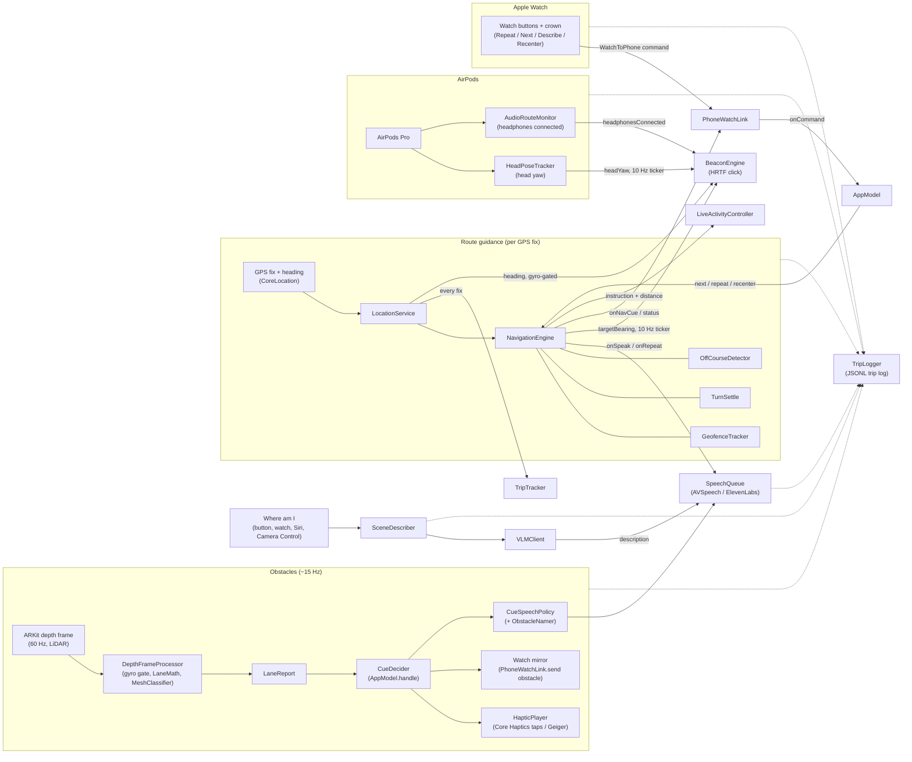

# CaneKit code reference

CaneKit (the OpenCane project) is a native Swift 6 / SwiftUI app, built against iOS 26 / watchOS 26
APIs with no third-party packages, that guides a blind cane user along GPS waypoints and warns about
waist-to-head obstacles. The **phone is the only computer**: an iPhone 17 Pro Max running iOS 27
(deployment target iOS 26) clamped to a non-metal 28.75 mm cane, using LiDAR depth for obstacles and
Core Haptics for taps. AirPods Pro carry the spatial-audio beacon, speech and head yaw. An Apple Watch
gives wrist taps and the Repeat / Next / Describe / Recenter buttons. There's no ESP32 and no external
sensor. The demo route is ISR Townsend Hall → CIF on the UIUC campus
(`ios/CaneKit/Resources/route_isr_cif.json`), and MapKit walking directions handle any other
destination. For the demo everything runs **untethered on the phone**. The Mac only signs and installs
the app. This file maps every file, type and function by module. `AGENTS.md` has the hard rules and
wins wherever the two disagree.

## Contents

- [Data flow](#data-flow)
- [How to keep this file true](#how-to-keep-this-file-true)
- [Module: logic — `ios/Logic` (SwiftPM package `CaneKitLogic`)](#module-logic--ioslogic-swiftpm-package-canekitlogic)
- [Module `app-core` — `ios/CaneKit/App/`](#module-app-core--ioscanekitapp)
- [Module `depth-haptics` — `ios/CaneKit/Depth/*.swift`, `ios/CaneKit/Haptics/HapticPlayer.swift`](#module-depth-haptics--ioscanekitdepthswift-ioscanekithapticshapticplayerswift)
- [Module: speech-audio-scene (`ios/CaneKit/Speech`, `ios/CaneKit/Audio`, `ios/CaneKit/Scene`)](#module-speech-audio-scene-ioscanekitspeech-ioscanekitaudio-ioscanekitscene)
- [Module `navigation-trip` — GPS, waypoint engine, turn settling, route sources, trip log/tracker, Live Activity](#module-navigation-trip--gps-waypoint-engine-turn-settling-route-sources-trip-logtracker-live-activity)
- [Module `watch-widget-shared`](#module-watch-widget-shared)
- [Module: ui-tests-build — Phone UI, XCUITests, XcodeGen build, CI](#module-ui-tests-build--phone-ui-xcuitests-xcodegen-build-ci)

## Data flow

`AppModel` (`ios/CaneKit/App/AppModel.swift`) owns every engine and does the wiring shown below. The
pure decision types (`CueDecider`, `CueSpeechPolicy`, `GeofenceTracker`, `TurnSettle`,
`OffCourseDetector`, `StraightWalkDetector`) live in `CaneKitLogic`, and the app classes around them
only own state, timing and effects. The module sections below have the exact callbacks.



The dotted edges mean every subsystem writes events (`gps`, `speech`, `navcue`, `waypoint`, `lanes`,
`watch`, `describe`, …) to `TripLogger` through `AppModel`.

## How to keep this file true

Change code, and you update its module section here **in the same commit**. Agents read this map
instead of the source, so a stale entry leads them to wrong edits. When you add a file, give it a `###`
entry under the right `##` module. When you rename or delete a type or function, edit or remove its
entry. When you change a number or a ⚠ invariant, keep the text in step with the `CaneKitLogic` test
that pins it. `AGENTS.md` has the hard rules (concurrency, iOS 26 APIs only, logic in `ios/Logic`,
secrets, generated project, frozen bundle IDs, audio session, cue priorities, accessibility labels,
per-commit checks). If this file and `AGENTS.md` disagree, `AGENTS.md` wins; fix this file.

---

## Module: logic — `ios/Logic` (SwiftPM package `CaneKitLogic`)

Pure-Swift, Foundation-only package. No ARKit/UIKit/WatchKit/MapKit/CoreLocation so `swift test` runs on a Mac with only Command Line Tools. **Isolation:** `Package.swift` sets only `.swiftLanguageMode(.v6)` — there is no `SWIFT_DEFAULT_ACTOR_ISOLATION=MainActor` here (unlike the app targets), so every type is **nonisolated** by default. All value types are `Sendable`; the three stateful classes (`CueDecider`, `OffCourseDetector`, `GeofenceTracker`) are deliberately **not Sendable** and must be owned and driven by exactly one actor (the app drives them from `@MainActor` `AppModel` / `NavigationEngine`). The four `NavSupport` state machines (`TurnSettle`, `StraightWalkDetector`, `CueSpeechPolicy`, `CrownAccumulator`) are `Sendable` structs with `mutating` updates: the owner keeps them in a `var` and must write a mutated copy back (e.g. `if var s = settle { s.update(fix); settle = s }` in `NavigationEngine`).

### `ios/Logic/Package.swift`
- swift-tools 6.0; platforms iOS 26, watchOS 26, macOS 15; one library product `CaneKitLogic`, one test target `CaneKitLogicTests` (Swift Testing). No dependencies.
- ⚠ Do not add ARKit/UIKit/MapKit imports to `Sources/` — `ios/scripts/test.sh` and the required CI job rely on the package building with Foundation alone.

---

### `LaneMath.swift` — LiDAR depth map → 3 lanes × 2 bands (10th-percentile per cell) + centre median
**`struct LaneConfig: Sendable, Equatable`** — tunables for `computeLanes`.

| Field | Default | Meaning |
|---|---|---|
| `rotateForPortrait` | `true` | Landscape sensor buffer is the scene rotated 90° CCW (EXIF 6): `bufX = sceneY`, `bufY = bufH-1-sceneX` |
| `mirrorLeftRight` | `false` | Swap output lanes 0↔2 (phone mounted facing the other way) |
| `minConfidence` | `1` (UInt8) | ARKit confidence 0 low / 1 medium / 2 high; pixels below are ignored. Medium **must** be accepted |
| `groundSkipFraction` | `0.25` | Bottom fraction of the upright scene skipped as ground |
| `subsampleStep` | `4` | Sample every Nth pixel on both axes (clamped ≥ 1) |
| `minSamplesPerCell` | `8` | Fewer valid samples → cell = `.infinity` (clear) |
| `percentile` | `0.10` | Index `Int(count × percentile)` of sorted samples ("nearest 10 % of the cell") |
| `centerWindow` | `16` | Side (scene px) of the square window for `centerDepth` |

**`struct LaneGrid: Sendable, Equatable`** — `head: [Float]`, `torso: [Float]` (index 0 = left, 1 = centre, 2 = right; metres; `.infinity` = clear/no data), `centerDepth: Float` (median of centre window, `.infinity` if unknown). `static let empty` = all infinity. `nearest(lane:) -> Float` = `min(head[lane], torso[lane])`.

**`enum LaneMath`**
- `static func computeLanes(depth: UnsafeRawPointer, depthBytesPerRow: Int, confidence: UnsafeRawPointer?, confidenceBytesPerRow: Int, width: Int, height: Int, config: LaneConfig, scratch: inout [Float]) -> LaneGrid`
  - Raw entry point used by the app (`DepthFrameProcessor.swift:145`) over CVPixelBuffer memory. Depth is Float32 metres; confidence is UInt8. **Both row strides must be honoured** (CVPixelBuffer rows are padded). `scratch` is a reusable sample buffer (no per-frame allocation); not thread-safe — one caller at a time.
  - Geometry: `sceneW = rotate ? bufH : bufW`, `sceneH = rotate ? bufW : bufH`; `usableH = max(2, Int(sceneH × (1 − groundSkipFraction)))`; `bandH = usableH / 2` (band 0 = head/top, band 1 = torso); `laneW = sceneW / 3`.
  - A sample is valid iff confidence ≥ `minConfidence` (when a confidence map is given) **and** depth `isFinite && > 0.05 m`. Zero, NaN, and ≤ 5 cm are invalid.
  - Per cell: sorted samples, value = `scratch[min(count−1, Int(count × percentile))]`, or `.infinity` if `count < minSamplesPerCell`. Consequence: an obstacle must cover **more than ~10 %** of a cell's valid samples to register (pinned by `tenthPercentileNeedsMoreThanTenPercentOfCell`).
  - Centre window: full-image centre (**independent of ground skip**), sampled at step 2, median if ≥ 4 samples else `.infinity`.
  - Pure; no side effects other than mutating `scratch`.
- `static func computeLanes(depth: [Float], confidence: [UInt8]?, width: Int, height: Int, config: LaneConfig = LaneConfig()) -> LaneGrid` — array convenience for tests/replay; `precondition(depth.count == width*height)` (and same for confidence); assumes tight rows (`bytesPerRow = width*4` / `width`).
- ⚠ Do not change the rotation mapping, ground skip, percentile logic, or stride handling without re-running `LaneMathTests` (esp. `rawEntrypointHonoursPaddedRowStrides`, `headRowIsTopBand`, `groundBandIsSkipped`) **and** a device test with the phone clamped upright on the cane (the L/R/head/torso orientation is only verifiable on hardware).

---

### `LaneReport.swift` — what the depth pipeline publishes (~15 Hz); value type so it can cross actors
- **`enum ObstacleClass: Int, Sendable, Codable, CaseIterable`** — `none=0, wall, floor, ceiling, table, seat, window, door` — mirrors ARKit mesh classification raw values (order must stay in sync with `ARMeshClassification`). `spokenName: String?` → "wall"/"table"/"seat"/"window"/"door"; `nil` for `none/floor/ceiling` (never announced).
- **`struct MeshHit: Sendable, Equatable`** — `classification: ObstacleClass`, `distance: Float` (m).
- **`struct LaneReport: Sendable, Equatable`** — `grid: LaneGrid` (default `.empty`), `isTrusted: Bool` (default `true`; false while cane is sweeping, |ω| ≥ app threshold → cues freeze), `rotationRate: Float` (|rad/s|, debug footer), `timestamp: TimeInterval`, `depthAvailable: Bool` (default `false`; false until first depth frame / non-LiDAR), `centerHit: MeshHit?`. Computed `head`/`torso` forward to `grid`.
- **`enum TileLevel: Sendable`** — `clear, far, near, urgent, noData`. `static func level(for distance: Float, hasData: Bool) -> TileLevel`: `!hasData → .noData`; non-finite → `.clear`; `< 0.7 → .urgent`; `< 1.2 → .near`; `< 2.0 → .far`; else `.clear`. Used by `LaneGridView` debug tiles. Pinned by `tileLevels`.

---

### `CueDecider.swift` — LaneReport → haptic cue with hysteresis and rate limiting (decides *what/when*; player is elsewhere)
- **`enum HapticCue: Sendable, Equatable`** — `centerApproach(distance: Float)`, `left`, `right`, `head`; `kind: CueKind`.
- **`enum CueKind: String, Sendable, Codable, Hashable, CaseIterable`** — `clear, center, left, right, head`. Also travels to the watch inside `PhoneToWatch.obstacle(CueKind)` — ⚠ raw values are wire format; renaming breaks phone↔watch compatibility.
- **`enum CueOutput: Sendable, Equatable`** — `fire(HapticCue)` (start/re-fire), `updateCenter(distance:)` (centre loop active, only distance changed), `stop` (active cue ended; stop continuous pattern).
- **`struct CueThresholds: Sendable, Equatable`**

| Field | Default | Meaning |
|---|---|---|
| `head` | 1.5 m | any head-row lane closer → head cue |
| `center` | 2.0 m | torso centre lane closer → approach cue |
| `centerNear` | 0.5 m | floor for the reported approach distance (rate scaling floor) |
| `side` | 1.2 m | torso left/right lane closer → side cue |
| `hysteresis` | 0.15 m | zone clears only when `d > enter + hysteresis` |
| `minChangeInterval` | 0.4 s | minimum time between cue *changes* |
| `repeatInterval` | 1.0 s | minimum time before the same discrete cue (left/right/head) fires again |

- **`enum GeigerRate`** — `static func hertz(distance: Float, thresholds: CueThresholds = .init()) -> Double`: `clamp(4/d, 2, 8)`; non-finite or ≤ 0 → 2. So 2 Hz at 2.0 m, 4 Hz at 1.0 m, 8 Hz at 0.5 m. Called by `HapticPlayer.swift:194`. Pinned by `geigerRateScalesWithInverseDistance`.
- **`final class CueDecider`** — **not Sendable**; owned by `AppModel` (`@ObservationIgnored private let decider`). State: `thresholds` (var), `active: CueKind` (private(set), starts `.clear`), `lastChange: TimeInterval` (starts `-∞`), private `lastFired: [CueKind: TimeInterval]`, private `zoneActive` per kind.
  - `init(thresholds: CueThresholds = .init())`
  - `reset()` — clears all state.
  - `update(_ r: LaneReport, now: TimeInterval) -> CueOutput?` — `nil` = nothing new. Algorithm, in order:
    1. `guard r.depthAvailable, r.isTrusted else { return nil }` — untrusted frames **freeze** state (no zone updates, no stop).
    2. Zone hysteresis via `updateZone` for head (`min` of the 3 head lanes vs `head`), center (`torso[1]` vs `center`), left (`torso[0]` vs `side`), right (`torso[2]` vs `side`).
    3. Priority **head > center > left > right**; centre distance reported as `max(centerNear, torso[1])`.
    4. No desired cue: if `active != .clear` → `active = .clear`, `lastChange = now`, return `.stop`; else `nil`.
    5. Desired kind ≠ active: require `now − lastChange ≥ minChangeInterval` (else `nil`, active unchanged). Then for discrete kinds (not center) require `now − lastFired[kind] ≥ repeatInterval`; if not met and something is active → switch to `.clear`, set `lastChange`, return `.stop` (don't leave the old loop running); if nothing active → `nil`. Otherwise set `active`, `lastChange`, `lastFired[kind] = now`, return `.fire`.
    6. Same kind active: center → `.updateCenter(distance:)` every frame (exempt from the 1 s floor); discrete → re-`fire` only when `now − lastFired ≥ repeatInterval`.
  - `now` is caller-supplied (monotonic, seconds); the decider never reads the clock.
  - ⚠ Do not change thresholds, priority order, the 400 ms / 1 s gates, or the freeze rule without re-running `CueDeciderTests` (all 14) and a walk test with the cane; these values are the spec'd haptic grammar.

---

### `GeoMath.swift` — haversine distance/bearing, angle wrapping, off-course detection, waypoint geofences
- **`struct Coordinate: Sendable, Equatable, Codable`** — `latitude`, `longitude` (degrees).
- **`struct GeoFix: Sendable, Equatable`** — `coordinate`, `accuracy: Double` (horizontal m; **negative = invalid**), `speed: Double` (m/s; **negative = invalid**, CoreLocation reports −1 when unknown), `timestamp`. App adapts `CLLocation → GeoFix`.
- **`enum GeoMath`** — `static let earthRadius = 6_371_000.0` m (internal).
  - `distanceMeters(_ a, _ b) -> Double` — haversine, `asin(min(1, √h))` guards rounding.
  - `bearingDegrees(from:to:) -> Double` — initial great-circle bearing, degrees clockwise from true north in `[0, 360)`.
  - `wrap360(_:)` → `[0, 360)`; `wrap180(_:)` → `(−180, 180]` (note `wrap180(180) == 180`); `bearingError(target:heading:)` = `wrap180(target − heading)`, **positive = target is to the right**. Used by `NavigationEngine.swift:220`.
- **`enum Turn: String, Sendable, Codable, Equatable`** — `left, right`.
- **`final class OffCourseDetector`** — **not Sendable**; owned by `NavigationEngine`. Tunables: `threshold = 25°`, `hold = 3 s`, `cooldown = 10 s`.
  - `reset()`; `update(error: Double, now: TimeInterval) -> Turn?` — |error| ≤ threshold resets the episode (`offSince = nil`). Otherwise starts/continues the episode; fires once when `now − offSince ≥ hold` **and** `now − lastCue ≥ cooldown`, then sets `lastCue = now` and `offSince = now` (a further full hold is required before the next cue). Returns `.right` if error > 0 else `.left`.
  - ⚠ Do not change without re-running `offCourseNeedsThreeSecondsThenCoolsDown` / `offCourseResetsWhenBackOnBearing`.
- **`enum NavEvent: Sendable, Equatable`** — `reached(index: Int, waypoint: Waypoint, isLast: Bool, skipped: [Waypoint] = [], passedBy: Bool = false)`. `skipped` = earlier waypoints jumped over via look-ahead; `passedBy` = never entered but clearly walked past.
- **`final class GeofenceTracker`** — **not Sendable**; created per route by `NavigationEngine.swift:85` (which sets `maxAccuracy = veerMaxAccuracy`, 20). Enter-once geofences with GPS gating.

| Tunable | Default | Meaning |
|---|---|---|
| `maxAccuracy` | 20 m | intermediate fixes worse than this are ignored |
| `minSpeed` | 0.5 m/s | intermediate fixes with `speed <= minSpeed` ignored (strictly `> 0.5` passes) |
| `maxArrivalAccuracy` | 30 m | last waypoint needs a valid fix no worse than this; speed-exempt |
| `arrivalHits` | 2 | consecutive *plausibly inside* fixes needed for arrival |
| `lookahead` | 2 | fixes may claim up to this many waypoints beyond the current one |
| `passedByFactor` | 2 | "near" for passed-by (and `isNearCurrent` / leg-bearing zone) = within `factor × radiusM` |
| `passedByFixes` | 3 | consecutive receding gated fixes needed to count as passed |

  - `waypoints` (private(set)), `index` (private(set), starts 0), `current: Waypoint?`, `isFinished: Bool` (`index >= count`).
  - `@discardableResult advance() -> Waypoint?` — manual next (watch crown / Action button); returns the waypoint skipped; resets passed-by state and the arrival streak via private `moveTo`.
  - private `gatePasses(_ fix, forLast:)` — last: `accuracy >= 0 && <= maxArrivalAccuracy`; intermediate: `accuracy` in `[0, maxAccuracy]` **and** `speed >= 0 && speed > minSpeed`.
  - `update(_ fix: GeoFix) -> NavEvent?` — (1) for `i in index...min(last, index+lookahead)` with a passing gate: intermediate waypoint fires when `distance <= radiusM`; the **last** waypoint needs `distance + accuracy/2 <= radiusM` (plausibly inside) and increments a private `arrivalStreak`, firing only once it reaches `arrivalHits`. A fix that was *evaluated* for arrival (passed the arrival accuracy gate) but not plausibly inside resets the streak to 0; a fix too poor to judge (> 30 m) leaves it alone (`aGatedOutFixDoesNotBreakTheArrivalStreak`). On fire: `moveTo(i+1)`, return `.reached(index: i, …, skipped: waypoints[index..<i])` — nearest index wins. (2) Passed-by, intermediate only and only on gated fixes: track `minDistance`; `recedingFixes += 1` when `d > lastDistance − 1 m` (tolerates 1 m jitter), else reset to 0 (first fix after `moveTo` has no `lastDistance` → 0); fire `.reached(…, passedBy: true)` when `minDistance <= radiusM × passedByFactor`, `d >= minDistance + radiusM`, `recedingFixes >= passedByFixes`. Never applied to the last waypoint. Returns `nil` once finished.
  - `targetBearing(from fix: GeoFix, maxLiveAccuracy: Double = 20) -> Double?` — `leg` = previous waypoint's `bearingNextDeg` (nil at index 0). Inside `radiusM × passedByFactor` of the current waypoint → `leg` if non-nil (live bearing swings next to a waypoint and points back after a missed fence; applies to the last waypoint too). Else live bearing when `0 <= accuracy <= maxLiveAccuracy`; else `leg ?? live`. `nil` when finished. Consumed by `NavigationEngine.effectiveBearing` (`NavigationEngine.swift:162/184/292`).
  - `isNearCurrent(_ fix: GeoFix) -> Bool` — fix within `radiusM × passedByFactor` of the current waypoint; always `false` for the last waypoint or when finished. `NavigationEngine.swift:191` mutes veer cues inside this zone.
  - ⚠ Do not change the gating, arrival plausibility/streak, look-ahead, passed-by, or leg-bearing rules without re-running `GeoMathTests` (`geofenceGatesOnAccuracyAndSpeedExceptArrival`, `arrivalStreakResetsOnAMiss`, `invalidSpeedOrAccuracyDoesNotPassIntermediateGate`, `missedFenceIsSkippedWhenTheNextOneIsEntered`, `lookaheadReachesArrivalWhenThePreviousFenceWasMissed`, `oneBadFixShortOfTheDoorDoesNotArrive`, `passedByIgnoresStationaryFixesAtACurb`, `passedByNeverAppliesToArrival`, `passedByStateResetsAfterAdvance`, `targetBearingUsesTheLegNearTheWaypoint`, `walkingPastAWaypointCountsAsReached`, `passedByNeedsANearApproach`) and a GPS walk of the ISR→CIF route (arrival ends the beacon and Live Activity with no way back).

---

### `NavSupport.swift` — small pure state machines the app engines drive (moved out of app classes so they are testable)

**`struct TurnSettle: Sendable, Equatable`** — after a waypoint is reached (its fence fires up to `radius_m` before the corner), keeps the new leg from driving the beacon / veer cues until the user has actually turned.

`struct Config: Sendable, Equatable`

| Field | Default | Meaning |
|---|---|---|
| `nearM` | 6 m | good moving fix this close to the corner → release after grace |
| `minRecedeM` | 6 m | floor for `recedeM = max(minRecedeM, radiusM / 2)` |
| `graceSeconds` | 4 s | delay after a near / recede release |
| `maxMovingSeconds` | 25 s | cap; counts only time between good **moving** fixes |
| `headingMatchDeg` | 30° | body heading within this of `nextBearing` → immediate release |
| `minSpeed` | 0.5 m/s | "moving" = `speed > minSpeed` |
| `maxAccuracy` | 20 m | "good" = `0 <= accuracy <= maxAccuracy` |

- Stored: `anchor: Coordinate`, `heldBearing: Double?` (bearing kept while settling), `nextBearing: Double?` (nil = no heading release), `isCrossing`, `config`, `recedeM`; `private(set)` `minDistance`, `releaseAt: TimeInterval?`, `movingSeconds`; private `recedeHits`, `stoppedHits`, `lastTime`.
- `init(anchor:radiusM:heldBearing:nextBearing:isCrossing:startDistance:releasedAt: TimeInterval? = nil, config: = Config())` — `minDistance` starts at `startDistance`; non-nil `releasedAt` = live from that time (manual / passed-by advance: already past the corner).
- `isLive(at now:) -> Bool` — `releaseAt != nil && now >= releaseAt`, or `movingSeconds >= maxMovingSeconds`.
- `bearing(live: Double?, at now:) -> Double?` — live → `live`; settling at a crossing → `nil` (beacon silent: "Listen for traffic"); else `heldBearing ?? live`.
- `@discardableResult mutating update(_ fix: GeoFix) -> Bool` (returns `isLive(at: fix.timestamp)`):
  1. `dt = clamp(now − lastTime, 0, 5)` (0 on the first fix); `movingSeconds += dt` only when the fix is good **and** moving.
  2. Crossing, not yet released: `stoppedHits` counts consecutive *at-the-curb* fixes: `speed < minSpeed` (speed −1 counts as standing), accuracy ≤ `maxAccuracy`, and distance to the anchor ≤ `nearM + curbSlackM` (6 + 4 = 10 m); any other fix resets it; 2 → `releaseAt = now` (no grace). A pause 11 m short of the street does not release (`aPauseShortOfTheCurbDoesNotReleaseACrossing`).
  3. Only good, moving, unreleased fixes continue: `d ≤ nearM` → `releaseAt = now + graceSeconds`; else `minDistance = min(minDistance, d)`, `recedeHits` counts consecutive fixes with `d ≥ minDistance + recedeM` (reset otherwise); 2 → `releaseAt = now + graceSeconds`. Stationary or poor fixes never ratchet `minDistance` and never release by distance. Once set, `releaseAt` never moves.
- `mutating update(heading: Double, now:)` — unreleased and `nextBearing != nil`: `|wrap180(heading − nextBearing)| < headingMatchDeg` → `releaseAt = now`. Caller must pass the gyro-gated **body** heading (phone on the cane), never head yaw.
- Owner: `NavigationEngine.settle: TurnSettle?`, created in `reached` (`NavigationEngine.swift:274`): normal fence entry → `heldBearing` = previous leg (`skipped.last?.bearingNextDeg ?? previousBearing`), `nextBearing = wp.bearingNextDeg`, `isCrossing = wp.crossing`, `startDistance` = last fix's distance (∞ if none); manual or passed-by → `heldBearing nil`, `isCrossing false`, `releasedAt = now`. Not created for the last waypoint. When live, the engine sets `settle = nil` and resets `OffCourseDetector`; `isSettling` mutes veer cues and blocks auto-recenter.
- ⚠ Do not change the release rules or defaults without re-running the nine `NavSupportTests` settle tests (`settleHoldsThePreviousLegUntilNearTheCornerPlusGrace`, `settleDoesNotReleaseOnOneJitteryFix`, `settleReleasesAfterTwoConsecutiveRecedingFixes`, `stationaryOrPoorFixesNeverReleaseByDistance`, `settleCapCountsMovingTimeOnly`, `crossingSilencesTheBeaconAndReleasesAtTheCurb`, `turningTheBodyReleasesImmediately`, `manualOrPassedByAdvanceIsLiveAtOnce`, `noHeldBearingFallsBackToLive`) and a walk through the 12 m turn fences (WP3/WP6/WP8) incl. the WP6 crossing.

**`struct StraightWalkDetector: Sendable, Equatable`** — "walking straight" for AirPods auto-recenter.
- Vars: `minSpeed = 0.6` m/s (cane users walk ~0.6–1.0 m/s), `maxAccuracy = 20` m, `maxCourseDelta = 15°`, `maxYawDelta = 8°`, `requiredFixes = 3`; `private(set) count`; private `lastHeading`, `lastYaw`. `reset()` clears all three.
- `mutating update(speed: Double, accuracy: Double, heading: Double?, headYaw: Double) -> Bool` — unless `speed > minSpeed`, `0 <= accuracy <= maxAccuracy` and `heading != nil` → `reset()`, `false`. `steady = |wrap180(heading − lastHeading)| < maxCourseDelta`, `still = |headYaw − lastYaw| < maxYawDelta` (plain difference, not wrapped); both `true` on the first fix. `count = steady && still ? count + 1 : 1` (the fix that breaks a run starts the next one). At `requiredFixes` → `reset()` and `true` (the first fix counts).
- Owner: `AppModel.straightWalk` (`AppModel.swift:402`), fed each fix by `autoRecenterIfWalkingStraight` with `location.heading` and `head.headYawDeg ?? 0`; reset while no recenter is pending, `nav.isSettling`, AirPods not connected, or within `recenterAfterCrossingM` (15 m) of a crossing `nav.lastReached`; reset at route start and on every waypoint advance (which re-arms `recenterPending`). `true` → `head.recenter()`.
- ⚠ Pinned by `straightWalkNeedsThreeSteadyFixesCountingTheFirst`, `straightWalkRestartsOnATurnAStopOrAHeadTurn`.

**`struct CueSpeechPolicy: Sendable, Equatable`** — which obstacle cues are also spoken.
- `enum Tier: Sendable, Equatable { safety, obstacle }`. Vars `headInterval = 4 s`, `sideInterval = 4 s`; private `lastSpoken: [CueKind: TimeInterval]`, `episodeKind` (starts `.clear`).
- `mutating cleared()` — `episodeKind = .clear` (next head cue is a new episode).
- `mutating line(for cue: HapticCue, phoneCannotBuzz: Bool, now: TimeInterval) -> (text: String, tier: Tier)?` — `newEpisode = episodeKind != cue.kind`; a `.head` cue sets `episodeKind = .head`, and a side cue moves the episode only when it is actually spoken (a buzzed, silent side cue between two head re-fires does not make the second "new" — `aBuzzedSideCueDoesNotSplitAHeadEpisode`). `.head` → `"Head height."` (`.safety`, `headInterval`) only on a new episode, regardless of `phoneCannotBuzz`. `.left` → `"Left."`, `.right` → `"Right."`, `.centerApproach(d)` → `"Ahead, \(SpokenDistance.phrase(d))."` (all `.obstacle`, `sideInterval`) only when `phoneCannotBuzz`. Then a per-kind limiter: `nil` if `now − lastSpoken[kind] < interval`, else record `now` and return. Consequences: a head episode swallowed by the 4 s limiter is not spoken later in that episode; a *spoken* side cue (phone cannot buzz) between two head cues starts a new head episode.
- Owner: `AppModel.cueSpeech` (`AppModel.swift:262`): `speakCueIfNeeded` on every `CueOutput.fire` with `phoneCannotBuzz = !haptics.isHealthy || haptics.silenced`; `.safety` → `SpeechPriority.safety`, else `.obstacle`; ttl 6 s (survives queuing behind a crossing line). `cleared()` on `CueOutput.stop`; a fresh instance at route start.
- ⚠ Pinned by `headHeightIsSpokenOncePerEpisode`, `headEpisodesAreRateLimitedAcrossEpisodes`, `sideCuesAreSpokenOnlyWhenThePhoneCannotBuzz`. The head line must never be suppressed for a new episode (spec: an overhanging sign has no mesh class).

**`struct CrownAccumulator: Sendable, Equatable`** — Digital Crown "next waypoint" gesture.
- Vars `detents = 3` (Double), `window = 1 s`, `debounce = 0.8 s`; private `windowStart`, `travel`, `lastFire` (`-∞`).
- `mutating move(delta: Double, now: TimeInterval) -> Bool` — window expires when `now − windowStart > window` (travel reset); a new window is anchored at the first detent; `travel += |delta|` (either direction). At `travel ≥ detents` the window and travel reset, then fire only if `now − lastFire ≥ debounce` (a debounced gesture is consumed, not carried over). A cuff brushing once per arm swing never accumulates.
- Owner: `WatchModel.crown` (`WatchModel.swift:50`); `crownMoved(delta:now:)` → `send(.nextWaypoint)`.
- ⚠ Pinned by `crownFiresOnThreeDetentsWithinASecond`, `crownIgnoresARhythmicSleeve`, `crownDebouncesBackToBackGestures`.

---

### `Waypoint.swift` — route file schema + MapKit-steps → waypoints converter (MapKit-free)
- **`struct Waypoint: Sendable, Equatable, Codable, Identifiable`** — `id: Int`, `lat`, `lon`, `radiusM` (JSON `radius_m`), `say: String` (spoken once on fence entry), `crossing: Bool`, `bearingNextDeg: Double?` (JSON `bearing_next_deg`; degrees true; `nil` on last waypoint), `curved: Bool` (JSON `curved`, optional, default `false`: the leg **after** this waypoint is not straight → no veer cues and the beacon is silent on it; `NavigationEngine.legCurved`). `coordinate: Coordinate`.
  - `init(id:lat:lon:radiusM:say:crossing:bearingNextDeg:curved: Bool = false)`.
  - Custom `init(from:)`: `bearing_next_deg` and `curved` are `decodeIfPresent` (`curved` → `false`); all other keys required. Encoding is synthesized (always writes `curved`, omits a nil bearing).
  - `name: String?` — optional JSON `"name"`: the short spoken place name ("Goodwin Avenue", "the path to CIF"). Every waypoint in the shipped route has one (pinned by `shippedRouteFileIsConsistent`, ≤ 30 chars).
  - `placeName: String` — `name` when set, else the first sentence of `say` (split on the first `.`, whitespace-trimmed; MapKit routes use this fallback). Used by `NavigationEngine` for "Passed <place>. <next place> in N meters." and Repeat's "Next, <place>, in N meters." ⚠ Give every hand-written waypoint a `name`; the first-sentence fallback reads badly for sentences like "CIF is ahead on your left".
  - ⚠ `CodingKeys` are the on-disk schema of `ios/CaneKit/Resources/route_isr_cif.json`; changing them breaks `routeFileDecodesSnakeCaseSchema` and `shippedRouteFileIsConsistent`.
- **`struct Route: Sendable, Equatable, Codable`** — `name`, `waypoints`. `static func load(from data: Data) throws -> Route` (plain `JSONDecoder`; called by `RouteSource.swift:22`). `bearingInconsistencies(tolerance: Double = 15) -> [(id, recorded, geometric)]` — every recorded `bearingNextDeg` must be within `tolerance°` (via `wrap180`) of the geometric bearing to the next waypoint; hand-edit sanity check.
- **`struct RouteStepInput: Sendable, Equatable`** — `points: [Coordinate]`, `instructions: String` (one MapKit walking step, reduced).
- **`enum RouteBuilder`** — `static func waypoints(from steps: [RouteStepInput], destinationName: String = "destination") -> [Waypoint]`: drops steps with empty `points` (MapKit's empty first step); one waypoint at the **end** of each step, `id = i+1`, `say` = the **next** step's trimmed instruction (last: `"Arrived at \(destinationName)."`; empty → `"Continue."`), `crossing` = say contains "cross" (case-insensitive), `radiusM` = 15 (20 for the last), `bearingNextDeg` = bearing from this end point to the next step's last point (nil on last), `curved` always `false`. Called by `RouteSource.swift:46`.

---

### `WatchMessage.swift` — phone ↔ watch contract over WatchConnectivity (JSON under message key `"m"`)
- **`enum NavCue: String, Sendable, Codable, CaseIterable`** — `turnLeft, turnRight, crossing, arrived, obstacle`.
- **`enum PhoneToWatch: Sendable, Codable, Equatable`** — `nav(NavCue)`, `obstacle(CueKind)` (mirrored obstacle cue, fallback when phone haptic engine is unhealthy or silenced), `status(instruction: String, distanceM: Int)` (watch face; `distanceM == -1` = unknown — `AppModel` sends `distanceToNext ?? -1`, `WatchModel` maps negative → `nil`). Uses synthesized `Codable` for enums with associated values.
- **`enum WatchToPhone: String, Sendable, Codable, CaseIterable`** — `nextWaypoint, describe, recenter, repeatLast` (`repeatLast` → `AppModel.repeatInstruction()` → `NavigationEngine.repeatInstruction()`: the last line actually spoken plus "Next, <place>, in N meters.").
- **`enum WatchEnvelope`** — `static let key = "m"`; `encode(_ m: PhoneToWatch) throws -> [String: Any]` / `encode(_ m: WatchToPhone) throws -> [String: Any]` (value is `Data` from `JSONEncoder`); `decodePhoneToWatch(_:)` / `decodeWatchToPhone(_:) -> …?` return `nil` when the key is missing, not `Data`, or undecodable (forward compatibility with newer app versions — never throw).
- Call sites: `CaneKit/Watch/PhoneWatchLink.swift` (encode 91/101, decode 146/150), `CaneKitWatch/WatchModel.swift` (decode 68/245/249, encode 125; also read from `receivedApplicationContext`).
- Version skew: the watch sends commands with a reply handler; the phone replies `["ok": decodeWatchToPhone(message) != nil]` (`PhoneWatchLink.swift:152`). The watch treats a missing `ok` as success; `ok == false` → "Update the phone app" + `.retry` haptic.
- ⚠ Case names and raw values are the wire format between two separately installed binaries. Adding cases is safe (old side decodes `nil`, and an old phone replies `ok=false`); renaming/removing is not. Re-run `WatchMessageTests` and a paired phone+watch device test.

---

### `VLMCodec.swift` — request bodies / response parsing for scene-description providers (app owns URLSession, keys, audio)
- **`enum VLMProvider: String, Sendable, Codable, CaseIterable`** — `custom` (any OpenAI-compatible chat endpoint; Muse 1.3 for this build), `anthropic`, `gemini`, `openai`.
- **`enum VLMError: Error, Equatable, LocalizedError`** — `http(Int, String)`, `emptyResponse(String)`, `refused`, `malformed(String)`; `errorDescription` gives spoken/loggable strings.
- **`enum ScenePrompt`** — `static let text` = "You are describing a scene to a blind pedestrian. One sentence, under 20 words, use clock-face directions and distances in meters. Mention hazards first." (fixed by spec).
- **`enum VLMRequest`** (all return `Data` JSON bodies; all take `jpegBase64: String`, `prompt = ScenePrompt.text`):
  - `gemini(jpegBase64:prompt:)` — `generateContent` body: `contents[0].parts = [text, inlineData{mimeType:"image/jpeg", data}]`, `generationConfig{maxOutputTokens: 120, temperature: 0.2, thinkingConfig{thinkingBudget: 0}}`. Header (app side): `x-goog-api-key`.
  - `openAICompatible(model:jpegBase64:prompt:)` — `chat/completions`: user message with `[{type:"text"}, {type:"image_url", image_url.url:"data:image/jpeg;base64,…"}]`, `max_tokens 120`, `temperature 0.2`.
  - `anthropic(model:jpegBase64:prompt:)` — Messages API: content `[image(base64, image/jpeg), text]`, `max_tokens 1024` (ceiling covering thinking + one sentence — 256 would starve the answer on Opus/Sonnet 5), `output_config{effort:"low"}`. Headers (app side): `x-api-key`, `anthropic-version: 2023-06-01`.
- **`enum VLMResponse`**
  - `checkStatus(_ status: Int, data: Data) throws` — non-2xx → `.http(status, msg)` where `msg` = provider `{error:{message}}` or first 200 bytes of body. Called first by `VLMClient.swift:77`.
  - `gemini(_ data) throws -> String` — joins `candidates[0].content.parts[].text`; empty → `.emptyResponse(promptFeedback.blockReason ?? finishReason ?? "no text")`; undecodable → `.malformed("gemini: …")`.
  - `openAICompatible(_ data) throws -> String` — no choices → `.emptyResponse("no choices")`; non-empty `message.refusal` → `.refused`; `content` may be a string **or** `[{type,text}]` (internal `struct ContentValue: Decodable`); empty → `.emptyResponse(finish_reason ?? "no content")`.
  - `anthropic(_ data) throws -> String` — `stop_reason == "refusal"` → `.refused`; joins `content[].text` where `type == "text"`; empty → `.emptyResponse(stop_reason ?? "no text")` ("max_tokens" with no text = thinking ate the budget).
  - internal `clean(_:)` — collapses all whitespace runs to single spaces, strips one pair of surrounding double quotes.
- **`enum SpokenDistance`** — `static func phrase(_ meters: Float) -> String`: rounds to nearest 0.5 m; non-finite → `""`; `< 0.5` → "very close"; 0.5 → "half a meter"; 1 → "one meter"; 1.5 → "one and a half meters"; 2 → "two meters"; whole → "N meters"; else "%.1f meters". Used by `CueSpeechPolicy` ("Ahead, …"), `ObstacleNamer`, `LaneGridView` (accessibility labels).
- ⚠ Do not change request shapes or parser fallbacks without re-running `VLMCodecTests` and one live call per provider from `VLMClient` (the tests only pin JSON shape, not provider acceptance).

---

### Tests — `ios/Logic/Tests/CaneKitLogicTests/` (Swift Testing, `@testable import CaneKitLogic`) — 79 tests
**CueDeciderTests.swift** (14; helper `report(head:torso:trusted:)` builds a trusted, depth-available report)
- `centerApproachFiresThenUpdatesDistance` — first centre frame → `.fire(.centerApproach)`, next → `.updateCenter`, `active == .center`.
- `centerDistanceIsClampedToNearFloor` — 0.3 m reports as 0.5 m (`centerNear`).
- `hysteresisHoldsUntilPlusFifteenCentimetres` — 1.95 → 2.05 → 2.14 m keep updating; 2.2 m → `.stop`; then `nil`.
- `cueChangeNeeds400ms` — left→head change refused at +0.2 s, accepted at +0.5 s.
- `sameDiscreteCueRepeatsAtMostOncePerSecond` — right re-fires at exactly 1.0 s and 2.0 s, not 0.5/0.99/1.5.
- `sameCueDoesNotRefireWithinOneSecondAcrossAClear` — left, clear (stop), left at 0.8 s → nil; at 1.0 s → fire.
- `sameCueDoesNotRefireWithinOneSecondAcrossAChange` — left→right at 0.4 s; left back at 0.8 s → `.stop` (active cleared); 1.0 s → nil (400 ms gate); 1.25 s → fire.
- `headReturningAfterClearWaitsOutTheFloor` — same floor rule for head.
- `centerLoopIsExemptFromTheFloor` — centre re-fires 0.4 s after a stop.
- `headCueKeepsRefiringWhileObstaclePersists` — head fires every 1.0 s while present.
- `headBeatsCenterBeatsSides` — priority order.
- `untrustedFramesFreezeState` — untrusted frame returns nil and leaves `active == .left`; next trusted clear frame → `.stop`.
- `noDepthMeansNothing` — `depthAvailable == false` → nil.
- `geigerRateScalesWithInverseDistance` — 2.0→2 Hz, 1.0→4, 0.5→8, 0.1→8, 10→2, ∞→2.

**GeoMathTests.swift** (19; fixtures `wps` = 2-waypoint ISR→CIF, `line` = 4 waypoints ~100 m apart due north, radii 15/15/15/20)
- `isrToCifIsAboutSevenHundredMetres` — haversine 600–750 m for the demo endpoints.
- `cardinalBearings` — N/E/S/W within 0.5°.
- `wrapping` — `wrap360`, `wrap180` (incl. 180 → 180, 360 → 0), `bearingError` sign convention.
- `offCourseNeedsThreeSecondsThenCoolsDown` — fires at t=3 s, not at 6, again at 13.
- `offCourseResetsWhenBackOnBearing` — an on-bearing sample restarts the hold.
- `geofenceGatesOnAccuracyAndSpeedExceptArrival` — 30 m accuracy and 0.2 m/s rejected for wp1; arrival (~11 m from CIF, speed 0): 40 m rejected, 30 m not plausibly inside (11 + 15 > 20), 12 m first hit → nil, second 12 m → reached; nil after finish.
- `arrivalStreakResetsOnAMiss` — plausible, far, plausible → nil; the next plausible fix arrives.
- `invalidSpeedOrAccuracyDoesNotPassIntermediateGate` — −1 accuracy/speed rejected; speed 0.5 rejected, 0.51 accepted; arrival needs valid accuracy only (speed −1 OK), two fixes.
- `missedFenceIsSkippedWhenTheNextOneIsEntered` — bad-GPS pass of wp1, entering wp2 yields `skipped: [wp1]`.
- `lookaheadReachesArrivalWhenThePreviousFenceWasMissed` — standing still in the arrival fence with wp3 unvisited: first fix nil, second → `reached(index: 3, skipped: [wp3])`.
- `oneBadFixShortOfTheDoorDoesNotArrive` — 30 m fix 6 m from the door (6 + 15 > 20) → nil, not finished.
- `passedByIgnoresStationaryFixesAtACurb` — fixes 18 m east with speed 0 / −1 never pass wp1.
- `passedByNeverAppliesToArrival` — walking past the arrival waypoint 25 m east never finishes.
- `passedByStateResetsAfterAdvance` — `advance()` does not carry the previous waypoint's closest approach.
- `targetBearingUsesTheLegNearTheWaypoint` — 20 m east of wp2 → recorded leg bearing (0), `isNearCurrent == true`.
- `walkingPastAWaypointCountsAsReached` — 22 m lateral offset (inside 2× radius, outside fence) → `passedBy: true`.
- `passedByNeedsANearApproach` — 60 m offset never passes.
- `manualAdvanceSkipsWaypoint` — `advance()` returns the skipped waypoint.
- `targetBearingFallsBackToRecordedWhenFixIsPoor` — 5 m fix → live WNW (280–320°); 50 m fix → recorded `bearingNextDeg` (0).

**NavSupportTests.swift** (17; corner at 40.11, −88.224, helpers `south(m)`/`north(m)`, `settle(...)` = radius 12, held 270, next 0, start 12 m)
- TurnSettle: `settleHoldsThePreviousLegUntilNearTheCornerPlusGrace` (5 m at t=2 → held until 6, live at 6), `settleDoesNotReleaseOnOneJitteryFix`, `settleReleasesAfterTwoConsecutiveRecedingFixes` (`releaseAt == 15` = 11 + 4), `stationaryOrPoorFixesNeverReleaseByDistance` (speed 0 / −1 / accuracy 40), `settleCapCountsMovingTimeOnly` (60 s at the curb not live; 25 s walking live), `crossingSilencesTheBeaconAndReleasesAtTheCurb` (bearing nil, 2 stationary fixes → `releaseAt == 2`), `turningTheBodyReleasesImmediately` (300° no, 350° yes vs next 0), `manualOrPassedByAdvanceIsLiveAtOnce`, `noHeldBearingFallsBackToLive`.
- StraightWalkDetector: `straightWalkNeedsThreeSteadyFixesCountingTheFirst`, `straightWalkRestartsOnATurnAStopOrAHeadTurn` (40° course jump, 0.3 m/s, 12° yaw, nil heading → `count == 0`, 25 m accuracy).
- CueSpeechPolicy: `headHeightIsSpokenOncePerEpisode`, `headEpisodesAreRateLimitedAcrossEpisodes` (cleared, 2 s later → nil), `sideCuesAreSpokenOnlyWhenThePhoneCannotBuzz` (incl. "Ahead, one meter.", per-kind limiter).
- CrownAccumulator: `crownFiresOnThreeDetentsWithinASecond` (±1 either direction), `crownIgnoresARhythmicSleeve` (one detent per 0.9 s), `crownDebouncesBackToBackGestures` (0.6 fire, 0.9 no, 1.5 fire).

**LaneMathTests.swift** (11; helper `portraitBuffer(bufW: 256, bufH: 192, f)` builds a landscape buffer from a scene function; scene = 192 wide × 256 tall; lanes 64 px; usable height 192 → bands of 96)
- `uniformWallReadsSameEverywhere`, `leftWallOnlyHitsLeftLanes`, `mirrorSwapsLeftAndRight`, `headRowIsTopBand`, `groundBandIsSkipped` (bottom 25 % at 0.3 m ignored, centre window too), `lowConfidencePixelsAreIgnored` (confidence 0 → `.infinity`), `tenthPercentileNeedsMoreThanTenPercentOfCell` (20 % coverage → 1 m; 5 % → 4 m), `zeroAndNaNDepthsAreInvalid`, `landscapeModeUsesBufferAsScene` (`rotateForPortrait = false`), `rawEntrypointHonoursPaddedRowStrides` (depth bpr 1088, conf bpr 320, confidence 1 accepted, padding 0xFF/0 never read), `tileLevels`.

**RouteTests.swift** (4)
- `mapKitStepsBecomeWaypoints` — empty first step dropped; ids 1…; say = next instruction; crossing detection; radii 15/20; bearing; last `bearingNextDeg == nil`.
- `routeFileDecodesSnakeCaseSchema` — `radius_m`/`bearing_next_deg` decode (no `curved` key anywhere, no bearing on the last entry) and round-trip.
- `shippedRouteFileIsConsistent` — reads `ios/CaneKit/Resources/route_isr_cif.json` relative to `#filePath`: 6–12 waypoints (currently 9), ids `1...n`, last has nil bearing and radius 20; exact pins crossings `[4, 6, 7]`, curved `[1]`, 12 m fences on ids 3/6/8; every intermediate radius 10–20 m; `crossing` ⇒ say contains "crossing", non-crossing may mention "cross" only as "no crossing"; `waypoints[2].placeName == "Goodwin Avenue"`; every waypoint has a `name` and a `placeName` ≤ 30 chars; bearings within 15°; consecutive spacing 20–300 m; total 700–1300 m. ⚠ Edits to the route JSON must keep this test green (and update the pins on purpose).
- `bearingConsistencyCheckCatchesTypos` — +5° passes, 180° flagged.

**VLMCodecTests.swift** (8) — `geminiRequestCarriesImageAndPrompt` (thinkingBudget 0), `openAIRequestUsesDataURI`, `anthropicRequestShape` (`max_tokens == 1024`, image block first), `geminiResponseParses` (join + clean, SAFETY block → `emptyResponse("SAFETY")`, garbage throws), `openAIResponseParsesStringAndPartsAndRefusal`, `anthropicResponseParsesAndDetectsRefusal`, `httpErrorsCarryProviderMessage`, `spokenDistances`.

**WatchMessageTests.swift** (3) — `phoneToWatchRoundTrips` (all three cases, incl. `obstacle(.clear)`), `watchToPhoneRoundTrips` (all `WatchToPhone.allCases`), `unknownPayloadsDecodeToNil` (missing key, non-Data, unknown case → nil, never throws).

---

### `ios/scripts/test.sh` — runs the package tests (`make test`)
- `cd ios/Logic`; if `xcode-select -p` points at `Xcode.app` → `exec swift test "$@"`.
- Otherwise (Command Line Tools only) → `swift test` with `-Xswiftc -Fsystem -Xswiftc /Library/Developer/CommandLineTools/Library/Developer/Frameworks`, `-Xfrontend -disable-cross-import-overlays`, and matching `-Xlinker -F/-rpath`, because SwiftPM cannot find Swift Testing's Foundation cross-import overlay under CLT.
- Invariant: tests may use only core `Testing` + `Foundation` types (no overlay-dependent APIs). Extra args pass through (e.g. `--filter`).
- CI: `.github/workflows/ci.yml` job `logic-tests` runs plain `swift test` in `ios/Logic` on `macos-latest` with the newest Xcode — **required**; the `sim-build` job is informational (`continue-on-error`).

### Cross-module contracts (who uses what)
- `DepthFrameProcessor` (app) → `LaneMath.computeLanes` (raw pointer form, owns `LaneConfig` and `scratch`) → publishes `LaneReport` at ~15 Hz.
- `AppModel` (MainActor) owns `CueDecider`; feeds each `LaneReport` with `now`; routes `CueOutput` to `HapticPlayer` (which uses `GeigerRate.hertz`), mirrors `CueKind` to the watch via `PhoneToWatch.obstacle`, and asks `CueSpeechPolicy` which cues to speak (`cleared()` on `.stop`).
- `AppModel` owns `StraightWalkDetector` (auto-recenter; gated on `nav.isSettling` / `nav.lastReached`) and sends `PhoneToWatch.status` on every fix and waypoint change (`distanceM` −1 = unknown; `PhoneWatchLink` drops a status with the same text and < 5 m change).
- `NavigationEngine` (MainActor) owns `GeofenceTracker` + `OffCourseDetector` + `TurnSettle?`; adapts `CLLocation → GeoFix`; computes `bearingError` via `GeoMath`; veer muted while settling, on `Waypoint.curved` legs, and when `GeofenceTracker.isNearCurrent`; speaks `Waypoint.placeName` for passed-by and Repeat; publishes `targetBearing`/`bearingError` to `BeaconEngine` and `GuideCard`.
- `RouteSource` → `Route.load` (bundled JSON) or `RouteBuilder.waypoints` (MapKit steps).
- `PhoneWatchLink` / `WatchModel` → `WatchEnvelope` encode/decode (also for `receivedApplicationContext`); phone replies `ok` to watch commands. `WatchModel` owns `CrownAccumulator`.
- `VLMClient` → `VLMRequest.*`, `VLMResponse.checkStatus` then `VLMResponse.*`.
- `CueSpeechPolicy`, `ObstacleNamer`, `LaneGridView` → `SpokenDistance.phrase`; `LaneGridView` → `TileLevel.level`.

---

## Module `app-core` — `ios/CaneKit/App/`

Three files: the `@main` entry, the `AppModel` that owns every engine and all settings, and the App Intents (Action button / Siri). Everything here is `@MainActor` (app-target default `SWIFT_DEFAULT_ACTOR_ISOLATION=MainActor`, `project.yml`); off-main engines hand back `Sendable` value types (`LaneReport`, `GeoFix`) via closures that `AppModel` installs. The pure state machines `AppModel` leans on (`CueDecider`, `CueSpeechPolicy`, `StraightWalkDetector`) live in CaneKitLogic and are unit-tested there.

---

### `CaneKitApp.swift` — app entry point

**Purpose.** Creates the single `AppModel`, keeps the screen awake, forwards scene-phase changes.

- **`struct CaneKitApp: App`** (`@main`, MainActor via SwiftUI).
  - `@State private var model = AppModel()` — the one model for the process lifetime.
  - `@Environment(\.scenePhase) private var scenePhase`.
  - `body`: `WindowGroup { ContentView().environment(model) }` with:
    - `.task { UIApplication.shared.isIdleTimerDisabled = true; model.start() }` — the idle timer *must* stay disabled: the camera (hence LiDAR) stops when the screen locks and the app has no background mode. `start()` is idempotent (guarded by `started`) so `.task` re-entry is safe.
    - `.onChange(of: scenePhase) { _, phase in model.scenePhaseChanged(phase) }`.

⚠ Do not remove `isIdleTimerDisabled = true` without a device walk test — ARKit dies on screen lock.

---

### `AppModel.swift` — engine owner, settings, cue router

**Purpose.** Central `@MainActor @Observable final class AppModel`. Owns every engine, persists user settings in `UserDefaults`, routes each depth `LaneReport` to haptics/watch/speech/log, wires navigation and headphone-route callbacks, runs the route start/stop sequence, handles watch commands, and observes thermal/battery.

#### Types

| Type | Kind / isolation | Role |
|---|---|---|
| `AppModel` | `@MainActor @Observable final class` | Owner of all engines and settings; UI reads its published properties. |
| `Settings` | `enum` namespace (implicitly `@MainActor` via the target default) | Thin `UserDefaults.standard` wrapper: `bool(_:default:)`, `set(_:_:)`. |

#### Engine wiring (all `let`, created in the property initialisers except `describer`)

| Property | Type | Step | Notes |
|---|---|---|---|
| `depth` | `DepthEngine` | 2 | LiDAR lanes + gyro gate. `onReport` → `handle(_:)` (~15 Hz); `report.isTrusted`, `isRunning`, `apply(portrait:mirror:)`, `pause/resume`, `setMeshClassification(_:)`. |
| `haptics` | `HapticPlayer` | 3 | Taptic renderer. `silenced`, `isHealthy`, `play`, `setApproach(distance:)`, `stopAll`, `start/resume`. |
| `logger` | `TripLogger` | — | JSONL trip log. `enabled`, `start`, `event`, `lanes`, `flush`. |
| `speech` | `SpeechQueue` | 4 | Single voice. `say(_:_:ttl:)` (default ttl 8), `sayAgain(_:_:ttl:)` (default ttl 12; bypasses coalescing so a line still playing is re-spoken), `prefetch`, `stopAll`, `isSpeaking`, `configureAudioSession`. |
| `watch` | `PhoneWatchLink` | 5 | WatchConnectivity. `onCommand`, `activate`, `isPaired`, `isReachable`, `send(obstacle:now:)`, `send(nav:)`, `send(status:distanceM:)` (dedups: same text and < 5 m change is dropped). |
| `location` | `LocationService` | 6 | GPS + compass. `onFix`, `onHeading`, `fix`, `heading` (GPS course when moving, compass otherwise), `start/stop`, `requestAuthorization`. |
| `nav` | `NavigationEngine` | 6 | Waypoints. `onSpeak`, `onRepeat`, `onNavCue`, `onWaypointAdvanced`, `onArrived`, `start/stop/next/repeatInstruction`, `isNavigating`, `isSettling`, `lastReached`, `instruction`, `distanceToNext`, `targetBearing`, `waypointIndex`, `route`. |
| `beacon` | `BeaconEngine` | 7 | Spatial click. `enabled`, `headphonesConnected` (renders only into headphones), `start/stop`, `setSpeaking`, `setHeadYaw`, `setTarget(bearing:)`, `setHeading`. |
| `head` | `HeadPoseTracker` | 7 | AirPods yaw. `start/stop/recenter`, `headYawDeg`, `isConnected`. |
| `audioRoute` | `AudioRouteMonitor` (`@MainActor @Observable`, `ios/CaneKit/Audio/`) | — | Headphone presence. `onChange: ((Bool, String) -> Void)?` fires only when the headphone state flips (connected, route name); `start()`, `headphonesConnected`, `outputName`. |
| `describer` | `SceneDescriber` | 8 | Built in `init` as `SceneDescriber(processor: depth.processor, speech: speech)`. `describe()`, `providerName`. |
| `trip` | `TripTracker` | 9 | `start()`, `async stop()`, `ingest(fix)`, `spokenSummary(destination:)`. |
| `liveActivity` | `LiveActivityController` | 9 | `start(routeName:instruction:distanceM:)`, `update(instruction:distanceM:kind:)`, `end(final:)` / `end()`. |
| `decider` | `CueDecider` (`@ObservationIgnored private let`, CaneKitLogic) | 3 | Pure cue state machine; `update(_:now:) -> CueOutput?`, `reset()`. |
| `namer` | `ObstacleNamer` (`@ObservationIgnored private let`) | 4 | Mesh-class → "door ahead, two meters"; `update(_:now:) -> String?`, `reset()`. |

Logic state held as `@ObservationIgnored private var` value types (CaneKitLogic `NavSupport.swift`): `cueSpeech: CueSpeechPolicy` (which obstacle cues are spoken; replaced with a fresh value in `beginRoute`) and `straightWalk: StraightWalkDetector` (auto-recenter trigger).

`private(set) static weak var shared: AppModel?` — set in `init`; read by `IntentSupport.model()` (App Intents run inside the app process).

#### Published UI state (`private(set)` unless noted)

- `destinationQuery: String` (read/write, route picker text), `routeError: String?`, `isBuildingRoute: Bool`.
- `activeCue: CueKind` (`.clear` when nothing in range), `lastCueDescription: String` (`"<kind> @ <ar_t>s"`, initial `"—"`).
- `lidarSupported = DepthEngine.supportsDepth`, `meshClassificationSupported = DepthEngine.supportsMesh` (fixed per process).
- `status: String { depth.status }` (computed), `started: Bool`, `thermalName: String` (`nominal|fair|serious|critical|unknown`), `batteryPercent: Int` (0–100, `-1` unknown/simulator), `cameraControlPresses: Int`.

#### Settings — UserDefaults keys

Each is a stored `var` initialised from `Settings.bool(key, default:)`; `didSet` persists and pushes to the engine that cares.

| Key | Default | Pushed to |
|---|---|---|
| `portraitMode` | `true` | `pushDepthSettings()` → `depth.apply(portrait:mirror:)` |
| `mirrorLeftRight` | `false` | `pushDepthSettings()` |
| `hapticsSilenced` | `false` | `haptics.silenced` (decider keeps running so speech/watch stay in sync) |
| `loggingEnabled` | `true` | `logger.enabled` |
| `obstacleNamesEnabled` | `true` | read in `handle` only |
| `beaconEnabled` | `true` | `beacon.enabled` |
| `fallbackToWatch` | `false` | read in `handle` only (mirror every cue to the wrist) |

`init()` re-pushes `portrait/mirror`, `haptics.silenced`, `logger.enabled`, `beacon.enabled` (didSet does not run for initial values), then sets `AppModel.shared = self`.

#### Constants

| Name | Value | Where / meaning |
|---|---|---|
| `CueSpeechPolicy.headInterval` | 4 s | Min gap between "Head height." lines across episodes (AR clock). |
| `CueSpeechPolicy.sideInterval` | 4 s | Min gap per kind for "Left." / "Right." / "Ahead, …" (AR clock). |
| ticker period | 100 ms (10 Hz) | `startTicker` beacon sync loop. |
| namer speech `ttl` | 4 s | `> namer interval (2.5 s) + one utterance`. |
| cue speech `ttl` | 2 s | `speakCueIfNeeded`. |
| nav speech `ttl` | 12 s; repeat 12 s (`sayAgain` default); arrival summary 30 s | `nav.onSpeak`, `nav.onRepeat`, `onArrived`. |
| headphone connect/disconnect `ttl` | 5 s | `wireAudioRoute`. |
| channel announcement `ttl` | 20 s | `announceChannels`. |
| `StraightWalkDetector` gates | speed `> 0.6` m/s; `0 ≤ acc ≤ 20` m; course `|wrap180(Δ)| < 15°`; head `|Δyaw| < 8°`; 3 fixes (the first counts) | Auto-recenter (≈ 3 s at 1 Hz GPS). Library defaults, not overridden here. |
| `recenterAfterCrossingM` | 15 m | No auto-recenter this close to a just-reached crossing waypoint. |
| MapKit first-fix wait | 30 × 500 ms = 15 s | `startMapKitRoute` |
| thermal "hot" | `.serious` or `.critical` | disables mesh classification |
| `commonLines` | 15 strings | pre-synthesised at start and route begin |

#### Lifecycle

- **`init()`** — builds `describer`, pushes settings, registers `shared`.
- **`start()`** — once (`guard !started`). Order matters:
  1. `observeThermalAndBattery()`; 2. `logger.start()`; 3. `speech.configureAudioSession()` **before ARKit and before the haptic engine**; 4. `wireAudioRoute()`; 5. `haptics.start()`; 6. `watch.onCommand = handleWatchCommand`; `watch.activate()`; 7. `wireNavigation()`; 8. `location.requestAuthorization()` **unless env `CANEKIT_UITEST == "1"`** (the three-choice alert races the first XCUITest tap) — Location prompts at launch, Motion/HealthKit at route start to avoid a three-alert pile-up; 9. `depth.onReport = handle`; `depth.start()`; 10. log `start` event (`lidar`, `mesh`, `haptics`); 11. `speech.prefetch(commonLines)`; `speech.say("CaneKit ready." | "CaneKit. This phone has no LiDAR.", .nav)`; 12. if `CommandLine.arguments` contains `--demo-route` **or** env `CANEKIT_DEMO_ROUTE == "1"` → `startDemoRoute()` (simulator GPS replay / UI-test hook).
  ⚠ Do not reorder audio-session → haptics → ARKit without a device test (AirPods route + Taptic engine ownership).
- **`scenePhaseChanged(_ phase: ScenePhase)`** — no-op until `started`.
  - `.active`: `haptics.resume()`, `depth.resume()` (no tracking reset).
  - `.inactive`: nothing.
  - `.background`: `depth.pause()` (stops gyro too), `haptics.stopAll()`, `decider.reset()`, `namer.reset()`, `activeCue = .clear`, `logger.flush()`.
- **`startTicker()` / `stopTicker()`** — private; a `Task` at 10 Hz while a route is active pushing `speech.isSpeaking` → `beacon.setSpeaking`, `recenterPending ? 0 : (head.headYawDeg ?? 0)` → `beacon.setHeadYaw`, and `nav.isNavigating ? nav.targetBearing : nil` → `beacon.setTarget(bearing:)`. Idempotent (`guard ticker == nil`). Head yaw is forced to 0 while a recenter is pending: after a turn the AirPods yaw (relative to the old reference) already contains the body turn the phone heading has, so adding both would double-count it.

#### Cue router — `handle(_ report: LaneReport)` (private, ~15 Hz, called from `depth.onReport`)

1. `decider.update(report, now: report.timestamp)` (AR clock, seconds) →
   - `.fire(cue)`: `activeCue = cue.kind`; `haptics.play(cue)`; `phoneCannotBuzz = !haptics.isHealthy || haptics.silenced`; if `phoneCannotBuzz || fallbackToWatch` → `watch.send(obstacle: cue.kind, now:)`; `speakCueIfNeeded(cue, phoneCannotBuzz:, now:)`; update `lastCueDescription`; log `cue` (`kind`, `ar_t`, plus `distance` for `.centerApproach`).
   - `.updateCenter(d)`: `activeCue = .center`; `haptics.setApproach(distance: d)` (no watch/speech — continuous ramp).
   - `.stop`: `activeCue = .clear`; `haptics.stopAll()`; `cueSpeech.cleared()` (the next head cue is a new episode); log `cue: clear`.
2. If `obstacleNamesEnabled` and `namer.update(report, now:)` returns a line → `speech.say(line, .obstacle, ttl: 4)` + log.
3. `logger.lanes(report, cue: activeCue, thermal: thermalName, battery: batteryPercent)` every report.

Invariants: `now` is always `report.timestamp` (AR clock), never wall time — the decider's `repeatInterval` (1.0 s), its 400 ms `minChangeInterval` and `CueSpeechPolicy`'s intervals are in that clock. ⚠ Do not change the decider/`now` contract without re-running `CueDeciderTests` (`cueChangeNeeds400ms`, `hysteresisHoldsUntilPlusFifteenCentimetres`, `centerApproachFiresThenUpdatesDistance`).

#### `speakCueIfNeeded(_ cue: HapticCue, phoneCannotBuzz: Bool, now: TimeInterval)` (private)

Delegates to `cueSpeech.line(for: cue, phoneCannotBuzz:, now:) -> (text: String, tier: Tier)?`; nil → return. Tier `.safety` → `SpeechPriority.safety`, else `.obstacle`; then `speech.say(text, priority, ttl: 6)` + log `speech`.
Policy (`CueSpeechPolicy`, CaneKitLogic):
- `.head` → `"Head height."` (`.safety`) **once per episode, regardless of haptics** — an episode starts when the fired kind differs from the previous fired kind or after `cleared()`; plus at most one per `headInterval` (4 s) across episodes. Plan rule: the `.head` cue must never be suppressed (overhanging signs have no mesh class, so the namer is silent and clamp haptics may be unfelt), but re-speaking it while the haptic re-fires at 1 Hz cut crossing lines to pieces.
- `.left` / `.right` / `.centerApproach(d)` → `"Left."` / `"Right."` / `"Ahead, \(SpokenDistance.phrase(d))."` (`.obstacle`) **only when `phoneCannotBuzz`**, per kind at most every `sideInterval` (4 s); otherwise nil (the Taptic pattern is the channel).
- `cueSpeech` is reset to `CueSpeechPolicy()` at every `beginRoute`.
⚠ Do not add a further suppression path for `.head` without a device head-height test and re-running `NavSupportTests` (`headHeightIsSpokenOncePerEpisode`, `headEpisodesAreRateLimitedAcrossEpisodes`, `sideCuesAreSpokenOnlyWhenThePhoneCannotBuzz`).

#### Headphones / watch presence

- **`wireAudioRoute()`** (private, called once in `start`) — installs `audioRoute.onChange { connected, name }`: `beacon.headphonesConnected = connected`; log `audioroute` (`connected`, `name`); connected → `speech.say("\(name) connected.", .nav, ttl: 5)` and, if `nav.isNavigating`, `head.start()` + `recenterPending = true`; disconnected → `speech.say("Headphones disconnected. Beacon paused.", .nav, ttl: 5)` (head tracker is not stopped). Then `audioRoute.start()` and seeds `beacon.headphonesConnected = audioRoute.headphonesConnected` (the initial read does not fire `onChange`). The beacon only renders into headphones; a click out of the cane speaker carries no direction.
- **`announceChannels()`** (private, last step of `beginRoute`) — each applicable line at `.nav`, ttl 20, queued after the route intro: `!audioRoute.headphonesConnected` → `"No headphones. Beacon paused until AirPods connect."`; `watch.isPaired && !watch.isReachable` → `"Watch not reachable. Open CaneKit on the watch."`; `!haptics.isHealthy && !watch.isReachable` → `"Haptics unavailable. Obstacle cues will be spoken."`.

#### Navigation wiring — `wireNavigation()` (private, called once in `start`)

- `location.onFix { fix }`: `nav.update(fix:)`; `trip.ingest(fix)`; if `nav.isNavigating` → `liveActivity.update(instruction:, distanceM: nav.distanceToNext ?? 0, kind: lastNavKind)`, `pushStatusToWatch()` (every fix; the link's dedup makes it ≈ 1 message / 5 s) and `autoRecenterIfWalkingStraight(fix)`; log `gps` (`lat`, `lon`, `acc`, `speed`).
- `location.onHeading { h }`: **gyro gate** — `guard depth.report.isTrusted || !depth.isRunning` (a compass reading mid-cane-sweep is noise; gate only applies while depth is running); then `nav.update(heading: h, now: Date().timeIntervalSinceReferenceDate)` (wall clock, distinct from the AR clock) and `beacon.setHeading(h)`.
- `nav.onSpeak { text, priority }`: `speech.say(text, priority, ttl: 12)` + log.
- `nav.onRepeat { text }`: `speech.sayAgain(text, .nav)` (ttl 12; must bypass coalescing — the line may still be playing) + log `speech {repeat: true}`.
- `nav.onNavCue { cue: NavCue }`: `watch.send(nav: cue)`; `lastNavKind = cue.rawValue` (Live Activity glyph); log `navcue`.
- `nav.onWaypointAdvanced`: log `waypoint` (`index`); `pushStatusToWatch()`; `recenterPending = true`; `straightWalk.reset()` (re-zero head **only once walking straight**, never on a timer — at a curb the head is turned toward traffic).
- `nav.onArrived`: log `arrived`; `beacon.stop()`; `head.stop()`; `stopTicker()`; `pushStatusToWatch()`; `liveActivity.end(final: nav.instruction)`; then a `Task`: `await trip.stop()`; `destination = nav.route?.waypoints.last?.say ?? "Arrived"`; `nav.appendToLastSpoken(summary)` (so Repeat at the door includes the numbers), then `speech.say(summary, .nav, ttl: 30)` — same `.nav` priority as the waypoint line so it queues after it.

Public helpers: `recenter()` (`head.recenter()`, `recenterPending = false`, says `"Recentered."` ttl 2, log), `repeatInstruction()` (`nav.repeatInstruction()`, log `repeat`). `nav.repeatInstruction()` speaks the last waypoint line actually spoken (route intro, waypoint line or "Passed …" line) plus `" Next, <placeName>, in N meters."` while navigating, via `onRepeat`; it also works after arrival (last line only); with no route and not arrived it speaks `"No route running."` via `onSpeak`.

#### Auto-recenter — `autoRecenterIfWalkingStraight(_ fix: GeoFix)` (private, per GPS fix while navigating)

State (`@ObservationIgnored`): `recenterPending: Bool`, `straightWalk: StraightWalkDetector`; `private let recenterAfterCrossingM: Double = 15`.
Rules, in order:
1. `guard recenterPending, !nav.isSettling, head.isConnected` else `straightWalk.reset()`; return.
2. If `nav.lastReached` is a `crossing` waypoint and `GeoMath.distanceMeters(fix.coordinate, wp.coordinate) < 15` → `straightWalk.reset()`; return (stepping off the curb the head is still turned toward traffic).
3. `straightWalk.update(speed: fix.speed, accuracy: fix.accuracy, heading: location.heading, headYaw: head.headYawDeg ?? 0)` — returns true on the 3rd consecutive fix (the first counts) with speed `> 0.6`, `0 ≤ acc ≤ 20`, non-nil heading, `|wrap180(h − last)| < 15°` and `|yaw − last| < 8°`. A failed speed/accuracy/heading gate resets the detector (count 0); a course or head-yaw miss restarts the count at 1. The detector resets itself on success.
4. On true: `head.recenter()`, `recenterPending = false`, log `recenter {auto: true}`.
`recenterPending` is set at route start, on every waypoint advance and when headphones connect mid-route; cleared by manual `recenter()` or auto. While set, the beacon renders from the phone heading alone (see `startTicker`). ⚠ Do not loosen the detector gates or the 15 m crossing exclusion without a device walk test at a curb (README §3 "auto when walking straight for 3 s"); covered by `NavSupportTests` (`straightWalkNeedsThreeSteadyFixesCountingTheFirst`, `straightWalkRestartsOnATurnAStopOrAHeadTurn`) and `GeoMathTests.wrapping`.

#### Route start / stop sequence

- **`startDemoRoute()`** — `RouteSource.bundled()` → `beginRoute`; on throw: `routeError`, says `"Route file missing."`.
- **`startMapKitRoute()`** — trims `destinationQuery`; empty → `routeError = "Type a destination first"`. Else `location.start()`, `isBuildingRoute = true`, `routeError = nil`, says `"Finding a route to \(query)."`; `Task`: poll `location.fix` up to 30×500 ms; no fix → `routeError = "No GPS fix yet"` + `"No GPS fix yet. Try again outside."`; else `RouteSource.mapKit(to: query, from: origin)` → `beginRoute`; on error `routeError` + `"Could not build a route. …"`. `defer` clears `isBuildingRoute`.
- **`beginRoute(_ route: Route)`** (private) — order: `routeError = nil` → `speech.prefetch(waypoint lines + commonLines + "Route started. \(name). First: \(first.say)")` → `location.start()` → `nav.start(route)` (speaks the intro) → `beacon.start()` → `head.start()` → `recenterPending = true; straightWalk.reset()` → `cueSpeech = CueSpeechPolicy()` → `startTicker()` → `trip.start()` (Motion/HealthKit prompts here) → `lastNavKind = "straight"` → `liveActivity.start(routeName:instruction:distanceM: nav.distanceToNext ?? 0)` → log `route {action: start, name, waypoints, headphones: audioRoute.outputName, watch: watch.isReachable}` → `pushStatusToWatch()` → `announceChannels()`.
- **`stopRoute()`** — `nav.stop()` → `location.stop()` → `beacon.stop()` → `head.stop()` → `stopTicker()` → `Task { await trip.stop() }` → `liveActivity.end()` → `speech.stopAll()` (**queued waypoint lines must not play after Stop**) → `speech.say("Route stopped.", .nav)` → log `route {action: stop}` → `pushStatusToWatch()`.
- **`pushStatusToWatch()`** (private) — `watch.send(status: nav.instruction, distanceM: nav.distanceToNext ?? -1)` (`-1` = no distance; the watch maps it to nil).
- `static let commonLines: [String]` — `"CaneKit ready."`, `"Route started."`, `"Route stopped."`, `"Next."`, `"Recentered."`, `"Veer left."`, `"Veer right."`, `"GPS weak. Waypoint cues paused until it recovers."`, `"GPS back."`, `"No route running."`, `"No GPS fix yet. Try again outside."`, `"Head height."`, `"Left."`, `"Right."`, `"Passed one waypoint."`. Must stay byte-identical to the strings spoken elsewhere (`NavigationEngine`, `CueSpeechPolicy`, this file) or the prefetch cache misses. (`"Route started."` and `"Next."` are not currently spoken standalone — the intro is `"Route started. <name>. First: …"`, prefetched separately.)

#### Watch commands — `handleWatchCommand(_ cmd: WatchToPhone)` (private; installed as `watch.onCommand`)

Logs `watch {command}` then: `.nextWaypoint` → `nav.next()` if navigating else says `"No route running."` (ttl 2); `.describe` → `describeScene()`; `.recenter` → `recenter()`; `.repeatLast` → `repeatInstruction()`. The `WatchToPhone` enum is in CaneKitLogic (`WatchMessage.swift`) — ⚠ adding a case requires updating this `switch` and re-running `WatchMessageTests.watchToPhoneRoundTrips`.

Other triggers into the same paths: `describeScene()` (logs `describe {provider}` then `describer.describe()`; used by button, watch, intent, Camera Control), `cameraControlPressed()` (`cameraControlPresses += 1` then `describeScene()`), debug `watchTest(_ cue: NavCue)` (`watch.send(nav:)`), `speechTest()` (a `.scene` line then an `.obstacle` line to prove interrupt ordering).

#### Thermal / battery observers

- `observeThermalAndBattery()` — `UIDevice.current.isBatteryMonitoringEnabled = true`; initial `updateBattery()` + `updateThermal()`; `NotificationCenter` observers for `ProcessInfo.thermalStateDidChangeNotification` and `UIDevice.batteryLevelDidChangeNotification` on `queue: .main`, bodies wrapped in `MainActor.assumeIsolated` (closures are `@Sendable` but provably on main). Tokens kept in `thermalObserver` / `batteryObserver` (`@ObservationIgnored`).
- `updateThermal()` — maps state to `thermalName`; `hot = .serious || .critical` → `depth.setMeshClassification(!hot)` (cheapest downgrade: drop mesh classification when hot; obstacle names then go silent).
- `updateBattery()` — `batteryLevel < 0` → `-1`, else `Int((level*100).rounded())`.
- `pushDepthSettings()` — `depth.apply(portrait: portraitMode, mirror: mirrorLeftRight)`.

---

### `AppIntents.swift` — Action button / Siri entry points

**Purpose.** Three `AppIntent`s that open the app (ARKit needs the foreground) and call into `AppModel.shared`, plus the `AppShortcutsProvider`.

| Type | Kind | Role |
|---|---|---|
| `WhereAmIIntent` | `struct: AppIntent` | title "Where am I"; `perform()` → `model.describeScene()`. |
| `StartDemoRouteIntent` | `struct: AppIntent` | title "Start CaneKit route"; `perform()` → `model.startDemoRoute()`. |
| `RepeatInstructionIntent` | `struct: AppIntent` | title "Repeat instruction"; `perform()` → `model.repeatInstruction()`. |
| `IntentSupport` | `enum` namespace | `struct NotReady: Error, CustomLocalizedStringResourceConvertible` ("CaneKit is still starting. Try again."); `@MainActor static func model() async throws -> AppModel` polls `AppModel.shared` up to 20 × 100 ms (2 s) on a cold lock-screen launch, then throws `NotReady`. |
| `CaneKitShortcuts` | `struct: AppShortcutsProvider` | Registers the three shortcuts; every phrase must contain `\(.applicationName)`. |

All three intents: `static let supportedModes: IntentModes = .foreground(.immediate)`; `perform()` is `@MainActor`, returns `.result()`.

Phrases: `"Where am I in <app>"`, `"<app> describe the scene"` (`eye`); `"Start my route in <app>"` (`figure.walk`); `"Repeat in <app>"`, `"<app> say that again"` (`arrow.counterclockwise`).

⚠ Do not change `supportedModes` away from foreground — `describeScene()` needs a live ARKit frame, which only exists while the app is frontmost.

---

## Module `depth-haptics` — `ios/CaneKit/Depth/*.swift`, `ios/CaneKit/Haptics/HapticPlayer.swift`

Pipeline: ARKit frame (60 Hz, `canekit.depth` queue) → `DepthFrameProcessor` (rate-capped to 15 Hz, gyro gate, `LaneMath.computeLanes`, throttled `MeshClassifier` lookup) → `AsyncStream<LaneReport>` (newest-only) → `DepthEngine` (main actor, `@Observable`) → `onReport` → `AppModel.handle(_:)` → `CueDecider` → `HapticPlayer.play/setApproach/stopAll` (plus the watch mirror, `CueSpeechPolicy` speech and `ObstacleNamer`, all in `AppModel`). Pure logic (`LaneMath`, `LaneConfig`, `LaneGrid`, `LaneReport`, `MeshHit`, `ObstacleClass`, `HapticCue`, `CueKind`, `GeigerRate`) lives in `CaneKitLogic`; this module only wraps ARKit / CoreMotion / CoreHaptics around it.

### `ios/CaneKit/Depth/DepthFrameProcessor.swift`

Purpose: the only hot path off the main actor. Converts each `ARFrame` into a Sendable `LaneReport` and yields it to the main actor.

**`struct ProcessorSettings: Sendable`** — runtime knobs, replaced atomically via `Mutex` from the main actor.

| Field | Default | Unit / meaning |
|---|---|---|
| `lane` | `LaneConfig()` | see LaneConfig table below |
| `sweepThreshold` | `0.6` | rad/s; \|gyro\| ≥ this → frame `isTrusted == false` (cane mid-sweep) |
| `maxRate` | `15` | Hz publish cap (ARKit delivers 60) |
| `meshLookupEnabled` | `true` | run `MeshClassifier` at image centre (~10–15 % CPU) |
| `meshEveryNthFrame` | `4` | mesh lookup on every 4th *published* frame ≈ 4 Hz |

**`LaneConfig` (CaneKitLogic, consumed here)** — lane geometry:

| Field | Default | Meaning |
|---|---|---|
| `rotateForPortrait` | `true` | 256×192 landscape sensor buffer is the scene rotated 90° CCW; scene `(sx,sy)` → buffer `(bx = sy, by = bufH-1-sx)` |
| `mirrorLeftRight` | `false` | output lane index `2 - lane` |
| `minConfidence` | `1` | ARKit confidence 0 low / 1 med / 2 high; below → pixel ignored |
| `groundSkipFraction` | `0.25` | bottom 25 % of the upright image dropped as ground |
| `subsampleStep` | `4` | every 4th pixel on both axes |
| `minSamplesPerCell` | `8` | fewer valid samples → cell = `.infinity` (clear) |
| `percentile` | `0.10` | 10th-percentile depth per cell |
| `centerWindow` | `16` | side (scene px) of the centre square → median `centerDepth` (needs ≥ 4 samples, stride 2) |

Lane grid: usable height = `sceneH × 0.75`, split into 2 equal bands (band 0 = head, band 1 = torso); width split into 3 lanes of `sceneW/3` (0 = left, 1 = centre, 2 = right). Depth ≤ 0.05 m or non-finite is invalid. Centre window uses the full image centre, independent of the ground skip.

**`nonisolated final class DepthFrameProcessor: NSObject, ARSessionDelegate, @unchecked Sendable`** — thread model: every mutable field is guarded by `settings` (Mutex), `imageLock` (NSLock), or is queue-only (`lastPublished`, `publishedCount`, `scratch`, `lastMeshHit`).

- `let reports: AsyncStream<LaneReport>` — `bufferingNewest(1)`: a slow consumer only ever sees the latest report.
- `let queue = DispatchQueue(label: "canekit.depth", qos: .userInteractive)` — ARKit's `delegateQueue`; serial.
- `let settings = Mutex(ProcessorSettings())` — written by `DepthEngine.apply` / `setMeshClassification`; read once per frame (`withLock { $0 }` copy).
- `startMotion()` — starts `CMMotionManager` raw gyro at `1/60` s if available and not already active. `stopMotion()` stops it. Gyro is *polled* (`gyroData`) per frame rather than callback-driven so the gate and the depth sample refer to the same instant.
- `private var rotationRate: Float` — `√(x²+y²+z²)` of `gyroData.rotationRate`, 0 when no data.
- `session(_:didUpdate:)` (on `queue`):
  1. Retains `frame.capturedImage` in `latestImage` under `imageLock` — **one buffer only**; ARKit's pool stalls if more are held.
  2. Rate gate: returns unless `frame.timestamp - lastPublished ≥ 1/maxRate`; increments `publishedCount`.
  3. `trusted = rotationRate < sweepThreshold`.
  4. `computeGrid` nil → yields `LaneReport(grid: .empty, isTrusted:, rotationRate:, timestamp:, depthAvailable: false, centerHit: nil)`.
  5. Mesh: if `meshLookupEnabled && publishedCount % max(1, meshEveryNthFrame) == 0` → `lastMeshHit = MeshClassifier.nearestFace(to: grid.centerDepth, in: frame)`; if lookup disabled → `lastMeshHit = nil`; otherwise the previous hit is **reused** (stale by up to 3 frames by design).
  6. Yields `LaneReport(grid:, isTrusted:, rotationRate:, timestamp: frame.timestamp, depthAvailable: true, centerHit: lastMeshHit)`.
- `session(_:didFailWithError:)` — no-op (errors surface via `SessionObserver`).
- `private func computeGrid(frame:config:) -> LaneGrid?` — uses `frame.smoothedSceneDepth ?? frame.sceneDepth`; requires `kCVPixelFormatType_DepthFloat32`; locks depth (and confidence) buffers read-only, passes base addresses + `bytesPerRow` to `LaneMath.computeLanes(depth:depthBytesPerRow:confidence:confidenceBytesPerRow:width:height:config:scratch:)` with the reusable `scratch` buffer (capacity 2048).
- `jpegSnapshot(maxDimension: CGFloat = 1024, quality: CGFloat = 0.7) -> Data?` — safe from any thread; copies `latestImage` under lock, applies `.oriented(.right)` when `lane.rotateForPortrait`, scales long edge to ≤ `maxDimension`, sRGB JPEG via `CIContext` (GPU). ~30–80 ms; caller (`SceneDescriber`) must run it `@concurrent`.
- `var hasCameraFrame: Bool` — `latestImage != nil` (SceneDescriber's "camera warming up" guard polls this up to 30 × 100 ms).

⚠ Do not change `rotateForPortrait` mapping, band/lane split, `groundSkipFraction`, `percentile`, `minConfidence`, `minSamplesPerCell` or the 0.05 m validity floor without re-running `LaneMathTests` (`uniformWallReadsSameEverywhere`, `leftWallOnlyHitsLeftLanes`, `mirrorSwapsLeftAndRight`, `headRowIsTopBand`, `groundBandIsSkipped`, `lowConfidencePixelsAreIgnored`, `tenthPercentileNeedsMoreThanTenPercentOfCell`, `zeroAndNaNDepthsAreInvalid`, `landscapeModeUsesBufferAsScene`, `rawEntrypointHonoursPaddedRowStrides`).
⚠ Do not change `sweepThreshold` (0.6 rad/s), `maxRate` (15 Hz) or `meshEveryNthFrame` without a device walk test on the cane: `CueDecider` timing constants (`minChangeInterval` 0.4 s, `repeatInterval` 1 s) assume ~15 Hz, and the untrusted-frame freeze (`untrustedFramesFreezeState`) assumes sweeps exceed 0.6 rad/s.
⚠ Never retain more than one `CVPixelBuffer` from ARKit, and never let `ARFrame`/`ARMeshAnchor` escape the delegate callback.

### `ios/CaneKit/Depth/DepthEngine.swift`

Purpose: main-actor owner of the `ARSession`; configures LiDAR depth + mesh classification, starts the processor, republishes reports as `@Observable` state, exposes the thermal downgrade hook.

**`@MainActor @Observable final class DepthEngine`**

Published (all `private(set)`): `report: LaneReport` (~15 Hz), `status: String` (header text via `AppModel.status`: "Depth idle" / "Waiting for depth…" / "Depth OK" / "Depth paused" / "Depth resuming…" / "AR error: …" / "AR interrupted" / "AR resumed" / "Mesh classification on" / "Mesh classification off (thermal)" / "No LiDAR / sceneDepth on this device"), `fps: Double` (rolling over a 2 s window of report timestamps), `framesProcessed: Int`, `isRunning: Bool`, `meshEnabled: Bool` (default `true`), `tracking: String` ("normal", "limited (motion)", "limited (features)", "initializing", "relocalizing", "not available", "limited", "—"). `DebugFooter` shows `fps`, `report.rotationRate`, `framesProcessed`, `tracking`, `meshEnabled`; `ContentView` feeds `report` to `LaneGridView`.

- `@ObservationIgnored var onReport: ((LaneReport) -> Void)?` — invoked on the main actor for every report; `AppModel.start()` sets it to `handle(report)` (the cue router).
- `static let supportsDepth` = `ARWorldTrackingConfiguration.supportsFrameSemantics(.sceneDepth)`; `static let supportsMesh` = `supportsSceneReconstruction(.meshWithClassification)`. Read by `AppModel.lidarSupported` / `meshClassificationSupported`.
- `let processor = DepthFrameProcessor()` (internal, `@ObservationIgnored`; handed to `SceneDescriber(processor:speech:)` for snapshots).
- `apply(portrait: Bool, mirror: Bool)` — writes `lane.rotateForPortrait` / `lane.mirrorLeftRight` into `processor.settings`. Called from `AppModel.pushDepthSettings()` at init and when the Mount toggles (`portraitMode`, `mirrorLeftRight`) change.
- `start()` — no-op if running; if a configuration already exists → `resume()`; if `!supportsDepth` → status only. Otherwise builds config, installs `SessionObserver` as `session.delegate` with `delegateQueue = processor.queue`, `processor.startMotion()`, `session.run(config, options: [.resetTracking, .removeExistingAnchors])`, sets `isRunning`, status "Waiting for depth…", starts the consumer task. Invariant: a second `start()` after `pause()` must not re-wire the delegate or add a second consumer.
- `pause()` — no-op unless running; `session.pause()`, `processor.stopMotion()`, `isRunning = false`, status "Depth paused". Called on `.background`.
- `resume()` — no-op if running; `start()` if no configuration yet; otherwise re-runs the stored configuration **without** reset options (keeps the world map), restarts gyro, status "Depth resuming…". Called on `.active`.
- `setMeshClassification(_ on: Bool)` — thermal hook; no-op if unchanged. Updates `meshEnabled`, `processor.settings.meshLookupEnabled`, and if running re-runs the session with a new config (no reset options). Re-running costs ~1–2 s of depth; `AppModel.updateThermal()` calls it at launch and on every `thermalStateDidChangeNotification` with `!hot` (`hot` = `.serious`/`.critical`), and the unchanged-guard makes it re-run only when that boundary is crossed.
- `private func makeConfiguration(mesh:)` — `frameSemantics = [.sceneDepth, .smoothedSceneDepth]`; `sceneReconstruction = .meshWithClassification` iff `mesh && supportsMesh`; `worldAlignment = .gravity`; `planeDetection = []`; `isAutoFocusEnabled = true`; `videoFormat` = last supported format with `framesPerSecond >= 30` (lowest resolution ≥ 30 fps — depth is fixed at 256×192 regardless; colour only feeds `jpegSnapshot`).
- `private func startConsumer()` — cancels any previous task, then `for await r in processor.reports { ingest(r) }` (breaks on cancellation; holds `self` weakly at task start).
- `private func ingest(_:)` — sets `report`, `framesProcessed &+= 1`, updates `fpsWindow` (drops timestamps older than 2 s; `fps = (count-1)/max(0.001, span)`), flips status to "Depth OK" on first `depthAvailable` after "Waiting…"/"Resuming…", then calls `onReport`.
- `fileprivate sessionFailed(code:message:)` — maps `ARError.Code` (`.cameraUnauthorized` → "Camera access denied — enable it in Settings"; `.sensorUnavailable`/`.sensorFailed` → "LiDAR sensor unavailable"; `.unsupportedConfiguration` → "Unsupported AR configuration"; else raw message) into "AR error: …", sets `isRunning = false`.
- `fileprivate sessionInterrupted(_:)`, `fileprivate trackingChanged(_:)` — status/tracking strings only.

Other consumer: `AppModel.location.onHeading` drops compass readings unless `depth.report.isTrusted || !depth.isRunning` (the gyro gate also protects nav heading and the beacon).

**`nonisolated private final class SessionObserver: NSObject, ARSessionDelegate, @unchecked Sendable`** — splits the delegate: `session(_:didUpdate:)` forwards synchronously to `DepthFrameProcessor` on the depth queue; `didFailWithError` (extracts `NSError.code` + `localizedDescription` because `any Error` is not Sendable), `sessionWasInterrupted`, `sessionInterruptionEnded`, `cameraDidChangeTrackingState` hop to the engine via `Task { @MainActor }`. Holds `engine` weakly.

⚠ Do not change `frameSemantics`, `delegateQueue`, or the reset options in `start()`/`resume()` without a device test (depth must recover after backgrounding without losing the world map; `.smoothedSceneDepth` is what keeps lanes from flickering at 15 Hz).

### `ios/CaneKit/Depth/MeshClassifier.swift`

Purpose: names what is straight ahead — projects the centre-window depth into world space along the camera forward axis and finds the nearest classified mesh face. Runs on the depth queue at ≈ 4 Hz.

**`nonisolated enum MeshClassifier`**

| Constant | Value | Meaning |
|---|---|---|
| `maxFaceDistance` | `0.25` m | face centroid must be within this of the projected point |
| `anchorReach` | `2.5` m | anchors whose origin is ≥ `anchorReach + 1.0` (= 3.5 m) from the point are skipped entirely |
| `faceBudget` | `30_000` | hard cap on faces visited per lookup (across all anchors) so a dense mesh can never stall the depth queue |
| input depth window | `0.1 < centerDepth < 5` m, finite | otherwise returns `nil` |
| face sampling | every 3rd face (`f += 3`) | each visited face counts against the budget |

- `static let mappingVerified: Bool` — lazily asserts (debug builds) that `ARMeshClassification` raw values equal `ObstacleClass` raw values for `.none, .wall, .floor, .ceiling, .table, .seat, .window, .door` (0…7). Touched once per lookup (`_ = mappingVerified`).
- `static func nearestFace(to centerDepth: Float, in frame: ARFrame) -> MeshHit?` — `p = cameraOrigin + (−camera.columns.2.xyz) × centerDepth` (camera looks down −Z). For each `ARMeshAnchor` within reach with a `classification` buffer and triangle faces (`indexCountPerPrimitive == 3`): reads indices (`UInt32` or `UInt16` per `bytesPerIndex`), reads vertex components individually (packed float3, 12-byte stride — **not** `SIMD3<Float>` which is 16 bytes), transforms the centroid by `anchor.transform`, keeps the closest face with `d < maxFaceDistance`, reads its classification byte at `f * classification.stride`. Returns `MeshHit(classification: ObstacleClass(rawValue:) ?? .none, distance: centerDepth)` — note `distance` is the depth-window value, not the face distance.

Consumers: `LaneReport.centerHit` → `ObstacleNamer` (trusted frames only; "door ahead, two meters", spoken at `.obstacle` priority, ttl 4 s); `ObstacleClass.spokenName` is `nil` for `.none/.floor/.ceiling`.

⚠ Do not change `faceBudget`, the every-3rd-face stride, or the anchor reach without profiling on device with mesh on — the lookup shares the `userInteractive` depth queue and a stall delays every haptic warning. Do not change the `ObstacleClass` raw values without updating the `mappingVerified` table.

### `ios/CaneKit/Haptics/HapticPlayer.swift`

Purpose: renders decided cues on the phone's Taptic Engine (phone is clamped to the cane shaft). `CueDecider` decides *what/when*; this class only renders.

**`@MainActor @Observable final class HapticPlayer`**

Published: `isHealthy: Bool` (`private(set)`; engine running + players built; `false` → cue router mirrors to the watch and speaks side cues), `lastError: String?` (`private(set)`), `rendering: CueKind` (`private(set)`, `.clear` when idle), `silenced: Bool` (settable; `didSet` calls `stopAll()` when turned on; cues are still decided, just not rendered). `static let supported = CHHapticEngine.capabilitiesForHardware().supportsHaptics`. `HapticsCard` shows `isHealthy` as the "Engine OK" / "Engine down" pill and `lastError` beneath it.

Haptic patterns (`buildPlayers()` / `pattern(taps:gap:intensity:sharpness:)` — `taps` `.hapticTransient` events at `relativeTime = i × gap`):

| Player | Cue | Taps | Gap | Intensity | Sharpness |
|---|---|---|---|---|---|
| `leftPlayer` | `.left` | 2 | 0.12 s | 0.9 | 0.5 |
| `rightPlayer` | `.right` | 3 | 0.10 s | 0.9 | 0.5 |
| `headPlayer` | `.head` | 2 | 0.08 s | 1.0 | 1.0 |
| `tapPlayer` | Geiger tick | 1 | 0 | 1.0 (overridden per tick) | 0.6 |

Geiger loop (`startApproachLoopIfNeeded` / `fireTap`): one `Task` on the main actor; each iteration reads `approachDistance` (initial `2`), `hz = GeigerRate.hertz(distance:)` = `clamp(4/d, 2, 8)` → **2 Hz at 2.0 m, 4 Hz at 1.0 m, 8 Hz at ≤ 0.5 m, 2 Hz for non-finite/≤ 0**; tick intensity = `0.6 + 0.4 × clamp((2.0 − d)/1.5, 0, 1)` → 0.6 at 2 m, 1.0 at 0.5 m, sent via `.hapticIntensityControl` dynamic parameter; then sleeps `1/hz` s. Only one loop task exists at a time (`guard approachTask == nil`); distance updates change only the next interval. `stopApproachLoop()` cancels and nils the task.

- `start()` — sets `wantsRunning`; if unsupported → `lastError = "This device has no Taptic Engine"`, `isHealthy = false`. Creates `CHHapticEngine(audioSession: nil)` once (`playsHapticsOnly = true`, `isAutoShutdownEnabled = false` — independent of the app's audio session so speech/beacon route changes never stop the buzz), installs `resetHandler` → `rebuildAfterReset()` and `stoppedHandler` → `engineStopped(reasonCode:)` (both hop to main via `Task { @MainActor }`), then `engine.start()` + `buildPlayers()`, `isHealthy = true`, `lastError = nil`; any throw → `isHealthy = false`, `lastError = "Haptic engine: …"`. Safe to call repeatedly. Called by `AppModel.start()` after `speech.configureAudioSession()` and `wireAudioRoute()`.
- `resume()` — `start()` only if `wantsRunning && !isHealthy` (foreground hook; Core Haptics stops the engine on suspend). Called on `.active`.
- `stop()` — clears `wantsRunning`, `stopAll()`, `engine.stop`, `isHealthy = false`. No caller in the app today.
- `private rebuildAfterReset()` — media-server reset: restart engine and rebuild players if `wantsRunning`; failure → `lastError = "Haptic reset failed: …"`.
- `private engineStopped(reasonCode:)` — `isHealthy = false`, stops the loop; records `lastError` unless reason is `.applicationSuspended` (raw 2).
- `play(_ cue: HapticCue)` — sets `rendering = cue.kind` **before** the `silenced/isHealthy` guard (UI shows the decided cue even when silent); `.left/.right/.head` → `fire(player)` once; `.centerApproach(d)` → `approachDistance = d`, start loop.
- `setApproach(distance:)` — updates `approachDistance`, `rendering = .center`, (re)starts loop if `!silenced && isHealthy`. Called for `CueOutput.updateCenter`.
- `stopAll()` — `rendering = .clear`, cancels loop. Called for `CueOutput.stop`, on `.background`, and on `silenced = true`.
- `private fire(_:)` — `player.start(atTime: CHHapticTimeImmediate)`, errors to `lastError`.
- `test(_ kind: CueKind)` — debug buttons (HapticsCard) bypass the decider; `.center` plays `centerApproach(distance: 1.0)` (4 Hz) and auto-stops after 2 s; `.clear` → `stopAll()`.

Cross-module contract (`AppModel.handle(_:)`, ~15 Hz): `.fire(cue)` → `haptics.play(cue)`; `phoneCannotBuzz = !haptics.isHealthy || haptics.silenced`; if `phoneCannotBuzz || fallbackToWatch` → `watch.send(obstacle: cue.kind, now:)` (the link drops the same kind within 1 s); then `speakCueIfNeeded` → `CueSpeechPolicy.line(for:phoneCannotBuzz:now:)` ("Head height." once per episode at `.safety`, ≥ 4 s between episodes; "Left." / "Right." / "Ahead, <distance>." only when `phoneCannotBuzz`, per kind ≥ 4 s, at `.obstacle`; spoken with ttl 6 s). `.updateCenter(d)` → `setApproach`; `.stop` → `stopAll` + `cueSpeech.cleared()` (next head cue is a new episode). `cueSpeech` is reset at route start. `AppModel.hapticsSilenced` (UserDefaults) mirrors into `haptics.silenced`. `announceChannels()` at route start says "Haptics unavailable. Obstacle cues will be spoken." when `!haptics.isHealthy && !watch.isReachable`.

⚠ Do not change the Geiger rate curve (`GeigerRate.hertz`) without re-running `CueDeciderTests.geigerRateScalesWithInverseDistance`; do not change tap counts/gaps (2×120 ms left, 3×100 ms right, 2×80 ms head) without a device test on the cane and updating docs/design.md §5 — the user distinguishes left/right by tap count, and the watch mirror uses the same `CueKind` vocabulary.
⚠ Do not change what counts as `phoneCannotBuzz` (engine down or silenced) without re-running `NavSupportTests` (`headHeightIsSpokenOncePerEpisode`, `headEpisodesAreRateLimitedAcrossEpisodes`, `sideCuesAreSpokenOnlyWhenThePhoneCannotBuzz`) — it decides both the wrist mirror and whether side cues are spoken.
⚠ Do not change the `CHHapticEngine(audioSession: nil)` / `playsHapticsOnly` / `isAutoShutdownEnabled = false` setup without a device test that toggles AirPods and backgrounds the app — this is what keeps haptics alive across audio-route changes and media-server resets. `CaneKitUITests.testHapticTestButtonsAndSilenceToggle` covers the test buttons and silence toggle.

---

## Module: speech-audio-scene (`ios/CaneKit/Speech`, `ios/CaneKit/Audio`, `ios/CaneKit/Scene`)

Owner of everything the user *hears* that is not a haptic: the single speech queue and its two TTS backends, the headphone-route monitor, the spatial-audio beacon and the AirPods head-yaw it needs, and the "Where am I" camera→VLM→speech path plus the key plumbing behind it. Everything in this module is instantiated once by `AppModel` (`ios/CaneKit/App/AppModel.swift`); nothing here talks to ARKit, haptics or the watch directly. The pure rules that decide *what* reaches this module (`CueSpeechPolicy`, `StraightWalkDetector`, `TurnSettle`) live in `ios/Logic/Sources/CaneKitLogic/NavSupport.swift`.

Verification handles used below:
- **`make test`** → `ios/scripts/test.sh` → `swift test` in `ios/Logic` (Swift Testing, 79 tests). Tests touching this module: `ios/Logic/Tests/CaneKitLogicTests/VLMCodecTests.swift` (request/response codecs, `SpokenDistance`) and `NavSupportTests.swift` (`headHeightIsSpokenOncePerEpisode`, `headEpisodesAreRateLimitedAcrossEpisodes`, `sideCuesAreSpokenOnlyWhenThePhoneCannotBuzz` — which cues `AppModel` hands to `SpeechQueue`; `straightWalkNeedsThreeSteadyFixesCountingTheFirst`, `straightWalkRestartsOnATurnAStopOrAHeadTurn` — when `HeadPoseTracker.recenter()` auto-fires; the `settle…`/`crossingSilencesTheBeaconAndReleasesAtTheCurb` tests — what bearing reaches the beacon). Nothing in `SpeechQueue`, `BeaconEngine`, `AudioRouteMonitor`, `HeadPoseTracker` or `ObstacleNamer` is unit-tested — they are device-only.
- **UI tests** (`make uitest` → `sim-grant` first, simulator): `CaneKitUITests.testWhereAmIWithoutKeyReportsGracefully`; `testGuideStartsAndStopsDemoRoute` (Repeat exists, does not advance the route, disappears after Stop — the `sayAgain` path, audio not asserted).
- **Device walk** = the manual checks in `CHANGELOG.md` (Step 4, Steps 6–7, and Step 10 "Test on device") plus the AirPods sanity check in `docs/devices_setup.md`: speech test cut at a word boundary, phone call mid-route resumes speech + beacon, AirPods out → "Headphones disconnected. Beacon paused.", turn head with body still → click moves the other way, Recenter zeroes yaw, Repeat on the watch mid-line. (The Steps 6–7 line "AirPods out → still pans from the compass" is superseded: without headphones the beacon is now silent.)

---

### `ios/CaneKit/Speech/SpeechQueue.swift`

Purpose: the one voice of the app — a priority queue over two TTS backends (ElevenLabs mp3 via `AVAudioPlayer`, else `AVSpeechSynthesizer`) sharing one `AVAudioSession`, with interrupted-line replay and phone-call/Siri interruption handling.

#### Types

| Type | Kind / isolation | Role |
|---|---|---|
| `SpeechPriority` | `enum: Int, Comparable, Sendable` | `scene = 0 < obstacle = 1 < nav = 2 < safety = 3`. Higher raw value wins. `<` compares `rawValue`. |
| `SpeechQueue` | `@MainActor @Observable final class` | The queue + backend switch. |
| `SpeechQueue.Pending` | `private struct` | `text`, `priority`, `expires: TimeInterval` (reference-date seconds, `.infinity` = never), `sequence: Int` (FIFO key), `var replays: Int = 0` (times this line was already cut and resumed). |
| `CallbackBox` | `nonisolated private final class, @unchecked Sendable` | Holds `onEnd: (@Sendable (ObjectIdentifier) -> Void)?`; written once in `init`, then read-only. |
| `DelegateRelay` | `nonisolated private final class: NSObject, AVSpeechSynthesizerDelegate, @unchecked Sendable` | `didFinish` and `didCancel` both call `box.onEnd?(ObjectIdentifier(utterance))`. |
| `PlayerRelay` | `nonisolated private final class: NSObject, AVAudioPlayerDelegate, @unchecked Sendable` | `audioPlayerDidFinishPlaying` and `audioPlayerDecodeErrorDidOccur` both call `onEnd()`. |
| `Result<Success, Error>` ext | `private extension Result where Failure == Error`, `init(catching body: () async throws -> Success) async` | Wraps an async throwing call for the fetch task. |

#### Published state (observed by UI / AppModel)

- `isSpeaking: Bool` — true from `speakNow` until `lineEnded` with an empty queue (or an interruption). **Read at 10 Hz by `AppModel.startTicker()` → `beacon.setSpeaking`** (beacon ducking) and by `HapticsCard` ("Speaking" / "Quiet" pill).
- `lastSpoken: String` — last text handed to a backend (not the Repeat source: Repeat uses `NavigationEngine.lastSpokenLine`).
- `audioSessionError: String?` (shown in `HapticsCard`), `voiceError: String?`, `backendName: String` (`"System"` | `"ElevenLabs"`; `HapticsCard` voice pill shows `"System"` whenever `naturalVoice == nil`, else `backendName`).
- `naturalVoice: ElevenLabsVoice?` = `ElevenLabsVoice.fromSecrets()` (nil without a key); `useNaturalVoice = true` (toggle to force system voice).
- `rate: Float = AVSpeechUtteranceDefaultSpeechRate * 1.05`.

Private state beyond the backends: `queue`, `sequence`, `generation`, `currentPriority`, `currentText`, `currentExpires`, `currentReplays`, `interrupted: Bool` (between an interruption's `.began` and resume), `interruptionFallback: Task`.

#### Constants

| Name | Value | Where |
|---|---|---|
| default `ttl` | 8 s | `say(_:_:ttl:)`; `ttl <= 0` → never expires |
| `sayAgain` default `ttl` | 12 s (no never-expire case) | `sayAgain(_:_:ttl:)` |
| `maxReplays` | 1 (`private let`) — an interrupted line resumes once; cut again, it is dropped | `requeueCurrent` |
| re-queue validity floor | `expires = max(currentExpires, now + 8)` | `requeueCurrent` |
| interruption fallback drain | 15 s after `.began` if `.ended` never arrives | `interruption(_:)` |
| session reactivation | 3 tries (`attempt` 0…2), 1 s apart; after the last failure it drains anyway | `resumeAfterInterruption(attempt:)` |
| watchdog limit | `6.0 + Double(text.count) / 6.0` s (≈25 s for a long crossing line) | `armWatchdog` |
| `postUtteranceDelay` | 0.05 s (`preUtteranceDelay` 0) | `speakSystem` |
| stop boundary | `.word` (`stopSpeaking(at: .word)`) | `stopCurrent` |
| audio session | category `.playback`, mode `.default`, options `[.duckOthers]`, `setActive(true)`; **no Bluetooth options** | `configureAudioSession` |
| system voice pick | en-US: `.premium` → `.enhanced` → `AVSpeechSynthesisVoice(language: "en-US")` | `bestEnglishVoice` |

#### Functions

- `init()` — builds `CallbackBox`/`DelegateRelay`, sets `synthesizer.usesApplicationAudioSession = true`, `synthesizer.delegate = relay`, picks the voice, and routes `box.onEnd` → `Task { @MainActor in utteranceEnded(id) }`.
- `configureAudioSession()` — sets the session (table above), records `audioSessionError`, and registers `AVAudioSession.interruptionNotification` (object: the shared session) on `.main` → `interruption(_:)` via `MainActor.assumeIsolated`. Called **once** by `AppModel.start()` as its first audio step — before `wireAudioRoute()`, `haptics.start()` and `depth.start()`. ⚠ Do not change the category/mode/options without the device walk (AirPods route + phone-call resume) — adding HFP/Bluetooth options drops AirPods to call quality and flips routes (`ios/README.md` §2 "One audio session").
- `say(_ text: String, _ priority: SpeechPriority, ttl: TimeInterval = 8)` — trims; empty → no-op. `expires = now + ttl` (or `.infinity` if `ttl <= 0`). Rules:
  0. `interrupted` (call/Siri in progress) → dropped if an identical text is already queued; otherwise appended (`sequence += 1`, `sortQueue()`); nothing plays until resume.
  1. Not speaking → `speakNow` immediately.
  2. Speaking and `priority > currentPriority` → `requeueCurrent()` then `stopCurrent()` then `speakNow` (interrupt).
  3. Speaking and `priority <= currentPriority` → **coalesce**: dropped if `line == currentText` or an identical text is already queued; otherwise appended with `sequence += 1` and `sortQueue()`.
  Callers/priorities in `AppModel`: `.nav` for route lines (`nav.onSpeak`, ttl 12 — `NavigationEngine` only ever passes `.nav`), status lines "Recentered." / watch "No route running." (ttl 2), headphone connect/disconnect lines (ttl 5), `announceChannels()` lines at route start (ttl 20), arrival summary (ttl 30), and default-ttl lines ("CaneKit ready.", "Route stopped.", route-building errors); `.obstacle` for namer lines (ttl 4) and `"Left."` / `"Right."` / `"Ahead, <distance>."` from `CueSpeechPolicy` when the phone cannot buzz (ttl 6); `.safety` for `"Head height."` from `CueSpeechPolicy` (ttl 6; once per obstacle episode, ≥ 4 s apart); `.scene` from `SceneDescriber` and `speechTest()`.
- `sayAgain(_ text: String, _ priority: SpeechPriority, ttl: TimeInterval = 12)` — "say that again": bypasses coalescing so it speaks even when `text` is the line playing now. Trims; empty → no-op; removes any queued copy of `text`. If `interrupted` or speaking a line with `currentPriority > priority` → enqueued (`sequence += 1`, `sortQueue()`). Otherwise `stopCurrent()` + `speakNow` — it interrupts an equal-or-lower line **without** re-queueing it. Only caller: `nav.onRepeat` → `speech.sayAgain(text, .nav)` (`NavigationEngine.repeatInstruction()`: last line actually spoken + " Next, <place>, in N meters." while navigating).
- `requeueCurrent()` (private) — **re-queue rule**: requires `currentPriority`, non-empty `currentText`, `currentReplays < maxReplays`, `currentExpires > now`, and the text not already queued. Inserted at the *front of its priority band* with `sequence = (min queued sequence ?? sequence) − 1`, `expires = max(currentExpires, now + 8)`, `replays = currentReplays + 1`. Equal priority ⇒ resumes right after the interrupter; lower priority ⇒ after all higher lines. A line already replayed once, or expired, is silently dropped (Repeat recovers it).
- `sortQueue()` (private) — sort key `(priority desc, sequence asc)`: highest priority first, FIFO within a band.
- `prefetch(_ lines: [String])` — no-op unless natural voice active; `Task.detached(priority: .utility)` → `ElevenLabsVoice.prefetch`. Called by `AppModel.start()` (`commonLines`), `beginRoute` (every `waypoint.say` + `commonLines` + intro line), and by `speakNow` for an obstacle/safety cache miss.
- `stopAll()` — clears the queue, `stopCurrent()`, resets `isSpeaking/currentPriority/currentText`. Called by `AppModel.stopRoute()` *before* `say("Route stopped.", .nav)`.
- `speakNow(_ text: String, _ priority: SpeechPriority, expires: TimeInterval = .infinity, replays: Int = 0)` (private) — `generation += 1`, records current text/priority/expires/replays, `isSpeaking = true`, `lastSpoken = text`, arms the watchdog, then backend choice: no natural voice / `useNaturalVoice == false` → `speakSystem`; cache hit → `playFile`; **miss at `.obstacle` or `.safety` → `speakSystem` now + `prefetch([text])`** (warnings never wait for the network); other miss → `fetchTask` awaiting `naturalVoice.audio(for:)`, result applied only if `generation == gen` still; failure → `voiceError` + `speakSystem`.
- `speakSystem(_:gen:)` (private) — `backendName = "System"`, builds the `AVSpeechUtterance` (voice, rate, delays), stores `currentUtterance`, `synthesizer.speak`.
- `playFile(_:gen:)` (private) — `backendName = "ElevenLabs"`, `AVAudioPlayer(contentsOf:)` + `PlayerRelay` → `lineEnded(gen:)`. If `play()` returns false (`voiceError = "Playback did not start"`) or init throws (`"Playback: …"`) → `speakSystem(lastSpoken, gen:)` (otherwise `isSpeaking` would stick forever).
- `armWatchdog(gen:text:)` (private) — **watchdog formula** `limit = 6.0 + text.count / 6.0` seconds. On expiry, if `generation == gen && isSpeaking`: `voiceError = "Speech watchdog reset"`, `stopCurrent()` (bumps `generation`, so in-flight work stays stale), then `lineEnded(gen: generation)` with the *new* generation so the queue advances. It no longer rolls the generation back.
- `stopCurrent()` (private) — cancels watchdog and fetch task, `player.stop()` if playing, `player = nil`, `stopSpeaking(at: .word)` if speaking, clears `currentUtterance`, **`generation += 1`** so every in-flight callback becomes stale.
- `utteranceEnded(_ id: ObjectIdentifier)` (private) — ignored unless `id` is the current utterance; then clears it and `lineEnded(gen: generation)`.
- `lineEnded(gen:)` (private) — guard `gen == generation`; cancel watchdog; `player = nil`; clear `currentPriority`/`currentText`; drop `queue` entries with `expires < now`; if the queue is empty **or `interrupted`** → `isSpeaking = false`; else pop the first and `speakNow` it with its `expires` and `replays`.
- `interruption(_:)` (private) — `.began`: `requeueCurrent()` if speaking, `stopCurrent()`, `isSpeaking = false`, `currentPriority = nil`, `currentText = ""`, `interrupted = true`, and arms `interruptionFallback` (15 s, then `resumeAfterInterruption(attempt: 0)` if still interrupted — `.ended` is not guaranteed). `.ended`: cancel the fallback, `resumeAfterInterruption(attempt: 0)`.
- `resumeAfterInterruption(attempt:)` (private) — `setActive(true)`; on failure `audioSessionError = "Audio resume: …"` and, if `attempt < 2`, retry after 1 s and return. Then `interrupted = false` and, if not speaking, `lineEnded(gen: generation)` drains what is still valid in priority order.

Invariants a future editor must keep:
- **Generation token**: every backend callback (`didFinish`, `didCancel`, `didFinishPlaying`, decode error, fetch completion, watchdog) is accepted only when its `gen == generation`. `stopCurrent()` must keep incrementing `generation`; `speakNow` must keep incrementing it before dispatch.
- All backend callbacks arrive off the main actor and are hopped via `Task { @MainActor … }` — never touch queue state from the relays.
- Coalescing is by exact trimmed text. A caller that needs a verbatim repeat must use `sayAgain`, not `say` (which drops a line identical to the one playing or queued).
- Replay cap: an interrupted line resumes at most `maxReplays` (1) times — a head-height branch every few seconds must not loop the first words of a crossing line.
- While `interrupted`, nothing may start a backend: `say`/`sayAgain` only queue, `lineEnded` does not pop.
- ⚠ Do not change priorities, the re-queue/replay rule, the obstacle/safety no-network rule or the watchdog without the CHANGELOG Step 10 device checks ("Speech that is never lost or looped": Repeat on the watch mid-line, "Head height." once with haptics silenced, phone call mid-route) and `docs/design.md` §5 (crossing/arrival/head = P0, obstacle names = P1).

---

### `ios/CaneKit/Speech/ObstacleNamer.swift`

Purpose: turns the mesh classification at the image centre (`LaneReport.centerHit`) into "door ahead, two meters", rate-limited and hysteresis-gated.

- `ObstacleNamer` — `@MainActor final class`, no published state. Created by `AppModel` (`namer`), driven from `AppModel.handle(report)`: `if obstacleNamesEnabled, let line = namer.update(report, now: report.timestamp) { speech.say(line, .obstacle, ttl: 4) }`; `reset()` on `.background`.

| Property | Value | Meaning |
|---|---|---|
| `minInterval` | 2.5 s | minimum gap between spoken names (spec: one utterance / 2.5 s) |
| `maxDistance` | 3.0 m | name anything classified nearer than this… |
| `wallMaxDistance` | 1.5 m | …except walls |
| `forgetAfter` | 2.0 s | no hit for this long → forget last class/bucket so re-approach re-announces |

- `update(_ r: LaneReport, now: TimeInterval) -> String?` — Requires `r.isTrusted`, a `centerHit` (`MeshHit{classification, distance}`), a `classification.spokenName` (wall/table/seat/window/door; `none/floor/ceiling` → nil), finite distance, and distance under the class limit; otherwise, if `now − lastHit > forgetAfter`, clears memory and returns nil. Bucket = `Int((distance * 2).rounded())` (half-metre). Speaks only if class changed **or** `abs(bucket − lastBucket) >= 2` (moved a full metre — hysteresis against edge jitter) **and** `now − lastSpoken >= minInterval`. Output `"\(name) ahead, \(SpokenDistance.phrase(distance))"` (or `"\(name) ahead"` if the phrase is empty). `now` is the AR clock (`report.timestamp`), not wall time.
- `reset()` — clears `lastClass`, `lastBucket = -1`, `lastSpoken`/`lastHit = -.infinity`.
- Contract: the `.obstacle` ttl (4 s) in `AppModel` is deliberately `> minInterval + one utterance`; keep them consistent. `SpokenDistance.phrase` is covered by `VLMCodecTests.spokenDistances` (`make test`).

---

### `ios/CaneKit/Speech/ElevenLabsVoice.swift`

Purpose: ElevenLabs TTS with an on-disk mp3 cache so any previously heard line (and every prefetched route line) plays with zero network latency.

- `ElevenLabsVoice` — `nonisolated struct: Sendable`. Fields `apiKey`, `voiceID`, `model`, `timeout: TimeInterval = 2.5` (hard cap on a live synth call; over it the queue falls back to AVSpeech).
- `VoiceError` — `enum: Error, LocalizedError`: `.badResponse` ("ElevenLabs: empty response"), `.http(Int, String)` ("ElevenLabs HTTP <code>: <first 200 bytes>").

| Constant | Value |
|---|---|
| Secrets keys | `ELEVENLABS_API_KEY` (required), `ELEVENLABS_VOICE_ID` (default `21m00Tcm4TlvDq8ikWAM`), `ELEVENLABS_MODEL` (default `eleven_flash_v2_5`) |
| Endpoint | `POST https://api.elevenlabs.io/v1/text-to-speech/{voiceID}?output_format=mp3_22050_32` |
| Headers | `xi-api-key`, `Content-Type: application/json`, `Accept: audio/mpeg` |
| Body | `text`, `model_id`, `voice_settings {stability 0.5, similarity_boost 0.8, style 0.35, use_speaker_boost true}` |
| Cache dir | `URL.cachesDirectory/elevenlabs/` (created on access) |
| Cache key | first 12 bytes (24 hex chars) of `SHA256("\(voiceID)|\(model)|\(text)")` + `.mp3` |
| Prefetch concurrency | max 3 in flight |

- `static fromSecrets() -> ElevenLabsVoice?` — nil when no API key.
- `cached(_ text:) -> URL?` — file-exists check.
- `audio(for text:) async throws -> URL` — cache hit or `synthesize` + atomic write. Throws on network/HTTP/timeout so `SpeechQueue` can fall back.
- `prefetch(_ lines:) async` — dedupes (`Set`), filters cached, runs a `TaskGroup` with a sliding window of 3; failures ignored.
- `synthesize(_:)` (private) — the request above; `request.timeoutInterval = timeout`; non-`HTTPURLResponse` or empty body → `.badResponse`, non-2xx → `.http`.
- Invariant: changing `voiceID` or `model` changes the cache key (old files are simply orphaned, never reused). ⚠ Do not raise `timeout` above roughly one utterance without a device check — a `.nav`/`.scene` cache miss blocks the queue for that long before the system voice starts (`.obstacle`/`.safety` misses never wait; see `SpeechQueue.speakNow`).

---

### `ios/CaneKit/Audio/AudioRouteMonitor.swift`

Purpose: knows whether the user is wearing headphones, and which. The beacon renders only into headphones (a spatial click from the cane-mounted speaker is noise), and a blind user must be told when the click goes away.

- `AudioRouteMonitor` — `@MainActor @Observable final class`. Published: `headphonesConnected: Bool` (`private(set)`, starts false), `outputName: String` (`private(set)`, starts `"Speaker"`: the headphone port's `portName`, else the first output's `portName`, else `"Speaker"`). Computed `isAirPods` = `outputName` contains "AirPods" (case-insensitive; best effort, currently unread — `HeadPoseTracker.isConnected` is the truth for head tracking). `@ObservationIgnored var onChange: ((Bool, String) -> Void)?`.
- Headphone ports: `[.bluetoothA2DP, .bluetoothLE, .headphones, .usbAudio]` — the first output whose `portType` is in the set wins. `.bluetoothHFP` is deliberately excluded: a mono call-quality route cannot carry a directional click.
- `start()` — no-op if already observing; `refresh(notify: false)` to read the launch route, then observes `AVAudioSession.routeChangeNotification` (object: the shared session) on `.main` → `refresh(notify: true)` via `MainActor.assumeIsolated`. Called by `AppModel.wireAudioRoute()` from `AppModel.start()`, right after `speech.configureAudioSession()`.
- `refresh(notify:)` (private) — re-reads `currentRoute.outputs`; fires `onChange(headphonesConnected, outputName)` only when `notify` and the connected state actually **flipped** (switching between two headphone routes updates `outputName` silently).
- Wiring in `AppModel.wireAudioRoute()`: after `start()`, `beacon.headphonesConnected = audioRoute.headphonesConnected`. `onChange` → `beacon.headphonesConnected = connected`, log `"audioroute"`; connected → `speech.say("<name> connected.", .nav, ttl: 5)` and, if navigating, `head.start()` + `recenterPending = true`; disconnected → `speech.say("Headphones disconnected. Beacon paused.", .nav, ttl: 5)`. At route start `AppModel.announceChannels()` says "No headphones. Beacon paused until AirPods connect." when not connected (plus the watch / haptics lines), `.nav`, ttl 20. UI: `GuideCard` beacon pill "Beacon paused" and head pill "No AirPods" when not connected.

---

### `ios/CaneKit/Audio/BeaconEngine.swift`

Purpose: a soft periodic click rendered with HRTF from the direction to walk. Graph: `AVAudioPlayerNode` (mono, generated) → `AVAudioEnvironmentNode` → `mainMixerNode`.

- `BeaconEngine` — `@MainActor @Observable final class`. Published: `isRunning`, `lastError`, `renderedError: Double?` (bearing error shown in debug), `renderedVolume: Float` (0…1; `GuideCard` pill "Beacon N%"), `enabled` (`didSet` → `silence()` when false; set from `AppModel.beaconEnabled`), `headphonesConnected` (default false, `didSet` → `render()`; set only from `AudioRouteMonitor` via `AppModel`). Tunables `silentError`, `fullVolumeError`, `duckWhileSpeaking` are plain `var`s.

**Rotation convention** (⚠ Do not change without the AirPods device walk: click comes from the walking direction, goes quiet when facing it, turning the head moves it the other way; headphones without motion data → still pans from the compass; no headphones → silent):
- Source at the **absolute** target bearing θ (degrees true), 10 m out: `position = (10·sin θ, 0, −10·cos θ)` — north = −z, east = +x.
- Listener yaw carries the user's absolute facing = phone heading + head yaw: `listenerAngularOrientation.yaw = −(heading + headYaw)` (AVAudio yaw is CCW-positive); pitch = roll = 0; listener at origin.
- Bearing error `err = wrap(θ − facing)` into (−180°, 180°]; volume = 0 if `|err| ≤ silentError`, else `min(1, (|err| − silentError) / (fullVolumeError − silentError))`; `×duckWhileSpeaking` while speech plays.

| Constant | Value |
|---|---|
| `silentError` | 10° |
| `fullVolumeError` | 90° |
| `duckWhileSpeaking` | 0.3 |
| sample format | 48 000 Hz, 1 channel, standard float |
| source distance | 10 m; `referenceDistance` 10, `maximumDistance` 20, model `.inverse`, reverb off |
| rendering | `player.renderingAlgorithm = .HRTF`, `sourceMode = .spatializeIfMono`, `environment.outputType = .headphones` |
| click | 40 ms of `0.6·e^(−90t)·sin(2π·1200·t)` (1.2 kHz, fast decay) then silence, buffer 400 ms looped ⇒ one click every 0.4 s (2.5 Hz). Note `docs/design.md` says "1 Hz"; the code is the 400 ms loop. |
| restart retries | up to 3 retries, 1 s apart (`restartEngine(attempt:)`, `attempt < 3`) |

- `start()` — no-op if running. Builds the graph **once** (`graphBuilt`), then `engine.start()`, `restartLoop()`, `isRunning = true`, `lastError = nil`, `observeRouteChanges()`, `render()`. Called by `AppModel.beginRoute`.
- `stop()` — `player.stop()`, `engine.stop()`, `isRunning = false`. Called by `stopRoute` and `nav.onArrived`.
- `restartLoop()` (private) — `player.stop()` (drops any scheduled buffer so there is never a second loop), `scheduleBuffer(clickBuffer, at: nil, options: [.loops])`, restore `player.volume = renderedVolume`, `play()`.
- `observeRouteChanges()` (private, registered once via `configObserver == nil`) — `.AVAudioEngineConfigurationChange` (object: the engine; AirPods connect/disconnect) → `restartEngine()`; `AVAudioSession.interruptionNotification` (call/Siri) → `.began`: `silence()` (the pill must not claim a live click), `.ended`: `restartEngine()`. Both delivered on `.main` and entered with `MainActor.assumeIsolated`.
- `restartEngine(attempt: Int = 0)` (private) — guard `isRunning`; `setActive(true)`; `engine.start()` if stopped; `restartLoop()`; `render()`; `lastError = nil`. On failure `lastError = "Beacon restart: …"` and, if `attempt < 3`, retry after 1 s — otherwise the click would be gone for the rest of the walk.
- Inputs (each calls `render()`): `setTarget(bearing: Double?)` (nil → silent), `setHeading(_ h: Double?)` (degrees true, already gyro-gated by `AppModel.location.onHeading`), `setHeadYaw(_ yaw: Double)` (degrees, right-positive), `setSpeaking(_ on: Bool)` (from `SpeechQueue.isSpeaking`).
- `render()` (private) — if not running / disabled / **no headphones** / no target / no heading → `silence()`; otherwise the formulas above, setting `player.position`, `environment.listenerAngularOrientation`, `player.volume`, `renderedError`, `renderedVolume`.
- `silence()` (private) — `renderedVolume = 0`, `renderedError = nil`, `player.volume = 0` if running.
- Cross-module: `AppModel.startTicker()` pushes at **10 Hz** (100 ms) while a route is active: `setSpeaking(speech.isSpeaking)`, `setHeadYaw(recenterPending ? 0 : (head.headYawDeg ?? 0))` — after a turn the AirPods yaw (relative to the old reference) already contains the body turn the phone heading has, so it is ignored until re-zeroed on the new leg — and `setTarget(nav.isNavigating ? nav.targetBearing : nil)`. `nav.targetBearing` is nil (beacon silent) on a `curved` leg and while a crossing settles (`TurnSettle`), holds the previous leg's bearing while a turn settles, and follows the recorded leg bearing inside the passed-by zone of the current waypoint. Heading arrives from `LocationService.onHeading` only when `depth.report.isTrusted || !depth.isRunning`.

---

### `ios/CaneKit/Audio/HeadPoseTracker.swift`

Purpose: head yaw from AirPods Pro via `CMHeadphoneMotionManager` (no Head Pose entitlement needed). Only the *difference* from a reference captured at Recenter is ever used, because the headphone frame is arbitrary and drifts.

- `HeadPoseTracker` — `@MainActor @Observable final class`. Published: `headYawDeg: Double?` (degrees, **positive = head turned right** of the recentred direction; nil = no AirPods data), `isConnected` (`GuideCard` head pill "Head tracked" / "Compass only"), `isAvailable` (from a throwaway `CMHeadphoneMotionManager().isDeviceMotionAvailable` property initializer), `lastError`.
- `ConnectionRelay` — `nonisolated private final class: NSObject, CMHeadphoneMotionManagerDelegate, @unchecked Sendable`; `didConnect`/`didDisconnect` → `onConnect?(Bool)`.

- `start()` — guard available and not already active (`!manager.isDeviceMotionActive`, so a second call is a no-op); `active = true`, `referenceYaw = nil`; delegate relay hops to main and clears `headYawDeg/rawYaw` on disconnect; `startDeviceMotionUpdates(to: .main)` and inside `MainActor.assumeIsolated`: ignore if `!active` (samples already queued when `stop()` ran must not re-seed), record `lastError`, `isConnected = true`, `rawYaw = yaw`, **first sample seeds `referenceYaw`**, `headYawDeg = wrap180((referenceYaw − yaw) · 180/π)`. Called by `AppModel.beginRoute` and by the `AudioRouteMonitor` connect handler when headphones arrive mid-route.
- `stop()` — `active = false`, `isConnected = false` (the pill must not say "Head tracked" with no data), stop updates, clear `headYawDeg/rawYaw/referenceYaw` (fresh start re-zeroes on first sample). Called by `stopRoute` / `onArrived`.
- `recenter()` — `referenceYaw = rawYaw`; `headYawDeg = 0` (or nil when no data). Callers:
  - `AppModel.recenter()` (`GuideCard` Recenter button, watch `.recenter`) — also clears `recenterPending` and says "Recentered." (`.nav`, ttl 2).
  - `AppModel.autoRecenterIfWalkingStraight(_:)`, run on every fix while navigating. Guarded by `recenterPending` (set at `beginRoute`, on every `nav.onWaypointAdvanced`, and on headphones connecting mid-route), `!nav.isSettling` and `head.isConnected` (else the detector resets); skipped and reset while within `recenterAfterCrossingM` = 15 m of `nav.lastReached` when that waypoint is a `crossing` (the user steps off the curb with the head still turned toward traffic). Fires when `StraightWalkDetector.update(speed:accuracy:heading:headYaw:)` returns true: 3 consecutive fixes (the first counts) with speed > 0.6 m/s, accuracy 0…20 m, course change < 15° (`location.heading`), head-yaw change < 8°. Silent (log event only); never on a timer.
- `wrap180(_:)` (private static) — into (−180, 180].
- Invariant: sign convention (`reference − yaw`, right-positive) must match `BeaconEngine.setHeadYaw` (`facing = heading + headYaw`). ⚠ Do not flip either without the AirPods device walk ("turn your head, body still → click moves the other way"). ⚠ Do not loosen the auto-recenter gates without a turn + crossing walk: a recenter taken mid-turn or at a curb makes the beacon point the wrong way for the whole leg (`NavSupportTests` pins the detector).

---

### `ios/CaneKit/Scene/VLMClient.swift`

Purpose: transport + key plumbing for the vision-language providers; request bodies and parsing live in `CaneKitLogic` (`VLMRequest`, `VLMResponse`, `VLMError`, `VLMProvider`, `ScenePrompt`).

- `VLMClient` — `nonisolated protocol: Sendable` with `name: String` and `describe(jpeg: Data) async throws -> String`.
- `VLMClientFactory` — `nonisolated enum`.
  - `static fromSecrets() -> (any VLMClient)?` — **provider fallback order**: `VLM_PROVIDER` (raw `custom | anthropic | gemini | openai`) selects one provider; empty/unknown → try `[.custom, .anthropic, .gemini, .openai]` in that order, first with a key wins. If the requested provider has no key, every other provider is tried in `VLMProvider.allCases` order (`custom, anthropic, gemini, openai`) before returning nil.
  - `make(_:)` (private) — per-provider key requirements and defaults:

| Provider | Required keys | Optional model key (default) | Client / `name` |
|---|---|---|---|
| `.custom` | `CUSTOM_BASE_URL`, `CUSTOM_API_KEY` | `CUSTOM_MODEL` (`muse-1.3`) | `OpenAICompatibleClient`, `"Muse"` |
| `.anthropic` | `ANTHROPIC_API_KEY` | `ANTHROPIC_MODEL` (`claude-opus-5`) | `AnthropicClient`, `"Anthropic"` |
| `.gemini` | `GEMINI_API_KEY` | `GEMINI_MODEL` (`gemini-2.5-flash`) | `GeminiClient`, `"Gemini"` |
| `.openai` | `OPENAI_API_KEY` | `OPENAI_MODEL` (`gpt-4o-mini`) | `OpenAICompatibleClient` at `https://api.openai.com/v1`, `"OpenAI"` |

- `vlmSession` — `nonisolated private let URLSession`: `waitsForConnectivity = true`, `timeoutIntervalForRequest = 20`, `timeoutIntervalForResource = 20` (whole request capped at 20 s; tolerates a lock-screen cold start on Wi-Fi).
- `post(_ url:headers:body:) async throws -> Data` (nonisolated private) — `POST`, `Content-Type: application/json` + provider headers; no `HTTPURLResponse` → `VLMError.malformed("no HTTP response")`; status checked by `VLMResponse.checkStatus` (throws `VLMError.http(code, provider message or first 200 bytes)`).
- `OpenAICompatibleClient` (`nonisolated struct: VLMClient`; `name`, `baseURL`, `apiKey`, `model`) — normalises the base URL (trim, strip trailing `/`, append `/chat/completions` unless already present; missing scheme → `.malformed("bad base URL")`), header `Authorization: Bearer <key>`, body `VLMRequest.openAICompatible(model:jpegBase64:)`, parse `VLMResponse.openAICompatible`.
- `AnthropicClient` — `https://api.anthropic.com/v1/messages`, headers `x-api-key`, `anthropic-version: 2023-06-01`; `VLMRequest.anthropic` / `VLMResponse.anthropic`.
- `GeminiClient` — `https://generativelanguage.googleapis.com/v1beta/models/{model}:generateContent`, header `x-goog-api-key`; `VLMRequest.gemini` / `VLMResponse.gemini`.
- ⚠ Do not change request/response shapes here — they belong in `ios/Logic/Sources/CaneKitLogic/VLMCodec.swift`; any change there must keep `VLMCodecTests` green (`make test`: `geminiRequestCarriesImageAndPrompt`, `openAIRequestUsesDataURI`, `anthropicRequestShape`, `geminiResponseParses`, `openAIResponseParsesStringAndPartsAndRefusal`, `anthropicResponseParsesAndDetectsRefusal`, `httpErrorsCarryProviderMessage`).

---

### `ios/CaneKit/Scene/SceneDescriber.swift`

Purpose: "Where am I" — latest camera frame → 1024 px JPEG → configured VLM → one spoken sentence.

- `SceneDescriber` — `@MainActor @Observable final class`. Published: `isDescribing`, `lastDescription`, `lastError`, `lastLatencyMs: Int`, `providerName: String?` (nil = no key; logged by `AppModel.describeScene()`). `GuideCard` shows "Describing…" / disables the button while `isDescribing`, and renders `lastDescription` and `lastError`. Private: `client = VLMClientFactory.fromSecrets()`, `processor: DepthFrameProcessor`, `speech: SpeechQueue`.
- `init(processor:speech:)` — built in `AppModel.init` with `depth.processor` and `speech`.
- `describe()` — one at a time (`guard !isDescribing`). No client → `speech.say("No scene description key is set.", .scene)`, `lastError = "No VLM key in Secrets.plist"`. Otherwise `isDescribing = true`, `lastError = nil`, `say("Describing.", .scene, ttl: 3)`, then a `Task`:
  1. Wait for `processor.hasCameraFrame` up to **30 × 100 ms = 3 s** (Action-button cold launch); a cancelled sleep returns (the `defer` still clears `isDescribing`).
  2. `snapshot(processor)` — `@concurrent private static`, runs `processor.jpegSnapshot(maxDimension: 1024, quality: 0.7)` off the main actor (~30–80 ms on device). nil → `lastError = "No camera frame"`, `say("Camera warming up. Try again.", .scene)`.
  3. `client.describe(jpeg:)`; success → `lastLatencyMs`, `lastDescription`, `say(text, .scene, ttl: 20)`; failure → `lastError`, `say("Scene description failed.", .scene)`.
- Triggers, all via `AppModel.describeScene()`: `GuideCard` "Where am I" button, watch `.describe`, `AppIntents.swift` (Action button App Shortcut), `AppModel.cameraControlPressed()`.
- All speech is `.scene` (lowest priority) — a description never interrupts a route or safety line and is dropped after its ttl if the voice is busy. ⚠ Do not change the no-key path without re-running `CaneKitUITests.testWhereAmIWithoutKeyReportsGracefully`.

---

### `ios/CaneKit/Scene/Secrets.swift`

Purpose: reads `CaneKit/Resources/Secrets.plist` (git-ignored; `ios/scripts/gen.sh` copies `ios/Secrets.example.plist` in when missing). Empty strings count as missing so the example file builds with every feature degraded gracefully.

- `Secrets` — `nonisolated enum`. `table: [String: String]` (private static, loaded once from `Bundle.main`; only `String` values kept so it is Sendable). `string(_ key:) -> String?` trims whitespace/newlines and returns nil for empty. `hasElevenLabs: Bool` (static computed; currently unread outside the file).
- **Secrets.plist keys** (all strings): `VLM_PROVIDER`, `CUSTOM_BASE_URL`, `CUSTOM_API_KEY`, `CUSTOM_MODEL`, `ELEVENLABS_API_KEY`, `ELEVENLABS_VOICE_ID`, `ELEVENLABS_MODEL`, `ANTHROPIC_API_KEY`, `ANTHROPIC_MODEL`, `GEMINI_API_KEY`, `GEMINI_MODEL`, `OPENAI_API_KEY`, `OPENAI_MODEL`. The example ships `VLM_PROVIDER = custom`, the ElevenLabs voice/model and the Anthropic/Gemini/OpenAI model defaults filled in, `CUSTOM_MODEL` empty (code default `muse-1.3`), all keys and `CUSTOM_BASE_URL` empty.

---

### `ios/CaneKit/Scene/CameraControlInteraction.swift`

Purpose: spike — Camera Control button (iPhone 16+) and volume buttons via `AVCaptureEventInteraction`. Apple delivers these only to apps "actively performing capture"; whether an ARKit-owned camera counts is unverified. If it never fires, delete the file.

- `CameraControlInteraction` — `struct: UIViewRepresentable`; `onPress: () -> Void` (called on the main actor on `.began`; `.ended`/`.cancelled` ignored). `makeUIView` creates a non-interactive `UIView`, attaches an enabled `AVCaptureEventInteraction`, and stores it on the coordinator; `updateUIView` refreshes `coordinator.onPress`.
- `Coordinator` — `@MainActor final class` holding `onPress` and the `interaction`.
- Attached once in `ContentView`: `.background(CameraControlInteraction { model.cameraControlPressed() })`; `AppModel.cameraControlPressed()` increments `cameraControlPresses` (debug counter shown in `DebugFooter`) and calls `describeScene()`.

---

## Module `navigation-trip` — GPS, waypoint engine, turn settling, route sources, trip log/tracker, Live Activity

Files: `ios/CaneKit/Navigation/{LocationService,NavigationEngine,RouteSource}.swift`, `ios/CaneKit/Trip/{TripLogger,TripTracker,LiveActivityController}.swift`, `ios/CaneKit/Resources/route_isr_cif.json`, `docs/route_isr_cif.md`, plus `TurnSettle` in `ios/Logic/Sources/CaneKitLogic/NavSupport.swift`. All app classes are `@MainActor @Observable final class` (app target default `SWIFT_DEFAULT_ACTOR_ISOLATION: MainActor` in `ios/project.yml`); the pure decision logic they wrap (`GeofenceTracker`, `OffCourseDetector`, `GeoMath`, `Route`/`Waypoint`, `RouteBuilder`, `TurnSettle`, `StraightWalkDetector`) lives in `ios/Logic/Sources/CaneKitLogic/{GeoMath,Waypoint,NavSupport}.swift` (SwiftPM package, no default isolation: value types are `Sendable`, `GeofenceTracker`/`OffCourseDetector` are non-Sendable classes owned by the engine) and is tested by `ios/Logic/Tests/CaneKitLogicTests/{GeoMathTests,RouteTests,NavSupportTests}.swift` (79 logic tests in total; `make test` / `ios/scripts/test.sh`; required `logic-tests` job in `.github/workflows/ci.yml`). Everything here is wired together by `AppModel.wireNavigation()` / `beginRoute()` / `stopRoute()` / `autoRecenterIfWalkingStraight(_:)` in `ios/CaneKit/App/AppModel.swift`.

### Data flow (who calls whom)

```
CoreLocation ──► LocationService ──onFix(GeoFix)──────► AppModel ──► NavigationEngine.update(fix:)
                                 ──onHeading(deg true)─►          ──► TripTracker.ingest(fix)
                                                                   ──► if nav.isNavigating:
                                                                         LiveActivityController.update(...)
                                                                         pushStatusToWatch()          (every fix; PhoneWatchLink drops same text & < 5 m)
                                                                         autoRecenterIfWalkingStraight(fix)
                                                                   ──► TripLogger.event("gps", …)
AppModel gyro-gates onHeading (depth.report.isTrusted || !depth.isRunning) ──► NavigationEngine.update(heading:now:) + BeaconEngine.setHeading
NavigationEngine ──onSpeak(text, .nav)──► SpeechQueue.say(ttl 12) + log "speech"
                 ──onRepeat(text)──────► SpeechQueue.sayAgain(text, .nav) (bypasses coalescing, default ttl 12) + log "speech" repeat:true
                 ──onNavCue(NavCue)────► PhoneWatchLink.send(nav:) + AppModel.lastNavKind + log "navcue"
                 ──onWaypointAdvanced──► log "waypoint", pushStatusToWatch, recenterPending = true, straightWalk.reset()
                 ──onArrived──────────► log "arrived", beacon/head stop, ticker stop, pushStatusToWatch, LiveActivity.end(final:),
                                         await TripTracker.stop(), spoken summary (ttl 30)
AppModel 10 Hz ticker: beacon.setTarget(bearing: nav.isNavigating ? nav.targetBearing : nil)  (nil = silent)
                       beacon.setHeadYaw(recenterPending ? 0 : head.headYawDeg ?? 0)
autoRecenterIfWalkingStraight reads nav.isSettling / nav.lastReached; GuideCard reads nav.instruction/distanceToNext/bearingError/gpsWeak/
isNavigating/arrived and calls nav.next(); watch .nextWaypoint → nav.next() (else "No route running."); watch .repeatLast, GuideCard Repeat and the
RepeatInstructionIntent → AppModel.repeatInstruction() → nav.repeatInstruction(); ArrivalCardView reads TripTracker.
```

---

### `ios/CaneKit/Navigation/LocationService.swift`

Purpose: reduces CoreLocation to `GeoFix` + a heading in degrees true; owns the background-location session.

**`final class LocationService: NSObject, @MainActor CLLocationManagerDelegate`** — `@MainActor @Observable`. Position comes from `CLLocationUpdate.liveUpdates(.otherNavigation)` (async sequence, no delegate); heading from a `CLLocationManager` created on the main actor, so its delegate callbacks are main-actor.

Published (`private(set)`): `fix: GeoFix?`, `compassHeading: Double?` (degrees true, nil until first reading), `heading: Double?` (best estimate: GPS course when moving, compass otherwise), `authorized: Bool`, `denied: Bool`, `lastError: String?`, `isRunning: Bool`.
Callbacks (`@ObservationIgnored`, invoked on main actor): `onFix: ((GeoFix) -> Void)?`, `onHeading: ((Double) -> Void)?`.

| Constant | Value | Where |
|---|---|---|
| `manager.headingFilter` | 2° | `init` — compass delegate fires only on ≥ 2° change |
| `manager.headingOrientation` | `.portrait` | `init` — phone is clamped portrait on the cane |
| Walking threshold for course-as-heading | `loc.speed > 0.7` m/s and `loc.course >= 0` | `ingest`, `didUpdateHeading` |
| Location activity type | `.otherNavigation` | `start()` |

- `init()` — sets delegate, filter, orientation.
- `requestAuthorization()` — `requestWhenInUseAuthorization()` only. Called by `AppModel.start()` at launch so the prompt does not stack with Motion/HealthKit prompts at route start; **skipped when `CANEKIT_UITEST=1`** (the three-choice alert races the first XCUITest tap).
- `start()` — idempotent (`guard !isRunning`). Requests when-in-use, `startUpdatingHeading()` if `CLLocationManager.headingAvailable()`, creates a `CLBackgroundActivitySession` (keeps location alive on screen lock; requires `UIBackgroundModes: [audio, location]` in `project.yml`), spawns `updatesTask` iterating `liveUpdates`. Sets `denied`/`authorized` from the update flags; skips updates with `authorizationRequestInProgress`; calls `ingest` for each `update.location`. Errors → `lastError`. Called by `beginRoute()` and `startMapKitRoute()`.
- `stop()` — cancels task, stops heading, invalidates background session, `isRunning = false`. Called by `AppModel.stopRoute()`.
- `private ingest(_ loc: CLLocation)` — builds `GeoFix(coordinate, accuracy: horizontalAccuracy, speed: loc.speed, timestamp: loc.timestamp.timeIntervalSinceReferenceDate)`, sets `fix`, calls `onFix`. **Heading rule:** if `speed > 0.7 && course >= 0`, `heading = loc.course` and `onHeading(course)` fires (course-over-ground is immune to cane tilt and the pole).
- `locationManager(_:didUpdateHeading:)` — ignores `headingAccuracy < 0` (invalid / needs calibration). Uses `trueHeading` if ≥ 0 else `magneticHeading`. Always updates `compassHeading`; only publishes `heading`/`onHeading` when there is no fix or the last fix's `speed <= 0.7` (standing still → compass is all we have).
- `locationManagerShouldDisplayHeadingCalibration` → `false` (never show the figure-8 sheet over the guide screen).
- `locationManager(_:didFailWithError:)` → `lastError`.

Invariants:
- GeoFix timestamps are `timeIntervalSinceReferenceDate` wall clock; `NavigationEngine.update(heading:now:)` (and `TurnSettle.update(heading:now:)` through it) compares them against `Date().timeIntervalSinceReferenceDate` — keep both on the same clock.
- The 0.7 m/s threshold is shared between `ingest` and the compass path; changing one without the other creates a band where no heading is published. Known open item (`docs/todo.md`): heading is nil while iOS wants compass calibration until the user walks > 0.7 m/s.
- `onHeading` is *not* gyro-gated here; `AppModel` does that. Do not add gating in this class.
- `heading` is also read directly by `AppModel.autoRecenterIfWalkingStraight` (course steadiness for `StraightWalkDetector`).

⚠ Do not change the 0.7 m/s course rule, `.otherNavigation`, or the background session without a device walk (CHANGELOG step 10 "Test on device" list, after `docs/devices_setup.md`) — no unit test covers CoreLocation.

---

### `ios/CaneKit/Navigation/NavigationEngine.swift`

Purpose: walks a `Route` waypoint by waypoint; owns timing/state/outputs; delegates decisions to `GeofenceTracker`, `OffCourseDetector` and `TurnSettle`.

**`final class NavigationEngine`** — `@MainActor @Observable`.

Published (`private(set)`): `route: Route?`, `isNavigating`, `arrived`, `instruction: String` (next waypoint's `say`, default `"No route"`), `distanceToNext: Int?` (metres, rounded), `targetBearing: Double?` (degrees true; **held previous-leg bearing while settling; nil = beacon silent** — crossing still settling, or curved leg), `bearingError: Double?` (target − heading, (−180, 180], positive = target is to the right), `waypointIndex: Int` (= number of waypoints reached), `startedAt: Date?`, `gpsWeak: Bool`, `isSettling: Bool`, `lastReached: Waypoint?` (most recently reached waypoint; auto-recenter checks `.crossing`).
Callbacks (main actor, `@ObservationIgnored`): `onSpeak: ((String, SpeechPriority) -> Void)?` (always `.nav`), `onRepeat: ((String) -> Void)?` (Repeat only — must bypass the queue's coalescing because the line may still be playing), `onNavCue: ((NavCue) -> Void)?`, `onWaypointAdvanced: (() -> Void)?`, `onArrived: (() -> Void)?`.

Tunables (vars) and literals:

| Name | Default | Meaning |
|---|---|---|
| `veerMaxAccuracy` | 20 m | Veer cues need a fix at least this good; **copied into `GeofenceTracker.maxAccuracy` in `start()`** so "GPS weak" fires exactly when fences pause. Not copied into `TurnSettle.Config.maxAccuracy` (also 20) |
| `gpsWeakAfter` | 10 s | continuous bad accuracy before "GPS weak…" is spoken |
| Turn-cue delta | ±30° | in `reached`: `wrap180(next − prev) > 30` → `.turnRight`, `< −30` → `.turnLeft` |
| Veer fix gate | `speed > 0.5` m/s, `accuracy ∈ [0, veerMaxAccuracy]`, `now − fix.timestamp < 5` s | in `update(heading:now:)` |
| Settle constants | `TurnSettle.Config()` defaults | 6 m near, recede `max(6, radius/2)`, 4 s grace, 30° heading, 25 s moving cap — see `NavSupport.swift` below |

Inherited from `CaneKitLogic.GeofenceTracker` (`GeoMath.swift`; not owned here, but load-bearing):

| Rule | Value / behaviour |
|---|---|
| Intermediate gate | `accuracy ∈ [0, maxAccuracy = 20]` and `speed > minSpeed = 0.5` (strict; speed −1 fails) |
| Arrival gate (last waypoint) | speed-exempt; `accuracy ∈ [0, maxArrivalAccuracy = 30]` **and plausibly inside**: `distance + accuracy/2 ≤ radius` on `arrivalHits = 2` consecutive fixes (streak resets on any fix that is not an arrival candidate, and on every index move) |
| Skip-ahead | `lookahead = 2` — a fix may claim the current or next two fences; nearest index wins; missed ones reported in `skipped` |
| Passed-by | intermediate only, gated fixes only: closest approach ≤ `passedByFactor (2) × radius`, now ≥ closest + radius, and `passedByFixes = 3` consecutive receding fixes, where receding tolerates 1 m of jitter (`d > last − 1`) → `.reached(…, passedBy: true)` |
| `targetBearing(from:maxLiveAccuracy: 20)` | nil without a current waypoint; the previous waypoint's recorded `bearing_next_deg` **when the fix is within `passedByFactor × radius` of the current waypoint** or the fix is worse than 20 m; otherwise the live great-circle bearing (also used when there is no recorded leg, i.e. before WP1) |
| `isNearCurrent(_ fix:)` | true when the fix is within `passedByFactor × radius` of the current waypoint; always false on the last waypoint. Veer cues are muted there |
| `OffCourseDetector` | `threshold = 25°`, `hold = 3 s`, `cooldown = 10 s`; after a cue a new full hold is required |

Private state (`@ObservationIgnored`): `tracker: GeofenceTracker?`, `offCourse = OffCourseDetector()`, `lastFix: GeoFix?`, `heading: Double?`, `weakSince: TimeInterval?`, `previousBearing: Double?` (the `bearing_next_deg` of the last reached waypoint), `settle: TurnSettle?`, `lastSpokenLine: String` (what Repeat says), `legCurved: Bool` (the leg now being walked is `curved`).

Functions:
- `start(_ route: Route)` — new `GeofenceTracker(waypoints:)` with `maxAccuracy = veerMaxAccuracy`; resets `offCourse`, all flags, `waypointIndex = 0`, `startedAt = Date()`, `previousBearing`/`settle`/`legCurved`/`lastReached`; `refreshInstruction()`; speaks `"Route started. \(route.name). First: \(first.say)"` and stores it as `lastSpokenLine`. Does not clear `lastFix`.
- `stop()` — `isNavigating = false`, drops tracker/settle, `isSettling = false`, `instruction = "No route"`, clears distance/bearing/error. Does **not** clear `route`/`arrived`/`lastSpokenLine`/`lastReached`.
- `next()` — manual advance (watch Next / crown, GuideCard Next): guard navigating; `tracker.advance()` then `reached(wp, index: waypointIndex, isLast: tracker.isFinished, skipped: [], manual: true)`. Speaks the skipped waypoint's line and its wrist cue; the new leg is live at once.
- `appendToLastSpoken(_ text: String)` — appends a line spoken outside the engine (the arrival trip summary from `AppModel.onArrived`) to `lastSpokenLine`, so Repeat includes it.
- `repeatInstruction()` — if neither navigating nor arrived: `onSpeak("No route running.", .nav)`. Else text = `lastSpokenLine` (or `instruction` if empty), plus `" Next, \(tracker.current.placeName), in \(distanceToNext) meters."` while navigating with a known distance; delivered through **`onRepeat`**, not `onSpeak`. After arrival it repeats the arrival waypoint's line.
- `update(fix: GeoFix)` — guard navigating and tracker. Order matters:
  1. `lastFix = fix`; `now = fix.timestamp`.
  2. **GPS-weak:** if `accuracy < 0 || accuracy > veerMaxAccuracy`: start `weakSince`; after `gpsWeakAfter` s set `gpsWeak = true` and speak `"GPS weak. Waypoint cues paused until it recovers."` (once). Else clear `weakSince`; if it was weak speak `"GPS back."` (once).
  3. `settle?.update(fix)` (copy, mutate, write back), then `refreshSettling(now:)`.
  4. If a current waypoint exists: `distanceToNext`, `targetBearing = effectiveBearing(live: tracker.targetBearing(from: fix), now:)`, `recomputeError()`.
  5. `tracker.update(fix)` → on `.reached(index, wp, isLast, skipped, passedBy)` call `reached(..., manual: false, passedBy:)`. (So the fix that reaches a waypoint is never fed to the new settle; it only sets its start distance.)
- `update(heading h: Double, now: TimeInterval)` — guard navigating; stores heading. If settling: `settle.update(heading:now:)`, `refreshSettling`, and `targetBearing` recomputed from `lastFix` (a heading release swings the beacon immediately). Then `recomputeError()`. Veer cue only when `bearingError`, `lastFix` and tracker exist, fix accuracy in `[0, veerMaxAccuracy]`, `fix.speed > 0.5`, `now − fix.timestamp < 5 s`, `!isSettling`, `!legCurved`, and `!tracker.isNearCurrent(fix)`; then `offCourse.update(error:now:)` → speak `"Veer left."`/`"Veer right."` and `onNavCue(.turnLeft/.turnRight)`. Caller must gyro-gate (AppModel does) — this also gates the settle heading release.
- `private refreshSettling(now:)` — no `settle` → `isSettling = false`. If `settle.isLive(at: now)`: clear settle, `isSettling = false`, `offCourse.reset()` (hold timer restarts on the new leg); else `isSettling = true`.
- `private effectiveBearing(live:now:)` — `nil` if `legCurved`; else `settle.bearing(live:at:)` while a settle exists (held bearing, or nil at a crossing); else `live`.
- `private recomputeError()` — `bearingError = GeoMath.bearingError(target:heading:)` or nil.
- `private reached(_ wp, index, isLast, skipped, manual, passedBy = false)`:
  - `waypointIndex = index + 1`, `lastReached = wp`; `nextWp = route.waypoints[safe: index + 1]` (nil when last); `prev = skipped.last?.bearingNextDeg ?? previousBearing`.
  - **Passed-by:** speaks `"Passed \(wp.placeName)."` + `" \(nextWp.placeName) in N meters."` (distance from `lastFix`, when both exist); stored as `lastSpokenLine`. **No wrist cue** and not the waypoint's own `say` (its "turn right…" would be stale). On a normal (non-passed-by) fire, if any **skipped** waypoint was a crossing and the entered one is not, the wrist still gets `.crossing` (the user just walked across that street).
  - **Otherwise:** if `skipped` non-empty speak `"Passed one waypoint."` / `"Passed N waypoints."` first, then `wp.say` (= `lastSpokenLine`). Wrist cue precedence: `isLast` → `.arrived`; else `wp.crossing` → `.crossing`; else turn from `delta = wrap180(wp.bearingNextDeg − prev)` (±30°).
  - `previousBearing = wp.bearingNextDeg`; `legCurved = wp.curved`; `offCourse.reset()`.
  - Last: clears settle, `arrived = true`, `isNavigating = false`, `instruction = "Arrived: \(wp.say)"`, `distanceToNext = 0`.
  - Otherwise: `immediate = manual || passedBy`; `settle = TurnSettle(anchor: wp.coordinate, radiusM: wp.radiusM, heldBearing: immediate ? nil : prev, nextBearing: wp.bearingNextDeg, isCrossing: wp.crossing && !immediate, startDistance: distance(lastFix, wp) or ∞, releasedAt: immediate ? now : nil)` with `now = lastFix?.timestamp ?? Date()`; `refreshSettling(now:)` (an immediate settle is cleared on the spot); `refreshInstruction()`.
  - Then `onWaypointAdvanced?()` (after the instruction refresh so watch/Live Activity see the new leg), then `onArrived?()` if last.
- `private refreshInstruction()` — `instruction = tracker.current.say` (or `"Arrived"`); recomputes distance and `targetBearing = effectiveBearing(live: tracker.targetBearing(from: lastFix))`, or, with no fix yet, `effectiveBearing(live: route.waypoints[waypointIndex − 1].bearingNextDeg)` (nil before WP1).
- `private extension Array { subscript(safe:) }` — bounds-checked index.

Veer is muted when any of: the turn is settling; the leg is `curved`; the fix is inside the current waypoint's passed-by zone (`isNearCurrent`); the fix is > 20 m, invalid, older than 5 s, or ≤ 0.5 m/s. The beacon is silent (`targetBearing == nil`) on a curved leg and while a crossing is settling; near a waypoint it follows the recorded leg bearing (tracker rule), never a live bearing pointing back at a missed waypoint.

Auto-recenter (AppModel, reads this engine): `recenterPending` is set at `beginRoute`, after every waypoint (`onWaypointAdvanced`) and when headphones connect mid-route; while pending the ticker renders the beacon with head yaw 0 (the AirPods yaw would double-count the body turn). `autoRecenterIfWalkingStraight(fix)` needs `recenterPending && !nav.isSettling && head.isConnected`, refuses within `recenterAfterCrossingM = 15` m of `nav.lastReached` when it was a crossing, then feeds `StraightWalkDetector.update(speed:accuracy:heading: location.heading, headYaw: head.headYawDeg ?? 0)`; on true → `head.recenter()`, pending cleared, log `recenter` `auto: true`. Any failed guard resets the detector.

⚠ Do not change `veerMaxAccuracy` independently of `GeofenceTracker.maxAccuracy` (20 m) — the "GPS weak" line promises fences are paused; verified by `geofenceGatesOnAccuracyAndSpeedExceptArrival`, `invalidSpeedOrAccuracyDoesNotPassIntermediateGate`.
⚠ Do not change the ±30° turn delta, the veer gate or its mute conditions, or the settle construction in `reached` without re-running `offCourseNeedsThreeSecondsThenCoolsDown`, `offCourseResetsWhenBackOnBearing`, `walkingPastAWaypointCountsAsReached`, `missedFenceIsSkippedWhenTheNextOneIsEntered`, `targetBearingUsesTheLegNearTheWaypoint`, the `TurnSettle` tests in `NavSupportTests`, and the CHANGELOG step-10 device walk ("walk past WP2 on the far side → 'Passed Illinois Street sidewalk…' and no Veer; at Goodwin keep walking to the corner → no Veer until you turn, beacon then swings north; at Green St stand at the curb with your head turned → no clicks until you face north; Repeat on the watch mid-line → the line again + distance"). No unit test covers `NavigationEngine` itself (app target); the XCUITest `testGuideStartsAndStopsDemoRoute` only asserts Next changes the instruction, Repeat exists and does not advance, and Repeat is gone after Stop.

---

### `ios/Logic/Sources/CaneKitLogic/NavSupport.swift` — `TurnSettle` (and neighbours)

Purpose: small pure state machines moved out of app classes in step 10 so they can be tested (`NavSupportTests.swift`). This module owns `TurnSettle` and consumes `StraightWalkDetector`; `CueSpeechPolicy` (cue router) and `CrownAccumulator` (watch) live in the same file.

**`public struct TurnSettle: Sendable, Equatable`** — nonisolated value type. A fence is entered up to `radius_m` before the corner, so after an intermediate waypoint the new leg must not drive veer cues or the beacon until the user has really turned.

`public struct Config: Sendable, Equatable` (engine uses the defaults):

| Field | Default | Meaning |
|---|---|---|
| `nearM` | 6 m | one good moving fix this close to the corner → release after grace |
| `minRecedeM` | 6 m | floor for `recedeM = max(minRecedeM, radiusM / 2)` (6 m for 12 m fences, 7.5 m for 15 m) |
| `graceSeconds` | 4 s | delay after a near / recede trigger |
| `maxMovingSeconds` | 25 s | cap, counted in **moving** time only (good + moving fixes, `dt` clamped to 0…5 s per fix) |
| `headingMatchDeg` | 30° | body heading within this of `nextBearing` → release at once |
| `minSpeed` | 0.5 m/s | moving = `speed > 0.5`; stopped (crossing) = `speed < 0.5` (−1 counts as stopped) |
| `maxAccuracy` | 20 m | good = `accuracy ∈ [0, 20]` |

Stored: `anchor: Coordinate`, `heldBearing: Double?` (nil → fall back to live), `nextBearing: Double?` (nil → no heading release), `isCrossing: Bool`, `config`, `recedeM`; `public private(set)` `minDistance` (starts at `startDistance`), `releaseAt: TimeInterval?`, `movingSeconds`; private `recedeHits`, `stoppedHits`, `lastTime`.

- `init(anchor:radiusM:heldBearing:nextBearing:isCrossing:startDistance:releasedAt: TimeInterval? = nil, config: Config = Config())` — non-nil `releasedAt` = manual / passed-by advance, live immediately.
- `isLive(at now:) -> Bool` — `releaseAt != nil && now >= releaseAt`, or `movingSeconds >= maxMovingSeconds`.
- `bearing(live: Double?, at now:) -> Double?` — `live` once live; else `nil` at a crossing ("Listen for traffic": no clicks); else `heldBearing ?? live`.
- `@discardableResult mutating update(_ fix: GeoFix) -> Bool` — accumulates moving time; **at a crossing** (not yet released) counts consecutive stopped fixes regardless of accuracy — 2 → `releaseAt = now` (no grace: the user reached the curb). Poor, stationary or already-released fixes stop here (never ratchet the closest approach, never release by distance). Else `d = distance(fix, anchor)`: `d ≤ nearM` → `releaseAt = now + graceSeconds`; otherwise `minDistance = min(minDistance, d)` and `d ≥ minDistance + recedeM` on **2 consecutive** such fixes → `releaseAt = now + graceSeconds`. Returns `isLive(at: now)`.
- `mutating update(heading:now:)` — only while unreleased and `nextBearing != nil`: `|wrap180(heading − nextBearing)| < headingMatchDeg` → `releaseAt = now` (also at crossings).

**`public struct StraightWalkDetector: Sendable, Equatable`** — `minSpeed 0.6` m/s (strict >), `maxAccuracy 20`, `maxCourseDelta 15°` (wrapped), `maxYawDelta 8°` (raw difference), `requiredFixes 3`; `count` is `public private(set)`. `reset()`; `mutating update(speed:accuracy:heading: Double?, headYaw:) -> Bool` — a slow / poor / heading-nil fix resets and returns false; otherwise `count` grows while course and head yaw are steady versus the previous fix (the first fix counts as 1), restarts at 1 on a jump; returns true (and resets) on the fix that reaches 3.

Other types in the file (documented with their modules): `CueSpeechPolicy` ("Head height." once per episode, ≥ 4 s between episodes; "Left."/"Right."/"Ahead, …" only when the phone cannot buzz, ≤ 1 per kind per 4 s; `cleared()` on decider `.stop`), `CrownAccumulator` (3 detents within 1 s of the first, 0.8 s debounce).

⚠ Do not change any `TurnSettle.Config` default, the "2 consecutive" recede rule, the stationary-crossing release or the moving-time cap without re-running `settleHoldsThePreviousLegUntilNearTheCornerPlusGrace`, `settleDoesNotReleaseOnOneJitteryFix`, `settleReleasesAfterTwoConsecutiveRecedingFixes`, `stationaryOrPoorFixesNeverReleaseByDistance`, `settleCapCountsMovingTimeOnly`, `crossingSilencesTheBeaconAndReleasesAtTheCurb`, `turningTheBodyReleasesImmediately`, `manualOrPassedByAdvanceIsLiveAtOnce`, `noHeldBearingFallsBackToLive`, and the device walk above. `StraightWalkDetector` is covered by `straightWalkNeedsThreeSteadyFixesCountingTheFirst`, `straightWalkRestartsOnATurnAStopOrAHeadTurn`.

---

### `ios/CaneKit/Navigation/RouteSource.swift`

Purpose: the two route origins, both yielding a `CaneKitLogic.Route` so the engine never knows the difference.

**`enum RouteSource`** (namespace, statics):
- `static func bundled() throws -> Route` — loads `route_isr_cif.json` from `Bundle.main` via `Route.load(from:)` (`JSONDecoder`, snake_case keys via `CodingKeys`). Throws `RouteError.missingBundledRoute` if absent. Called by `AppModel.startDemoRoute()` (GuideCard "Start demo route", `StartDemoRouteIntent`, and at launch when `--demo-route` / `CANEKIT_DEMO_ROUTE=1`).
- `static func mapKit(to destination: String, from origin: CLLocationCoordinate2D) async throws -> Route` — `MKLocalSearch` with `naturalLanguageQuery`, region 3000 m × 3000 m around origin, `resultTypes = [.pointOfInterest, .address]`; first match else `RouteError.destinationNotFound`. `MKDirections` `.walking` from origin `MKMapItem(location:address:nil)` to the item; first route else `RouteError.noRoute`. Each `MKRoute.Step` → `RouteStepInput(points: polyline coords, instructions:)`, then `Route(name: "To \(item.name ?? destination)", waypoints: RouteBuilder.waypoints(from:destinationName:))`. `RouteBuilder` rules (Logic): drops empty-polyline steps, waypoint at each step end spoken with the *next* step's instruction (`"Arrived at <name>."` for the last, `"Continue."` if empty), `crossing` = instruction contains "cross" (case-insensitive), radius 15 m (20 m arrival), bearing = geometric bearing to next step end, last `bearingNextDeg = nil`, `curved` always false. Called by `AppModel.startMapKitRoute()` after waiting ≤ 30 × 500 ms for a first fix.

**`enum RouteError: LocalizedError`** — `.missingBundledRoute` ("The bundled route file is missing"), `.destinationNotFound(String)` ("Could not find \"…\""), `.noRoute` ("No walking route found"). Messages are spoken/shown by `AppModel`.

**`private extension MKPolyline { var coordinates: [CLLocationCoordinate2D] }`** — `getCoordinates` over the full range.

⚠ Do not change the search region, result types or converter contract without re-running `mapKitStepsBecomeWaypoints` (`RouteTests`).

---

### `ios/CaneKit/Resources/route_isr_cif.json` — schema and waypoints

Decoded by `CaneKitLogic.Route` / `Waypoint` (`ios/Logic/Sources/CaneKitLogic/Waypoint.swift`, custom `init(from:)`). Included as an app resource by the `CaneKit` target's `sources: - path: CaneKit` in `ios/project.yml`.

Schema (unknown keys such as `recorded`, `source` are ignored by the decoder but keep them for provenance; the synthesized encoder always writes `curved`):

| Key | Type | Swift | Notes |
|---|---|---|---|
| `name` | string | `Route.name` | spoken in "Route started. …" |
| `recorded` | string (date) | — | provenance only |
| `source` | string | — | provenance only |
| `waypoints[]` | array | `Route.waypoints` | ordered, ids must be `1…n` |
| `id` | int | `Waypoint.id` | |
| `lat`, `lon` | double | `lat`, `lon` (`coordinate`) | WGS-84 degrees |
| `radius_m` | double | `radiusM` | geofence entry radius, metres; also scales passed-by zone (2×) and settle recede (`max(6, r/2)`) |
| `say` | string | `say` | spoken once on fence entry; also the `instruction` shown before it. |
| `name` | string? | `name` | short spoken place name ("Goodwin Avenue"), used as `placeName` in "Passed <place>." and "Next, <place>, in N meters."; falls back to the first sentence of `say` |
| `crossing` | bool | `crossing` | true → wrist `.crossing` cue (beats turn cue), beacon silent while that turn settles, settle releases on 2 stationary fixes within 10 m of the corner, no auto-recenter within 15 m |
| `bearing_next_deg` | double, optional | `bearingNextDeg` | degrees true to the next waypoint; **omit on the last waypoint**; used for turn-direction cue, held beacon bearing while settling, heading release, bearing near a waypoint and under poor GPS |
| `curved` | bool, optional (default false) | `curved` | the leg *after* this waypoint is not straight → no veer cues and the beacon is silent on that leg |

Current waypoints (`name` = "ISR Townsend Hall to CIF", `recorded` 2026-09-11, OSM/Nominatim/Overpass sourced, **not yet walked/GPS-verified**):

| id | lat | lon | radius_m | crossing | curved | bearing_next_deg | say (abridged) |
|---|---|---|---|---|---|---|---|
| 1 | 40.10949 | -88.22135 | 15 | false | **true** | 225.6 | Leaving Townsend Hall through the ISR front doors. Follow the covered walk south, then the path west and down to the Illinois Street sidewalk. |
| 2 | 40.10913 | -88.22183 | 15 | false | — | 266.7 | Illinois Street sidewalk. Turn right and walk west. Goodwin Avenue is about 175 meters ahead. |
| 3 | 40.10904 | -88.2239 | **12** | false | — | 358.5 | Goodwin Avenue. Intersection. Turn right to face north and stay on this side. No crossing needed. Listen for traffic. |
| 4 | 40.1105 | -88.22395 | 15 | true | — | 359.6 | Green Street. Crossing. Signalized, push button. Listen for traffic, then cross and continue north. |
| 5 | 40.11163 | -88.22396 | 15 | false | — | 359.6 | Halfway up Goodwin. Keep going north. Springfield Avenue is about 125 meters ahead. |
| 6 | 40.11277 | -88.22397 | **12** | true | — | 270.0 | Springfield Avenue. Turn left to face west. Crossing Goodwin, signalized, push button. Listen for traffic, then cross and keep walking west. |
| 7 | 40.11277 | -88.22563 | 15 | true | — | 265.0 | Mathews Avenue. Crossing. Listen for traffic, then cross and continue west. CIF is about 150 meters ahead. |
| 8 | 40.11265 | -88.22741 | **12** | false | — | 237.4 | CIF is ahead on your left. Turn left and follow the path south-west to the east entrance. |
| 9 | 40.11242 | -88.22788 | 20 | false | — | (absent) | You have arrived at the Campus Instructional Facility, east entrance. |

Turn waypoints 3/6/8 use 12 m fences so the fence fires closer to the corner; arrival uses 20 m. WP1's leg is an S-shaped plaza path (south, west, south), hence `curved`. Total great-circle length ≈ 989 m. Every waypoint carries a short `name` (the Townsend Hall doors, the Illinois Street sidewalk, Goodwin Avenue, Green Street, the middle of Goodwin, Springfield Avenue, Mathews Avenue, the path to CIF, the CIF east entrance).

⚠ Do not edit this file without re-running `shippedRouteFileIsConsistent` (`RouteTests`), which asserts: 6–12 waypoints; ids `1…n`; last `bearing_next_deg` absent and radius 20; **exact pins** crossings `== [4, 6, 7]`, curved `== [1]`, radius 12 on 3/6/8; every non-last radius in 10…20; `crossing: true` ⇒ `say` contains "crossing", and a non-crossing `say` mentioning "cross" must contain "no crossing"; `waypoints[2].placeName == "Goodwin Avenue"`; every waypoint has a `name` and a `placeName` ≤ 30 chars; every recorded bearing within 15° of the geometric bearing (`Route.bearingInconsistencies(tolerance: 15)`); consecutive waypoints strictly 20–300 m apart; total strictly 700–1300 m. `routeFileDecodesSnakeCaseSchema` covers the snake_case round trip. Then re-walk (the `docs/route_isr_cif.md` "re-record Friday" list).

---

### `docs/route_isr_cif.md`

Purpose: provenance and field notes for the route file — OSM node/way ids per waypoint, why WP1 is the ISR south vestibule (OSM entrance node 5418851678 at Townsend's SW corner), the walked WP1→WP2 plaza path (~81 m vs 57 m straight line; real headings ~180 then ~270 then ~180), sources (Nominatim, Overpass, University Housing site/floor plans, ODbL attribution), and seven "could NOT be verified — to re-record Friday" items (WP1 door, WP2 plaza path, WP8/WP9 CIF east side, WP5 interpolated, intersection nodes are street-centre not corner (8–12 m off), sidewalk-side assumptions, Mathews crossing control unknown). Distances use haversine with R = 6371008.8 m; bearings are initial forward azimuths, degrees true. Total 989 m.

Note for editors: the doc is **stale relative to the JSON** — its table lists WP3 as `crossing: yes` with radius 15, radius 15 for WP6/WP8, has no `curved` column (WP1 is `curved: true`), and item 6 still says WP3 "is still flagged `crossing: true`". The JSON (step 10) has WP3 `crossing: false`, 12 m fences on 3/6/8, WP1 curved, and the new WP6 wording. The JSON and `shippedRouteFileIsConsistent` are authoritative; update the doc when re-recording.

---

### `ios/CaneKit/Trip/TripLogger.swift`

Purpose: JSONL log of everything needed to reproduce a walk, one file per app session in the app's Documents folder (visible in Files; AirDrop after a test). Buffered on the main actor, never touches the depth queue.

**`final class TripLogger`** — `@MainActor @Observable`.
- `enabled: Bool = true` — settings switch (`AppModel.loggingEnabled` mirrors it); turning off flushes.
- `fileName: String` (`"canekit-<ISO8601 with ':'→'-'>.jsonl"`), `linesWritten: Int` (both `private(set)`).
- `laneRate: Double = 2` Hz — max rate for `lanes` records; cues/events are never throttled.
- Private: `handle: FileHandle?`, `buffer: String`, `flushTask`, `lastLaneLog`, `t0 = Date()` (construction time; all `t` fields are seconds since `t0`).

| Constant | Value |
|---|---|
| Periodic flush | every 2 s (`flushTask`) |
| Buffer flush threshold | `buffer.count > 16_384` chars |
| Lane throttle | `r.timestamp − lastLaneLog >= 1 / laneRate` (0.5 s) |
| Number rounding | `Float` → 2 dp, `Double` → 3 dp; non-finite → `-1` |

- `start()` — idempotent (`guard handle == nil`); creates the file, opens a write handle, writes a `session` event, starts the 2 s flush loop. Called once from `AppModel.start()`. (Comment: never call `ProcessInfo.hostName` here — blocking reverse DNS on main.)
- `stop()` — cancels flush task, flushes, closes handle.
- `lanes(_ r: LaneReport, cue: CueKind, thermal: String, battery: Int)` — throttled snapshot; fields below.
- `event(_ kind: String, _ fields: [String: Any] = [:])` — appends `{"t": seconds since t0, "kind": kind, …fields}` if `JSONSerialization.isValidJSONObject`; increments `linesWritten`; flushes when the buffer exceeds 16 KB. Silently drops invalid objects (e.g. NaN doubles — callers pass through `num`).
- `flush()` — writes buffer to the handle; `AppModel.scenePhaseChanged(.background)` calls it so nothing is lost on suspend.
- `private static num(_: Float) -> Double`, `num(_: Double) -> Double` — finite-only rounding.

Trip log record kinds (every line has `t` (s since logger creation, 3 dp) and `kind`):

| kind | Fields | Emitted from |
|---|---|---|
| `session` | `file`, `os` | `TripLogger.start()` |
| `start` | `lidar: Bool`, `mesh: Bool`, `haptics: Bool` | `AppModel.start()` |
| `lanes` | `ar_t` (ARKit monotonic clock, 3 dp), `head: [Float×N]`, `torso: [Float×N]` (2 dp, −1 = invalid), `trusted: Bool`, `omega` (rad/s), `cue` (`CueKind` raw: `clear/center/left/right/head`), `thermal: String`, `battery: Int`, `mesh` (centre-hit classification or "") | `AppModel.handle(report)` ≤ 2 Hz |
| `cue` | `kind` (`CueKind` raw or `"clear"`), `ar_t`, optional `distance` (m, centre approach) | cue router |
| `speech` | `text`, `priority` (`"nav"`, `"obstacle"`, or `"\(SpeechPriority)"` = `safety`/`obstacle` for cue speech), optional `repeat: true` | nav lines (`onSpeak`), Repeat (`onRepeat`), obstacle names, cue speech, arrival summary. Not logged: audio-route lines, `announceChannels()` lines, "Recentered." |
| `gps` | `lat`, `lon`, `acc` (m, −1 invalid), `speed` (m/s, −1 invalid) | every `LocationService.onFix` |
| `navcue` | `cue` (`NavCue` raw: `turnLeft/turnRight/crossing/arrived/obstacle`) | `nav.onNavCue` |
| `waypoint` | `index` (= `nav.waypointIndex`, count reached) | `nav.onWaypointAdvanced` (also after a passed-by or manual advance) |
| `arrived` | — | `nav.onArrived` |
| `route` | `action: "start"` + `name`, `waypoints: Int`, `headphones: String` (`audioRoute.outputName`, `"Speaker"` without headphones), `watch: Bool` (`watch.isReachable`); or `action: "stop"` | `beginRoute` / `stopRoute` |
| `audioroute` | `connected: Bool`, `name: String` | `AppModel.wireAudioRoute` (`AudioRouteMonitor.onChange`, only on a headphone state flip) |
| `recenter` | optional `auto: true` | manual `recenter()` / `autoRecenterIfWalkingStraight` |
| `repeat` | — | `AppModel.repeatInstruction()` |
| `describe` | `provider` | `describeScene()` |
| `watch` | `command` (`WatchToPhone` raw: `nextWaypoint/describe/recenter/repeatLast`) or `test` (`NavCue` raw) | watch command / debug button |

Invariants: `gps` fields use raw `Double`s (not `num`) — CoreLocation never yields NaN, but a new caller passing NaN would drop the line. `ar_t` (ARKit clock) and `t` (wall since t0) are different clocks; correlate lane/cue records via `ar_t` and nav records via `t`/`gps`. Keep `lanes` throttled — the depth pipeline reports at camera rate.

⚠ Do not rename `kind` values or fields without updating any log-analysis tooling; no test covers the logger, so verify by AirDropping a file after a device walk.

---

### `ios/CaneKit/Trip/TripTracker.swift`

Purpose: the arrival card's numbers — elapsed time, GPS-integrated distance, steps since route start.

**`final class TripTracker`** — `@MainActor @Observable`. Published (`private(set)`): `isTracking`, `startedAt: Date?`, `elapsed: TimeInterval`, `distanceM: Double`, `steps: Int?`, `stepSource: String` (`"HealthKit"` / `"Pedometer"` / `"none"`), `lastError: String?`. Private: `health = HKHealthStore()`, `pedometer = CMPedometer()`, `lastFix: GeoFix?`, `ticker: Task`, `stepQuery: HKObserverQuery?` (unused).

| Constant | Value | Where |
|---|---|---|
| Ticker | 1 s; HealthKit re-query every 10 ticks | `start()` |
| Distance fix gate | `accuracy ∈ [0, 20]` m | `ingest` |
| Moving gate | `fix.speed > 0.5` m/s | `ingest` |
| Teleport reject | segment `d >= 100` m skipped | `ingest` |
| km threshold in summary | `distanceM >= 950` → `"%.1f kilometers"` else `"N meters"` | `spokenSummary` |

- `start()` — idempotent; resets counters, `startSteps(from: now)`, starts ticker updating `elapsed` each second and calling `refreshHealthKitSteps()` every 10 s (HealthKit is not live). Called by `AppModel.beginRoute()` (triggers Motion + HealthKit prompts at route start by design).
- `stop() async` — guard tracking; stops ticker and pedometer, freezes `elapsed`, `await refreshHealthKitStepsNow()`. Callers speaking the summary must `await` it (`AppModel.nav.onArrived` does; `stopRoute` fires-and-forgets).
- `ingest(_ fix: GeoFix)` — guard tracking and accuracy gate; `defer { lastFix = fix }`; adds haversine distance from previous fix only when `speed > 0.5` and `d < 100`. Called on every `onFix`, right after `nav.update(fix:)`, whether or not a route is navigating (the `isTracking` guard decides).
- `spokenSummary(destination: String) -> String` — `"<destination trimmed of '.' and ' '>. <distance>, <N minute(s)>[, <steps> steps]."`; minutes rounded. Also the arrival card's accessibility label.
- `private startSteps(from:)` — always starts the pedometer (HealthKit never reveals a denied *read*), then if `HKHealthStore.isHealthDataAvailable()` requests read auth for `.stepCount` and refreshes. Completion hops to `@MainActor` via `Task`.
- `private refreshHealthKitSteps()` / `refreshHealthKitStepsNow() async` — `HKStatisticsQuery` cumulative sum from `startedAt` (`.strictStartDate`) to now via `withCheckedContinuation`; only a count `> 0` sets `steps` and `stepSource = "HealthKit"`.
- `private startPedometer(from:)` — guard `CMPedometer.isStepCountingAvailable()`; `startUpdates(from:)`; updates `steps`/`stepSource = "Pedometer"` only while `stepSource != "HealthKit"` (HealthKit wins because it merges the watch's count; a phone clamped to a sweeping cane over-counts).

⚠ The 20 m / 0.5 m/s gates match `NavigationEngine`/`GeofenceTracker`/`TurnSettle.Config`; keep them aligned so the arrival distance is not dominated by stationary drift. No unit test; verify with the arrival card on a device walk ("CIF … meters, minutes, steps").

---

### `ios/CaneKit/Trip/LiveActivityController.swift`

Purpose: start/update/end the navigation Live Activity (Dynamic Island + lock screen, rendered by `ios/CaneKitWidget`), coalescing updates because ActivityKit throttles.

Contract type: `NavActivityAttributes` (`ios/Shared/LiveActivity/NavActivityAttributes.swift`, `nonisolated struct … : ActivityAttributes`, shared with the widget target): `routeName: String`; `ContentState: Codable, Hashable { instruction: String; distanceM: Int; kind: String }` where `kind` ∈ `"turnLeft" | "turnRight" | "crossing" | "arrived" | "straight"` (picks the glyph in `CaneKitWidget/NavLiveActivity.swift`; `AppModel.lastNavKind` feeds it from `NavCue.rawValue`, reset to `"straight"` at `beginRoute`; a passed-by advance sends no cue, so the kind stays unchanged).

**`final class LiveActivityController`** — `@MainActor @Observable`. Published: `isActive`, `lastError`. Private: `activity: Activity<NavActivityAttributes>?`, `lastState`.

| Constant | Value |
|---|---|
| Update coalescing | skip if same `instruction` and `kind` and `abs(Δ distanceM) < 10` m |
| Dismissal after end | `.after(.now + 60)` s (arrival glyph stays a minute) |

- `start(routeName:instruction:distanceM:)` — requires `ActivityAuthorizationInfo().areActivitiesEnabled` (else `lastError = "Live Activities are off in Settings"`); `end()`s any prior activity; `Activity.request(attributes:content: .init(state:staleDate:nil), pushType: nil)` with `kind: "straight"`. Needs `NSSupportsLiveActivities: true` (`project.yml`). Called by `AppModel.beginRoute()`.
- `update(instruction:distanceM:kind:)` — no-op without an activity or when coalesced; otherwise records `lastState` and calls `act.update(...)` from `Task.detached` (`nonisolated(unsafe) let act` — `Activity` is not Sendable but its async API is safe off-main). Called on every fix while navigating.
- `end(final instruction: String? = nil)` — content `instruction ?? "Route ended"`, `distanceM: 0`, `kind: "arrived"`, dismissal after 60 s, clears `activity`, `isActive = false`. Called on arrival (`final: nav.instruction`) and on `stopRoute()`.

⚠ Keep the ≥ 10 m / waypoint-change coalescing — ActivityKit rate-limits and silently drops bursts; verify on a device walk ("Dynamic Island shows the next instruction + distance"). Any new `kind` string must also be handled by the widget's glyph switch.

---

## Module `watch-widget-shared`

Phone↔watch link (WatchConnectivity), the watchOS companion app, the Live Activity widget extension, and the `NavActivityAttributes` payload shared between app and widget. The wire contract (`NavCue`, `PhoneToWatch`, `WatchToPhone`, `WatchEnvelope`) lives in `ios/Logic/Sources/CaneKitLogic/WatchMessage.swift`, and the crown gesture rule (`CrownAccumulator`) in `ios/Logic/Sources/CaneKitLogic/NavSupport.swift`; both are summarised here because files in this module depend on them.

### Cross-module map

```
AppModel (phone, MainActor)
  ├─ watch: PhoneWatchLink ──WCSession.sendMessage / updateApplicationContext──▶ WatchModel (watch, MainActor)
  │     ▲ onCommand(WatchToPhone) ◀──WCSession.sendMessage(replyHandler:)───────┘  (buttons + crown; phone replies ["ok": Bool])
  │     • nav.onNavCue        → watch.send(nav:)                    (waypoint reached: turn/crossing/arrived; veer: turnLeft/turnRight;
  │                                                                   passed-by advance sends nothing)
  │     • handle(report)      → watch.send(obstacle:now:)           (only if phoneCannotBuzz (= !haptics.isHealthy || haptics.silenced) || fallbackToWatch)
  │     • pushStatusToWatch() → watch.send(status:distanceM:)       (every GPS fix while nav.isNavigating, beginRoute, onWaypointAdvanced,
  │                                                                   onArrived, stopRoute; the link's dedupe sends only on a new instruction or a ≥5 m distance change)
  │     • handleWatchCommand  ← nextWaypoint→nav.next() (else "No route running.") / describe→describeScene() / recenter→recenter() /
  │                             repeatLast→repeatInstruction()→nav.repeatInstruction()→nav.onRepeat→speech.sayAgain(_, .nav)
  │     • announceChannels()  (beginRoute) speaks "Watch not reachable. Open CaneKit on the watch." if watch.isPaired && !watch.isReachable,
  │                             and "Haptics unavailable. Obstacle cues will be spoken." if !haptics.isHealthy && !watch.isReachable
  │     • watchTest(NavCue)   → watch.send(nav:)                    (debug buttons on UI/WatchCard.swift, disabled unless isReachable)
  └─ liveActivity: LiveActivityController ──Activity<NavActivityAttributes>──▶ CaneKitWidget.NavLiveActivity
        • beginRoute → start(routeName:instruction:distanceM: nav.distanceToNext ?? 0)
        • location.onFix (every GPS fix while nav.isNavigating) → update(instruction:distanceM: nav.distanceToNext ?? 0, kind: lastNavKind)
        • onArrived → end(final: nav.instruction); stopRoute → end()
```

Build wiring (`ios/project.yml`): `CaneKit` embeds `CaneKitWatch` and `CaneKitWidget`; `Shared/LiveActivity` is compiled into both `CaneKit` and `CaneKitWidget` (not the watch); `CaneKitWatch` and `CaneKit` both depend on the `CaneKitLogic` package. `scripts/gen.sh` applies the XcodeGen #1613 watch-embed patch (`PATCH_WATCH_EMBED=0` skips it) and supports `WATCH=0` (phone-only spec).

### Wire contract (CaneKitLogic/WatchMessage.swift, referenced by every file here)

| Type | Kind | Cases / shape |
|---|---|---|
| `NavCue` | `enum: String, Sendable, Codable, CaseIterable` | `turnLeft, turnRight, crossing, arrived, obstacle` |
| `PhoneToWatch` | `enum, Sendable, Codable, Equatable` | `.nav(NavCue)`, `.obstacle(CueKind)`, `.status(instruction: String, distanceM: Int)` |
| `WatchToPhone` | `enum: String, Sendable, Codable, CaseIterable` | `nextWaypoint, describe, recenter, repeatLast` |
| `CueKind` (CueDecider.swift) | `enum: String, Sendable, Codable, Hashable, CaseIterable` | `clear, center, left, right, head` |
| `WatchEnvelope` | `enum` namespace | `key = "m"`; `encode(PhoneToWatch|WatchToPhone) throws -> [String: Any]` = `["m": JSONEncoder data]`; `decodePhoneToWatch(_:)` / `decodeWatchToPhone(_:)` return `nil` on missing key, non-`Data` value, or unknown case |

**Message envelope invariant:** every WCSession dictionary (message *and* application context) is exactly `["m": Data]` where the Data is Swift-`Codable` JSON of the enum. Unknown payloads decode to `nil` and are dropped; on the phone→watch direction silently, on the watch→phone direction the phone replies `["ok": false]` so the watch can say "Update the phone app" (forward-compat for mismatched app versions). The only non-envelope dictionary is that reply.
⚠ Do not change the key, the enum case names, the associated-value labels, or the reply's `"ok"` key without re-running `WatchMessageTests` (`phoneToWatchRoundTrips`, `watchToPhoneRoundTrips`, `unknownPayloadsDecodeToNil`, `make test`) — and note that a case rename breaks an already-installed watch app until both sides are reinstalled.

---

### `ios/CaneKit/Watch/PhoneWatchLink.swift` — phone side of WatchConnectivity

Purpose: activates `WCSession`, sends nav cues / mirrored obstacle cues / a status line to the watch, receives `WatchToPhone` commands and forwards them to `AppModel` on the main actor.

**`PhoneWatchLink`** — `@MainActor @Observable final class`. Owned by `AppModel.watch` (created eagerly, `activate()` called from `AppModel.start()`).

Published (all `private(set)`, read by `UI/WatchCard.swift` and `AppModel.announceChannels()`):
- `isSupported: Bool` = `WCSession.isSupported()` at init.
- `isPaired`, `isWatchAppInstalled`, `isReachable: Bool` — mirrored from the session on every delegate callback. `isReachable` is true only while the watch app is frontmost or running its workout/runtime session. WatchCard pill: "Unsupported" / "Not paired" / "App not installed" / "Reachable" / "Asleep".
- `lastError: String?` — last send/activation error; cleared to `nil` synchronously on every successful `deliver`.
- `messagesSent: Int` — incremented per `sendMessage` call (not per delivered message).
- `lastReceived: WatchToPhone?` — last command from the watch.
- `@ObservationIgnored var onCommand: ((WatchToPhone) -> Void)?` — invoked on the main actor for every command. `AppModel` sets it before `activate()`.

Private: `relay = SessionRelay()`, `lastStatus: PhoneToWatch?` (dedupe), `lastObstacleSent: [CueKind: TimeInterval]` (per-kind throttle).

Functions:
- `activate()` — no-op if `!isSupported`. Installs the relay closures (each hops to `@MainActor` via `Task`), sets `WCSession.default.delegate = relay`, calls `activate()`. Must be called once; `AppModel.start()` guarantees it.
- `send(nav cue: NavCue)` — fire-and-forget via private `send(_:)`. Dropped if unreachable (cues are ephemeral; no queueing). Called from `nav.onNavCue` and `watchTest`.
- `send(obstacle kind: CueKind, now: TimeInterval)` — **throttle: one message per `CueKind` per 1.0 s** keyed by `now` (the AR/depth-report clock, *not* wall clock). Then `send(.obstacle(kind))`. `AppModel.handle(report)` calls this only when `!haptics.isHealthy || haptics.silenced || fallbackToWatch` (`fallbackToWatch` = WatchCard toggle "Mirror obstacle cues to the watch", persisted in `Settings`).
- `send(status instruction: String, distanceM: Int)` — builds `.status`; **dedupe: skipped when the instruction equals the last one and `abs(Δdistance) < 5` m** (the dedupe state is updated before the activation guard, so a status dropped while not activated is not retried until it changes). Requires `activationState == .activated`. Writes `updateApplicationContext(dict)` (survives the watch sleeping; last-writer-wins) and, if `isReachable`, also `deliver`s it live. `AppModel.pushStatusToWatch()` passes `distanceM: nav.distanceToNext ?? -1` — **-1 is the "unknown" sentinel**; the watch maps any negative value to `nil` (after `stopRoute` the watch shows "No route" under the title "CaneKit").
- `private send(_ msg: PhoneToWatch)` — guards `isSupported`, `.activated`, `isReachable`, encodable; else silently drops.
- `private deliver(_ dict:, session:)` — `sendMessage(dict, replyHandler: nil, errorHandler:)`; error text is hopped to the main actor into `lastError`; then `messagesSent += 1`, `lastError = nil`.

**`SessionRelay`** — `nonisolated private final class: NSObject, WCSessionDelegate, @unchecked Sendable`. All WCSession delegate callbacks arrive on a background queue; this class only decodes into `Sendable` values and calls `@Sendable` closures (`onStateChange(paired, installed, reachable, error?)`, `onCommand(WatchToPhone)`). Never touches main-actor state directly.
- `session(_:activationDidCompleteWith:error:)`, `sessionReachabilityDidChange`, `sessionWatchStateDidChange` → `publish` (state + optional error).
- `sessionDidBecomeInactive` — no-op. `sessionDidDeactivate` — calls `session.activate()` again (user switched watches).
- `session(_:didReceiveMessage:)` → decode with `WatchEnvelope.decodeWatchToPhone`, forward if non-nil. The `replyHandler:` variant (the one the current watch uses) forwards the same way and **answers `["ok": cmd != nil]`** — `false` means the watch is newer than this phone build.

Invariants: the closures set in `activate()` capture `self` weakly; never call `WCSession` APIs from the relay other than `activate()`; the reply handler is always called exactly once; `lastObstacleSent` uses the same clock as `CueDecider` (`report.timestamp`) so the 1 s throttle aligns with the decider's ≤1 Hz repeat.
⚠ Do not change the 1 s obstacle throttle or the reachability guards without the device test in CHANGELOG "Step 5": toggle "Mirror obstacle cues to the watch" → wrist taps ≤ 300 ms after the phone buzz; lower the wrist 30 s → cues still arrive.

---

### `ios/CaneKitWatch/WatchApp.swift` — watchOS entry point

- `@main struct WatchApp: App` — `@State private var model = WatchModel()`; `WindowGroup { WatchContentView().environment(model) }`. The model is injected via the Observation `.environment`, so `WatchContentView` reads it with `@Environment(WatchModel.self)`. One `WatchModel` per process.

---

### `ios/CaneKitWatch/WatchModel.swift` — watch side: haptics, commands, crown, keep-alive

Purpose: receives `PhoneToWatch`, plays `WKHapticType` on the wrist, sends `WatchToPhone`, feeds the crown into `CrownAccumulator`, and keeps the app frontmost so `WKInterfaceDevice.play` works wrist-down (it is a no-op when the app is not frontmost).

**`WatchModel`** — `@MainActor @Observable final class`.

Published:
- `instruction: String` = `"Waiting for the phone"` until first `.status`.
- `distanceM: Int?` — from `.status`, **`d >= 0 ? d : nil`** (the phone's `-1` sentinel becomes `nil`); `nil` until first status.
- `phoneReachable: Bool` — `WCSession.isReachable` mirrored.
- `private(set) lastCue: String` = `"—"`; set to `cue.rawValue` or `"obstacle <kind>"`. Not rendered by the current view.
- `private(set) keepAlive: String` — `"workout"` / `"runtime"` / `"none"`; only set to a running value once the session actually reports running. Not rendered by the current view (the footer that showed it is gone).
- `private(set) lastError: String?` — rendered as the red line at the bottom of the screen.

Private: `started` (idempotency), `relay = WatchSessionRelay()`, `healthStore = HKHealthStore()`, `workout: HKWorkoutSession?`, `workoutRelay`, `runtime: WKExtendedRuntimeSession?`, `runtimeRelay`, `crown = CrownAccumulator()` (CaneKitLogic).

Functions:
- `start()` — idempotent (`guard !started, WCSession.isSupported()`); SwiftUI `.task` may run it more than once. Wires `relay.onMessage → handle(msg)` and `relay.onReachability → phoneReachable = …` **plus a re-decode of `WCSession.default.receivedApplicationContext` on every reachability callback** (activation completion and each reachability change), so a status sent while asleep is applied on wake. Then `delegate = relay`, `activate()`, `startKeepAlive()`.
- `private handle(_ msg: PhoneToWatch)` — `.nav(cue)` → `play(haptic(for: cue))`, `lastCue`; `.obstacle(kind)` → play mapped haptic if non-nil, `lastCue`; `.status(text, d)` → `instruction`, `distanceM` (negative → `nil`).
- `private static haptic(for: NavCue) -> WKHapticType` and `haptic(forObstacle: CueKind) -> WKHapticType?` — the haptic map below.
- `private play(_ type: WKHapticType)` — `WKInterfaceDevice.current().play(type)`.
- `send(_ cmd: WatchToPhone)` — guard `.activated && isReachable && encodable`, else `lastError = "Phone not reachable"` and plays **`.retry`** (never `.failure`: that pattern is reserved for "head height"). On success `lastError = nil`, `sendMessage(dict, replyHandler:, errorHandler:)`, then plays **`.click`** immediately as the press confirm. Reply handler: `ok = reply["ok"] as? Bool ?? true` (a missing key counts as ok); `ok == false` → on the main actor `lastError = "Update the phone app"` and a follow-up **`.retry`** (so an unknown command, e.g. Repeat on an older phone build, is click-then-retry). Error handler: `lastError = error.localizedDescription` on the main actor.
- `crownMoved(delta: Double, now: TimeInterval)` — `if crown.move(delta:now:) { send(.nextWaypoint) }`. Called from the view's `.onChange(of: crown)` with `now = Date().timeIntervalSinceReferenceDate`.
- `private startKeepAlive()` / `startWorkout()` / `startRuntimeSession()`; `stopKeepAlive()` (internal) — keep-alive chain (below). `stopKeepAlive()` ends the workout, invalidates the runtime session, sets `keepAlive = "none"`; nothing calls it today.

**Haptic map** (`WKHapticType`) — ⚠ Do not change without re-running the CHANGELOG Step 5 device test (Left/Right/Cross/Arrive buttons on the phone Watch card → four distinguishable wrist taps; also the sanity check in `docs/devices_setup.md`):

| Incoming | Haptic |
|---|---|
| `.nav(.turnLeft)` | `.directionUp` (also sent for "Veer left.") |
| `.nav(.turnRight)` | `.directionDown` (also sent for "Veer right.") |
| `.nav(.crossing)` | `.notification` |
| `.nav(.arrived)` | `.success` |
| `.nav(.obstacle)` | `.failure` (case exists; `AppModel` never sends it — obstacles travel as `.obstacle(CueKind)`) |
| `.obstacle(.left)` | `.start` |
| `.obstacle(.right)` | `.stop` |
| `.obstacle(.center)` | `.click` |
| `.obstacle(.head)` | `.failure` (docs/design.md §5 says `.click` ×2 — the code is the source of truth) |
| `.obstacle(.clear)` | none |
| send confirm | `.click` |
| send failed (unreachable / not activated) | `.retry` |
| phone replied `ok: false` | `.retry` (after the confirm `.click`) |

**Crown rule** — `CrownAccumulator` (`public struct: Sendable, Equatable`, `ios/Logic/Sources/CaneKitLogic/NavSupport.swift`); `mutating func move(delta: Double, now: TimeInterval) -> Bool` returns true when this movement completes the gesture. Private state: `windowStart: TimeInterval?`, `travel: Double`, `lastFire = -.infinity`. ⚠ Do not change without `make test` (`crownFiresOnThreeDetentsWithinASecond`, `crownIgnoresARhythmicSleeve`, `crownDebouncesBackToBackGestures` in `NavSupportTests.swift`) and the device test "crown three clicks → phone says 'Next.'":

| Constant | Value | Meaning |
|---|---|---|
| `window` | `1` s, **anchored at the first detent** (`now - windowStart > window` → travel and window reset before adding this delta) | a sleeve brushing the crown once per arm swing (e.g. every 0.9 s) never adds up; the window does not slide with later moves |
| `detents` | `3` (`travel += abs(delta)`, units of the view's `by: 1` step, direction-agnostic) | three detents within one second of the first = "next waypoint" |
| `debounce` | `0.8` s since the last fire (`now - lastFire >= debounce`) | reaching 3 detents always zeroes travel and the window; inside the debounce it returns false, so another full 3 detents are needed |
| action | `WatchModel.send(.nextWaypoint)` | phone: `nav.next()` if navigating (speaks the skipped waypoint's line), else speaks "No route running." |

**Keep-alive fallback chain** (`startKeepAlive`) — needed because `WKInterfaceDevice.play` is a no-op when the app is not frontmost:

1. `HKHealthStore.isHealthDataAvailable()` false → `startRuntimeSession()`.
2. `healthStore.requestAuthorization(toShare: [HKObjectType.workoutType()], read: [HKQuantityType(.stepCount)])`. Refused/error → `lastError = message ?? "HealthKit refused"`, `startRuntimeSession()`. (The `stepCount` read grant is requested here for the phone's TripTracker merge; this module never reads it.)
3. `startWorkout()`: `HKWorkoutConfiguration` (`activityType = .walking`, `locationType = .outdoor`), `HKWorkoutSession(healthStore:configuration:)`, `session.startActivity(with: Date())`. `WorkoutRelay` reports `running = (toState == .running)`: running → `keepAlive = "workout"`, `lastError = nil`; not running **and** (`keepAlive == "workout"` or an error) → `keepAlive = "none"`, `lastError = "Workout: …"` (only when there is an error), `startRuntimeSession()`. Intermediate states (`.prepared` etc.) before the first `.running` do not trigger the fallback. `HKWorkoutSession` init throwing → `lastError = "Workout: …"`, `startRuntimeSession()`.
4. `startRuntimeSession()`: guarded by `runtime == nil` (never two at once). `WKExtendedRuntimeSession().start()`; `RuntimeRelay`: `DidStart` → `keepAlive = "runtime"`; `WillExpire` → `onChange(false, "expiring")`; `didInvalidateWith` → `onChange(false, error ?? "invalidated (<reason>)")`. Any non-running → `keepAlive = "none"`, `runtime = nil`, `lastError = "Runtime session: …"`. **There is no automatic re-arm after expiry/invalidation.** The session type comes from `WKBackgroundModes` in `Info.plist` (`workout-processing`, `mindfulness`), and the entitlement `com.apple.developer.healthkit = true` (`healthkit.access = []`) in `CaneKitWatch.entitlements`. `WKRunsIndependentlyOfCompanionApp = false`; `WKCompanionAppBundleIdentifier = com.aritro.canekit`; usage strings `NSHealthShareUsageDescription`, `NSHealthUpdateUsageDescription`, `NSMotionUsageDescription`.
⚠ Do not change the chain, the plist background modes, or the entitlement without the device test "lower the wrist for 30 s → cues still arrive (workout keep-alive)".

**Relays** (all `nonisolated private final class: NSObject, …, @unchecked Sendable`; delegate callbacks arrive off the main actor and are hopped via `Task { @MainActor … }` in the model's closures):
- `WatchSessionRelay: WCSessionDelegate` — `onMessage: (@Sendable (PhoneToWatch) -> Void)?`, `onReachability: (@Sendable (Bool) -> Void)?`. `activationDidCompleteWith` and `sessionReachabilityDidChange` → `onReachability(session.isReachable)`; `didReceiveMessage` and `didReceiveApplicationContext` both decode with `WatchEnvelope.decodePhoneToWatch` → `onMessage`. (No `didBecomeInactive`/`didDeactivate`: watchOS does not require them.)
- `WorkoutRelay: HKWorkoutSessionDelegate` — `init(onChange: @escaping @Sendable (Bool, String?) -> Void)`; `didChangeTo` → `(toState == .running, nil)`; `didFailWithError` → `(false, description)`.
- `RuntimeRelay: WKExtendedRuntimeSessionDelegate` — same `onChange` shape; see step 4 above.

---

### `ios/CaneKitWatch/WatchContentView.swift` — the wrist screen

`struct WatchContentView: View` (MainActor by default). `@Environment(WatchModel.self) private var model`; `@State private var crown = 0.0`.

Structure: `NavigationStack { content }` with, on `content`:
- `.navigationTitle(model.distanceM.map { "\($0) m" } ?? "CaneKit")`, `.navigationBarTitleDisplayMode(.inline)` — the distance lives in the system clock strip instead of its own row.
- `.toolbar { ToolbarItem(placement: .topBarLeading) }` — `Image` `iphone.radiowaves.left.and.right` in `WKColor.trusted` when `phoneReachable`, else `iphone.slash` in `WKColor.danger`; accessibility label "Phone connected" / "Phone not connected".

`content` — single `VStack(alignment: .leading, spacing: WKSpacing.sm)`, top-aligned, `WKColor.background` fill; **no `ScrollView` and no `TabView`** — a ScrollView would take the crown and Next would never fire; docs/design.md §6.6's two-page design is not what is built:
1. `model.instruction` — `WKFont.instruction`, `WKColor.text`, `lineLimit(2)`, `minimumScaleFactor(0.7)`, `.accessibilityAddTraits(.isHeader)`, `.accessibilityValue("\(d) meters to go")` when a distance is known (else `""`).
2. `WKBigButton("Repeat", "arrow.counterclockwise", primary)` → `model.send(.repeatLast)`.
3. `WKBigButton("Next", "forward.fill", secondary)` → `.nextWaypoint`.
4. `HStack(spacing: WKSpacing.xs)`: compact `Describe` (`"eye"`, secondary) → `.describe`; compact `Recenter` (`"location.north.line"`, secondary) → `.recenter`.
5. `model.lastError` — `WKFont.footnote`, `WKColor.danger`, `lineLimit(1)`, if present.

Modifiers on `content`, in order (order matters: `.focusable()` must precede crown rotation):
- `.padding(.horizontal, WKSpacing.xs)`, `.frame(maxWidth: .infinity, maxHeight: .infinity, alignment: .top)`, `.background(WKColor.background)`.
- `.focusable()`
- `.digitalCrownRotation($crown, from: -1_000_000, through: 1_000_000, by: 1, sensitivity: .low, isContinuous: true, isHapticFeedbackEnabled: true)` — `by: 1` defines the "detent" unit `CrownAccumulator` counts.
- `.onChange(of: crown) { old, new in model.crownMoved(delta: new - old, now: Date().timeIntervalSinceReferenceDate) }`.
- `.task { model.start() }`.

VoiceOver hints (literal strings): Repeat "Says the current instruction again"; Next "Skips to the next instruction"; Describe "Asks the phone to describe the scene ahead"; Recenter "Sets straight ahead as the beacon's forward direction".
⚠ Do not add a row, a `ScrollView`, `TabView` or a second `.digitalCrownRotation` without re-running the crown device test and checking the bottom row still fits a 42 mm and a 46 mm screen under the inline title.

---

### `ios/CaneKitWatch/WatchTheme.swift` — watch design tokens (docs/design.md §6.6)

Always dark (OLED). Text on any coloured fill is `WKColor.ink`, same rule as the phone `Theme.swift`.

**`enum WKColor`** (static `Color`s; `nonisolated private static func rgb(_ hex: UInt32) -> Color`):

| Token | Value | Use |
|---|---|---|
| `background` | `.black` | screen ground |
| `surface` | `#26231F` | secondary button fill |
| `text` | `#F4F1EA` (cane ivory) | instruction text, secondary-role button text |
| `secondary` | `#B5AFA3` | (unused since the footer was removed) |
| `accent` | `#F4F1EA` | primary button fill (ink text on top) |
| `ink` | `#17140F` | text on coloured fills |
| `trusted` | `#4ADE80` | phone-link glyph when reachable |
| `warning` | `#FBBF24` | (unused) |
| `danger` | `#F87171` | error line, phone-link glyph when unreachable, destructive fill |

**`enum WKFont`**: `instruction` = `.title3` semibold (comment says 3 lines max; the view uses `lineLimit(2)`); `distance` = `.title` rounded heavy `.monospacedDigit()` (unused: the distance is now the navigation title); `button` = `.headline` rounded semibold; `pill` = `.caption` rounded bold (unused); `footnote` = `.footnote`.

**`enum WKSpacing`**: `xs = 4`, `sm = 8`, `md = 12`, `touchTarget = 44` pt (HIG minimum; instruction (2 lines) + three 44 pt rows fit a 42 mm screen under the inline title — 48 pushed the bottom row off the 46 mm bezel).

**`struct WKBigButton: View`** — `enum Role { primary, secondary, destructive }`; `title`, `systemImage`, `role = .primary`, `hint: String?`, `value: String?`, `compact = false`, `action`. Full-width, `minHeight: WKSpacing.touchTarget` (the type's doc comment still says "≥ 48 pt"; the token is 44), `RoundedRectangle(cornerRadius: 14, style: .continuous)`, `.buttonStyle(.plain)`. Foreground: `.secondary` role → `WKColor.text`, else `WKColor.ink`. Fill: primary `accent`, secondary `surface`, destructive `danger`. Non-compact: `HStack(spacing: sm)` symbol (`.headline.bold`, `accessibilityHidden`) + title (`WKFont.button`, `lineLimit(1)`, `minimumScaleFactor(0.8)`) + `Spacer(minLength: 0)`, `padding(.horizontal, md)`. Compact: `VStack(spacing: 2)` symbol over `.caption2` semibold title (`lineLimit(1)`, `minimumScaleFactor(0.7)`), `padding(.horizontal, xs)` — two share a row without truncation at 46 mm. Accessibility: `label = title`, `hint = hint ?? ""`, `value = value ?? ""`.

---

### `ios/CaneKitWatch/CaneKitWatch.entitlements`

`com.apple.developer.healthkit = true`; `com.apple.developer.healthkit.access = []` (no clinical/background-delivery extras). Required for `HKWorkoutSession`; referenced from `project.yml` `CODE_SIGN_ENTITLEMENTS: CaneKitWatch/CaneKitWatch.entitlements`. ⚠ Removing it silently pushes every launch onto the runtime-session fallback.

---

### `ios/Shared/LiveActivity/NavActivityAttributes.swift` — Live Activity payload (app + widget)

- `nonisolated struct NavActivityAttributes: ActivityAttributes` — `nonisolated` because ActivityKit encodes it off the main actor under `SWIFT_DEFAULT_ACTOR_ISOLATION=MainActor`. Static: `var routeName: String`.
- `struct ContentState: Codable, Hashable` — `instruction: String`, `distanceM: Int` (metres), `kind: String` — one of `"turnLeft" | "turnRight" | "crossing" | "arrived" | "straight"`; picks the glyph. Producer: `LiveActivityController` (kind = `AppModel.lastNavKind`, which is `"straight"` at route start and `NavCue.rawValue` after each `nav.onNavCue` — including veer cues, so a "Veer left." leaves the turn-left glyph up until the next cue; `end()` forces `"arrived"`). Any other string falls to the default glyph.
⚠ Compiled into two targets; any field change must be made once here and both `CaneKit` and `CaneKitWidget` rebuilt together — a mismatched widget shows nothing.

---

### `ios/CaneKitWidget/CaneKitWidgetBundle.swift` — widget extension entry

`@main struct CaneKitWidgetBundle: WidgetBundle` — `body` returns only `NavLiveActivity()`. `Info.plist`: `NSExtensionPointIdentifier = com.apple.widgetkit-extension`, `CFBundlePackageType = XPC!`. Bundle id `com.aritro.canekit.widget`, `SKIP_INSTALL: YES`; the host app has `NSSupportsLiveActivities: true`.

---

### `ios/CaneKitWidget/NavLiveActivity.swift` — lock screen + Dynamic Island

`struct NavLiveActivity: Widget` — `ActivityConfiguration(for: NavActivityAttributes.self)`. No buttons by design (phone on a cane is glanced at, not touched). Colours hard-coded so the widget has no dependency on `Theme.swift`.

- Lock screen / banner: `HStack(spacing: 12)` — `glyph(kind)` `.title.bold`; `VStack(alignment: .leading, spacing: 2)` of `instruction` (`.headline`, `lineLimit(2)`) and `attributes.routeName` (`.caption`, `.secondary`); `Spacer`; `distance(distanceM)` (`.title` rounded heavy, `monospacedDigit`). `.padding(14)`, `.activityBackgroundTint(Color(red: 0.09, green: 0.08, blue: 0.06))` (ink), `.foregroundStyle(Color(red: 0.96, green: 0.95, blue: 0.92))` (ivory).
- Dynamic Island: expanded `.leading` glyph `.title2.bold`; `.trailing` distance `.title2` rounded heavy monospaced; `.bottom` instruction `.subheadline` `lineLimit(2)`; `compactLeading` glyph; `compactTrailing` distance monospaced; `minimal` glyph only (never the distance).
- `private func glyph(_ kind: String) -> some View` — `"turnLeft"→arrow.turn.up.left`, `"turnRight"→arrow.turn.up.right`, `"crossing"→figure.walk`, `"arrived"→flag.checkered`, default (`"straight"`/unknown) → `arrow.up`; `accessibilityLabel(kind)`.
- `private func distance(_ m: Int) -> Text` — `m >= 1000` → `String(format: "%.1f km", m/1000)`, else `"\(m) m"`.

Not implemented versus docs/design.md §6.7: no TRUSTED pill, no time-left/steps line.

---

### Live Activity update coalescing (`ios/CaneKit/Trip/LiveActivityController.swift`, the producer for this module)

`@MainActor @Observable final class LiveActivityController`; published `isActive`, `lastError`; private `activity: Activity<NavActivityAttributes>?`, `lastState: ContentState?`.

- `start(routeName:instruction:distanceM:)` — guard `ActivityAuthorizationInfo().areActivitiesEnabled` (else `lastError = "Live Activities are off in Settings"`); calls `end()` first; `Activity.request(attributes:, content: .init(state:, staleDate: nil), pushType: nil)` with `kind: "straight"`; a throw sets `lastError = "Live Activity: …"`.
- `update(instruction:distanceM:kind:)` — no-op without an activity; called on **every GPS fix** while navigating. **Coalesce rule: skip when `last.instruction == instruction && last.kind == kind && abs(last.distanceM - distanceM) < 10` m**; otherwise store state and `Task.detached { await act.update(...) }` (`nonisolated(unsafe) let act` because `Activity` is not Sendable). No time-based floor (docs/design.md §6.7 says "5 m or 15 s"; code is 10 m or any instruction/kind change).
- `end(final: String? = nil)` — no-op without an activity; final state `instruction ?? "Route ended"`, `distanceM: 0`, `kind: "arrived"`, `dismissalPolicy: .after(.now + 60)` (arrival glyph stays on the lock screen for 60 s); clears `activity`, `isActive = false`.
⚠ Do not lower the 10 m threshold or add per-fix updates without a device check that ActivityKit does not start throttling (its update budget is enforced silently).

### Tests that cover this module

| What | Test | How to run |
|---|---|---|
| Envelope encode/decode, unknown payload → nil | `ios/Logic/Tests/CaneKitLogicTests/WatchMessageTests.swift` | `make test` (`scripts/test.sh`); also the required `logic-tests` job in `.github/workflows/ci.yml` |
| Crown gesture (3 detents in 1 s either direction, rhythmic sleeve ignored, 0.8 s debounce) | `crownFiresOnThreeDetentsWithinASecond`, `crownIgnoresARhythmicSleeve`, `crownDebouncesBackToBackGestures` in `ios/Logic/Tests/CaneKitLogicTests/NavSupportTests.swift` | `make test` / CI `logic-tests` |
| Haptic map, reply `ok` handling, obstacle throttle, keep-alive, watch layout, Live Activity coalescing | **no unit tests** (all live in app/watch targets) | device test in `CHANGELOG.md` "Step 5 — Watch" (Reachable pill; four distinct wrist taps; crown ×3 → "Next."; Describe/Recenter acknowledged; mirror ≤ 300 ms; wrist down 30 s) and the Apple Watch checklist + sanity check in `docs/devices_setup.md` |
| Phone Watch card layout | `ios/CaneKitUITests/CaneKitVisualTour.swift` `testTour` (simulator, no watch; idle scroll shots) | `make tour` (PNGs in `SHOTS`, default `build/shots`) or `make uitest` |

---

## Module: ui-tests-build — Phone UI, XCUITests, XcodeGen build, CI

Covers `ios/CaneKit/UI/*.swift`, `ios/CaneKitUITests/*.swift`, `ios/project.yml`, `ios/scripts/gen.sh`, `ios/scripts/test.sh`, `ios/Makefile`, `ios/Secrets.example.plist`, the `ios/local.mk` convention, `.github/workflows/ci.yml`, and the rules in `docs/design.md` that the Swift implements.

All UI types are `struct … : View` in the `CaneKit` app target, which compiles with `SWIFT_DEFAULT_ACTOR_ISOLATION=MainActor` — every view, property and helper below is **MainActor** unless marked otherwise. The only `nonisolated` symbol in the module is `CKColor.dynamic`. Views read `AppModel` via `@Environment(AppModel.self)` (an `@Observable final class`, injected in the app entry) and never own state of their own except `@ScaledMetric`.

---

### ios/CaneKit/UI/Theme.swift

Purpose: design tokens (`CKColor`, `CKFont`, `CKSpacing`, `CKRadius`, `CKMetrics`) and the three reusable components (`CKBigButton`, `CKStatusPill`, `CKCard`). Prose twin is `docs/design.md`; when they disagree, the Swift is fixed. Contains a `#Preview("Components")`.

#### `enum CKColor` (namespace, no cases)
All members are `static let … : Color` built by `dynamic(...)`, so every colour resolves light / dark / increased-contrast at trait time. Nothing else in the app should construct a `Color` literal (design.md §8).

| Token | Light | Dark | HC Light | HC Dark | Use |
|---|---|---|---|---|---|
| `background` | `#F4F1EA` | `#0E0D0B` | `#FFFFFF` | `#000000` | screen ground (`ContentView`) |
| `surface` | `#FFFFFF` | `#1A1816` | `#FFFFFF` | `#0A0A0A` | `CKCard` fill |
| `surfaceRaised` | `#EAE6DD` | `#26231F` | `#E3DED3` | `#141210` | secondary button, no-data tile |
| `border` | `#C9C3B6` | `#3A362F` | `#000000` | `#FFFFFF` | hairlines |
| `textPrimary` | `#17140F` | `#F4F1EA` | `#000000` | `#FFFFFF` | body text |
| `textSecondary` | `#5C574D` | `#B5AFA3` | `#3A362F` | `#D9D4C9` | hints, card titles |
| `accent` | `#17140F` | `#F4F1EA` | `#000000` | `#FFFFFF` | primary button fill ("cane white on ink") |
| `onAccent` | `#F4F1EA` | `#0E0D0B` | `#FFFFFF` | `#000000` | text on `accent` |
| `ink` | `#17140F` | `#17140F` | `#000000` | `#000000` | text on **every** coloured fill |
| `laneClear` | `#4ADE80` | same | `#22D36B` | same | tile ≥ 2.0 m |
| `laneFar` | `#FDE047` | same | `#FFD500` | same | tile 1.2–2.0 m |
| `laneNear` | `#FB923C` | same | `#FF7A00` | same | tile 0.7–1.2 m |
| `laneUrgent` | `#F87171` | same | `#FF6B6B` | same | tile < 0.7 m; error text |
| `laneNoData` | = `surfaceRaised` | | | | tile with no depth |
| `trusted` | = `laneClear` | | | | pill tone |
| `warning` | `#FBBF24` | same | `#FFB000` | same | pill tone |
| `danger` | = `laneUrgent` | | | | destructive button, pill tone |
| `neutral` | = `surfaceRaised` | | | | pill tone |

- `nonisolated private static func dynamic(_ light: UInt32, _ dark: UInt32, hcLight: UInt32, hcDark: UInt32) -> Color` — wraps `UIColor { traits in … }`; picks by `traits.userInterfaceStyle == .dark` then `traits.accessibilityContrast == .high`; unpacks 0xRRGGBB, alpha 1. `nonisolated` because UIKit may resolve the provider off-main. ⚠ Do not change the lane ladder hex values or the `ink` rule without re-checking the contrast ratios in `docs/design.md §2` (clear 11.4:1, far 15.2:1, near 8.9:1, urgent 7.1:1 against ink).
- Invariant: lane colours are identical in light and dark (the fill *is* the signal); `accent` never carries hazard meaning. Thresholds are **not** here — they are `CaneKitLogic.TileLevel.level(for:hasData:)` (`< 0.7` urgent, `< 1.2` near, `< 2.0` far, else clear; `!hasData` → `.noData`; non-finite with data → `.clear`).

#### `enum CKFont`
| Token | Definition | Use |
|---|---|---|
| `hero(_ size: CGFloat) -> Font` | `.system(size:, weight: .heavy, design: .rounded).monospacedDigit()` | Guide distance; caller passes a `@ScaledMetric(relativeTo: .largeTitle)` value (base 64) |
| `tile` | `.title` rounded bold, monospacedDigit | metres in a tile; arrival stats |
| `instruction` | `.title2` default semibold | current instruction, status line |
| `button` | `.title3` rounded semibold | big-button labels; the "m" unit |
| `label` | `.headline` | card titles |
| `body` | `.body` | toggles, description text, Go label (semibold) |
| `pill` | `.subheadline` rounded bold | status pills (uppercased + kerning 0.9 in the view) |
| `secondary` | `.subheadline` | hints, error lines; smallest user-facing size |
| `mono` | `.footnote` monospaced, monospacedDigit | `DebugFooter` only; must be `accessibilityHidden(true)` |

#### `enum CKSpacing` (4 pt base)
| `xs` 4 | `sm` 8 | `md` 12 | `lg` 16 | `xl` 24 | `xxl` 32 | `gutter` 20 |
|---|---|---|---|---|---|---|
| icon-to-text in pill | between pills / tile gap | rows in a card | card padding, between big buttons | between sections | above button stack | screen edge |

#### `enum CKRadius`
`tile` 14 · `button` 18 (¼ of 72 pt: slab, not pill) · `card` 20 · `pill` 999.

#### `enum CKMetrics`
- `touchTarget: CGFloat = 60` — minimum height of any tappable thing that is not a `CKBigButton` (Go, the four haptic test buttons, the four wrist-cue buttons).
- `bigButton: CGFloat = 72` — `CKBigButton` min height.
- `static func border(for contrast: ColorSchemeContrast) -> CGFloat` — 3 if `.increased`, else 1.

#### `struct CKBigButton: View`
- Fields: `title: String`, `systemImage: String`, `role: Role = .primary` (`enum Role { primary, secondary, destructive }`), `hint: String? = nil`, `value: String? = nil`, `action: () -> Void`.
- Body: `Button` whose label is `ViewThatFits(in: .horizontal)` — `HStack(icon, text, Spacer)` else `VStack(icon, text)` at accessibility sizes; padding H `lg` / V `md`; `.frame(maxWidth: .infinity, minHeight: 72)`; `.contentShape(RoundedRectangle(18))`; `.buttonStyle(CKBigButtonStyle(role:))`.
- Accessibility (what XCUITests key on): `.accessibilityLabel(title)`, `.accessibilityHint(hint ?? "")`, `.accessibilityValue(value ?? "")`; icon is `accessibilityHidden(true)`. Text is `.lineLimit` unlimited via `fixedSize(horizontal: false, vertical: true)` — never truncates.
- ⚠ Do not rename any `title` passed to `CKBigButton` without updating `CaneKitUITests` / `CaneKitVisualTour` — `app.buttons["<title>"]` is the query (AGENTS.md rule 9 lists the contract strings).

#### `struct CKBigButtonStyle: ButtonStyle`
- `role: CKBigButton.Role`; environment `accessibilityReduceMotion`, `colorSchemeContrast`, `isEnabled`.
- `makeBody`: fill per role (`primary`→`accent`, `secondary`→`surfaceRaised`, `destructive`→`danger`); foreground (`onAccent` / `textPrimary` / `ink`); secondary role gets a `border(for:) + 1` stroke (2 pt normal, 4 pt HC), other roles 0; disabled → opacity 0.4; pressed → scale 0.97 with `.spring(duration: 0.12)` **unless** Reduce Motion, then opacity 0.85 and no animation; `.sensoryFeedback(.impact(weight: .light))` fires on release (`$0 == false && $1` i.e. on the pressed→released edge). This is the only animation and the only non-cue haptic the app owns (design.md §4, §7). Also used directly by the Go button and the haptic / wrist-cue test buttons.

#### `struct CKStatusPill: View`
- Fields: `text: String`, `tone: Tone = .neutral` (`enum Tone { trusted, warning, danger, neutral }`), `systemImage: String? = nil`, `spoken: String? = nil`, `updatesFrequently: Bool = false`.
- Body: optional icon (`.subheadline` bold) + `Text(text.uppercased())` in `CKFont.pill`, kerning 0.9, monospacedDigit, `lineLimit(1)`, `minimumScaleFactor(0.8)`; foreground `textPrimary` for `.neutral`, else `ink`; H padding `md`, `minHeight: 32`, `Capsule` fill (`trusted`/`warning`/`danger`/`neutral` colours).
- Accessibility: `accessibilityElement(children: .ignore)`, label = `spoken ?? text`, adds `.updatesFrequently` trait when set. Invariant: a pill is always one line — never hyphenates ("SPEAK-ING") — and always has a word (no colour-only meaning).

#### `struct CKCard<Content: View>: View`
- Fields: `title: String? = nil`, `@ViewBuilder content`; env `colorSchemeContrast`.
- Body: `VStack(alignment: .leading, spacing: md)` with optional title (`CKFont.label`, `textSecondary`, `.isHeader`) then content; padding `lg`; full width; `surface` fill in `RoundedRectangle(20, .continuous)`; `border` stroke of `border(for:)` width; `accessibilityElement(children: .contain)`; label `Text(title)` or `Text("")` (comment: an empty label would override children, so only titled cards are labelled).
- Contract: `CKCard(title: "Guide"/"Obstacles"/"Haptics"/"Watch"/"Mount"/"This phone"/"Arrived"/"This trip")` are the rotor stops.

---

### ios/CaneKit/UI/ContentView.swift

Purpose: root screen — a `NavigationStack` > `ScrollView` > `VStack(spacing: xl)` stacking, in order: `GuideCard()`, `ArrivalCardView()` (only if `model.nav.isNavigating || model.nav.arrived`), `statusCard`, `LaneGridView(report: model.depth.report)`, `HapticsCard()`, `WatchCard()`, `mountSettings($model)`, `capabilityCard`, `DebugFooter()`. Padding `gutter`; background `CKColor.background`; `.navigationTitle("CaneKit")`. A `.background(CameraControlInteraction { model.cameraControlPressed() })` (in `CaneKit/Scene/CameraControlInteraction.swift`) counts Camera Control / volume presses for the footer.

- `struct ContentView: View` — `@Environment(AppModel.self) private var model`; `@Bindable var model = model` inside `body` for toggle bindings.
- `private var statusCard: some View` — untitled `CKCard`; icon `checkmark.circle.fill` (`laneClear`) if `model.lidarSupported` else `xmark.octagon.fill` (`laneUrgent`), hidden from VO; `Text(model.status)` in `CKFont.instruction`; card is `accessibilityElement(children: .combine)`, label `"Status: \(model.status)"`, trait `.updatesFrequently`. (`model.status` forwards `depth.status`.)
- `private func mountSettings(_ model: Bindable<AppModel>) -> some View` — `CKCard(title: "Mount")` with four system `Toggle`s (labels are the XCUITest `switches[...]` keys):

| Toggle label | Binding (`AppModel`, persisted via `Settings.bool`) | Hint |
|---|---|---|
| "Phone held upright (portrait)" | `portraitMode` (default true) | "Turn off if the phone is clamped sideways" |
| "Mirror left / right" | `mirrorLeftRight` (default false) | "Turn on if left and right warnings feel swapped" |
| "Audio beacon while navigating" | `beaconEnabled` (default true) | "A soft click from the direction to walk, through the AirPods" |
| "Write trip log" | `loggingEnabled` (default true) | "Saves a JSONL log of lanes, cues and location to the Files app" |

- `private var capabilityCard: some View` — `CKCard(title: "This phone")` with three `capabilityRow`s: "LiDAR depth" (`model.lidarSupported`), "Mesh classification (door / wall / seat)" (`model.meshClassificationSupported`), "Logic package linked" (`Self.logicPackageOK`).
- `private func capabilityRow(_ title: String, _ ok: Bool) -> some View` — `Label` with check/octagon icon; a11y label `"\(title): available|not available"`.
- `private static var logicPackageOK: Bool` — `GeigerRate.hertz(distance: 1.0) == 4`; proves the SwiftPM link at runtime. ⚠ Do not change without re-running the `GeigerRate` tests in `ios/Logic` (`make test`) — the literal 4 Hz @ 1.0 m is the Geiger curve's contract.

---

### ios/CaneKit/UI/GuideCard.swift

Purpose: the Guide — instruction, distance, GPS/heading pills, "Where am I", the navigation buttons, beacon / headphone pills, and the route picker (demo route or typed MapKit destination). Everything the XCUITests drive lives here.

- `struct GuideCard: View` — `@Environment(AppModel.self) model`; `@ScaledMetric(relativeTo: .largeTitle) private var hero = 64`.
- Body inside `CKCard(title: "Guide")`:
  - Instruction: `Text(model.nav.instruction)` in `CKFont.instruction`, `lineLimit(nil)`, `fixedSize(vertical: true)`, traits `[.isHeader, .updatesFrequently]`. Invariant: never truncated (spotter reads it over the shoulder). `nav.instruction` is the current waypoint's `say` (`"Arrived: <say>"` on arrival, `"No route"` when stopped); the XCUITests find route lines through it via `staticTexts … label CONTAINS[c] 'Townsend'` / `'Illinois Street'`, which come from `CaneKit/Resources/route_isr_cif.json` waypoint `say` strings.
  - Distance row (only when `model.nav.distanceToNext != nil && (isNavigating || arrived)`; never in the simulator without a GPS fix): `Text("\(d)")` in `CKFont.hero(min(hero, 80))` (**hero clamps at 80 pt**), `Text("m")` in `CKFont.button`/`textSecondary`, then an optional bearing pill from `model.nav.bearingError`: tone `.trusted` if `abs(err) <= 25`, else `.warning`; icon `arrow.up` / `arrow.turn.up.right` (err > 0) / `arrow.turn.up.left`; `spoken: "Heading: …"`, `updatesFrequently: true`. Row is `.combine`d, label `"\(d) meters to the next point"`.
  - GPS pills: `CKStatusPill(gpsWord, gpsTone, "location", spoken: "GPS: …", updatesFrequently)`; plus `"GPS weak"` (`.warning`, `exclamationmark.triangle`) when `model.nav.gpsWeak`.
  - `CKBigButton(title: isDescribing ? "Describing…" : "Where am I", systemImage: "eye", role: .secondary, hint: "Takes a photo and reads out hazards and landmarks ahead", value: isDescribing ? "in progress" : nil)` → `model.describeScene()`; `.disabled(model.describer.isDescribing)`. Then `model.describer.lastDescription` (a11y label `"Scene: …"`) and `lastError` in `laneUrgent`.
  - When `model.nav.isNavigating`:
    - Row of `"Repeat"` (`arrow.counterclockwise`, primary, hint "Says the current instruction again" → `model.repeatInstruction()`) and `"Next"` (`forward.fill`, secondary, hint "Skips to the next instruction" → `model.nav.next()`); comment: two per row because three-up hyphenates "Recenter" on a 17 Pro Max at default type size.
    - `"Recenter"` alone on the next row (`location.north.line`, secondary, hint "Sets straight ahead as the beacon's forward direction" → `model.recenter()`).
    - Pill row: beacon pill (`beaconWord`, `.trusted` iff `beacon.isRunning && beaconEnabled` else `.neutral`, `dot.radiowaves.left.and.right`, spoken "Beacon: …", `updatesFrequently`) and head pill (`headWord`, `.neutral` if `model.audioRoute.headphonesConnected` else `.warning`, `airpodspro`, spoken `headSpoken`).
    - `"Stop route"` (`stop.fill`, `.destructive`, hint "Ends guidance" → `model.stopRoute()`).
  - Else (idle):
    - If `model.nav.arrived`: `"Repeat"` (`arrow.counterclockwise`, primary, hint "Says the arrival line again" → `model.repeatInstruction()`) — kept after arrival because the arrival line + trip summary are the longest line of the walk. `NavigationEngine.stop()` does not clear `arrived` (only `start` does), so after arrival Repeat stays until the next route; after a mid-route Stop `arrived` is false and Repeat is gone.
    - `"Start demo route"` (`figure.walk`, primary, hint "Starts the recorded ISR Townsend Hall to CIF route" → `model.startDemoRoute()`).
    - `HStack(spacing: sm)`: `TextField("Or type a destination", text: $model.destinationQuery)` (`.roundedBorder`, `CKFont.body`, `submitLabel(.go)`, `onSubmit → startMapKitRoute()`, a11y label **"Destination"**) beside a `Button` whose label is `Text("Go")` (`CKFont.body.weight(.semibold)`, padding H `lg`, `frame(minWidth: 64, minHeight: touchTarget)`), styled `CKBigButtonStyle(.secondary)`, `.fixedSize(horizontal: true, vertical: false)` (the HStack must never squeeze the label — fixed width), `.disabled(model.isBuildingRoute)`, a11y label **"Go"**, hint "Builds a walking route with Apple Maps" → `model.startMapKitRoute()`.
  - Error line: `model.routeError ?? model.location.lastError` in `CKFont.secondary` / `laneUrgent`. `AppModel.startMapKitRoute()` sets `routeError = "Type a destination first"` on an empty (trimmed) query — ⚠ `testDestinationFieldRejectsEmptyQuery` asserts that exact string as a `staticTexts` element.
- `model.repeatInstruction()` → `nav.repeatInstruction()`: speaks `lastSpokenLine` (falls back to `instruction`) plus, while navigating with a distance, `" Next, <placeName>, in N meters."` through `onRepeat` → `speech.sayAgain` (bypasses coalescing); with no route it says "No route running.". It never changes `nav.instruction` (what the Repeat test asserts).
- `private var beaconWord: String` — first match wins: `"Beacon off"` (`!beaconEnabled`) → `"Beacon paused"` (`!audioRoute.headphonesConnected`; the beacon only renders into headphones) → `beacon.lastError ?? "Beacon idle"` (not running) → `"Beacon \(Int(renderedVolume * 100))%"`.
- `private var headWord: String` — `"No AirPods"` without headphones; else `"Head tracked"` if `model.head.isConnected` (AirPods motion flowing), else `"Compass only"`.
- `private var headSpoken: String` — `"No headphones connected; beacon paused"` without headphones; else `"\(audioRoute.outputName), head tracking on"` / `"\(outputName), no head tracking"`.
- `private func bearingWord(_ err: Double) -> String` — `"On course"` if `abs(err) <= 25`, else `"Veer right N°"` (err > 0) / `"Veer left N°"`. **25° on-course threshold** (matches design.md §5 "Off-bearing > 25°").
- `private var gpsWord: String` — no fix: "Denied" / "Searching" (`isRunning`) / "Off"; `accuracy < 0` → "No accuracy"; else `"±N m"`.
- `private var gpsTone: CKStatusPill.Tone` — `.neutral` without a valid fix; `.trusted` if `accuracy <= 15` m else `.warning`.

---

### ios/CaneKit/UI/LaneGridView.swift

Purpose: the 3×2 depth grid (Head / Torso × Left / Center / Right) with the TRUSTED / SWEEPING pill; readable from ~1 m; each row is one VoiceOver sentence.

- `struct LaneGridView: View` — `let report: LaneReport` (from `CaneKitLogic`; `report.head` / `report.torso` are `[Float]` of 3 metres, `isTrusted`, `depthAvailable`); `laneNames = ["Left", "Center", "Right"]`.
- Body: `CKCard(title: "Obstacles")` → trailing pill `"Trusted"` (`.trusted`, `checkmark`, spoken "Depth trusted") or `"Sweeping"` (`.warning`, `arrow.left.arrow.right`, spoken "Sweeping, warnings paused"), `updatesFrequently`; then `row(title: "Head", values: report.head)`, `row(title: "Torso", values: report.torso)`.
- `private func row(title:values:) -> some View` — caption title + `HStack(spacing: sm)` of three `LaneTile`s; `accessibilityElement(children: .ignore)`, label `"\(title) row"`, value `spoken(values)`, trait `.updatesFrequently`. ⚠ `testAccessibilityLabelsExist` queries `app.otherElements["Head row"]` — keep the label format.
- `private func spoken(_ values: [Float]) -> String` — `"no depth data"` if `!depthAvailable`; else `"left <phrase>, center <phrase>, right <phrase>"` where phrase = `SpokenDistance.phrase(d)` if `d.isFinite && d < 4.5`, else `"clear"`.
- `struct LaneTile: View` — `label`, `distance: Float`, `hasData: Bool`; `level = TileLevel.level(for:hasData:)`. Shows caption label (`ink` at 0.7 opacity, or `textSecondary` when no data), the metres text in `CKFont.tile` (`lineLimit 1`, `minimumScaleFactor 0.5`), and a level word in `.caption2` bold; foreground `ink` (or `textSecondary` when no data); `padding(.vertical, md)`; fill in `RoundedRectangle(CKRadius.tile)`; **`accessibilityHidden(true)`** (the row speaks).
  - `text`: `"—"` if `!hasData`; `"clear"` if non-finite or `≥ 4.5` m; else `"%.1f m"`. **4.5 m is the "clear" display cutoff** (visual + spoken), distinct from the 2.0 m colour threshold.
  - `levelWord`: urgent→"STOP", near→"NEAR", far→"FAR", clear→"CLEAR", noData→"NO DATA".
  - `fill`: urgent→`laneUrgent`, near→`laneNear`, far→`laneFar`, clear→`laneClear`, noData→`laneNoData`.
- Invariant (design.md §4): no animation, no colour cross-fade on tiles; the grid re-renders at the depth engine's 15 Hz with instant changes.

---

### ios/CaneKit/UI/HapticsCard.swift

Purpose: haptic engine health, current cue, silence toggle, four test buttons that bypass `CueDecider`, obstacle-name toggle, speech status/backend pills and a speech test.

- `struct HapticsCard: View` — `CKCard(title: "Haptics")`.
- Pills: `"Engine OK"` (`.trusted`, `waveform`, spoken "Haptic engine running") / `"Engine down"` (`.danger`, `exclamationmark.triangle`, spoken "Haptic engine not running") from `model.haptics.isHealthy`; `cueWord` pill (`.neutral` if `model.activeCue == .clear` else `.warning`, spoken "Active cue: …", `updatesFrequently`). `model.haptics.lastError` line in `laneUrgent`.
- `Toggle("Silence haptics", isOn: $model.hapticsSilenced)` — hint "The phone stops vibrating; obstacle cues go to the watch and are spoken instead". ⚠ `switches["Silence haptics"]` is used by both test classes.
- "Test patterns" label + `testButton("Left","arrow.left",.left)`, `("Center","arrow.up",.center)`, `("Right","arrow.right",.right)`, `("Head","arrow.up.to.line",.head)`.
- `Toggle("Speak obstacle names", isOn: $model.obstacleNamesEnabled)` — hint "Says door, wall, seat, window or table when one is straight ahead".
- Speech pill row: `"Speaking"` (`.warning`) / `"Quiet"` (`.neutral`) pill (`speaker.wave.2`, `updatesFrequently`) from `model.speech.isSpeaking`; backend pill `"System"` (`.neutral`) when `model.speech.naturalVoice == nil` else `model.speech.backendName` (`.trusted`), icon `waveform.and.mic`, spoken "System voice; add an ElevenLabs key for the natural voice" / "Voice: …" (one word so the row fits a 17 Pro Max); trailing `Spacer`.
- Speech test on its own row (sharing the pill row squeezed "Speaking" to "SPEAKI…"): `CKBigButton(title: "Speech test", systemImage: "speaker.wave.3", role: .secondary, hint: "Speaks a scene line, then an obstacle line that interrupts it")` → `model.speechTest()`. Then the `model.speech.audioSessionError` line in `laneUrgent`.
- `private var cueWord: String` — `CueKind` → "Clear" / "Center" / "Left" / "Right" / "Head".
- `private func testButton(_ title: String, _ symbol: String, _ kind: CueKind) -> some View` — `Button` → `model.haptics.test(kind)`; VStack icon + caption; `minHeight touchTarget`; secondary style; a11y label **`"Test \(title.lowercased()) haptic"`** (→ "Test left haptic", "Test center haptic", "Test right haptic", "Test head haptic"); hint "Plays the approach loop for two seconds" for `.center`, else "Plays the pattern once". ⚠ Renaming these labels breaks `testHapticTestButtonsAndSilenceToggle` and the tour.

---

### ios/CaneKit/UI/WatchCard.swift

Purpose: watch link state, the mirror-to-watch toggle, and four buttons that send each wrist `NavCue`.

- `struct WatchCard: View` — `CKCard(title: "Watch")`.
- Link pill: `linkWord` with `.trusted` iff `model.watch.isReachable`, icon `applewatch.radiowaves.left.and.right` / `applewatch.slash`, spoken "Watch: …", `updatesFrequently`; optional pill `model.watch.lastReceived?.rawValue` (spoken "Last watch command: …"); `model.watch.lastError` line.
- `Toggle("Mirror obstacle cues to the watch", isOn: $model.fallbackToWatch)` — hint "Also taps the wrist for every obstacle; automatic when the phone's haptic engine fails".
- "Send wrist cue" + `testButton("Left","arrow.turn.up.left",.turnLeft)`, `("Right","arrow.turn.up.right",.turnRight)`, `("Cross","figure.walk",.crossing)`, `("Arrive","flag.checkered",.arrived)`.
- `private var linkWord: String` — "Unsupported" (`!isSupported`) → "Not paired" (`!isPaired`) → "App not installed" (`!isWatchAppInstalled`) → "Reachable" / "Asleep" (`isReachable`). Order matters: first failing check wins.
- `private func testButton(_ title: String, _ symbol: String, _ cue: NavCue) -> some View` — `model.watchTest(cue)`; `minHeight touchTarget`; secondary style; `.disabled(!model.watch.isReachable)`; a11y label `"Send \(title.lowercased()) cue to the watch"`. Not exercised by XCUITests (simulator has no watch).

---

### ios/CaneKit/UI/ArrivalCardView.swift

Purpose: trip summary — distance, minutes, steps — shown while walking ("This trip") and after arrival ("Arrived"). `ContentView` inserts it only when `nav.isNavigating || nav.arrived`.

- `struct ArrivalCardView: View` — `let trip = model.trip` (`TripTracker`: `distanceM: Double`, `elapsed: TimeInterval`, `steps: Int?`, `stepSource: String` ("HealthKit" / "Pedometer" / "none"), `lastError`, `spokenSummary(destination:)`).
- Body: `CKCard(title: nav.arrived ? "Arrived" : "This trip")` → `HStack(spacing: lg)` of `stat(distanceText, "walked")`, `stat(minutesText, "minutes")`, `stat(steps ?? "—", "steps")`; source line "Steps from Apple Health (watch + phone)" / "Steps from the phone pedometer" / "Steps unavailable"; error line. Card is `.combine`d with label `trip.spokenSummary(destination: arrived ? "Arrived" : "So far")`.
- `private func stat(value:label:)` — value in `CKFont.tile` (`lineLimit 1`, `minimumScaleFactor 0.6`), label in `secondary`.
- `private func distanceText(_ m: Double) -> String` — `≥ 950` m → `"%.1f km"`, else `"\(Int(m.rounded())) m"`. **950 m is the km switch-over.**
- `private func minutesText(_ s: TimeInterval) -> String` — `Int((s / 60).rounded())`.

---

### ios/CaneKit/UI/DebugFooter.swift

Purpose: developer strip, `CKFont.mono`, `textSecondary`, **`accessibilityHidden(true)`** (design.md §0/§7: never in the VoiceOver tree).

- `struct DebugFooter: View` — four `Text` lines: `fps %.0f · |ω| %.2f rad/s · frames N` (`model.depth.fps`, `.report.rotationRate`, `.framesProcessed`); `tracking … · thermal … · battery N% · mesh on|off` (`depth.tracking`, `model.thermalName`, `batteryPercent`, `depth.meshEnabled`); `Camera Control: no events yet | N press(es) · last cue …` (`cameraControlPresses`, `lastCueDescription`); `log <fileName|off> · N lines` (`model.logger.fileName`, `linesWritten`).

---

### ios/CaneKitUITests/CaneKitUITests.swift

Purpose: XCUITests that drive the real app in the simulator (`make uitest`). Target compiles with `SWIFT_DEFAULT_ACTOR_ISOLATION: nonisolated` (XCTest is not MainActor-friendly). `final class CaneKitUITests: XCTestCase`, `continueAfterFailure = false`.

- `setUp()` — `XCUIApplication()`, sets `launchEnvironment["CANEKIT_UITEST"] = "1"`, `launch()`. `AppModel.start()` reads it: with `CANEKIT_UITEST == "1"` it skips `location.requestAuthorization()` so the three-choice location alert cannot race the first tap (`make sim-grant` pre-grants location + motion as well). The app separately reads `CANEKIT_DEMO_ROUTE=1` / `--demo-route` to auto-start the route; the tests do not set it.
- `testGuideStartsAndStopsDemoRoute` — waits (10 s) for `buttons["Start demo route"]`, taps; waits for `buttons["Stop route"]` (10 s) and a `staticText` whose label contains "Townsend" (5 s; waypoint 1 `say`); taps `"Next"`, waits for a label containing "Illinois Street" (5 s; waypoint 2); asserts `buttons["Repeat"]` exists, taps it, asserts the "Illinois Street" text still exists (Repeat must not advance); taps `"Recenter"`, taps Stop; asserts Start reappears (5 s) and `buttons["Repeat"]` no longer exists. ⚠ Depends on `route_isr_cif.json` waypoint 1/2 `say` text and on `NavigationEngine.next()` advancing the instruction. Note: waypoint 1's `say` already ends "…down to the Illinois Street sidewalk.", so the "Illinois Street" wait alone does not prove Next advanced.
- `testWhereAmIWithoutKeyReportsGracefully` — taps `buttons["Where am I"]`; passes if a `staticText` containing "key" appears within 5 s **or** the button is enabled again (no crash, no stuck "Describing…").
- `testHapticTestButtonsAndSilenceToggle` — taps each of `"Test left haptic"`, `"Test center haptic"`, `"Test right haptic"`, `"Test head haptic"` (10 s wait each); finds `switches["Silence haptics"]`, taps it twice directly (on/off, not via `flip`). No haptic assertion (simulator).
- `testMountTogglesPersist` — `switches["Mirror left / right"]`; records `value`, `flip()`s, `waitUntil(3 s)` value changed, flips back. (Asserts the tap changes the value; persistence itself is via `Settings.bool` in `AppModel`.)
- `private func flip(_ toggle: XCUIElement)` — SwiftUI `Toggle` is a switch whose centre is the label; taps the nested `switches.firstMatch` if it exists and differs, else the coordinate at normalized `(0.94, 0.5)` (the knob). ⚠ Keep this helper in sync between both test files.
- `private func waitUntil(timeout:_:) -> Bool` — polls every 0.2 s via `RunLoop.current.run(until:)`.
- `testAccessibilityLabelsExist` — asserts `buttons["Start demo route"]`, `otherElements["Head row"]`, `buttons["Where am I"]`, `switches["Write trip log"]` exist.
- `testDestinationFieldRejectsEmptyQuery` — taps `buttons["Go"]` with empty field; asserts `staticTexts["Type a destination first"]` (exact) within 5 s.

### ios/CaneKitUITests/CaneKitVisualTour.swift

Purpose: a "camera", not a pass/fail suite — walks every reachable simulator state and saves one PNG per state (`make tour`). `final class CaneKitVisualTour: XCTestCase`, `continueAfterFailure = true`, same `setUp` as above, `shotIndex` counter.

- `testTour()` — order of shots: `01-idle-top`, `02-idle-middle`, `03-idle-bottom` (scrolling), scroll to top, tap Start, wait for Stop, pause 1.5 s → `navigating`; `Repeat` (0.5 s) → `after-repeat`; `Next` (1.0 s) → `after-next`; `Recenter` (0.5 s) → `after-recenter`; `navigating-middle`, `navigating-bottom`; scroll top; tap each haptic test button if present (0.3 s); flip "Silence haptics" → `haptics-silenced` (via `snapElement`), flip back; tap "Where am I" (1.5 s) → `where-am-i-no-key`; scroll top; Stop, wait for Start → `stopped`; tap `Go` empty → `go-empty`. Filenames are `String(format: "%02d-%@", shotIndex, name)`.
- `snap(_:)` — `XCUIScreen.main.screenshot().pngRepresentation` → `save`. `snapElement(_:_:)` — `app.swipeUp()` first if the element is not hittable, then full-screen snap.
- `save(_:name:)` — if env `CANEKIT_SHOTS` is set, writes `<dir>/<name>.png` (errors ignored); **always** also `add`s an `XCTAttachment` (`public.png`, `lifetime = .keepAlways`) so the `.xcresult` holds the images. The Makefile passes `TEST_RUNNER_CANEKIT_SHOTS=…`; xcodebuild strips the `TEST_RUNNER_` prefix into the test-runner environment.
- `scrollDown()` = `swipeUp` + 0.4 s; `scrollToTop()` = 4× `swipeDown` + 0.4 s; `pause(_:)` = RunLoop spin; `flip(_:)` identical to the other file.

---

### ios/project.yml (XcodeGen spec)

Regenerate with `scripts/gen.sh`; `CaneKit.xcodeproj` is git-ignored and never hand-edited (regenerate only when `project.yml` changed — root `CLAUDE.md`).

**options**: `bundleIdPrefix: com.aritro`, `deploymentTarget iOS 26.0 / watchOS 26.0`, `createIntermediateGroups`, `generateEmptyDirectories`, `xcodeVersion "26.0"`. **packages**: `CaneKitLogic` at `path: Logic`.

**settings.base (all targets)**

| Setting | Value | Why |
|---|---|---|
| `SWIFT_VERSION` | 6.0 | Swift 6 language mode |
| `SWIFT_STRICT_CONCURRENCY` | complete | data-race safety is compile-time |
| `SWIFT_DEFAULT_ACTOR_ISOLATION` | MainActor | everything is MainActor unless `nonisolated` (ARKit frame processor, network clients opt out) |
| `SWIFT_APPROACHABLE_CONCURRENCY` | YES | Xcode 26 defaults |
| `SWIFT_UPCOMING_FEATURE_NONISOLATED_NONSENDING_BY_DEFAULT` | YES | nonisolated async funcs run on the caller's actor |
| `CODE_SIGN_STYLE` | Automatic | personal team; `DEVELOPMENT_TEAM` comes from the command line, never this file |
| `ENABLE_USER_SCRIPT_SANDBOXING` | YES | |
| `SWIFT_TREAT_WARNINGS_AS_ERRORS` | NO | |
| `IPHONEOS_DEPLOYMENT_TARGET` / `WATCHOS_DEPLOYMENT_TARGET` | 26.0 | |
| `CURRENT_PROJECT_VERSION` / `MARKETING_VERSION` | 1 / 0.1 | feed `CFBundleVersion` / `CFBundleShortVersionString` |

**Targets**

- **`CaneKit`** (`application`, iOS). Sources: `CaneKit` (excluding `Resources/Secrets.plist`), `CaneKit/Resources/Secrets.plist` as `optional: true, buildPhase: resources` (missing file is not fatal), `Shared/LiveActivity`. Dependencies: package `CaneKitLogic`; `CaneKitWatch` and `CaneKitWidget` with `embed: true`. Settings: `PRODUCT_BUNDLE_IDENTIFIER com.aritro.canekit`, `PRODUCT_NAME CaneKit`, `TARGETED_DEVICE_FAMILY "1"` (iPhone only), `INFOPLIST_KEY_UIUserInterfaceStyle Automatic` (follows system appearance — design.md §2), `ASSETCATALOG_COMPILER_APPICON_NAME AppIcon`, `…GLOBAL_ACCENT_COLOR_NAME AccentColor`, `SUPPORTS_MACCATALYST NO`, `CODE_SIGN_ENTITLEMENTS CaneKit/CaneKit.entitlements`. Info.plist (`CaneKit/Info.plist`):

| Key | Value | Why |
|---|---|---|
| `CFBundleDisplayName` | CaneKit | |
| `UILaunchScreen` | `{}` | system launch screen |
| `UISupportedInterfaceOrientations` | `[Portrait]` | phone is clamped |
| `UIRequiredDeviceCapabilities` | `[arkit, arm64]` | LiDAR/ARKit required |
| `UIBackgroundModes` | `[audio, location]` | beacon + speech keep running; GPS in background |
| `NSSupportsLiveActivities` | true | widget target |
| `ITSAppUsesNonExemptEncryption` | false | |
| `NSCameraUsageDescription` | "CaneKit uses the camera and LiDAR to detect obstacles between your waist and head." | ARKit depth |
| `NSLocationWhenInUseUsageDescription` | "…uses your location and heading to guide you along the route." | |
| `NSMotionUsageDescription` | "…uses motion to tell when the cane is sweeping, to track your head direction with AirPods, and to count steps." | gyro gate, CMHeadphoneMotion, pedometer |
| `NSSpeechRecognitionUsageDescription` / `NSMicrophoneUsageDescription` | spoken commands | |
| `NSHealthShareUsageDescription` | "…reads your step count for the arrival summary." | |
| `NSHealthUpdateUsageDescription` | "…records the guided walk as a workout so the watch can keep giving cues." | |

  Entitlements (`CaneKit/CaneKit.entitlements`): `com.apple.developer.healthkit = true`, `com.apple.developer.healthkit.access = []`.

- **`CaneKitWatch`** (`application`, watchOS). Sources `CaneKitWatch`; dep `CaneKitLogic`. `PRODUCT_BUNDLE_IDENTIFIER com.aritro.canekit.watchkitapp`, `PRODUCT_NAME CaneKit`, `TARGETED_DEVICE_FAMILY "4"`, AppIcon/AccentColor, `CODE_SIGN_ENTITLEMENTS CaneKitWatch/CaneKitWatch.entitlements` (same two HealthKit keys). Info.plist: `WKApplication true`, `WKCompanionAppBundleIdentifier com.aritro.canekit`, `WKRunsIndependentlyOfCompanionApp false`, `WKBackgroundModes [workout-processing, mindfulness]` (workout keep-alive + runtime-session fallback), the motion/health purpose strings.
- **`CaneKitWidget`** (`app-extension`, iOS). Sources `CaneKitWidget`, `Shared/LiveActivity`. `PRODUCT_BUNDLE_IDENTIFIER com.aritro.canekit.widget`, `PRODUCT_NAME CaneKitWidget`, `TARGETED_DEVICE_FAMILY "1"`, `SKIP_INSTALL YES`. Info.plist: `NSExtension.NSExtensionPointIdentifier com.apple.widgetkit-extension`.
- **`CaneKitUITests`** (`bundle.ui-testing`, iOS). Sources `CaneKitUITests`; dep `CaneKit`. `PRODUCT_BUNDLE_IDENTIFIER com.aritro.canekit.uitests`, `TEST_TARGET_NAME CaneKit`, **`SWIFT_DEFAULT_ACTOR_ISOLATION nonisolated`** (overrides the base so XCTest subclasses compile). ⚠ Do not remove this override without rebuilding `make uitest`.

**Schemes**: `CaneKit` — build `CaneKit: all`, `CaneKitUITests: [test]`; run/test Debug; test targets `[CaneKitUITests]`; archive Release. `CaneKitWatch` — build/run Debug.

### ios/scripts/gen.sh

`set -euo pipefail`; `cd` to `ios/`. Env: `WATCH` (default 1), `PATCH_WATCH_EMBED` (default 1). Requires `xcodegen` (`brew install xcodegen`).
1. `mkdir -p CaneKit/Resources`; if `CaneKit/Resources/Secrets.plist` is missing, copies `Secrets.example.plist` there (fresh clone / CI builds).
2. If `WATCH=0`: two `awk` passes write `.project.phone-only.yml` (git-ignored) stripping the `- target: CaneKitWatch / embed: true` dependency, the whole `CaneKitWatch:` target block, and the `CaneKitWatch` scheme; ⚠ the awk patterns match exact indentation (`^      - target: CaneKitWatch$`, `^        embed: true$`, `^  CaneKitWatch:$`) — reformatting `project.yml` breaks phone-only mode (and the CI simulator build, which uses `WATCH=0`).
3. `xcodegen generate --spec "$SPEC" --project . --quiet`.
4. Watch-embed patch (XcodeGen #1613, `WATCH=1 && PATCH_WATCH_EMBED=1`): if `project.pbxproj` contains `dstPath = "$(CONTENTS_FOLDER_PATH)/Watch";`, `sed` rewrites `dstSubfolderSpec = 13;` → `16;` (Xcode 26 rejects 13 for WatchKit apps); warns if no "Embed Watch Content" phase exists. Set `PATCH_WATCH_EMBED=0` once XcodeGen fixes it.
5. Removes the temp spec when `WATCH=0`.

### ios/scripts/test.sh

Runs the `CaneKitLogic` Swift Testing suite from `ios/Logic` (79 tests, incl. `NavSupportTests`). If `xcode-select -p` points at `Xcode.app`: `exec swift test "$@"`. Otherwise (Command Line Tools only) adds `-Xswiftc -Fsystem <CLT Frameworks>`, `-disable-cross-import-overlays`, and linker `-F`/`-rpath` so Swift Testing links (tests use only core Testing + Foundation).

### ios/Makefile (run from `ios/`)

`-include local.mk`; variables `TEAM ?=`, `DEVICE ?=`, `SCHEME ?= CaneKit`, `CONFIG ?= Debug`, `DERIVED = build`, `APP = $(DERIVED)/Build/Products/$(CONFIG)-iphoneos/CaneKit.app`, `BUNDLE = com.aritro.canekit`, `XCB = xcodebuild -project CaneKit.xcodeproj -scheme $(SCHEME) -configuration $(CONFIG) -derivedDataPath $(DERIVED)`, `SIM ?= iPhone 17 Pro Max` (the demo phone on iOS 27), `SHOTS ?= $(DERIVED)/shots`.

| Target | Does |
|---|---|
| `gen` | `scripts/gen.sh` |
| `test` | `scripts/test.sh` (Logic unit tests, no device) |
| `check-env` | fails unless `TEAM` and `DEVICE` are non-empty (points at `local.mk`) |
| `build` | `check-env`; `$(XCB) -destination "platform=iOS,id=$(DEVICE)" -allowProvisioningUpdates -allowProvisioningDeviceRegistration DEVELOPMENT_TEAM=$(TEAM) CODE_SIGN_STYLE=Automatic build` |
| `install` | `check-env`; `xcrun devicectl device install app --device $(DEVICE) $(APP)` |
| `launch` | `check-env`; `xcrun devicectl device process launch --device $(DEVICE) $(BUNDLE)` |
| `run` | `gen build install launch` |
| `sim` | `$(XCB) -destination "generic/platform=iOS Simulator" CODE_SIGNING_ALLOWED=NO build` |
| `sim-grant` | `xcrun simctl boot "$(SIM)"`, then `xcrun simctl privacy "$(SIM)" grant location $(BUNDLE)` and `… grant motion $(BUNDLE)`; every line `-`-prefixed (errors ignored). Pre-answers permission prompts so no system alert races the first tap |
| `uitest` | depends on `sim-grant`; `$(XCB) -destination "platform=iOS Simulator,name=$(SIM)" CODE_SIGNING_ALLOWED=NO -only-testing:CaneKitUITests test` |
| `tour` | depends on `sim-grant`; `mkdir -p $(SHOTS)`; same destination, `-only-testing:CaneKitUITests/CaneKitVisualTour TEST_RUNNER_CANEKIT_SHOTS=$(abspath $(SHOTS)) test` |
| `sim17` | `xcrun simctl create "iPhone 17 Pro Max" com.apple.CoreSimulator.SimDeviceType.iPhone-17-Pro-Max com.apple.CoreSimulator.SimRuntime.iOS-27-0` (Xcode 27 does not create that device by default; run once) |
| `devices` | `xcrun devicectl list devices` |
| `clean` | `rm -rf $(DERIVED) CaneKit.xcodeproj Logic/.build` |

`.PHONY` lists every target: gen test build install launch run sim devices clean check-env uitest tour sim17 sim-grant.

Commit gate (AGENTS.md rule 10): `make test` and `make sim` green on every commit; UI changes also need `make uitest` + `make tour` on the iPhone 17 Pro Max / iOS 27 simulator.

### ios/local.mk convention

Git-ignored (root `.gitignore`: `ios/local.mk`, also `ios/.project.phone-only.yml`, `ios/CaneKit/Resources/Secrets.plist`, `ios/CaneKit.xcodeproj/`, `ios/build/`). Contains exactly:
```
TEAM   = ABCDE12345                # security find-identity -v -p codesigning
DEVICE = 00008150-000A1B2C3D4E5F   # make devices
```
`TEAM` is injected as `DEVELOPMENT_TEAM` on the xcodebuild line so `project.yml` never carries a team id. `local.mk` may also override `SIM`, `SCHEME`, `CONFIG`, `SHOTS`.

### ios/Secrets.example.plist

Copied to `CaneKit/Resources/Secrets.plist` (git-ignored) by `gen.sh`; bundled as an optional resource. Keys (all strings):

| Key | Default | Meaning |
|---|---|---|
| `VLM_PROVIDER` | `custom` | `custom` / `anthropic` / `gemini` / `openai`; empty = first provider with a key |
| `CUSTOM_BASE_URL` / `CUSTOM_API_KEY` / `CUSTOM_MODEL` | "" | any OpenAI-compatible chat endpoint (base URL without `/chat/completions`) |
| `ELEVENLABS_API_KEY` | "" | natural voice; empty → system voice (the "System" pill in `HapticsCard`) |
| `ELEVENLABS_VOICE_ID` | `21m00Tcm4TlvDq8ikWAM` | |
| `ELEVENLABS_MODEL` | `eleven_flash_v2_5` | |
| `ANTHROPIC_API_KEY` / `ANTHROPIC_MODEL` | "" / `claude-opus-5` | |
| `GEMINI_API_KEY` / `GEMINI_MODEL` | "" / `gemini-2.5-flash` | |
| `OPENAI_API_KEY` / `OPENAI_MODEL` | "" / `gpt-4o-mini` | |

With no VLM key, "Where am I" must report the missing key (what `testWhereAmIWithoutKeyReportsGracefully` relies on). CI builds with this file as-is (all keys empty).

### .github/workflows/ci.yml

Workflow `CI`, on `push` to `main` and every `pull_request`; `concurrency: ci-${{ github.ref }}`, `cancel-in-progress: true`. Nothing signs or touches a device.

| Job | Runner / limit | Steps | Gate |
|---|---|---|---|
| `logic-tests` ("CaneKitLogic unit tests") | `macos-latest`, 20 min | checkout; select the newest `/Applications/Xcode*.app` (`sort -V | tail -1`, `sudo xcode-select -s`); `swift test` in `ios/Logic` | **required** |
| `sim-build` ("Simulator build (informational)") | `macos-latest`, 40 min, `continue-on-error: true` | checkout; newest Xcode; `brew install xcodegen`; `WATCH=0 scripts/gen.sh` (phone-only, no watch embed); `make sim` in `ios/` | informational until hosted runners ship Xcode 27 |

CI does not run `make uitest` / `make tour` (no simulator test step).

---

### docs/design.md — rules the UI code implements

- **Five rules**: words first (speech is primary, screen mirrors it); three-way redundancy on every hazard (fill + glyph/word + number → `LaneTile` shows metres + level word on a fill); big and few (72 pt `CKBigButton`s); ivory-on-ink brand accent, never a hue; nothing that carries meaning animates (grid updates at 15 Hz with no transitions).
- **Typography** (§1): system faces only — SF Pro for prose, SF Rounded ≥ semibold for numbers/buttons/pills, SF Mono only in the hidden dev footer; tabular digits wherever a number changes; hero distance via `@ScaledMetric(relativeTo: .largeTitle)` base 64 (code clamps at 80); instructions never truncate; smallest user-facing size is `.subheadline`.
- **Colour** (§2): warm neutrals, three variants per token (light/dark/HC) resolved by UIKit traits; `ink` on every coloured fill; lane ladder identical in light and dark; app follows system appearance (`UIUserInterfaceStyle Automatic`); demo runs in Dark Mode with Increase Contrast off.
- **Spacing / radius / targets** (§3): 4 pt base tokens above; big buttons 72 pt, all other interactive controls on the phone ≥ 60 pt (`CKMetrics.touchTarget`); tiles are display only; no shadows — a card is a fill and a hairline (1 pt, 3 pt HC).
- **Motion** (§4): only the button press animates (scale 0.97 / 120 ms spring; Reduce Motion → opacity 0.85, haptic kept); no layout or colour animation on the grid.
- **Cue mapping** (§5): 25° on-course tolerance for the bearing pill; TRUSTED/SWEEPING pill flips on `isTrusted`; no VoiceOver announcements duplicating `SpeechQueue` — screen state is exposed via `accessibilityValue` + `.updatesFrequently` only.
- **Accessibility** (§6/§7): every button has a visible word plus a symbol and a hint; pills carry `spoken` when terse; cards are `.contain` containers with `.isHeader` titles; rows of the grid are single elements; dev footer `accessibilityHidden`; no `accessibilitySortPriority` (visual order is focus order); no colour-only meaning; no text under 15 pt for the user; no custom fonts; no icon-only buttons.
- **Divergence to know**: design.md §6 describes a 4-tab layout (Guide · Depth · Route · Settings), sheet-presented arrival card, and labels such as "Describe surroundings" / "Next waypoint" / "Recentre beacon". The shipped code is a single scrolling `ContentView` with inline cards and the labels documented above ("Where am I", "Repeat", "Next", "Recenter", "Start demo route", "Stop route"). design.md §3 also says 48 pt minimum on the watch, while `WatchTheme.swift` uses `WKSpacing.touchTarget = 44`. The tests follow the code; per the file header, the Swift wins.
